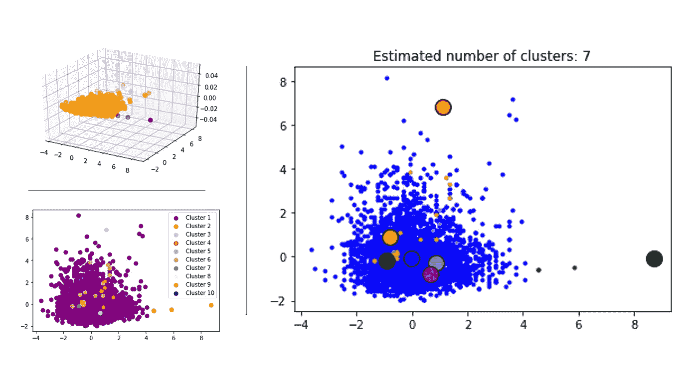
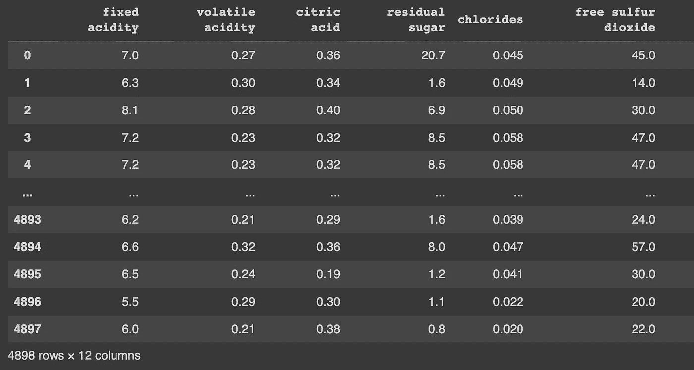
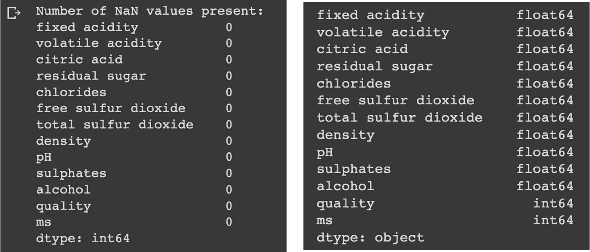
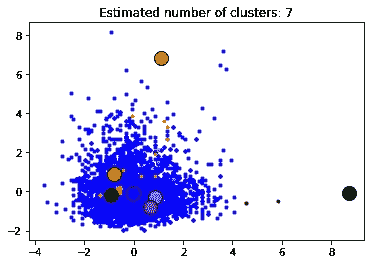
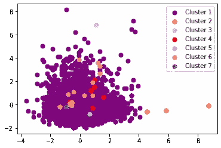
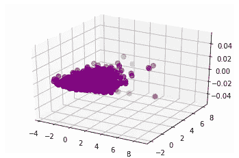

# 理解均值漂移聚类:使用 SciKit-Learn 进行实践

> 原文：<https://blog.devgenius.io/understanding-mean-shift-clustering-hands-on-with-scikit-learn-a98e79d6dd9f?source=collection_archive---------9----------------------->

## 无监督学习—聚类



均值漂移聚类是一种无监督的对相似数据点进行分组的机器学习方法。均值漂移算法的工作原理是，根据数据点周围的点密度，将每个数据点分配给一个聚类，然后将每个数据点漂移到其分配聚类的均值。这种聚类方法对于识别使用其他方法可能不容易分离的数据聚类非常有用。

## 它是如何工作的？

均值漂移算法是这样工作的:将每个数据点分配给一个聚类，然后迭代地将聚类质心(聚类的“平均值”)移动到分配给该聚类的所有数据点的平均值，直到聚类质心不再移动。这将产生所有数据点或多或少都“偏移”到聚类质心的聚类。

## 我们什么时候应该使用均值漂移？

均值漂移聚类不会对数据分布的形状做出任何假设。这使得它成为一种高度灵活的方法，能够适应复杂的非线性数据分布。此外，均值漂移聚类不需要用户指定要找到的聚类数，这在聚类数事先未知的情况下是有益的。

但是，需要注意的是，均值漂移聚类不能保证为给定数据集找到全局最优解。换句话说，可能还有比均值漂移更好的数据聚类。然而，在许多情况下，均值漂移聚类能够找到良好的数据聚类，因此在实践中经常使用。

> 让我们举个例子试试！

我们将使用在[这里](http://www3.dsi.uminho.pt/pcortez/wine/)可以找到的白酒质量数据集。您可以将其上传到您的谷歌可乐笔记本上，并从代码开始:

```
#Import libraries:
import pandas as pd
import numpy as np
import seaborn as sns
import matplotlib.pyplot as plt

#Load and read data frame:
df = pd.read_csv('/content/winequality-white.csv', delimiter=';')
df
```



我们有 4898 个数据点和 12 个特征。下一步是检查 NAN 值和数据类型，必要时进行更正:

```
#Check NAN values in df:
count_nan = df.isnull().sum()
print('Number of NaN values present: \n' + str(count_nan))

#Check data types:
print(df.dtypes)
```



现在，我们将转变和扩展我们的数据:

```
from sklearn.preprocessing import StandardScaler

#Define X as numpy array:
X = np.array(df)

scaler = StandardScaler()
X = scaler.fit_transform(X)
```

是时候建立我们的模型了:

```
from sklearn.cluster import MeanShift, estimate_bandwidth
from sklearn import metrics

# The following bandwidth can be automatically detected using
bandwidth = estimate_bandwidth(X, quantile=0.6, n_samples=100)

#Fit the model:
ms = MeanShift(bandwidth=bandwidth, cluster_all=True, max_iter=10000)
ms.fit(X)
labels = ms.labels_
cluster_centers = ms.cluster_centers_

labels_unique = np.unique(labels)
n_clusters_ = len(labels_unique)

print("number of estimated clusters : %d" % n_clusters_)
```


您可以使用 ***带宽*** 和 ***分位数*** 参数来控制簇的 de 数。分位数参数越低，聚类数就越高。现在我们有了模型，可以将结果保存到一个新变量中:

```
#Create new variable and new data-frame:
df_ms = np.array(ms.labels_)
df_ms = pd.DataFrame(df_ms, columns = ['ms'])

#Merge dataframes:
df = pd.concat([df, df_ms], axis=1, join='inner')
```

最后一步是为我们的模型构建一个图形可视化。我们将尝试 2D 和三维可视化，但我们有一个比其他集群大得多的集群，所以它可能会导致一点混乱:

```
import matplotlib.pyplot as plt
from itertools import cycle

plt.figure(1)
plt.clf()

colors = cycle("bgrcmykbgrcmykbgrcmykbgrcmyk")
for k, col in zip(range(n_clusters_), colors):
    my_members = labels == k
    cluster_center = cluster_centers[k]
    plt.plot(X[my_members, 0], X[my_members, 1], col + ".")
    plt.plot(
        cluster_center[0],
        cluster_center[1],
        "o",
        markerfacecolor=col,
        markeredgecolor="k",
        markersize=14,
    )
plt.title("Estimated number of clusters: %d" % n_clusters_)
plt.show()
```



2D 可视化的另一个选择是:

```
plt.scatter(X[labels==0, 0], X[labels==0, 1], s=50, marker='o', color='purple', label = 'Cluster 1')
plt.scatter(X[labels==1, 0], X[labels==1, 1], s=50, marker='o', color='orange', label = 'Cluster 2')
plt.scatter(X[labels==2, 0], X[labels==2, 1], s=50, marker='o', color='lightblue', label = 'Cluster 3')
plt.scatter(X[labels==3, 0], X[labels==3, 1], s=50, marker='o', color='red', label = 'Cluster 4')
plt.scatter(X[labels==4, 0], X[labels==4, 1], s=50, marker='o', color='lightgreen', label = 'Cluster 5')
plt.scatter(X[labels==5, 0], X[labels==5, 1], s=50, marker='o', color='lightcoral', label = 'Cluster 6')
plt.scatter(X[labels==6, 0], X[labels==6, 1], s=50, marker='o', color='grey', label = 'Cluster 7')

plt.legend()  
plt.show()
```



最后，我们可以尝试三维可视化:

```
fig = plt.figure()

ax = fig.add_subplot(111, projection ='3d')

ax.scatter(X[labels==0, 0], X[labels==0, 1], s=50, marker='o', color='purple', label = 'Cluster 1')
ax.scatter(X[labels==1, 0], X[labels==1, 1], s=50, marker='o', color='orange', label = 'Cluster 2')
ax.scatter(X[labels==2, 0], X[labels==2, 1], s=50, marker='o', color='lightblue', label = 'Cluster 3')
ax.scatter(X[labels==3, 0], X[labels==3, 1], s=50, marker='o', color='red', label = 'Cluster 4')
ax.scatter(X[labels==4, 0], X[labels==4, 1], s=50, marker='o', color='lightgreen', label = 'Cluster 5')
ax.scatter(X[labels==5, 0], X[labels==5, 1], s=50, marker='o', color='lightcoral', label = 'Cluster 6')
ax.scatter(X[labels==6, 0], X[labels==6, 1], s=50, marker='o', color='grey', label = 'Cluster 7')

plt.show()
```



谢谢你的阅读！如果您有什么建议要添加到本教程中，请告诉我，并且不要忘记订阅以接收关于我未来出版物的通知。

如果:你喜欢这篇文章，别忘了关注我，这样你就能收到关于新出版物的所有更新。

**其他如果:**你想在 Medium 上阅读更多，可以通过 [**我的推荐链接**](https://cdanielaam.medium.com/membership) 订阅 Medium 会员。它不会花你更多的钱，但会支付我一杯咖啡。

**其他:**谢谢！