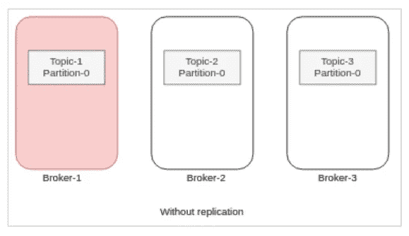

# 理解卡夫卡作品中的信息持久性

> 原文：<https://blog.devgenius.io/understanding-message-durability-in-kafka-8f6e7006aea8?source=collection_archive---------9----------------------->

在分布式系统中，持久性通常来自复制，数据的多个副本会独立地失败。在任何分布式系统中，完全的持久性几乎是不可能的。复制是在分布式系统中实现持久性的一种方式，虽然有些人选择从不丢失写入磁盘的数据，因此要求每次写入时同步，但其他人在他们的设计中处理这种情况，如 Kafka。

Kafka 提供了以下不同的方法来实现数据的高持久性和可用性-

1- **使用复制** — Kafka 提供了一种复制数据的方法，并将这些复制的数据放在不同的分区上，以便在任何代理数据丢失的情况下，我们仍有副本可用于此目的。

这可以处理代理故障。

Kafka 中添加复制的目的是为了更强的持久性和更高的可用性。我们希望保证任何成功发布的消息都不会丢失，并且可以被使用，即使在服务器出现故障时也是如此。

考虑我们没有配置复制因子的情况。我们可以看到，如果代理关闭，Partition-0 中的可用数据将被擦除，我们将无法恢复这些数据。

现在考虑下面的场景，我们将复制因子设为 3，即使一两个代理宕机，我们仍将拥有数据。

正如我之前提到的，Kafka 在其设计中处理副本同步保证。人们可以在耐久性保证和吞吐量之间进行选择。生产者可以选择使用 ***确认*** 配置来获得最大吞吐量或更高的数据持久性。 ***确认*** 设置是生产者配置。它表示在我们认为写入成功之前必须收到记录的代理数量。它支持三个值— 0、1 和全部或-1。

a.**ack = 0**—值为 0 时，生产者甚至不会等待代理的响应。记录发出后，它立即认为写入成功。

制片人甚至不等待回应。该消息已被确认。

b-**ack = 1**—设置为 1 时，生产者将在领导者收到记录时认为写入成功。主经纪人将知道在接收到记录时立即响应，而不再等待。

一旦收到记录，代理立即响应，跟随者异步复制记录。

c-**ack = all**—设置为 all 时，当所有 i **n-sync 副本**接收到记录时，生产者将认为写入成功。这是通过主代理智能地响应请求来实现的——一旦所有同步副本自己接收到记录，它将发送回一个响应。

经纪人 3 尚未收到记录，因此不会确认制作人。

2- **使用机架感知** —通过复制，我们可以确保即使代理宕机，我们也可以确保主题的所有分区保持可用，而不会牺牲一致性。我们仍然需要担心整个数据中心/可用性区域中断的可能性。
Kafka 使用一种称为机架感知的功能，轻松处理数据中心停机。机架可以代表可用性区域、数据中心或数据中心中的实际机架。 [KAFKA-1215](https://issues.apache.org/jira/browse/KAFKA-1215) 向 KAFKA 配置添加了一个机架 id。

这可以处理数据中心和可用性区域级别的故障。

3- **灾难恢复** —精心制定灾难恢复计划，以最大限度地减少自然和人为灾难(如停电、灾难性软件故障和网络中断)对业务的影响。我们采用多区域策略，在地理上分散的数据中心中，服务与备份一起部署。

灾难恢复本身是一个大话题，超出了本次讨论的范围，但有了它，我们可以处理地理上分布的区域级故障。一本关于卡夫卡灾难恢复的好书。

**结论** —消息队列临时存储消息，直到它们被消费者成功接收和处理。持久性意味着即使在消息的一个/一些副本失败后，消息仍然可用。Kafka 提供了复制、在生产者端使用 ack 设置的数据一致性以及机架感知等功能，以使消息持久并承受一定程度的故障。