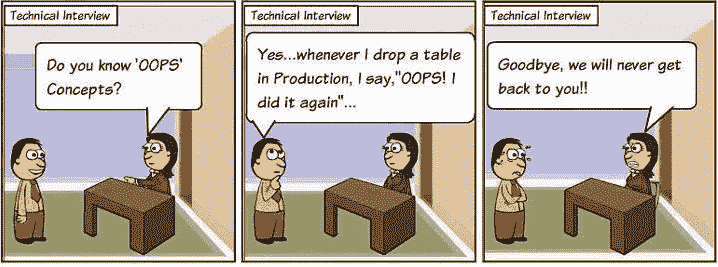

# 理解哎呀概念，更简单的方法！

> 原文：<https://blog.devgenius.io/understanding-oops-concept-the-simpler-way-88672670c483?source=collection_archive---------31----------------------->

在我的大学时代，哎呀听起来很可怕。我相信这可能对你们中的一些人是一样的，你们中的一些人仍然有这种感觉。我记得，直到我大学的最后一天，我把对象理解为类的实例和现实世界的实体，但不知道它到底是什么意思。阶级的定义就像

> *类是用户定义的数据类型，具有数据成员和成员函数。*

*最好弄清楚哎呀概念*

我只是在开始工作后才理解这些概念，并在工作中实际执行它们。当我正确理解了 OOPs 的概念时，我感觉好多了。

今天，我在这里试着用一些现实生活中的类比来帮助你理解这些概念。相信我，当我们正确理解它们的时候，写代码就不会那么难了。

> *面向对象编程只是为了更好的可维护性和可重用性而编写代码的一种方法。遵守规则，使复杂的代码更容易开发、重用和维护。*

**让我们从一个类比开始**

90 年代末，有人想拥有一款便携设备，这样无论他身在何处，都可以随时打电话给所爱的人，在游览美丽的地方时拍张照，捕捉与朋友在一起的瞬间，然后一天又一天地保存下来。每当他觉得无聊的时候就看电影，玩游戏。而且，要让那个东西活起来，这样他就可以随时访问。

这些要求看起来很熟悉，对吗？当然，他想的是智能手机。所以，他收集了所有这些成分:

`Screen, Battery, Camera, Charging Port, Storage space, an all other hardware components.`

通过大量的研究和努力工作，他制造出了他梦想中的设备，这将使他能够:

`Watch movies`

`Call Someone`

`Take pictures`

`Play games`

`Charge phone`

`Store photos and videos`

`And many more`

现在他有了一个想法，或者我们可以说是为他的家人和朋友创造智能手机的蓝图。他甚至可以制造数百万份拷贝。

让我们利用这个场景来学习类和对象。

他设计的创造智能手机的蓝图可以被认为是阶级。让我们将这个类命名为 Smartphone，因为我们将使用它来创建许多智能手机。

让我们带上我们之前看到的类的定义

> 类是用户定义的数据类型，具有数据成员和成员函数。

现在看来有些熟悉。但是让我们进一步分解它。这是一个用户定义的数据类型——我们从这个场景中看到，这个人创建了一个完全符合他定义和希望的东西。我们既不能将他制作设备表示为整数，也不能表示为字符串或数组，但我们可以将它表示为智能手机类型，这样听起来就完美了。

它有一个数据成员或者我们可以称之为**属性。**这些特性将描述我们的智能手机类别。屏幕、电池、存储空间、充电口都是属性。

属性描述了智能手机的外观，但它并没有告诉它如何工作或它能够做什么。为此，它确实有成员函数，或者我们可以称它们为**方法**。正如我们之前看到的，智能手机将被用来打电话、拍摄照片、制作视频等..所有这些都是成员函数。

我们还看到，类也可以被定义为一个**蓝图**，使用它我们可以创建许多对象。

什么是对象？

在解释之前，让我用类比再补充一点。我们认为制造智能手机的人将会制造数百万部智能手机。但是是否都需要看起来相同或者应该具有相同的特征或质量。显然，我们将根据成本对他们进行区别对待，这样他就可以同时针对富人和穷人。

物体是被制造出来的东西。他使用 smartphone 类制作的第一个副本也是这个对象。现在，他已经创造了数百万部手机，所有这些也都是物品。尽管所有这些物体可能看起来不相似或者行为方式不相似，但是它们都是智能手机。它们的不同之处在于它们所基于的属性值。

例如，一部手机可能有大屏幕和更高像素的摄像头，价格较高，而另一部手机可能有较小的屏幕和较低的摄像头质量，但两者都具有将它们视为智能手机的品质。

让我们来定义一下。

> *对象是类的实例。*

是的，很简单。这是我们可以看到的真实实体，它将我们的智能手机类概念带入了生活。

在总结之前，让我们试着制造我们自己的智能手机。我的智能手机会像这样:

`Screen = 6 inch`

`Battery = 4100 mh`

`Memory space = 16gb`

`camera = 48 megapixels`

`charging port = fast charging type c port`

基于这些属性，它将允许我执行不同的操作，如看电影，拍好照片，捕捉视频等等。

你可以尝试创造自己的智能手机。显然你可以随心所欲地拥有它。

我将在接下来的文章中介绍其他概念。继续阅读并关注我的[网站](http://saileshdhakal.com.np)获取更多帖子。