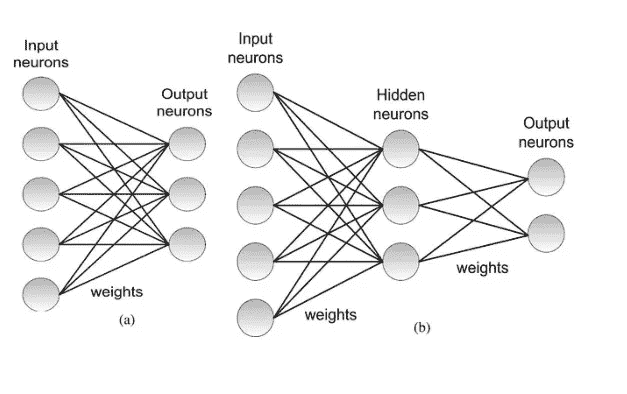
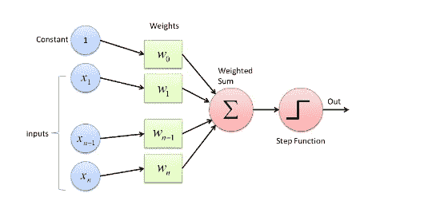

# 将感知器理解为逻辑运算符

> 原文：<https://blog.devgenius.io/understanding-perceptrons-as-logical-operators-553a254b80d5?source=collection_archive---------12----------------------->

神经网络

在我们深入了解其工作原理之前，让我们先简单介绍一下。

感知器是一种神经网络单元，它映射其输入“x ”,然后乘以权重“w ”,然后生成并输出值 f(x)。也就是说，它接受实值输入的向量，计算它们的线性组合，如果结果大于阈值，则输出 1，否则输出 0！如果你需要更多关于感知机的理解，请浏览[感知机:什么，为什么和如何](https://towardsdatascience.com/https-medium-com-francesco-cicala-whats-whys-and-hows-of-perceptron-f87c66f512c5)

单层感知器

理解感知器算法的技巧:

1.  从随机权重开始 *w1，w2，…..，wn*
2.  对于每一个误分类点( *x1，x2，…，xn*)；如果预测=目标，那么什么也不做，否则你更新权重！
3.  如果预测=！目标，那么权重应该被更新为*Wi*=*Wi*+/—*αXi*，这取决于 *α* 是*学习率*的情况

**和运算符**

只有当两个输入都为真时，才会返回*真*，否则输出将始终为假，即如果任何一个输入为*假。*让我们来理解一个感知器是如何实现这个逻辑运算符的功能的。我将通过将其命名为一个*实例来解释每一行中发生的事情。这意味着在下面的与门中，有 4 个实例。*

与上图相关联的这个等式将是:
ŷ=θ(*w1 * x1+w2 * x2+b*)。现在让我们抛开这个等式，把它算出来！在上面的 AND 运算符中，让我们取下列任意参数:

A = X1，B = X2，w1 = 1.3，w2 = 0.6，学习率( *α) =* 0.5，阈值= 1

1.  实例 a: A = 0，B = 0，目标输出= 0

*wi.xi =* 0 * 1.3 + 0 * 0.6 = 0，即预测的输出不大于阈值(1)，所以输出= 0。在这种情况下，目标输出和预测输出是相同的。

2.实例 b: A = 0，B = 1，目标输出= 0

*wi.xi =* 0 * 1.3 + 1 * 0.6 = 0.6 并且由于这个预测输出不大于阈值，所以输出= 0。在这种情况下，目标输出和预测输出是相同的。

3.实例 c: A = 1，B = 0，目标输出= 0

*wi.xi* = 1 * 1.3 + 0 * 0.6 = 1.3 并且由于这个预测值大于阈值，所以输出= 1。

问题来了，这个实例的预测输出是 1，而目标输出是 0，这意味着权重需要调整。

***wi = wi*+*α(t*—*o)Xi***

其中 *wi* =被调整的权重，t =目标输出，o =预测输出， *α* =学习率， *xi* =该实例的相应输入。使用该等式，新的权重计算如下:

w1 = 1.3+0.5(01)1 = 0.8

w2 = 0.6+0.5(01)0 = 0.6

> ***现在我们有了新的修改后的权重，我们需要从第一个实例开始计算，以确保这个新的权重能够正确地对它们进行分类。***

修改后的参数如下:

w1 = 0.8，w2 = 0.6，学习率= 0.5，阈值= 1

a) A = 0，B = 0，目标输出= 0

*wi.xi =* 0 * 0.8+ 0 * 0.6= 0，即预测的**输出不大于阈值(1)，所以输出= 0。在这种情况下，目标输出和预测输出是相同的。**

**b) A = 0，B = 1，目标输出= 0**

***wi.xi =* 0 * 0.8+ 1 * 0.6 = 0.6 并且由于这个预测输出不大于阈值，所以输出= 0。在这种情况下，目标输出和预测输出是相同的。**

**c) A = 1，B = 0，目标输出= 0**

***wi . Xi =*1 **0.8+0 * 0.6 = 0.8，由于这个预测输出不大于阈值，所以输出= 0。在这种情况下，目标输出和预测输出是相同的，不再需要修改。***

***d) A = 1，B = 1，目标输出= 1***

****wi . Xi =*1 **0.8+1 * 0.6 = 1.4 并且由于该预测输出大于阈值，所以输出= 1，这类似于目标输出。****

***现在，我们很高兴我们的感知器已经正确地预测了 AND 逻辑运算符的所有输出。因此，这些是感知器算法中与门的最终参数。请注意，我们故意忽略了偏差，这是为了清晰起见。实际上，一旦权重更新，偏差也会类似地更新。我希望这能让你明白感知机的逻辑。同样的方法可以用来理解或门。让我知道你的想法。***