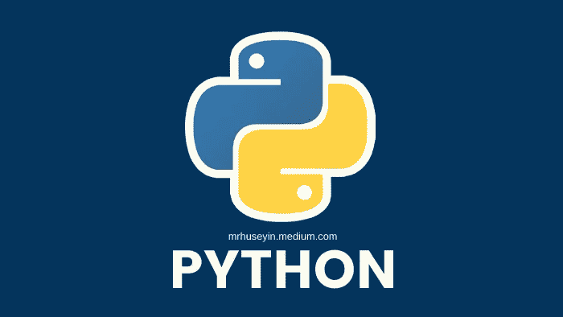

# 理解 Python 的原理

> 原文：<https://blog.devgenius.io/understanding-principles-of-python-1c01eadd4e2f?source=collection_archive---------4----------------------->

## Python 基础循序渐进



Logo 由 [Python](https://www.python.org/) ，图片由[作者](https://mrhuseyin.medium.com/)

```
 **Table of Contents**  ∘ [Python’s place in Data Science and machine learning](#3155)
  ∘ [Applications of Python](#1381)
  ∘ [Why We Use Python?](#26df)
  ∘ [Advantages](#82ee)
  ∘ [Disadvantages](#10d2)
  ∘ [Is Python Too Slow?](#051d)
  ∘ [Phyton and Matlab](#9f80)
  ∘ [Who Use Python?](#c74d)
  ∘ [Python has many development tools.](#1d5c)
```

Python 编程语言是用于数据科学、机器学习、系统自动化、web 和 API 开发等的基本结构。它是一种基于目标的编程语言。

自 1991 年以来，Python 编程语言只被视为不必要程序的补充语言。他甚至出版了一本名为《让无聊的东西自动化》的书。

然而，在过去几年中，Python 已经成为现代软件开发、基础设施管理和数据分析领域的一流编程语言。它不再是黑客的后门建设者，已经赢得了 web 应用程序创建中的闪亮语言以及系统管理、数据分析和机器学习中的关键角色的声誉。

## Python 在数据科学和机器学习中的地位

复杂的数据分析已成为当今 it 最重要的问题。另一方面，对于这些情况，Python 是最方便的编程语言。Python 接口中的许多库对机器学习和数据科学很有用。在这些领域，库中的高质量命令帮助了机器学习库和其他数值算法库的不断发展。他们会继续帮助我们。

## Python 的应用

[](https://medium.com/dev-genius/50-basic-python-code-examples-e1a261c006f5) [## 50 多个基本 Python 代码示例

### 列表、字符串、分数计算等等..

medium.com](https://medium.com/dev-genius/50-basic-python-code-examples-e1a261c006f5) 

*   网络和互联网发展
*   科学计算和统计
*   人工智能
*   桌面界面开发
*   软件开发
*   网络接口

## 我们为什么使用 Python？

## 优势

*   **免费:** Python 是完全免费的，可以不受版权限制的使用和分发。尽管是免费的，但在过去的 25 年里，Python 已经有了一个非常活跃的社区，并且不断得到更新和及时的改进。
*   **可移植:** Python 是用 ANSI C 开发的可移植语言，在 Unix、Linux、Windows、DOS、Macintosh、实时系统、OS / 2、Android、iOS 手机等不同平台上也可以使用。这是可能的，因为它是一种解释语言，所以只要安装了 Python 解释器，相同的代码就可以在任何平台上运行。
*   **易于使用:** Python 是一种既简单又强大的高级语言。该语言中已经包含的语法和不同的模块和功能是一致的、直观的和易于学习的，并且该语言的设计是基于最小混淆的原则。所以你可以提前知道你写的代码的反应。所以你不会感到惊讶。程序的行为与预期相符。
*   **高级库:**每个 Python 安装都包括一个标准库，这是一个超过 200 个模块的集合，用于执行最多样化的任务，例如与操作系统和文件系统交互，或者管理不同的协议。Python 标准库、系统管理、网络、文本处理、数据库接口、图形系统和 XML 处理。Python 标准库有明确的命名接口，有很好的文档记录，易学易用。此外，Python 包目录允许您下载和安装由社区创建和维护的数千个附加模块。它也可以与先前使用 import 属性编写的代码一起使用。如果你是初学者级别，你可以在 Python 的官方网站的[这个链接](https://www.python.org/about/gettingstarted/)中找到一些有用的信息。
*   **它可以与其他语言集成:**除了用 C 编写的经典解释器(称为 CPython)，还有其他一些解释器允许与其他几种语言集成。IronPython 允许您在。NET 框架，使用其功能，并与其他。网络语言。可以使用 Jython 集成 Python 和 Java。还有其他解释器，比如 PyPy:用 Python 写的高性能应用。

[](https://medium.com/dev-genius/top-20-coding-software-languages-67083e04a1a0) [## 前 20 种编码软件语言

### 从 C 到 Python，每种语言都有许多共同的特性，也有独特的特性。

medium.com](https://medium.com/dev-genius/top-20-coding-software-languages-67083e04a1a0) 

*   **自动管理内存:** Python 是一种高级语言，采用垃圾收集机制，自动处理内存分配和释放。这使得程序员可以自由地使用变量，而不必担心声明变量以及手动分配和释放内存区域。

## 不足之处

虽然 Python 一般适合写高质量的应用，但是它有一些缺点和它无法承受的领域。

*   因为是高级编程语言，不适合系统级编程。但是，这一类别不包括设备驱动程序或操作系统内核。
*   在需要跨平台独立二进制文件的情况下，它也不理想。
*   你可以为 Windows、MacOS 和 Linux 操作系统开发一个应用程序。但是将要创建的应用程序不会太棒
*   一般来说，Python 在繁重的程序中不提供太多的功能，因为这种编程语言在速度上也处于前列。因此，您可以使用 C / C++之类的语言，这是最古老的编程语言之一。

## Python 太慢了吗？

关于 Python 的负面传言之一是它很慢。总的来说，是的，Python 很慢。通过 Python 创建的程序通常比 C / C ++或 Java 中的相应程序运行得慢。

这么慢的原因是什么？这需要缓慢的同步，因为汇编程序逐行分析代码。Python 中包含的对象是由所使用的代码决定的，这一事实使得优化该语言的速度变得困难，即使在编译时也是如此。然而，Python 的速度可能并不像它看起来那么重要，有一些方法可以减轻这个问题。

## Phyton 和 Matlab

这可以用 Phtyon 进行科学计算。用于科学计算的最重要的程序之一是 Matlab。但是，除了高度专业化的工具箱，Matlab 是不可替代的。与 Matlab 相比，使用 Python 进行科学计算有许多优势:

[](https://medium.com/dev-genius/what-is-matlab-why-we-need-it-d61e405ef419) [## Matlab 是什么？我们为什么需要它？

### 了解 Matlab 的基础知识

medium.com](https://medium.com/dev-genius/what-is-matlab-why-we-need-it-d61e405ef419) 

MATLAB 主要是商业软件，价格昂贵。而且 Python 是完全免费的。您可以找到许多针对 Python 的开源科学计算库。用户可以在任何电脑上免费安装 Python 及其大部分扩展库。

其次，Python 相对于 Matlab 是一种更易学、更严谨的编程语言。它允许用户编写更易于阅读和维护的代码。

最后，MATLAB 主要关注工程和科学计算。然而，即使在计算中，也经常会遇到各种要求，如文件管理、界面设计和联网。而且 Python 拥有丰富的扩展库，可以轻松完成各种高级任务，开发者可以使用 Python 实现一个完整应用所需的各种功能。

## 谁使用 Python？

如今，Python 在 IT 市场的许多大公司中得到了应用，包括:

NASA 用 Python 改进控制系统；雅虎！用 Python 开发了一些互联网服务；它使用谷歌、Youtube 和 RedHat Python。

[](https://medium.com/dev-genius/the-change-of-coding-language-softwares-by-time-cef89802afc6) [## 编码语言软件随时间的变化

### 从过去到现在的历史解释

medium.com](https://medium.com/dev-genius/the-change-of-coding-language-softwares-by-time-cef89802afc6) 

## Python 有很多开发工具。

**Tkinter** : Python 默认的图形界面接口。Tkinter 是一个与 Tk 接口的 Python 模块。Tkinter 库提供了 Tk API 的接口，属于 TCL / Tk GUI 工具包。

**PYGTK:** 用于 Python GUI 程序开发的 GTK +库。GTK 是用来实现 GIMP 和 Gnome 的库。

**PyQt:**Python 的 Qt 开发库。QT 是实现 KDE 环境的库。Qt 由一系列包含 300 个类和 5750 多个函数和方法的模块组成，包括 qtcanvas、qtgl、qtnetwork、qtsql、qttable、qtui 和 qtxml。PyQt 还支持一个名为 qtext 的模块，其中包含 qscintilla 库。这个库是 scintillar 编辑器类的 Qt 接口。

**wxPython:** GUI 编程框架，熟悉 MFC 的人一定会喜欢。几乎是一样的架构。注意:对于初学者或者设计要求不高的用户，使用 Boa 构造函数可以方便 WxPython 的快速开发。

**PIL:** Python 提供了强大的图形处理能力，支持多种图形文件格式。该库可以转换、打印和显示图形格式。它还可以处理一些图形效果，如放大、缩小和旋转图形。它是 Python 用户执行图像处理的强大工具。

**Psyco:** 是一个 Python 代码加速器。它可以将 Python 代码的执行速度提高到与编译语言相同的水平。

**xmppy:** Jabber 服务器使用开发的 XMPP 协议，Google Talk 也是使用 XMPP 协议的 IM 系统。Python 有一个支持该协议的 xmpppy 模块。换句话说，我们可以通过这个模块与 Jabber 服务器进行通信。

**Pymedia** :用于多媒体操作的 Python 模块。多媒体处理(wav、mp3、ogg、avi、divx、dvd、cdda 等。)为提供了丰富而简单的界面。在 Windows 和 Linux 平台下可用。

**Pmw** : Python megawidgets，Python 超级 GUI 组件集，使用 Python 中的 Tkinter 模块构建的高级 GUI 组件，每个 Pmw 包含一个或多个 Tkinter 组件，以实现更有用、更复杂的功能。

**PyXML** :一个包中带有 Python 4dom 的解析和处理 XML 文档的工具包，完全符合 W3C DOM 规范。包括以下内容:xmlproc:一个兼容的 XML 解析器。Expat:一个快速的、未经验证的 XML 解析器。PyHtml 还有与 PySGML 处于同一级别的其他元素。

**Pygame** :多媒体开发和游戏软件开发模块。您可以使用 Pygame 直接下载 Pip 安装。

**PyOpenGL** :该模块包括“OpenGL 应用编程接口”，python 程序员可以在其中将 2D 和 3D 图形集成到程序中。

**NumPy，NumArray，SAGE:** NumArray 是一个扩展的 Python 库，基本上是一个矩阵库，用来处理随机维度的固定类型数组。它的基本代码是用 C 写的，所以速度优势很明显。SAGE 是一个基于 NumPy 和许多其他工具的数学软件包。目标是取代 Magma、Maple、Mathematica 和 Matlab 等工具。

**MySQLdb** :用于连接 MySQL 数据库。还有 zmysqlda 模块，在这里可以连接到 zope 的 mysql 数据库。

**Sqlite3** :用于连接 Sqlite 数据库。

**Python-ldap:**OpenLDAP[2 . it](http://2.it/)提供了一组面向对象的 API，方便访问基于 x 的 Python 中的 LDAP 目录服务

**smtplib** :发送邮件。

ftp 类和一些方法是为客户端 FTP 编程而定义的。如果想了解 Ftp 协议的细节，请参考 Rfc959。

**PyOpenCL** : OpenCL 的 Python 接口，其中 GPU 可以用来实现并行计算。

**Xes-lib:** 学而思库可以用来发送邮件，查询天气等功能。

谢谢你..

来源:[1](https://www.html.it/pag/15608/perche-usare-python/)[2](https://desarrolloweb.com/articulos/1325.php)[3](https://it.wikipedia.org/wiki/Python)[4](https://bilginc.com/tr/blog/158/python-nedir-python-hakkinda-hersey)[5](https://es.wikipedia.org/wiki/Python)[6](https://baike.baidu.com/item/Python/407313)