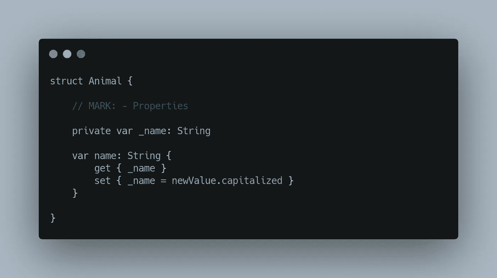
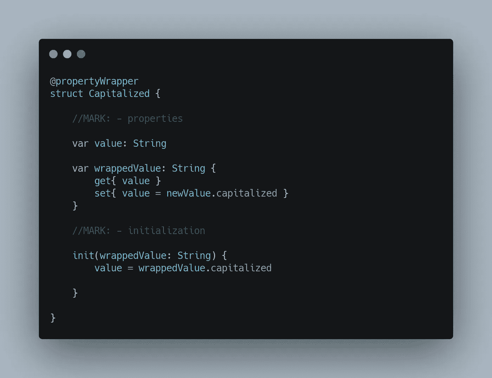
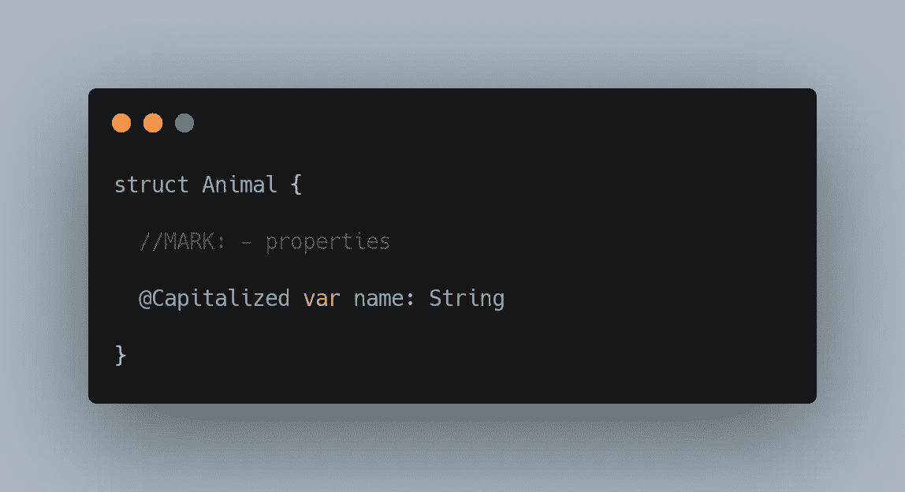
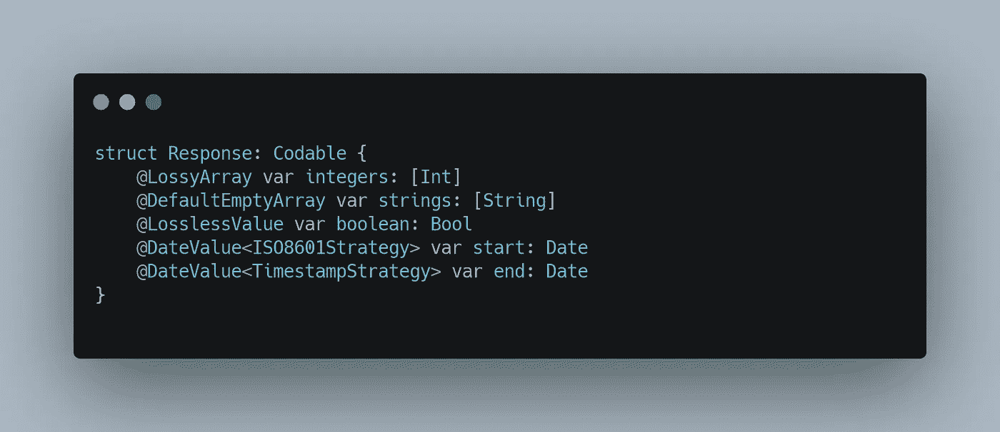
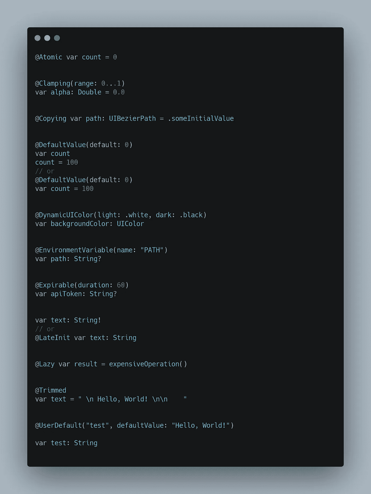
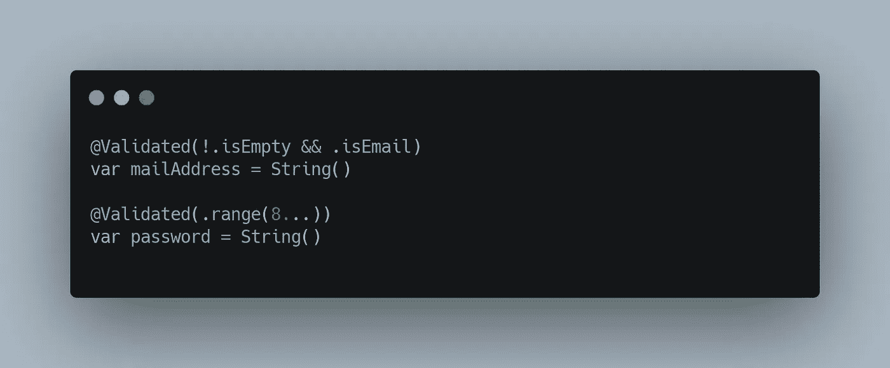
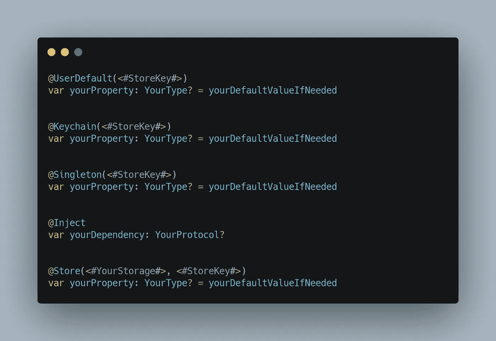

# 了解 Swift 中的属性包装器

> 原文：<https://blog.devgenius.io/understanding-property-wrappers-in-swift-267e3f22ea9b?source=collection_archive---------2----------------------->

照片由[鲁迪·董](https://unsplash.com/@mrdongok?utm_source=unsplash&utm_medium=referral&utm_content=creditCopyText)在 [Unsplash](https://unsplash.com/s/photos/wrap?utm_source=unsplash&utm_medium=referral&utm_content=creditCopyText)

我们已经熟悉了 Objective-C 中的@“at 符号”。然后我们在 Swift 语言中使用了@ IBAction、@NSCopying、@UIApplicationMain 示例，我们认为它将仅限于这些。

随着时间的推移，Swift 开始增加@前缀属性的使用。

通过 SwiftUI 的发布，我们意识到这个@前缀将会被更频繁地使用，并且将会出现在 Swift 语言的未来。
举例: *@State，@Binding，@EnvironmentObject* 。

然而，这些前缀不仅开始在 SwiftUI 中使用，也开始在 swift ui 之外使用。示例:@propertyWrapper

**什么是属性包装器？**

本质上，属性包装器是一种包装给定值以便将附加逻辑绑定到它的类型。

它可以通过@propertyWrapper 使用结构或类来实现。

你可以在这里找到属性包装器动机的背景。

现在，假设您有一个样本代码，如下所示。

我假设您已经意识到，每次需要应用这种模式时，都需要编写样板代码。这是造成代码冗余的问题。

如前所述，属性包装器只不过是用@propertyWrapper 属性和名为 wrappedValue 的属性注释的结构或类。

顾名思义，wrappedValue 属性保存由@propertyWrapper 包装的值。

**让我们从一个例子开始练习。**

我将创建一个名称大写的属性包装器，它会将值大写。

现在让我们回到样板代码，用大写的属性包装器重新创建它。

如您所见，@propertyWrapper 将您从复杂和冗余的代码中拯救出来。这只是一个应用大写属性包装器的简单示例。

不要拘泥于这一点，你还可以在另一种情况下使用。

-使用属性包装验证需要电子邮件的条件。
-使用一个属性包装器，用 UserDefault 存储数据。
-使用限制分数的属性包装器。

我将列出一些有用的第三方属性包装器来帮助你。

# [可改善的](https://github.com/marksands/BetterCodable)

通过属性包装提升您的可编码结构。这些属性包装器的目标是避免实现自定义 init(from decoder: Decoder)抛出和遭受样板文件。

# [墨西哥卷饼](https://github.com/guillermomuntaner/Burritos)

Swift 资产包装器(以前称为“资产委托”)的集合

# [已验证的属性工具包](https://github.com/SvenTiigi/ValidatedPropertyKit)

ValidatedPropertyKit 使您能够利用属性包装器的强大功能轻松验证您的属性。

# [安全的财产储藏](https://github.com/alexruperez/SecurePropertyStorage)

帮助您使用 Swift 属性包装器为您的属性定义安全存储。

感谢您的阅读。别忘了鼓掌:)