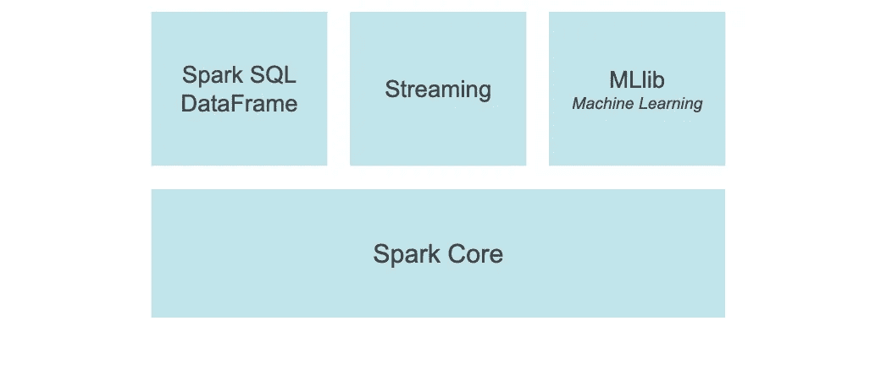
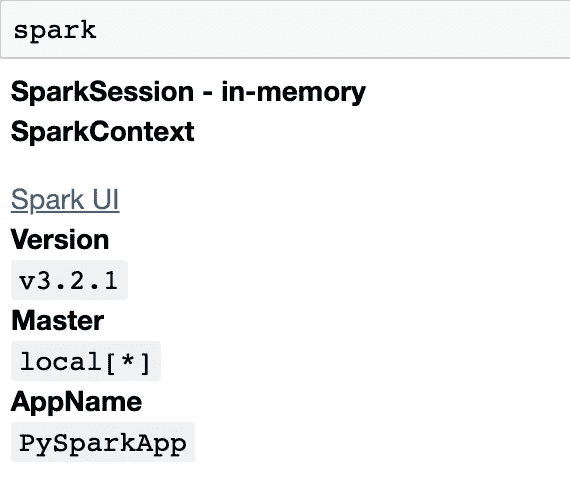
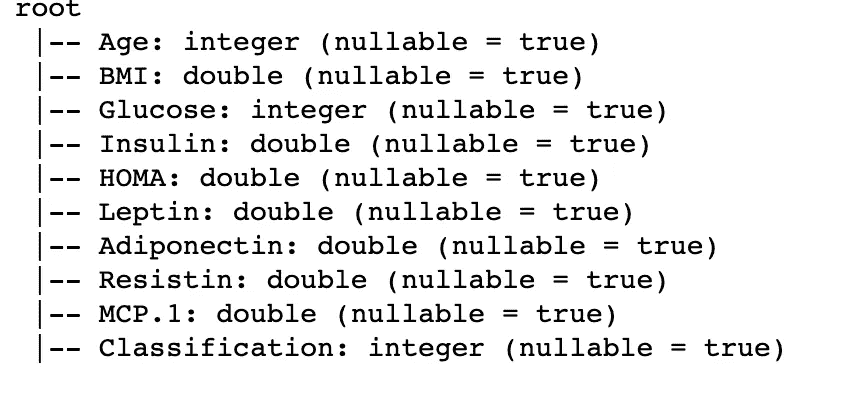
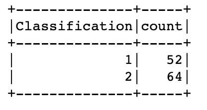
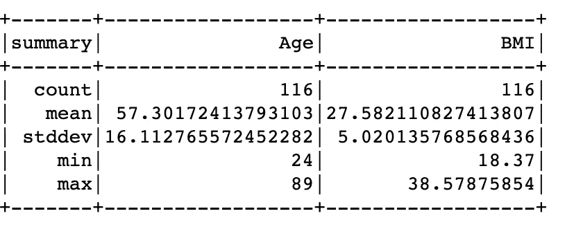
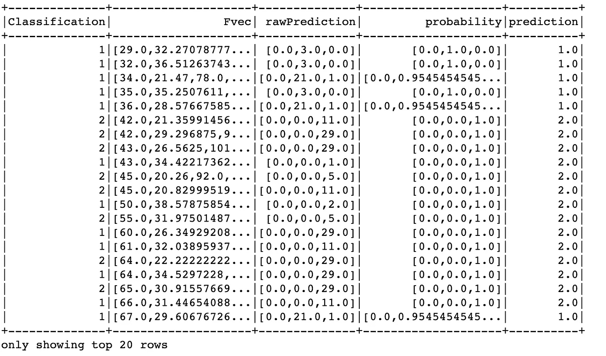

# 了解 PySpark

> 原文：<https://blog.devgenius.io/understanding-pyspark-fadd9588636f?source=collection_archive---------6----------------------->



来源:-[https://spark.apache.org/docs/latest/api/python/](https://spark.apache.org/docs/latest/api/python/)

本文将涵盖以下内容

*   什么是火花？
*   什么是 RDD？
*   Apache Spark 的组件
*   什么是 PySpark
*   PySpark 中常见的数据争论函数
*   使用 PySpark 机器学习库构建机器学习模型

如果你以前用过熊猫，并且对 PySpark 很好奇，那么这篇文章就是为你准备的。你可以在这里找到本教程[使用的数据集。请注意，本文将只包含一些选定函数的输出。](https://archive.ics.uci.edu/ml/datasets/Breast+Cancer+Coimbra)

## 阿帕奇火花

Apache Spark 是一个开源的集群计算框架。它是用于并行大规模数据处理的统一分析引擎。Spark 构建于 Scala 之上，但也可以用于 Python，这就是 PySpark 发挥作用的地方。Spark 支持 SQL、机器学习、图形处理和流的高级工具。让我们详细看看这些工具。

## Apache Spark 的优势？

*   Apache Spark 是一个统一的引擎，支持流数据、SQL 查询、机器学习和图形处理模块。
*   Spark 使用弹性分布式数据集(RDD)的概念处理 RAM 中的数据，比使用 [MapReduce](https://www.tutorialspoint.com/hadoop/hadoop_mapreduce.htm) 的 [Hadoop](https://hadoop.apache.org/) 更快。
*   它很容易使用
*   它可以用于各种编程语言，如 Python、Java 和 r。
*   它是免费的
*   它提供分布式计算

## 什么是 RDD？

RDD 完全是弹性分布式数据集。这是 Spark 的基本数据结构。rdd 被称为*弹性*是因为它们是不可变的，*分布式*是因为它们被划分到可以并行操作的集群节点上，而*数据集*是因为它们保存数据。需要注意的是，rdd 不是表格，也没有像 Spark 数据框那样的数据模式，我们将在本教程中使用 Spark 数据框。

## Apache Spark 的组件

以下是构成 Spark 的组件

*   **Spark Core —** 是 Spark 平台的底层通用执行引擎，所有其他功能都构建在该引擎之上。它提供内置的内存计算，并协调输入和输出(I/O)操作。
*   **机器学习库(ML)——**建立在 Spark 之上，其目的是让机器学习变得可扩展和简单。它提供机器学习算法，如回归、聚类、分类和协同过滤。此外，它还提供了用于数据预处理(如特征提取)和构建 ML 管道的工具。
*   **Spark Streaming —** 允许处理实时数据流。
*   **Spark SQL 和 DataFrame—** 通过使用 SQL 查询支持数据操作和分析，提供结构化数据处理。当您使用另一种语言(比如 Python)运行 SQL 时，返回的结果将以数据集或数据框的形式出现。数据集是提供 RDDS 优势的分布式数据集合，而数据框是组织成命名列的数据集。这类似于熊猫的数据框。

## PySpark

PySpark 是 Python 中 Apache Spark 的一个接口。它是一个开源的分布式计算框架，由一组允许实时和大规模数据处理的库组成。作为一个分布式计算框架，它允许将一个任务分配成更小的任务，以便在一个机器网络中同时运行。

PySpark 支持大多数 Spark 特性，如 SparkSQL、数据帧、MLlib、Spark Core 和流。在本教程中，我们将只涵盖 Spark SQL 和数据帧，以及 MLlib。

要使用 spark 执行任何分析，我们必须启动 Spark 会话。从 PySpark 导入 spark 会话，并如下所示启动它。如果没有安装 PySpark，可以使用 pip 安装。

```
# import the spark session
from pyspark.sql import SparkSession# initiate the spark session
spark = SparkSession.builder.appName("PySparkApp").getOrCreate()
```

*   getOrCreate()函数创建一个新的会话或者在你的工作空间中检索现有的会话。
*   PySparkApp 是所创建的应用程序的名称。
*   要查看关于您的会话的一些信息，您可以在笔记本中键入 spark，请参考下图。



图 1

现在我们可以继续分析我们的数据集了。

## PySpark 中常见的数据争论函数

*   **加载数据集**

```
#read csv file
df = spark.read.csv("dataR2.csv", inferSchema=True, header=True)
```

*   **统计数据帧中的行数**

```
# count number of rows
df.count()
```

*   **从数据帧中选择一列**

```
# select a column
df.select("Glucose").show(3)
```

*   **从数据框中选择列**

```
# select columns
df.select(["Age","BMI","Glucose"]).show(3)
```

*   **显示表格的前 5 行**

```
# show the first five rows in the table
df.show(5)
```

*   **检查数据类型**

```
df.printSchema()# OR You can use the dtypes functiondf.dtypes
```

**输出:**



图 2

*   **获取唯一值的计数**

```
# counting the unique values in the Classification column
df.groupBy("Classification").count().show()
```



图 3

*   **删除一列**

```
df.drop("Age")
```

*   **重命名列**

```
df = df.withColumnRenamed("MCP.1", "MCP")
```

*   **获取汇总统计数据**

要获得数据的汇总统计信息，使用 select 函数选择感兴趣的列，然后使用 describe 命令，如下所示。

```
df.select(["Age", "BMI"]).describe().show()
```

**输出:**



图 4

## 处理空值

*   如果某一行在任一列中包含空值，则删除该行

```
df = df.na.drop(how="any")
```

*   仅当所有列都有空值时删除一行

```
df = df.na.drop(how='all')
```

*   使用` ***thres`*** 删除小于 thresh hold 非空值的行

```
df = df.na.drop(thres=2)
```

*   考虑列的子集，删除空值

```
df = df.na.drop(how="any", subset=["Age", "BMI"])
```

*   用给定值替换空值

```
df = df.na.fill(value=10, subset=["Age"])
```

*   使用火花输入器

```
# import imputer
from pyspark.ml.feature import Imputer
# list of columns to impute
cols=["Age", "BMI"]
# list of out put columns
output_cols = ["Age", "BMI"]
#initiate imputer
imputer=Imputer(inputCols=cols,outputCols=output_cols).setStrategy("mean)
# fit the imputer to the data and transform it.
df = imputer.fit(df).transform(df)
```

## 过滤

*   使用过滤器命令

```
df.filter("Age > 30")
```

*   使用 where 命令

```
df.where("Age > 30")
# OR
df.where(df["Age"] > 30)
```

*   基于两个条件的过滤

```
df.where((df["Age"] >30) & (df["class"]==0))
```

## 根据给定值将数据分组

```
df.groupBy("Age").mean().select(["Age", "avg(BMI")]).show(5)
```

## 分类数据

```
# import the ascending or descending function
from pyspark.sql.functions import asc
df1 = df.groupby("age").mean().select(["age", "avg(BMI")]).show(5)
# sort in ascending order
df1.orderBy(asc("age")
```

## 用 PySpark MLlib 构建机器学习模型

*   值得注意的是，PySpark 不接受特性列表，而是需要一个单独的列，其中每个条目都是特性列的向量。

```
# import the vector assembler
from pyspark.ml.feature import VectorAssembler
# define feature columns
x_cols = ["Age", "BMI"]
# initiate the assembler
v_asmblr = VectorAssembler(inputCols=x_cols, outputCol="Fvec")
# apply the vector assembler to the data
df=v_asmblr.transform(df)
```

*   将数据集分为训练集和测试集

```
*# Split the data into training and test sets (30% held out for testing)*
trainData, testData = df.randomSplit([0.7, 0.3])
```

*   使用决策树分类器构建分类模型

```
# import the classifier
from pyspark.ml.classification import DecisionTreeClassifier# train decision tree model
dt = DecisionTreeClassifier(labelCol="Classification", featuresCol="Fvec")
dt_model = dt.fit(trainData)# make predictions
y_pred = dt_model.transform(testData)
```

*   将预测与原始数据集中的分类进行比较

```
# select example rows to display
y_pred.select(['Classification', 'Fvec', 'rawPrediction', 'probability', 'prediction']).show()
```

**输出:**



图 5

*   **模型评估**

```
# import the evaluator
from pyspark.ml.evaluation import BinaryClassificationEvaluator# Select (prediction, true label) and compute accuracy
evaluator = MulticlassClassificationEvaluator(
    labelCol="Classification", predictionCol="prediction", metricName="accuracy")accuracy = evaluator.evaluate(y_pred)
print(accuracy)
```

*   **车型总结**

```
# print model summary
treeModel = dt_model.toDebugString
print(treeModel)
```

**输出:**

```
DecisionTreeClassificationModel: uid=DecisionTreeClassifier_6369f0025818, depth=5, numNodes=29, numClasses=3, numFeatures=9
  If (feature 2 <= 93.5)
   If (feature 7 <= 12.85105)
    If (feature 2 <= 91.5)
     If (feature 3 <= 12.036000000000001)
      Predict: 1.0
     Else (feature 3 > 12.036000000000001)
      Predict: 2.0
    Else (feature 2 > 91.5)
     If (feature 0 <= 63.5)
      If (feature 3 <= 3.278)
       Predict: 1.0
      Else (feature 3 > 3.278)
       Predict: 2.0
     Else (feature 0 > 63.5)
      Predict: 1.0
   Else (feature 7 > 12.85105)
    If (feature 0 <= 37.0)
     Predict: 1.0
    Else (feature 0 > 37.0)
     If (feature 0 <= 74.5)
      Predict: 2.0
     Else (feature 0 > 74.5)
      Predict: 1.0
  Else (feature 2 > 93.5)
   If (feature 0 <= 75.5)
    If (feature 1 <= 35.95290733)
     If (feature 5 <= 54.08985)
      Predict: 2.0
     Else (feature 5 > 54.08985)
      If (feature 0 <= 65.5)
       Predict: 2.0
      Else (feature 0 > 65.5)
       Predict: 1.0
    Else (feature 1 > 35.95290733)
     If (feature 2 <= 101.5)
      Predict: 1.0
     Else (feature 2 > 101.5)
      Predict: 2.0
   Else (feature 0 > 75.5)
    If (feature 5 <= 22.334200000000003)
     Predict: 1.0
    Else (feature 5 > 22.334200000000003)
     Predict: 2.0
```

## 结论:

我希望这篇文章已经教会了你 PySpark 的基础知识。请随意发表评论或建议任何修改。如果你想了解更多，这里有一些参考资料

*   [https://spark.apache.org/docs/1.5.2/ml-decision-tree.html](https://spark.apache.org/docs/1.5.2/ml-decision-tree.html)
*   [https://spark.apache.org/docs/latest/api/python/](https://spark.apache.org/docs/latest/api/python/)
*   [https://sparkbyexamples.com](https://sparkbyexamples.com/pyspark/pyspark-drop-rows-with-null-values/)
*   [https://spark.apache.org/docs/latest/ml-guide.html](https://spark.apache.org/docs/latest/ml-guide.html)