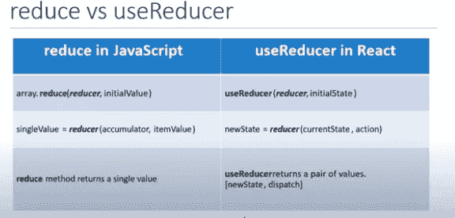
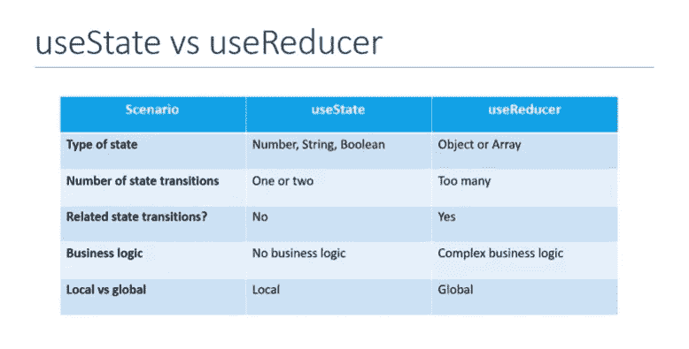

# 理解反应

> 原文：<https://blog.devgenius.io/understanding-react-469e1ac3127d?source=collection_archive---------4----------------------->

## 请阅读这篇简明扼要的文章，它将引导您了解 React Js 的最基本和最重要的概念


# 从背景细节开始

React 是一个 JavaScript 库，旨在简化可视化界面的开发。它由脸书开发，于 2013 年向全世界发布，驱动着世界上一些最广泛使用的代码，为许多软件公司提供支持。

# 一个巨大的误解

**React 是一个 JavaScript“库”**。它不完全是一个“框架”。这并不是一个完整的解决方案，你经常需要使用更多的库来形成任何解决方案。React 不对任何解决方案中的其他部分做任何假设。

框架服务于一个伟大的目的，特别是对于年轻的团队和创业公司。当使用一个框架时，许多聪明的设计决策已经为您做出，这为您提供了一条清晰的道路来专注于编写好的应用程序级逻辑。然而，框架也有一些缺点。对于在大型代码库上工作的有经验的开发人员来说，这些缺点有时是一个障碍。

框架并不灵活，尽管有些人声称是灵活的。一个框架通常希望你用一种特定的方式来编码所有的东西。如果你试图偏离这种方式，框架通常会反对你这样做。框架通常也很大，功能丰富。如果您只需要使用其中的一小部分，无论如何您都必须包含整个内容。诚然，这一点今天正在改变，但仍不理想。

# 让我们从基础开始

# **片段**

对于 **VS Code** 用户，这里有一些有用的片段:

**扩展名**:*ES7 React/Redux/graph QL/React-Native 片段*

*   rce ->创建基于类的组件
*   rfce ->创建功能组件
*   rconst ->为类创建构造函数

> 还有很多其他的扩展，这是最常用的一个。

# **生命周期方法**

## 增加

当组件的实例被创建或插入到 DOM 中时

*   构造器
*   静态 getDerivedStateFromProps
*   提供；给予
*   组件安装

## 升级

当一个组件由于其属性或状态的改变而被重新渲染时。

*   静态 shouldComponentUpdate
*   shouldComponentMount
*   提供；给予
*   getSnapBeforeUpdate
*   componentDidUpdate

## 卸载

当组件从 DOM 中移除时

*   组件将卸载

## 错误处理

当渲染期间、生命周期方法中或子组件的构造函数中出现错误时

*   静态 getDerivedStateFromError
*   componentDidCatch

# *碎片*

React 中的一个常见模式是一个组件返回多个元素。片段允许您对一个子列表进行分组，而无需向 DO 添加额外的节点

# *纯组分*

纯组件只在道具和状态比较浅的情况下重新渲染类组件。这导致了性能的提高。它只适用于基于类的组件。

# *备忘录*

它是高阶分量。纯组件之于基于类的组件，备忘录之于功能组件

# *参考文献*

Refs 使得在 React 中访问 DOM 节点成为可能。有两种有效的方法:-

*   React.createRef()方法
*   回调方法。

Refs 可以与函数组件和类组件一起使用。引用也可以从父组件传递到子组件。

**转发引用**:引用也可以使用**forward Ref(*native component*， *ref* )** 方法从父组件转发到本地输入组件。基本上，子组件从父组件接收 ref，并将其附加到本地输入元素。

# *门户网站*

*React 门户提供了一种将子组件呈现到 DOM 节点的方法，该节点存在于父组件的 Dom 层次结构之外*。它提供了打破 DOM 树的能力。它使用一个函数***react DOM . create portal(JSX，id)。门户*** 表现得像个做出反应的孩子。我们需要门户来处理父子 CSS

# *误差边界*

*错误边界是 React 组件，它捕捉子组件树中的 JavaScript 错误，记录这些错误，并显示回退 UI* 实现生命周期方法*getderivedstatefromrerror*和 *componentDidCatch* 之一或两者的类组件成为错误边界。

getderivedstatefromrerror:这是一个静态方法，用于在抛出错误后呈现回退 UI。
**componentDidCatch** :这是一个用来记录错误信息的方法。

错误边界在生命周期方法和它们下面的整个树的构造函数中的呈现期间捕捉错误，但是，它们不捕捉事件处理程序内部的错误

# *高阶组件—特设*

*一种模式，其中函数将组件作为参数，并返回新的增强组件*。它共享组件中的公共属性，而不必重复代码。

**const new component = higherOrderComponent(original component)
非技术示例:const iron man = with suit(TonyStark)**

这是一个很好的小模式，可以用来在 React 组件之间共享公共功能。

# *渲染道具*

术语“渲染道具”指的是一种使用**道具(其值为函数**)在 React 组件之间共享代码的技术。

# *反应上下文*

上下文提供了一种通过组件树传递数据的方法，而不必在每个级别手动向下传递支柱。
主要包括三个步骤:

*   **创建上下文** —使用 createContext()方法，并导出提供程序和使用者组件。
*   **提供上下文值** —在顶级，包括提供者组件并使用值属性传递该值。
*   **使用上下文值** —使用消费者组件并作为子代传递函数

# 一头扎进胡克斯


***Hooks 是 React 16.8 中的一个新特性，它允许您使用 reactor 特性，而不必编写类*** *。从概念上讲，React 组件始终更接近函数。Hooks 支持函数，但不牺牲 reactor 的实用精神。Hooks 提供了对命令式退出孵化的访问，并且不需要您学习复杂的函数式或反应式编程技术。*

# 为什么是 Hooks？

**问题-1**

*   了解 ***这个*** 关键字在 JavaScript 中是如何工作的
*   请记住在 Components 类中绑定事件处理程序
*   类不能很好地缩小，使得热重载非常不可靠。

**问题-2**

*   没有特定的方法来重用有状态 compomnent Logic
*   HOC 和 render prop 模式确实解决了这个问题，但它使代码更难遵循。
*   有必要以更好的方式共享状态逻辑

**问题-3**

*   为复杂场景创建组件时，相关代码不会组织在一个地方

# **挂钩规则**

> 处理挂钩时要记住的几点

*   **只调用顶层的挂钩**。不要在循环、条件或嵌套函数内部调用挂钩。
*   **仅从 React 函数**调用挂钩。不要在任何常规的 JavaScript 函数内部调用挂钩。

# 挂钩类型

## 1 — useState

*   使用状态挂钩可以在功能组件中添加状态
*   在类中，状态始终是对象
*   使用 useState 挂钩，状态不必是对象
*   新状态取决于以前的状态值

## > _ useEffect

“效果挂钩”允许您在“功能组件”中执行副作用

它是 ***组件安装******组件更新*** 和 ***组件将卸载*** 的紧密替代品

## > _ useContext

上下文提供了一种通过组件树传递数据的方法，而不必在每个级别手动向下传递支柱

## > _ useReducer

这是一个用于国家管理的挂钩。这是 useState 的一个替代项。这是一个比 useState 更原始的挂钩。



## > _ useCallback

Is 是一个挂钩，它将返回回调函数的记忆版本，该版本仅在依赖项之一发生更改时发生更改。

当传递回调来优化依赖引用相等的子组件以防止不必要的重新呈现时，这很有用。

*{引用相等检查函数是否相等。}*

## > _ 使用备忘录

您可以依赖 useMemo 作为性能优化，而不是作为语义保证。将来，React 可能会选择“忘记”一些先前存储的值，并在下次渲染时重新计算它们，例如，为屏幕外组件释放内存。

> 【useCallback 和 useMemo 的区别

*useCallback 缓存提供的函数实例本身，而 useMemo 调用提供的函数并捕捉其结果。因此，如果你需要缓存一个函数，使用 useCallback 钩子；如果你需要缓存一个函数的结果，使用 useMemo 钩子。*

## > _ useRef

通常用于聚焦输入字段。总的来说，它可以用来创建一个通用容器，该容器可以保存一个类似于类组件的实例属性的可变值。
该通用容器在其存储的数据改变时不会导致重新呈现。
同时，在其他状态变量导致该组件重新呈现后，它还会记住存储的数据。

## *以上挂钩在大多数情况下都会用到，除此之外还有三个挂钩:-*

*   ***使用 ImperitiveHandle***
*   **useLayoutEffect**

> ***useDebugValue***

# 额外主题—数据提取

Axios 是一个基于 HTTP 服务的轻量级 HTTP 客户端，类似于本地 JavaScript Fetch API。Axios 是基于承诺的，这使您能够利用 JavaScript 的异步并等待更可读的异步代码。

```
npm install axios
```

**使用 Axios 和 useEffect 在 React 中获取数据**

**使用 Axios 和 useReducer 在 React 中获取数据**

# 结论

本文应该已经很好地向您介绍了 React Js 的关键概念。还有很多需要学习和改进的地方，但是我希望你现在能够自信地钻研和使用 react yourself。

如果你在某个时候感到困惑，需要一个路线图来学习 React，那么你可以参考下面提到的文章。

[](https://codeburst.io/a-practical-road-map-for-react-development-aad87afdd5d0) [## React 开发的实用路线图

### 在这篇简短扼要的文章中，我将指导你完成学习反应和成为…

codeburst.io](https://codeburst.io/a-practical-road-map-for-react-development-aad87afdd5d0) 

如果还有什么不清楚的地方，或者您希望在本文或后续文章中看到什么，请告诉我。如果你想讨论什么，请随时联系我。如果您能发送您的反馈和建议，我将非常高兴。

> 非常感谢你一直读到最后。如果您需要任何帮助，可以联系我:
> 
> web:[https://portfolio.abhisheksrivastava.me/](https://portfolio.abhisheksrivastava.me/)
> insta gram:[https://www.instagram.com/theprogrammedenthusiast/](https://www.instagram.com/theprogrammedenthusiast/)
> LinkedIn:[https://www.linkedin.com/in/abhishek-srivastava-49482a190/](https://www.linkedin.com/in/abhishek-srivastava-49482a190/)
> Github:[https://github.com/abhishek2x](https://github.com/abhishek2x)
> 邮箱:abhisheksrivastavabbn@gmail.com

[](https://github.com/abhishek2x) [## abhishek2x -概述

### 关于 ME I 我天生就是一个企业家，也是一个充满激情的开发者，一个技术爱好者，开源贡献者，技术…

github.com](https://github.com/abhishek2x)