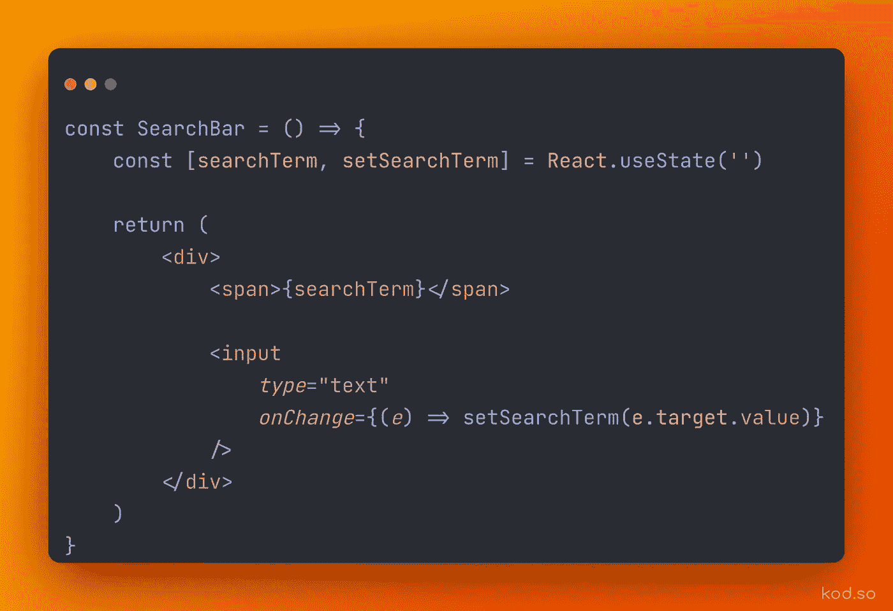
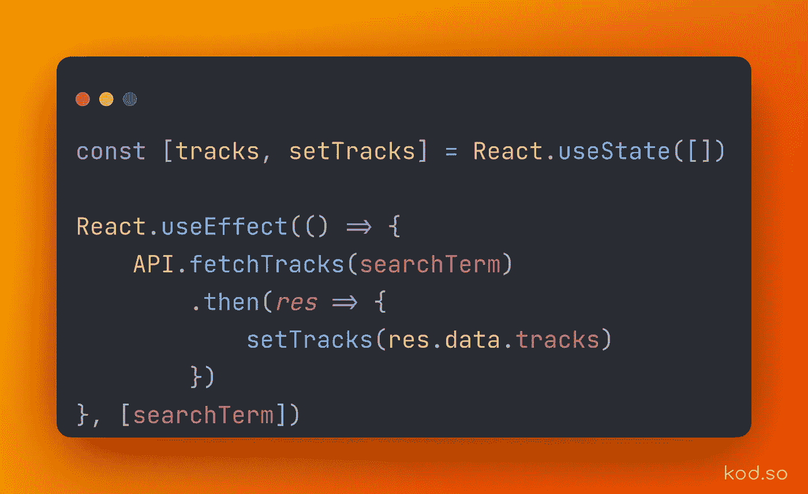
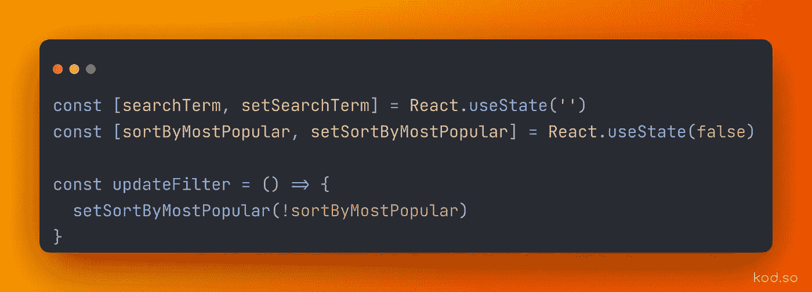
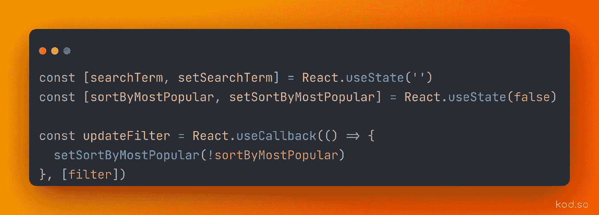

# 了解 React 挂钩

> 原文：<https://blog.devgenius.io/understanding-react-hooks-7e9c4ea690d2?source=collection_archive---------8----------------------->

马克西姆·扎沃龙科在 [Unsplash](https://unsplash.com?utm_source=medium&utm_medium=referral) 上拍摄的照片

理解 react 挂钩可能有点棘手，尤其是当你正在学习 JavaScript 时，所以我想消除 React 挂钩背后的一些神秘，谈谈一些最常见的挂钩以及如何使用它们。

# 使用状态

可以说最常见的钩子是 useState，它存储了组件需要的一些本地状态。useState 的伟大之处在于它可以存储数组、对象、字符串、字符串数组和/或对象中的任何东西。

在上面的例子中，我们使用 useState 钩子来存储用户输入的搜索词。本质上，这个钩子只是一个返回数组中一对值的函数。第一个值是当前状态，第二个变量是更新该状态的函数。

在这里，您可以对当前状态做任何您想做的事情。也许您想使用 **searchTerm** 变量来进行 API 调用，或者通过简单地使用 JSX 来呈现变量来将其显示在屏幕上。要更新这个当前状态，您可以使用 **setSearchTerm** 函数，向它传递新值。

# 使用效果

另一个非常流行的钩子是 useEffect，这个钩子用于在组件挂载之后执行一些代码，或者你可以把它想象成组件渲染之后。当您需要从 API 获取数据或在 render 上更新一些 dom 元素时，它非常有用。这可能会变得非常复杂，但下面可以找到一个非常简单的用例

在这个例子中，API 可以是一个被定义来帮助获取数据的类，或者是一个 axios/fetch 函数。在任何情况下，我们从我们的 useState 钩子传递 **searchTerm** ，然后进行一个 API 调用，它将为我们返回一些数据，我们将使用响应更新 tracks 状态。正如我前面提到的，useState 可以存储许多不同的数据类型，但是在本例中，我们存储一个轨道数组，并使用一个空数组作为初始状态。

所以让我们来了解一下这是怎么回事。组件安装或呈现在屏幕上，然后立即调用我们的 useEffect 函数。这意味着它里面的所有代码都将被执行。在这种特殊情况下，从服务器获取磁道并在本地状态中设置。

您可能想知道这个带有 searchTerm 的数组在 useEffect 钩子中做什么。同样，useEffect 是另一个类似 useState 的函数，它将一个函数作为第一个参数，将一个依赖数组作为第二个参数。这个依赖数组就像一个条件数组，在这个条件数组中，您传入的函数应该被调用。每当依赖数组中的一个变量发生变化时，你传入的函数就会被再次执行。这在这种情况下很有用，因为我们希望在用户继续输入时获得与用户输入相匹配的歌曲，类似于网飞搜索栏。

在其他情况下，你可能只希望你的函数在组件渲染时被调用一次，为此你可以传入一个空数组，这让 React 知道这个函数不依赖于任何其他变量或状态，所以只需运行一次。

当您的组件卸载时，您还可以使用清理函数来执行代码，但这超出了本文的讨论范围。

# 使用回调

这个钩子比之前的钩子稍微复杂一点，但是一旦你理解了如何使用它，它将会极大地改善你的代码库并加速你的应用程序。

如果不使用回调，您组件可能如下所示

这是带有搜索词的第一个例子的延续。我添加了一个功能，将最受欢迎的歌曲排序。这当然可行，但问题是更新过滤器函数将在初始呈现时创建，然后每次用户在搜索输入中键入内容时继续重新创建。

我们可以做得更好，如果 updateFilter 函数只是在用户实际更改过滤器时才被重新创建。这将节省大量不必要的重新创建，因为它只在需要时重新创建。这种技术被称为记忆化，useCallback 帮助我们记忆那些不需要每次渲染都重新创建的函数。

在上面的代码中，我们传递了一个我们想要记忆的函数以及一组依赖项。当依赖数组中的变量改变时，我们会得到一个新的函数，否则 react 不会在重新渲染时重新创建这个函数。

# 摘要

React 挂钩是开发人员在类组件之外访问 React 状态和生命周期方法的一种非常有效的方式。今天我们讨论了 useState 挂钩，它允许我们轻松地管理组件的本地状态。我们还讨论了在不同的生命周期执行代码的 useEffect 钩子，比如当组件第一次安装、卸载，甚至当某些状态变量改变时。我们讨论的最后一个钩子是 useCallback 钩子，它返回给我们一个记忆化的函数，这个函数只有在某些状态值改变时才会被重新创建。非常感谢您的阅读，我希望这有助于您对 React hooks 的理解，哪怕只有 1%。