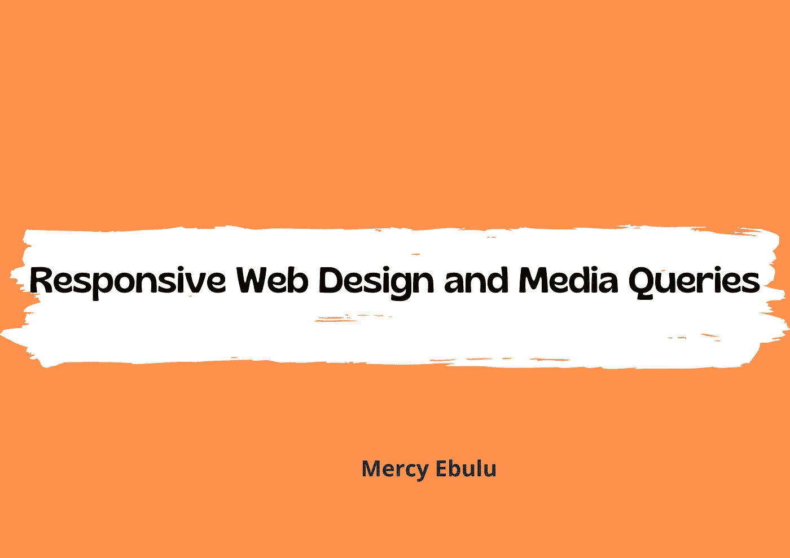
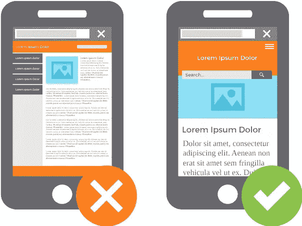
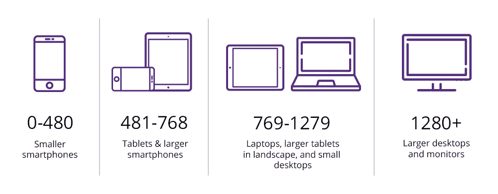

# 了解响应式网页设计和媒体查询。

> 原文：<https://blog.devgenius.io/understanding-responsive-web-design-and-media-queries-d9c7a143757b?source=collection_archive---------6----------------------->



过去，如果你是一名开发人员，正在创建一个网站，你会做的是为一个典型的桌面电脑制作一个网站。没有太多不同的屏幕尺寸，大部分都差不多。我们没有平板电脑和移动设备来浏览网页。然后随着技术的发展，浏览网页变成了移动设备的事情。iPhones、Android 设备和平板电脑等移动设备都内置了浏览器。这带来了一个问题，为电脑(典型的笔记本电脑和台式机显示器)构建的网站在移动设备上看起来很糟糕。应对移动响应可能是一个难题。在这篇文章中，我们将进一步了解什么是媒体查询以及如何在 CSS 中使用它们。

在本文中，您将了解到:

[什么是响应式网页设计](#c07d)？

[如何创建响应式网页](#fe67)。

[有哪些常见的断点](#f336)？

[什么是媒体查询](#fe67)？

[媒体查询语法](#fe67)。

[如何在 CSS 中使用媒体查询](#b4b7)。

**什么是响应式网页设计(RWD)？**

响应式网页设计(RWD)是一种网页设计方法，其目标是创建在所有设备上都好看的网页。RWD 的想法是有一个单一的网站，可以响应几个屏幕尺寸或设备类型，同时保持其美丽和美观。

网站会对几个方面做出反应，不仅仅是屏幕上的像素数量或宽度，还可能是高度，也可能是设备是横向还是纵向，以及你如何拿着手机或平板电脑。

响应的网页将自动调整不同的屏幕尺寸和视窗。

简而言之，网站对各种形式的用户设备做出响应的过程被称为响应式网页设计(RWD)。

**如何创建 Web 响应式网页？**

**设置视口**

要创建一个响应迅速的网站，请在你的所有网页上添加以下内容。

```
<meta name="viewport" content="width=device-width, initial-scale=1.0">
```



这将设置页面的视窗，并给浏览器提供如何控制页面尺寸和缩放的指示。这是您添加到 HTML 中的一行小代码，用来告诉您手机上的浏览器，您的网站会有响应。通过在你的 HTML 中添加这个小补丁，你的 CSS 中包含的媒体查询和其他响应性布局将会正常工作。

**设备和内容的常用断点。**

断点对于确定何时改变布局和适应媒体查询中的新规则很重要。



如上图所示，这些是器件宽度的常用断点。如今市场上有成吨的设备，我们无法为每个设备定义一个固定的断点。下面提到的断点不是标准断点，而是编写 CSS 时常用的断点。

*   对于移动设备:0px-480px
*   对于平板电脑、iPads 和更大的智能手机:481 像素-768 像素
*   对于笔记本电脑和小屏幕:769px-1024px
*   台式机:1025 像素-1200 像素
*   对于更大的屏幕、更大的台式机、电视和显示器:1201 像素或更高。

**什么是媒体查询？**

媒体查询是响应式网站设计的基础。如果你想做任何形式的移动响应设计，媒体查询是必不可少的，在今天这个时代，你需要考虑移动设备。媒体查询用于根据设备类型或屏幕大小等特性有条件地应用样式。在 CSS 中，媒体查询为我们提供了编写仅适用于特定屏幕尺寸的 CSS 样式的能力。

**媒体查询语法。**

```
@media media type and (condition: breakpoint){
/* CSS Media Query Syntax */
}
```

看上面写的语法似乎很混乱。让我们看看组成这个语法的组件，以帮助我们理解如何有效地使用媒体查询。

**@媒体规则**

在 CSS 中定义媒体查询的第一步是编写@media 规则。@media 规则还用于指定目标媒体类型。

**媒体类型**

有四类媒体类型。

*   **所有-** 适用于所有媒体类型
*   **打印-** 仅用于打印机。
*   **语音-** 适合大声朗读页面的屏幕阅读器，就像我们在 medium 上使用的屏幕阅读器功能一样。
*   **屏幕-** 用于电脑、平板电脑、手机和电视屏幕。

还需要注意的是，如果我们不应用媒体类型，默认情况下,@media 规则会选择所有类型的设备。

在定义了@media 规则并选择了目标媒体类型之后，我们在括号()中设置了一个条件，可以是`max-width`或`min-width`，还指定了您希望定义的规则应用到的断点。

例如，我们希望为移动设备的段落应用较小的字体大小。为此，我们将设置检查器件宽度的最大宽度。

```
p{
 font-size:16px;
}/* CSS Style for a mobile screen*/@media screen and (max-width:480px){
  p{
   font-size:12px;
  }
}
```

这里，断点是 480px。现在，媒体查询知道何时执行或覆盖`p`元素的新字体大小。这里需要注意的是，如果设备的宽度小于或等于 480px，`p`的字体大小为 12px，如果设备的宽度大于 480px，`p`的字体大小为 16px。

**如何在 CSS 中使用媒体查询**

我们已经考虑了如何在样式表中编写和定义媒体查询，让我们考虑几个例子来帮助我们巩固对这个令人惊叹的 CSS 特性的理解。

```
body{
background-color:black;
   }/* This style will give the body of the webpage a background color of black. */
```

让我们使用上面的 CSS 样式添加一些媒体查询。

```
@media screen and (min-width:768px){
  body{
    background-color:white;
    }
  }
```

这里，最小断点是 768px。现在，对于大于或等于 768 像素的屏幕，媒体查询将对页面主体应用新的背景颜色`white`。

```
@media screen and (max-width:1200px)
  body{
    background-color:blue;
    }
}
```

这里，最大断点是 1200px。现在，对于小于或等于 1200 像素的屏幕，媒体查询将对页面主体应用新的背景颜色`blue`。

**结论**

正如我们所见，在当今时代，响应式网页设计是构建网站的关键。媒体查询为我们提供了建立响应网站的能力。值得注意的是，CSS 中还有其他功能可以帮助我们创建响应式布局，如 [Flexbox](https://css-tricks.com/snippets/css/a-guide-to-flexbox/) 和 [Grid](https://css-tricks.com/snippets/css/complete-guide-grid/) 。我希望你喜欢这篇文章？

有问题可以在评论区分享。我将非常乐意回答每个问题。

感谢您的阅读。

可以在以下平台关注我。

[**推特**](https://twitter.com/mercysticks)

[**GitHub**](https://github.com/Mercysticks)

[**展示案例**](https://www.showwcase.com/mercysticks)