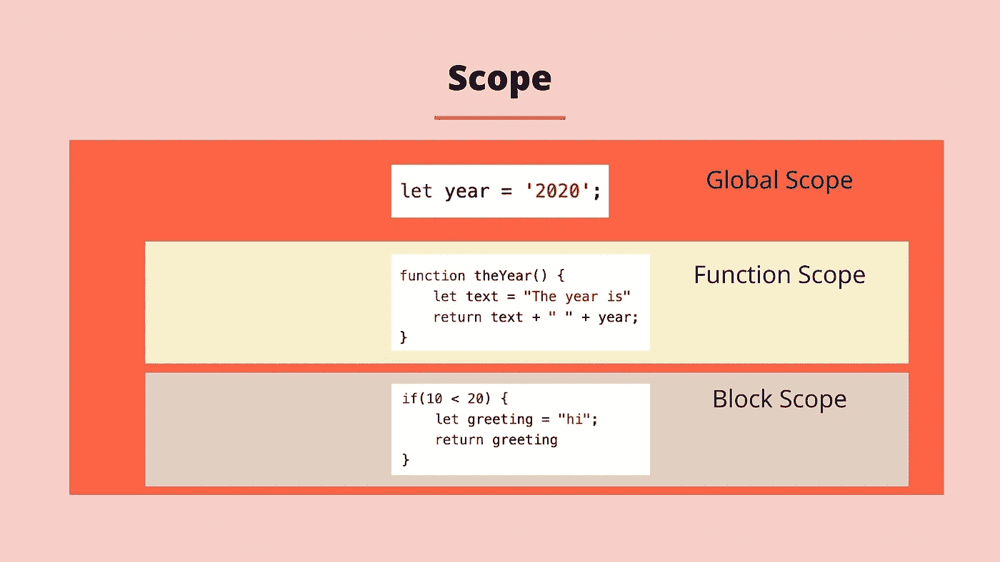

# 理解 JavaScript 中的范围

> 原文：<https://blog.devgenius.io/understanding-scope-in-javascript-f88e946636ac?source=collection_archive---------7----------------------->



在你的家里，你可能在厨房或走廊里放了一些物品，住在那里的任何人都可以拿到。在你的房间里，你可能会有一些更私人的物品，你可能更喜欢只供自己使用。这个例子本质上就是 JavaScript 中作用域的工作方式。它定义了代码运行时如何访问变量、对象和函数的规则。

JavaScript 中的范围定义了代码的当前上下文。基本上，JavaScript 中有两个作用域，全局作用域和局部作用域，本质上这定义了代码运行时哪些变量是可访问和可见的。

## 什么是全球范围？

在 JavaScript 中，我们的程序有一个全局范围。全局范围内的变量在我们代码的任何地方都是可访问的、可改变的和可见的。全局范围内的变量在程序运行的整个生命周期内都是可用的。在函数或块外部声明的变量是全局范围的一部分。

当我们在全局范围内声明变量时，注意我们为什么要这样做是很重要的。当程序运行时，在全局范围内声明变量会耗尽内存，当在代码的不同范围内分别声明同名变量时，命名事件就会发生。下面是一个在全局范围内声明的变量的例子。

```
var ourGlobalVariable = "Hello";function someFunction() {
  return ourGlobalVariable;
}someFunction();//Returns ---> 'Hello'
```

在上面的例子中，我们声明了全局变量 *ourGlobalVariable* ，并用字符串 *hello* 对其进行初始化。接下来，我们定义一个名为 *someFunction* 的函数，它将在被调用时返回*我们的全局变量*。最后，我们继续调用 *someFunction* 函数，该函数从 *ourGlobalVariable* 返回字符串。所有这些都是可能的，因为*我们的全局变量*在全局范围内，可以从任何地方访问。

## 本地范围是什么？

例如，每当在全局作用域中创建新的作用域时，每次创建一个函数时，都会创建一个新的局部作用域。在这个局部作用域中创建的任何变量都只能从这个函数中访问。函数参数也被归类到局部范围内。如果您试图从函数外部访问它们，JavaScript 将抛出一个错误。

从 ES6 开始，我们可以将局部作用域分成两部分，函数作用域和块作用域。如今当我们使用变量时，我们通常使用 *let* 或 *const。*鉴于 ES6 之前编写的大量代码，熟悉 *var* 仍然是值得的。每个变量使用不同的作用域，如下所示:

*   var:函数范围
*   const:块范围
*   let:块范围

## 什么是函数作用域？

当一个变量被定义在一个函数中时，我们可以说这个变量是函数作用域的。如果你试图从函数外部访问一个局部变量，它被定义为一个错误，特别是，当你运行代码时会抛出一个引用错误。用关键字 let 和 const 定义的变量在函数作用域中的行为与在块作用域中的行为相同。

```
function someFunction() {
  let ourLocalVariable = "Hello";
  return ourLocalVariable;
}console.log(ourLocalVariable);
//Returns ---> VM95:7 Uncaught ReferenceError: ourGlobalVariable is not defined
```

在上面的例子中，我们定义了一个名为 *someFunction* 的函数。在某个函数内部，我们首先声明一个名为*ourlocalvarvable*的变量，它用字符串 Hello 初始化。然后，该函数返回变量。在函数之外，所以回到全局作用域，我们尝试 console . log out*ourLocalVariable*的值。我们返回了一个引用错误，因为我们试图从全局范围访问局部范围的变量。

```
function someFunction() {
  const ourGlobalVariable = "Hello";
  return ourGlobalVariable;
}console.log(ourGlobalVariable);
//Returns ---> VM95:7 Uncaught ReferenceError: ourGlobalVariable is not defined
```

在下一个例子中，我们使用 const 创建的变量重复相同的步骤。因为 const 和 let 都是块范围的，所以我们遇到了同样的问题。

## 什么是块范围？

在 JavaScript 中，块是嵌套在一对花括号内的一段代码。条件语句和循环都是块的例子。

块作用域意味着每次创建块时，都会创建一个新的局部作用域。当我们在一个块中创建一个变量时，这个变量的作用域就是这个块。这意味着这些变量不能从块的外部访问。如果试图从块外部访问块内部定义的变量，JavaScript 将抛出一个错误(引用错误)。当我们用 var 关键字定义变量时，块作用域不适用。

```
function ourScopeExample(){
    if (true){
        var one = "I was created using var";

    }
    console.log(one);
}

ourScopeExample();//Returns ---> I was created using var
```

在上面的例子中，我们创建了一个名为 *ourScopeExample* 的函数。在函数内部，我们使用 if 语句创建一个块。在 if 语句中，我们创建了一个名为 *one* 的变量，用字符串*初始化。*在程序块之外，我们尝试 console.log 一个变量*的值。*最后，我们调用 *ourScopeExample* 函数。当这段代码运行时，初始化*的字符串被打印到控制台。这样做的原因是 var 是函数范围的，所以没有块范围规则适用。*

```
function ourScopeExample(){
    if(true){
        let two = "I was created using let";

    }
    console.log(two);
}

ourScopeExample();//Returns ---> Uncaught ReferenceError: two is not defined
```

我们现在继续重复相同的步骤，但是这次我们使用 let 代替 var。当这段代码运行时，会返回一个引用错误，因为 let 是块范围的，不能从创建它的块外部访问。如果我们想让这段代码运行，我们需要做一些类似下面的例子。

```
function ourScopeExample(){
    if(true){
        let two = "I was created using let";
        console.log(two);
    }
}

ourScopeExample();//Returns ---> I was created using let
```

或者，我们可以将 let 放在块范围之外，放入函数的外部范围。这就把我们带到了词法范围。

```
function ourScopeExample(){
    let two = "I was created using let";
    if(true){
        console.log(two);
    }
}

ourScopeExample();
//Returns ---> I was created using let
```

## 词汇范围

词法作用域是函数作用域从外部或父作用域访问变量的方式。内部或子函数在词汇上绑定到外部/父函数。这意味着一个函数可以访问从自己的作用域到全局作用域的所有作用域。

```
function outerParent(){
    var one = "I was created using var";        
    let two = "I was created using let"; function innerChild(){
        console.log(one);
        console.log(two);
    }
    innerChild();
}

outerParent();//Returns --->
//I was created using var
//I was created using let
```

上面的例子给出了词法范围的另一个例子。我们创建一个名为 *outerParent* 的函数，在这个函数中我们创建了两个变量，*一个*是用 var 创建的，*两个*是用 let 创建的。这两个变量都是用字符串初始化的。接下来，我们创建另一个函数，我们称之为 *innerChild* 。在 *innerChild* 函数中，我们控制台记录了一个*变量*和两个*变量*的值。在 *innerChild* 函数的外部，我们直接调用 *innerChild* 函数。最后，在*外部父*函数之外，我们调用*外部父*函数。当此代码在两个控制台上运行时，日志会成功工作。

我希望你喜欢这篇文章，请随时发表任何意见，问题或反馈，并关注我的更多内容！