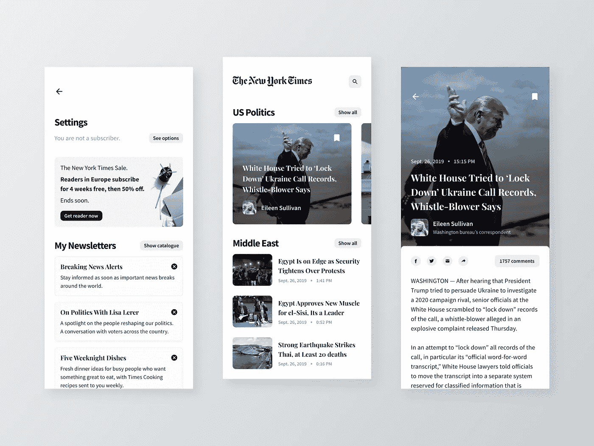
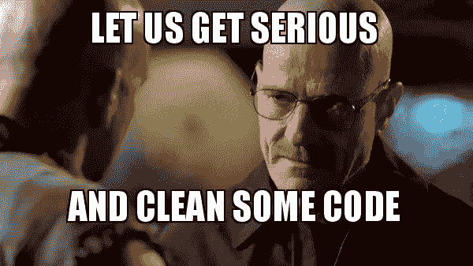

# 理解编程 UI 中的样式。

> 原文：<https://blog.devgenius.io/understanding-styles-in-programmatic-ui-f282acc143dd?source=collection_archive---------0----------------------->

## 编程用户界面，样式

## 帮助您一步一步地清理存储的属性！

当你寻找灵感时，无论是来自你自己的伟大思想，还是来自像 dribbble 这样的网站。就像上面的例子一样，我们可以看到多个可以重复使用的按钮和标签。

用相同的方法创建编程存储属性是乏味且不必要的。如果它没有遵循 DRY 的概念，那么重构它。

**D** : *别*
R:*重复*
Y:*自己*

当编写代码时，我们注意到这两个存储的属性有一些共同的兴趣。

> translatesAutoresizingMaskIntoConstraints = false
> font = ui font . system font()
> text color =。白色

这是六行不需要的代码。让我们实现一个样式文件来帮助解决这个问题！

我创建了一个新的 Swift 文件，并将其命名为 TestUIStyle。因为我想要模仿的样式是用于标签的，所以我将它子类化为一个 UILabel，并从一个名为“style”的枚举开始。正如你所看到的，我已经从我们的 dribbble 图像中确定，我们有大量的标签将会效仿。

现在我们要创建一个常量，并将其设置为我们的枚举并初始化它。这允许我们选择我们想要的样式以及在我们的 ViewControllers 中创建它时您想要的给定文本。“text: String”是可选的，如果您不愿意，它不是必需的。

正如你所看到的，每一种被转换的风格都有它们自己的属性，但是它们都符合我们需要的两点。

> translatesAutoresizingMaskIntoConstraints = false
> number of lines = 0

让我们来看看这个样式文件是如何从我们以前拥有的到现在的！

在使用编程式 UI 时，清理不需要的代码可以节省大量时间。我们能够把一切都归结为两条路线。

这里是完整的样本代码供查看！希望你和我一样，喜欢你的东西是干的！