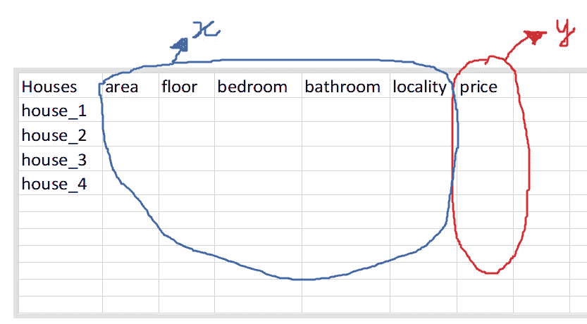

# 了解监督学习

> 原文：<https://blog.devgenius.io/understanding-supervised-learning-bb8ee40556e9?source=collection_archive---------9----------------------->

[国家癌症研究所](https://unsplash.com/@nci?utm_source=medium&utm_medium=referral)在 [Unsplash](https://unsplash.com?utm_source=medium&utm_medium=referral) 上拍摄的照片

如果你刚刚开始学习机器学习的概念，你很可能会先学习监督学习。这篇文章旨在给你一个简单的了解。

## 什么是监督学习？

监督学习，顾名思义，就是通过事先给机器学习模型数据进行分析，来监督机器学习模型。这是一种机器学习方法，我们根据历史数据进行预测/分类。在这种方法中，机器被给予良好标记的数据，基于这些数据模型被公式化。然后，给出新的数据，并根据模型进行预测。

## 一个简单的类比:

1.  你的老师教你把两个数相加。她给你问题和答案。
2.  您将使用工作簿中的其他示例学习如何将两个数字相加。
3.  你根据这个概念进行测试。

在上面的场景中，老师就像监督者一样监督你是否正确地解决了问题。你学习解决问题的方法就像正在形成的模型。你给出的测试就像是一个新的例子，它被赋予了一个被测试的模型。第一步是给机器提供标记良好的数据。第二步是机器分析如何解决加法问题，并提出一个模型。在第三步中，给模型一个它从未见过的问题。该模型应该能够基于它在前两步中学习到的技术准确地给出答案。

## 这里有一个例子:

用一个小的经典例子可以更好的理解这个概念。假设我们试图根据房子的特征(包括总面积、楼层数、卧室数、浴室数、位置等)预测某个城市的房价。

假设我们已经有一个由列(房子的特征和价格)组成的数据集，每行代表一所房子。

房价数据的数据集模板

在上图中，我们有房子的特征，这些特征将被视为我们的 x 变量(x1，x2，x3，…)。

> 记住:我们总是把自变量(或特征)作为 x。

最后一栏是价格。这将被视为我们的 y 变量，即要预测的变量。

> 记住:我们总是把因变量作为 y。

在我们的数据集中，自变量(房子的特征)已经映射到因变量(房子的价格)。所以，现在当我们把这些数据给我们的机器时，它会找到房子的特征和价格之间的关联。

> 比如面积越大或者卧室/卫生间数量越多，房子的价格就会越高。

机器将得出的关系将是我们的“**模型**”。该模型将是一个数学函数的类型: **Y = f(x)。**

简单来说， **Y** 是房子的价格，而 **f(x)** 是 x 的函数，它可以是一条简单的直线(y = mx+c)，可以是一个 sin 函数(y = sin(x))，也可以是天底下任何一个精确描述特征与房子价格关系的数学函数。

好了，现在我们的模型已经训练好了，我们可以通过给模型提供房子的特征(即 x1，x2，x3，…)来预测另一所房子的价格(即 y)。基本上，我们在函数 f(x)中插入 x 值，得到一个 y 值作为输出。

## 监督学习的类型:

1.  [回归](https://en.wikipedia.org/wiki/Regression_analysis) —输出是一个值，如“价格”。

*   回归的类型有— [线性](https://en.wikipedia.org/wiki/Linear_regression)(其形式为 y=mx+c)、[逻辑](https://en.wikipedia.org/wiki/Logistic_regression)(当输出应该是离散的，如 0 或 1 时使用)、[多项式](https://en.wikipedia.org/wiki/Polynomial_regression)(x 和 y 之间的关系是 n 次的)、贝叶斯(使用[贝叶斯定理](https://en.wikipedia.org/wiki/Bayes%27_theorem))。

2.分类-输出是一个类别/类，如“个人患有糖尿病”或“个人没有糖尿病”。

*   分类类型包括线性分类器、支持向量机(SVM)、决策树、k-最近邻和随机森林。

## 示例:

1.  垃圾邮件检测—该模型将给定的电子邮件分类为垃圾邮件/垃圾邮件。
2.  预测分析-监督学习可用于预测各种各样的事情，如价格、天气等。
3.  图像/对象识别—用于识别对象和分类图像。
4.  疾病检测—可用于发现一个人是否患有某种疾病。

本文到此为止！请不要忘记鼓掌👏🏻😇如果你觉得这篇文章是有帮助的！

*更多内容请看*[*blog . dev genius . io*](http://blog.devgenius.io)*。*