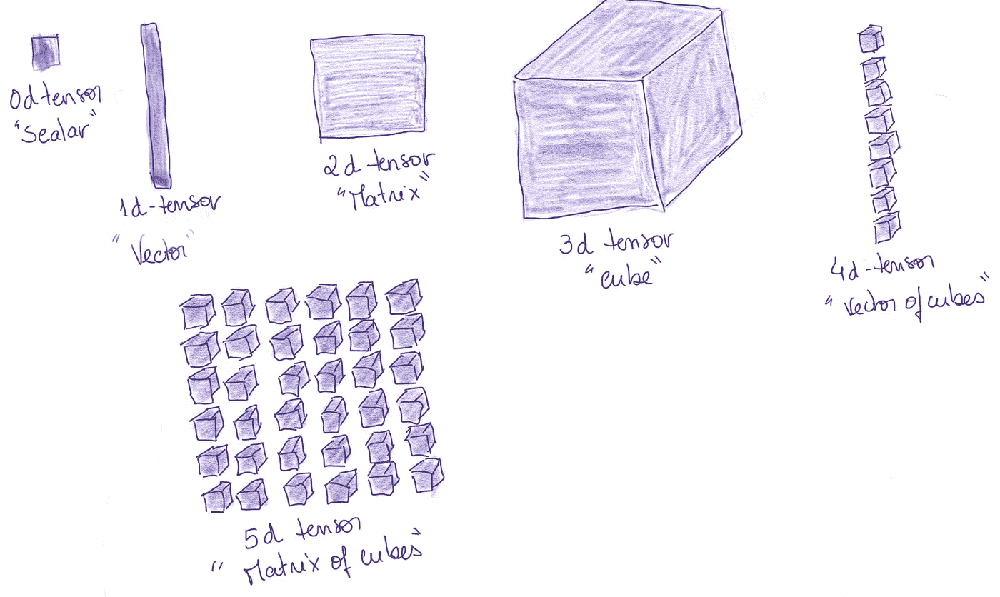
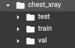
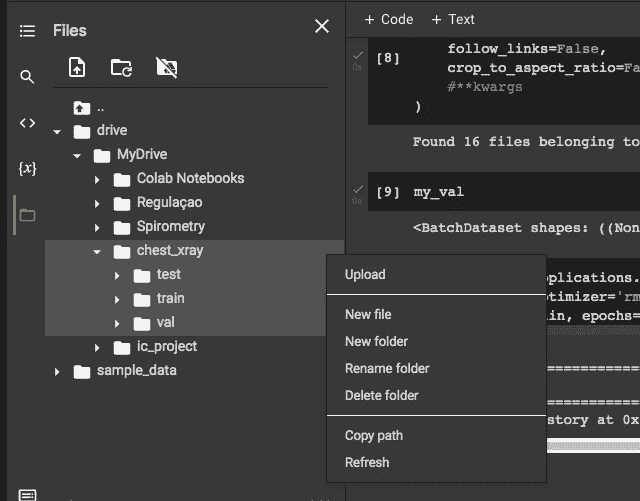
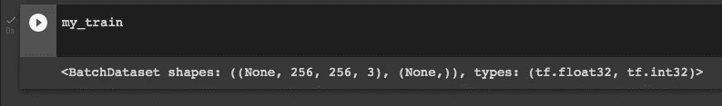
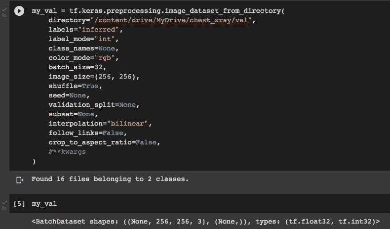
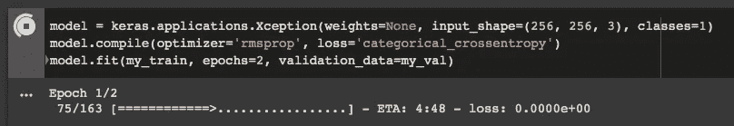

# 用 Keras 和 TensorFlow 理解张量数据结构

> 原文：<https://blog.devgenius.io/understanding-tensors-for-image-classification-with-keras-and-tensorflow-c9710e22cbf?source=collection_archive---------3----------------------->

模型 API 的数据预处理

对每个数据科学项目使用正确的数据结构是最基本的。在大多数简单的项目中，我们可以使用表格数据，有时如果我们足够幸运的话，表格数据将很容易清理，并且很容易处理丢失的值，我们的项目准备好了，因为我们导入了漂亮和干净的。csv 文件。

然而，这不适用于使用 TensorFlow 和 Keras 的图像分类任务。顾名思义，Keras 和 TensorFlow 使用的数据结构是张量。

但是张量到底是什么呢？

张量数据结构是在内存中存储多维异构对象的一种简单而有效的方法。你可以把它想象成容器。一个张量可以用一个**秩-** 和**形-** 对来表示，其中秩表示张量拥有的维数，形表示每个维中元素的个数。等级和形状对存储在二维数组中。

为了在 Python 中操作张量，我们使用了 **NumPy** 库。张量是多维 NumPy **数组**。

让我们看一些例子:

**标量或秩为 0 的张量:**

```
x = np.array(34)
x[OUT] array(34)
```

如果我们不确定我们可以检查维度的数量:

```
x.ndim[OUT] 0
```

**向量或秩 1 张量:**

```
y = np.array([34, 4, 7, 21, 8])
y[OUT] array([34, 4, 7, 21, 8])y.ndim[OUT] 1
```

**矩阵或秩为 2 的张量:**

```
z = np.array([[5, 78, 2, 34, 0],
              [6, 79, 3, 35, 1],
              [7, 80, 4, 36, 2]])
z[OUT] array([[ 5, 78,  2, 34,  0],  
             [ 6, 79,  3, 35,  1],      
             [ 7, 80,  4, 36,  2]])z.ndim[OUT] 2
```

**立方或三阶张量:**

```
w = np.array([[[5, 78, 2, 34, 0],
               [6, 79, 3, 35, 1],
               [7, 80, 4, 36, 2]],
              [[5, 78, 2, 34, 0],
               [6, 79, 3, 35, 1],
               [7, 80, 4, 36, 2]],
              [[5, 78, 2, 34, 0],
               [6, 79, 3, 35, 1],
               [7, 80, 4, 36, 2]]])
w[OUT] array([[[ 5, 78,  2, 34,  0],    
              [ 6, 79,  3, 35,  1],      
              [ 7, 80,  4, 36,  2]],                 [[ 5, 78,  2, 34,  0],       
              [ 6, 79,  3, 35,  1],     
              [ 7, 80,  4, 36,  2]],                     [[ 5, 78,  2, 34,  0],      
              [ 6, 79,  3, 35,  1],    
              [ 7, 80,  4, 36,  2]]])w.ndim[OUT] 3
```

我们可以继续讨论 4 阶和 5 阶张量。把一个秩为 4 的张量想象成一个立方体的向量，把秩为 5 的张量想象成立方体的矩阵。

用这种秩格式表示的数据的例子包括标量(对于秩-0)、数字阵列(对于秩-1)、表格数据库(对于秩-2)，如果我们有也是表格的时间序列数据，则可以使用秩-3 张量。对于图像，我们有 4 级张量，对于视频，我们有 5 级张量。



图像(或者我应该称之为艺术品？)来自作者

**秩为 4 的张量**

秩为 4 的张量是我们将在 Keras 和 TensorFlow 的数据集中使用的张量。通常图像是秩为 3 的张量，在那里他存储了(宽度，高度，颜色 _ 深度)的数据。然而，在图像分类项目中，我们不是只处理一幅图像，而是处理一批图像(图像的数据集)。这一批的大小将是我们的第 4 个元素，这将使秩 4 张量。这样，如果我们有一个具有 1000 个图像的样本，大小为 255x255 的 RGB 格式，我们将有以下张量(样本，高度，宽度，颜色深度)= (1000，255，255，3)。

**将数据集作为秩 4 张量导入**

Keras 拥有自己的图像数据预处理功能，允许我们以一种准备好“进入”模型的格式导入数据:`image_dataset_from_directory`。我们可以看到这个函数的运行，但是首先我们需要导入一些库:

```
import tensorflow as tf
from tensorflow import keras
from tensorflow.keras.preprocessing import image_dataset_from_directory
```

然后我们将 Google Colab 连接到 Google Drive。我将使用先前从 [Kaggle](https://www.kaggle.com/paultimothymooney/chest-xray-pneumonia) 下载的 x 光数据集。



然后是函数:

```
my_train = tf.keras.preprocessing.image_dataset_from_directory(
       directory="/content/drive/MyDrive/chest_xray/train",
       labels="inferred",
       label_mode="int",
       class_names=None,
       color_mode="rgb",
       batch_size=32, 
       image_size=(256, 256),
       shuffle=True,
       seed=None, 
       validation_split=None,
       subset=None,
       interpolation="bilinear",
       follow_links=False,
       crop_to_aspect_ratio=False,
       #**kwargs
)
```

现在让我们研究一下这个函数中的参数:

1.在**目录**参数中，您必须包含文件的路径。如果你正在使用 Google Colab，你可以简单地右击位于你的目录右边的三个点，选择“复制路径”,然后在你的目录参数中跳过它。



2.使用 **labels= "推断"**，如果我们的文件夹中有子目录，该功能将自动根据文件夹依次用 0、1、2 标记图像。我们也可以将它设置为**“None”**，这样就不会给我们的图像添加标签，或者我们可以将标签定义为一个整数列表，按照字母数字顺序分配给文件夹。

3.参数 **label_mode** 只能取两个值**“int”**或**“binary”**。如果我们有两个以上类别的分类数据，我们应该将它设置为“int”。如果我们只有两个类别(二进制类)，那么我们设置“二进制”。如果设置了“二进制”,我们的标签将只有 0 和 1。

4.使用 **class_names** 我们可以将标签分配给我们的图片，它们是字符串而不是整数。注意，如果我们使用这个选项，**标签**参数应该被设置为**【推断】**并且类名应该与文件夹名相匹配。

5. **color_mode** 参数可以取三个选项中的一个:**【灰度】****【RGB】**或**【rgba】**。通常，彩色图像是“rgb”。

6.参数 **batch_size** 指的是在一次迭代中使用的训练图像的数量。默认批量为 **32** ，但也可以定义为 **64** 、 **128** 或更高。请记住，较高的批量，虽然增加了模型的速度，导致较低的渐近测试精度。

7.在 **image_size** 参数中，顾名思义，必须声明图片的大小。通常默认为 **(256，256)** 。

8.参数 **shuffle** 应设置为 **True** ，否则图像将按字母数字顺序排序。

9.使用**种子**，您可以定义一个先前的估计起点，如果您从先前的模型中知道它的话。参数应该采用 *int* 格式。

10.如果要在训练和验证数据集中拆分数据，可以使用 **validation_split** 参数。您可以定义一个介于 0 和 1 之间的浮点数。通常是训练数据的 20%，这意味着 **validation_split = 0.2**

11.如果您设置了之前的参数，现在在**子集**中您必须选择**训练**或**验证**。如果之前的参数也是“无”，则应设置为“**无**”。

12.使用**插值**选择调整图像大小时使用的方法。默认的方法是“**双线性**”。

13.参数 **follow_links** 可用于通过符号链接访问的子目录。默认值为**假**。

14.一旦我们需要我们的图像符合模型接受的格式，最后一个参数 **crop_to_aspect_ratio** 通常被定义为 **False** 。如果我们从头开始构建一个模型，我们可以使用不同的格式，因此可以接受不同格式的图像，而不仅仅是正方形。

最后，我们可以看到我们的数据被成功加载到变量 **my_train** 中。



张量 my_train。

如果我们对验证数据集进行同样的操作:



现在，我们已经准备好构建、编译和拟合模型(我将使用预先训练的例外):



总之，我希望这个小教程已经帮助你理解了什么是张量，以及如何在 Keras 的图像分类任务中使用它们。您可以在 [Keras 文档](https://keras.io/about/)中找到导入数据的函数，并了解关于其参数的更多信息。

**如果:**你喜欢这篇文章，别忘了关注我，这样你就能收到关于新出版物的所有更新。

**其他如果:**想了解更多，可以用[我的推荐链接](https://cdanielaam.medium.com/membership)订阅 Medium 会员。它不会花你更多的钱，但会给我一杯咖啡。

**其他:**谢谢！

*更多内容尽在*[*blog . dev genius . io*](http://blog.devgenius.io)*。*