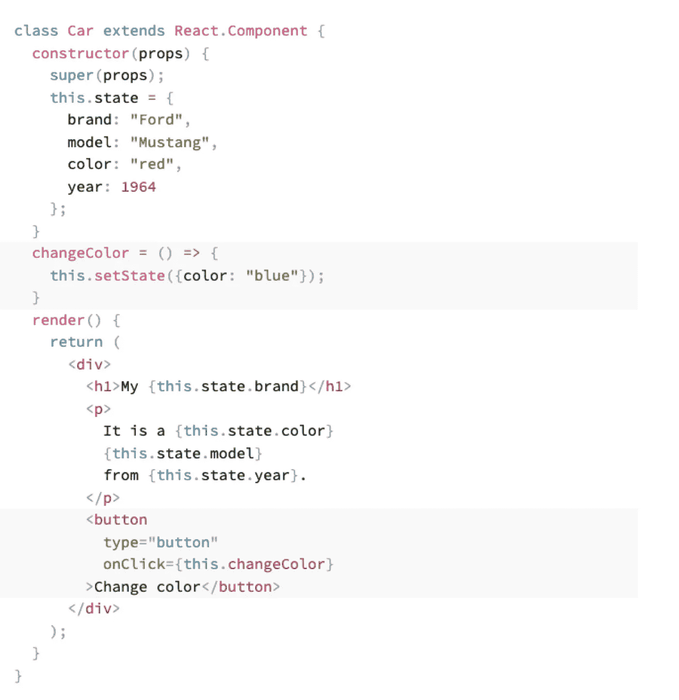
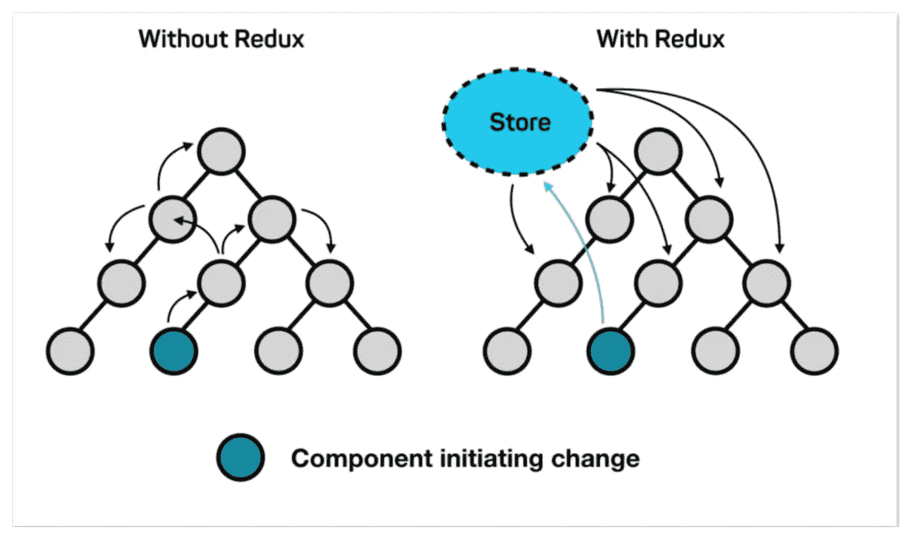
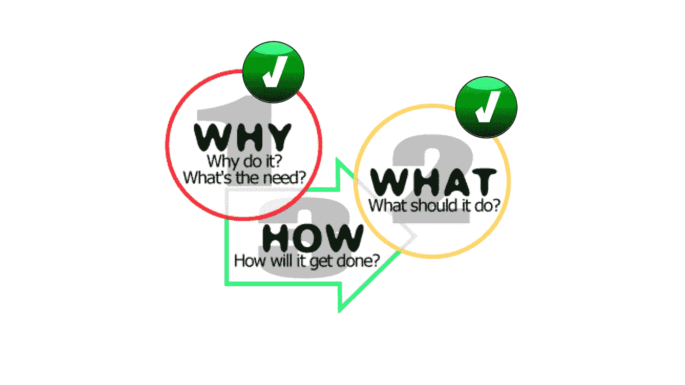
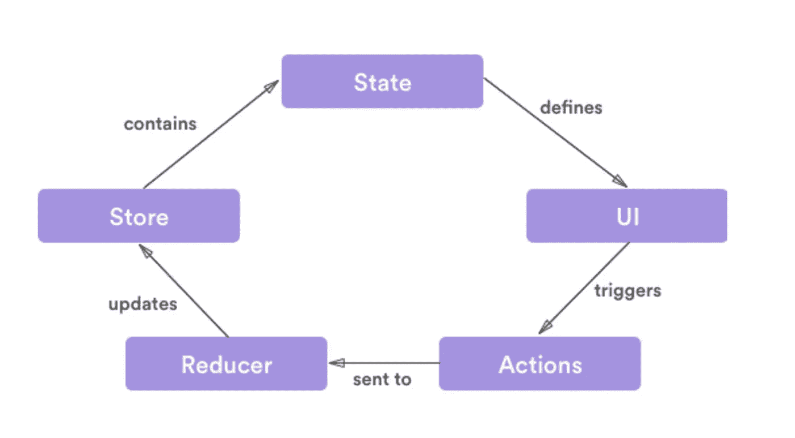
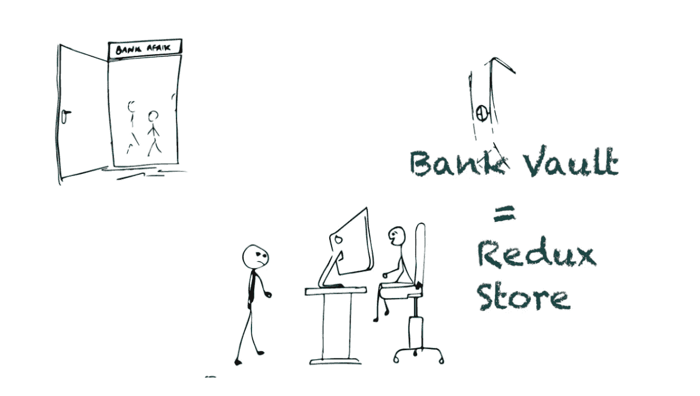
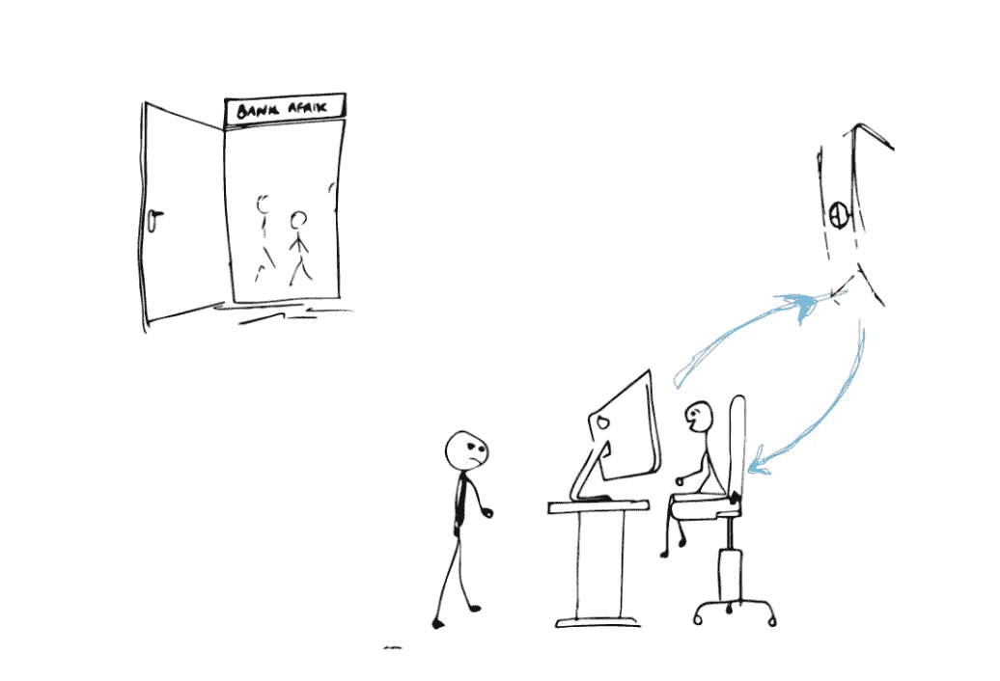

# 理解冗余的概念

> 原文：<https://blog.devgenius.io/understanding-the-concept-of-redux-5a50acfe38d?source=collection_archive---------12----------------------->

> Redux 是一个模式和库，用于管理和更新应用程序状态，使用称为“动作”的事件。换句话说，Redux 模式为 JavaScript 应用程序提供了状态管理。


那实际上是什么意思？什么是管理状态？什么是状态？

当我第一次在学习 Redux 时读到这句话时，我仍然感到困惑。我知道这个定义，但我仍然不清楚它到底是什么。

因此，为了更好地理解 Redux 到底是什么，我们需要首先了解状态和状态管理。它将帮助我们更好地理解 redux 的概念。

# 那么，什么是“状态”呢？

“State”是一个普通的 JavaScript 对象，React 使用它来表示关于组件当前情况的信息。

它在组件中被管理(就像在函数中声明的任何变量一样)。类变量和状态之间的主要区别在于，当状态更新时，组件被重新渲染，从而显示更新的值，但类变量不会发生这种情况，因为类变量更新时不会调用*【render()】。*

> ***注意:React 类组件有一个触发 render 方法的 *forceUpdate* 方法。通过在更新我们的类变量后调用 *this.forceUpdate()* ，我们可以手动调用 *render()* 即获取我们要更新的显示值。***

*下面是一个示例，说明如何在 React 中定义、使用和更改状态。在改变一个状态的时候，我们可以简单的调用***this . setstate()***并给它传递一个对象或者一个返回对象的函数，而不是手动赋值变量。调用***this . setstate()***将传递的对象合并到当前状态，创建一个新的状态对象，如果这导致一个改变的值，则调用 ***render()*** 。*

**

*既然我们对状态有了更好的了解，让我们来看看状态管理。*

# *什么是国家管理？*

*状态管理只不过是跨组件管理数据。这是一种设计模式的实现，在这种设计模式的帮助下，我们可以在应用程序的所有组件中同步应用程序的状态。*

> *这意味着为您访问和修改应用程序状态的方式创建一个结构。你可以认为这是管理“前端数据库”。*

*既然我们对“状态”和“状态管理”都有些熟悉，那么让我们回到我们主要关心的问题上来，回顾一下我们在本文开始时遇到的 Redux 的定义。*

**

****嗯，现在定义好像更熟悉了。Redux 只是允许我们为 javascript 应用程序维护一个可预测的状态容器。****

> *如果应用程序变得越来越大，管理应用程序的状态就会变得一团糟。为了克服这些情况，有多种状态管理工具可用，***【Redux】***是最流行的状态管理工具之一(其他工具:上下文 API、反冲、钩子等)。*

**

****我们为什么需要这个？为什么是 Redux？****

*好吧，让我们举一个有多个组件的应用程序的例子，来证明 redux 实际上解决了什么问题，从而清楚地说明我们为什么需要 Redux。*

*考虑一下，每个组件管理它的状态，并且还有子组件。在某些情况下，我们可能需要与子组件共享一个状态，或者我们可能需要从子组件中更改/更新组件的状态。*

*这就是我们遇到麻烦的地方。随着我们的应用程序增长到更高数量的组件，状态管理会成为一个真正的挑战。管理每个组件的状态并与许多其他组件共享不是一件容易的事情。我们很可能会遇到数据不一致的错误，这就是***【Redux】***发挥作用的地方。*

**

*如图所示，Redux 将单个组件管理状态的职责拿走了。相反，我们创建一个单独的存储来处理我们的状态管理。最重要的是，所有关于读取、更新或创建数据的通信都通过存储进行。它可以防止数据不一致错误的出现。此外，组件可以监听状态变化来更新 UI，并避免这些数据不一致的错误。*

> *因此，总的来说，Redux 允许我们在一个地方管理应用程序的状态，并使应用程序中的更改更加可预测和可跟踪。除此之外，更好的社区支持、本地存储上的状态持久性、服务器端呈现和可维护性是选择 Redux 的一些主要原因。*

**这就回答了我们的* ***为什么*******什么是*** *。不是咱们进* ***如何？*****

****

*****让我们跳入 Redux 循环，了解它的工作原理。*****

****

*****这是 Redux 循环的样子:*****

****

1.  ***用户与界面交互并触发动作***
2.  ***使用调度程序*将带/不带有效载荷的动作发送给减速器**
3.  ***Reducer 检查它是否处理动作，并基于动作及其有效载荷产生新的状态，从而更新包含该状态的存储。***
4.  ***UI 基于通过订阅方法接收的状态变化再次呈现***

****

*****“动作”、“还原器”、“存储”到底是什么？*****

> **这一定很混乱，为了更容易理解，让我们试着将一个熟悉的事件/故事与 Redux 的工作联系起来。**

**考虑去一家银行，心中只有一个意图/行动:**取钱**。当我们到达银行时，我们去出纳员那里并告诉他们我们的意图。**

****

**虽然这是我们自己的钱，我们知道银行金库里有钱，但我们不会去银行金库取钱。事情不是这样的。我们需要和出纳员谈谈，以帮助我们按照流程提取我们自己的钱。收银员然后从他们的电脑输入一些命令，然后交付现金。事情就是这样的。**

## **但是，这与 Redux 及其工作原理有什么关系呢？**

*****1)Redux 中的“商店”类似于金库之于银行*****

****

**就像银行金库将我们的钱安全地存放在银行一样，我们的应用程序的状态由一个叫做 ***存储*** 的东西来保证安全。所以， ***存储*** 保持我们的“钱”或*状态*不变。**

*****这就引出了第一个 Redux 原理:*****

> **"**有一个真实的来源:**整个应用程序的状态存储在一个 Redux 存储的对象树中。"**

*****2)带着“行动”去银行*****

**为了从银行取钱，我们必须有取款的意图/行动。不仅如此，我们还需要遵循适当的程序从银行提款。**

**同样，无论您在应用程序中做什么，如果我们必须更新 Redux 应用程序的状态(就像我们在 React 中做 setState 一样)，我们需要用一个 **" *action"*** 让 Redux 知道这件事。Redux 还考虑了改变/更新应用程序状态的适当过程。**

*****现在，这就引出了 Redux 原则#2 :*****

> ****“状态”是只读的:**改变状态的唯一方法是发出一个动作，一个描述发生了什么的对象。**

**如果我们要在一个简单的 redux 应用程序中表示我们进入银行的意图，即取钱，我们对银行的意图/动作可以由一个如下所示的对象来表示:**

```
**{
 type: “WITHDRAW_MONEY”, 
 amount: “$10,000”
}**
```

**在 Redux 应用程序的上下文中，这个对象被称为 ***动作*** ！它总是有一个描述我们想要执行的动作的*类型*字段。本例中是“*提现 _ 钱”*。**

**每当我们需要改变/更新 Redux 应用程序的*状态*时，您需要*分派一个动作*。**

*****3)Redux 中的“Reducer”类似于银行的*****

****

**就像在我们的例子中，我们在头脑中有行动，但是我们必须将该行动/意图传达给出纳员，出纳员反过来与保存银行所有资金的金库进行通信(或其他)。在 redux 中，要更新一个状态，我们需要将我们的 ***【动作】*** 传递给***【减速器】*** —我们自己的出纳。这个把我们的动作传递给减速器的过程叫做 ***“调度一个动作”*** 。**

**减速器知道该做什么。在这个例子中，它将采取你的行动“*取款 _ 钱”*，并确保你得到你的钱。**

**用 Redux 的话来说，你花的钱(例如:金额:“$ 10000”)就是你的状态。所以，你的 reducer 知道该做什么，它总是在执行完动作后返回你的新状态。**

*****这就引出了最后一个 Redux 原理:*****

> ****为了指定状态树如何被动作转换，你写纯归约器**，即归约器是纯函数，纯函数是一个给定相同输入，总是返回相同输出的函数**

**这意味着，为了更新我们的应用程序的状态(就像我们在 React 中用" *setState"* )我们的动作必须总是被发送( *dispatched* )到 reducers 以获得我们的新状态。**

**现在我们必须对最重要的 Redux 演员是什么以及他们是如何工作的有所了解:存储***减少*** ，以及动作*。***

******还有，这总结了 redux 的三大原理:******

> ****Redux 的原理:****

****1。真理的单一来源:****

**整个应用程序的状态存储在单个存储区的对象树中。意思是只有一个地方，代表一个应用的状态，你的 UI 消费它。**

****2。状态为只读:****

**“状态”是不可变的。所以，它不能被修改。如果需要任何更改，将为状态创建一个新对象。**

****3。纯函数的变化:****

**Redux 中操作数据的唯一地方是 reducer 函数。由于 reducers 是纯函数，它们不处理现有的数据。相反，他们使用所需的更改创建数据的新实例。**

**当一个动作被调度时，一个相应的 reducer 被调用，一个新的状态对象基于所执行的动作被创建。**

**这就是 redux 的所有操作，这就是 redux 的工作方式。我希望这篇文章对你有帮助。**

**总是感谢反馈🙏**

> ****主要参考:** [**了解 Redux #1**](https://ohansemmanuel.gumroad.com/l/Ocgbb)**

****

**编码快乐！！！**

**与游牧民族库图姆巴·❤️一起旅行
在 Instagram 上找到我: [@nomadckutumba](https://www.instagram.com/nomadic_kutumba/)**