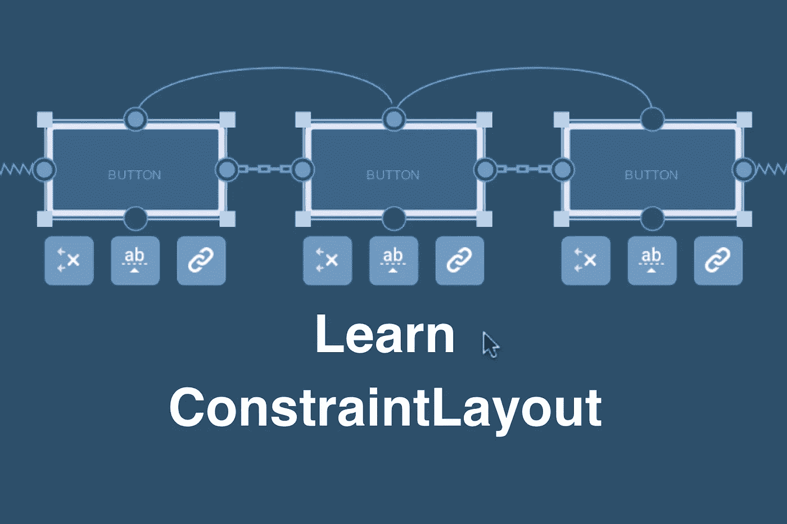
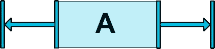
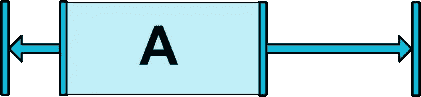
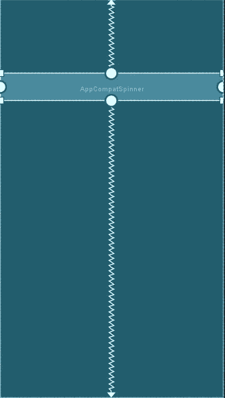
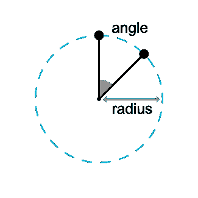
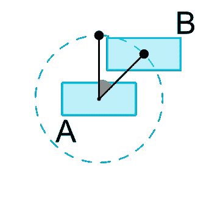
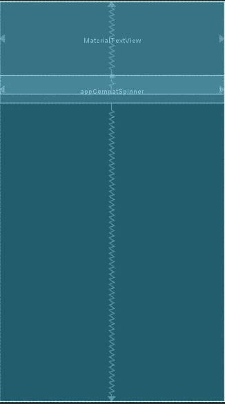
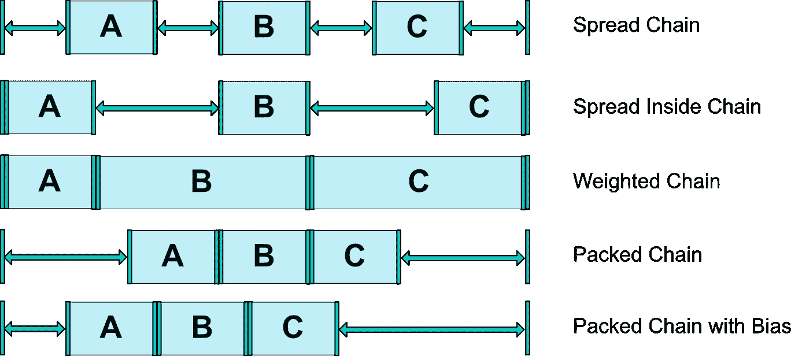
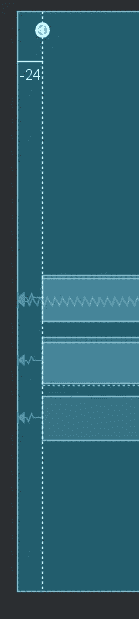
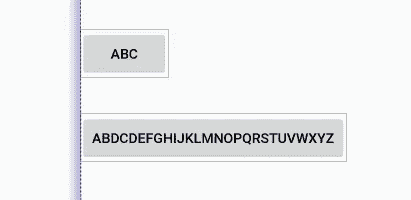

# 了解 Android 中的约束布局

> 原文：<https://blog.devgenius.io/understanding-the-constraint-layout-in-android-3b1528f8ca9?source=collection_archive---------4----------------------->



图片来源:谷歌

对于原生 android 应用程序开发者社区来说，在原生 Android 中创建一个具有嵌套视图组的响应式 UI 一直是一个挑战。

约束布局大大缓解了上述问题。谷歌在 **2016 的谷歌 I/O** 上公布了布局。约束布局或多或少类似于相对布局，但更灵活，更好地适应屏幕大小的变化，更容易与 Android Studio 的布局编辑器一起使用。根据官方文件"*，所有约束布局的功能都可以直接从布局编辑器的可视化工具中获得，因为布局 API 和布局编辑器是专门为彼此构建的。因此，您可以完全通过拖放而不是编辑 XML 来构建带有约束布局的布局。*”

# 什么是约束？

约束是这种布局的基本构件。它将一个小部件的锚点与另一个小部件或父部件连接起来。有各种各样的约束被操作来创建一个响应性的 UI，它也能更好地适应不同的屏幕尺寸。

# 各种约束:

***相对定位*******:***这些约束允许您相对于任何其他小部件或相对于父视图组水平或垂直地定位小部件的给定侧。*

*用于相对定位的属性:`**app:layout_constraint[source side]_to[target side]="[target id or parent]"**`*

****居中定位*** *:* 该约束用于在两个目标之间水平或垂直居中小部件。目标可以是另一个小部件的锚点或父对象的锚点。两个相反的约束就像两个相反的力，使小部件在目标之间居中。*

**

*小部件的中心定位(图片来源:谷歌的 Android 开发者文档)*

****偏差:*** 每次我们尝试创建布局时，小部件的中心定位可能并不理想。有时，小部件可能需要更倾向于某一方面。为了实现这个用例，我们被提供了偏差约束。我们可以有一个小部件的水平和垂直偏差。*

*用于偏差约束的属性:*

*`**app:layout_constraintHorizontal_bias="[float value ranging from 0 to 1]"**`*

*`**app:layout_constraintVertical_bias="[float value ranging from 0 to 1]"**`*

*浮点值决定偏差的百分比。*

*对于水平偏移，它决定了小工具需要从左侧偏移的百分比，例如:
`**app:layout_constraintHorizontal_bias="0.3"**`*

*上述属性将保持小部件的左侧有 30%的偏差，而不是默认的 50%。下面是该示例的图示。*

**

*水平偏差，图片来源:谷歌的 Android 开发者文档*

*对于垂直偏移，浮动值决定了小部件需要离开顶部的百分比，例如，*

*`**app:layout_constraintVertical_bias="0.2"**`*

*上述属性将保持小部件的顶部有 20%的偏差，而不是默认的 50%。下面是该示例的图示。*

**

*来自 Android Studio 的屏幕截图*

****圆形定位:*** 这有助于将一个小部件*(假设为小部件‘A’)*的中心约束到另一个小部件*(假设为小部件‘B’)*的中心，处于特定的角度和特定的距离。该角度是相对于从小部件 a 的中心向上画出的垂直假想线来提供的*

*实现循环位置所需的属性*

```
***app:layout_constraintCircle="[reference to another widget Id]"
app:layout_constraintCircleRadius="[distance in dp]"
app:layout_constraintCircleAngle="[the angle ranging from 0 to 360]"***
```

*下面给出了圆形定位的图示。*

***

圆形定位。图片来源:谷歌的 Android 开发者文档。* 

***b) WRAP_CONTENT:维设置为 WRAP_CONTENT 的小部件只占用所需的空间。但是在使用 WRAP_CONTENT 时，有时小部件不能遵循约束。***

***例如类似下面的内容***

******

***图片来源:截图来自 Android Studio***

***在上面的例子中，材质文本视图被赋予了以下属性***

```
***android:layout_height="wrap_content"
app:layout_constraintBottom_toTopOf="@+id/appCompatSpinner"***
```

***但是尽管有约束，文本视图完全与微调器重叠。***

***因此，为了应对这种情况，谷歌为我们提供了两个非常有用的属性，它们如下:***

*   ***`**app:layout_constrainedWidth=”[boolean]”**`***
*   ***`**app:layout_constrainedHeight=”[boolean]”**`***

***上述属性使小部件无论是垂直还是水平都遵循约束。***

***在与 WRAP_CONTENT 连用时，我们还有以下常用修饰语***

```
***android:minWidth="[value in dp]"
android:minHeight="[value in dp]"
android:maxHeight="[value in dp]"
android:maxWidth="[value in dp]"***
```

***这些修饰符仅对 WRAP_CONTENT 有效。***

***c) MATCH_CONSTRAINT:为 MATCH_CONSTRAINT 指定其维度的小部件将占用所有可用空间。我们用 0 dp 来表示约束布局中的 MATCH_CONSTRAINT。***

***MATCH_CONSTRAINT 使用以下修饰符:***

```
***app:layout_constraintWidth_max="[value in dp]"
app:layout_constraintWidth_min="[value in dp]"
app:layout_constraintHeight_max="[value in dp]"
app:layout_constraintHeight_min="[value in dp]"***
```

***注意:在约束布局中，不鼓励使用 MATCH_PARENT，因为它不会考虑应用在小部件上的约束。***

******比率:*** 你也可以定义一个 widget 的一个维度作为另一个的比率。为此，您需要将至少一个受约束的维度设置为 0 dp(即 MATCH_CONSTRAINT)，并将属性`**layout_constraintDimensionRatio**`设置为给定的比率。例如:***

```
*****<Button android:layout_width="wrap_content"
                   android:layout_height="0dp"
                   app:layout_constraintDimensionRatio="1:1" />*****
```

***上面的代码会将按钮的高度设置为与其宽度相同。***

***该比率可以表示为:***

*   ***一个浮点值，表示宽度和高度之间的比率***
*   ***“宽度:高度”形式的比率***

***如果两个尺寸都设置为匹配约束(0 dp)，也可以使用比率。在这种情况下，系统设置满足所有约束的最大尺寸，并保持指定的纵横比。若要根据另一边的尺寸约束某一边，可以预先附加“W”或“H”，分别约束宽度或高度。***

***例如，如果一个尺寸受到两个目标的约束(如宽度为 0 dp，并以父尺寸为中心)，您可以通过在比率前添加字母 W(用于约束宽度)或`**H**`(用于约束高度)，并用逗号分隔，来指明应约束哪一侧:***

```
*****<Button android:layout_width="0dp"
                   android:layout_height="0dp"
                   app:layout_constraintDimensionRatio="H,16:9"
                   app:layout_constraintBottom_toBottomOf="parent"
                   app:layout_constraintTop_toTopOf="parent"/>*****
```

***将按照 16:9 的比例设置按钮的高度，而按钮的宽度将匹配对 parent 的约束。***

******链:*** 用于创建两个或多个小部件之间的双向连接。根据我的观察，链基本上是线性布局的替代方案。有 3 种不同的链条可供选择:***

***a)扩展:窗口小部件之间以及与边距之间的距离相等。***

***b)内部展开:小部件之间的距离相等，而不是边距。***

***c)打包:小部件将紧密地打包在一起。***

***用于上述链的属性:***

```
***app:layout_constraintHorizontal_chainStyle = "[spread/spread_inside/packed]"app:layout_constraintVertical_chainStyle = "[spread/spread_inside/packed]"***
```

***加权链:我们也可以有加权链，类似于线性布局中的加权小部件。为此，我们需要根据需要将宽度/高度设置为 0 dp。***

***用于加权链的属性:***

```
***app:layout_constraintHorizontal_weight = "[value in int]"app:layout_constraintVertical_weight = "[value in int]"***
```

******

***链约束的图示，图片来源:Google 的 Android 开发者文档。***

# ***虚拟助手对象:***

***虚拟助手对象(vho)是不在设备上显示的视图，仅用于创建更好的布局。有 3 种基本 vho:***

***a) ***指引:*** 它是一个辅助视图，用来完美对齐其他视图。有两种指导方针:垂直指导方针和水平指导方针。***

******

***对齐三视图的指南，图片来源:来自 Android Studio 的截图***

***b) ***Barrier :*** 这个辅助视图引用多个小部件作为输入，并基于指定边上最极端的小部件创建虚拟指引线。***

***例如:***

***让我们有两个按钮，@id/button1 和@id/button2。将 Barrier 设置为 start，我们将得到以下结果。***

******

***图片来源:谷歌的 Android 开发者文档。***

***`Barrier`和`Guideline`的唯一区别是`Barrier`的位置是灵活的，并且总是基于其中包含的多个 UI 元素的大小，而`Guideline`的位置总是固定的。***

***c) ***组:*** 组是一个 VHO，用来控制一起引用的一组视图的可见性。***

***例如:***

```
***<androidx.constraintlayout.widget.Group
              android:id="@+id/group"
              android:layout_width="wrap_content"
              android:layout_height="wrap_content"
              android:visibility="visible"
              app:constraint_referenced_ids="button4,button9" />***
```

# ***结论:***

***约束布局解决了布局创建的许多问题。用它构建的布局，如果遵循适当的规则，布局实际上适应不同的屏幕尺寸。它还简化了大型复杂布局的创建。约束布局的主要优点是它有助于创建平面视图层次。在性能分析中，平面视图层次结构非常有用。***

***如需了解更多详情，请查看[开发人员文档中的](https://developer.android.com/reference/androidx/constraintlayout/widget/ConstraintLayout)约束布局文档。***