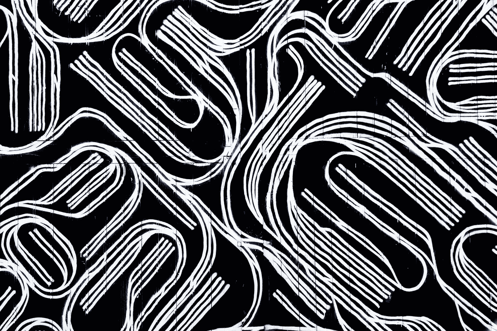
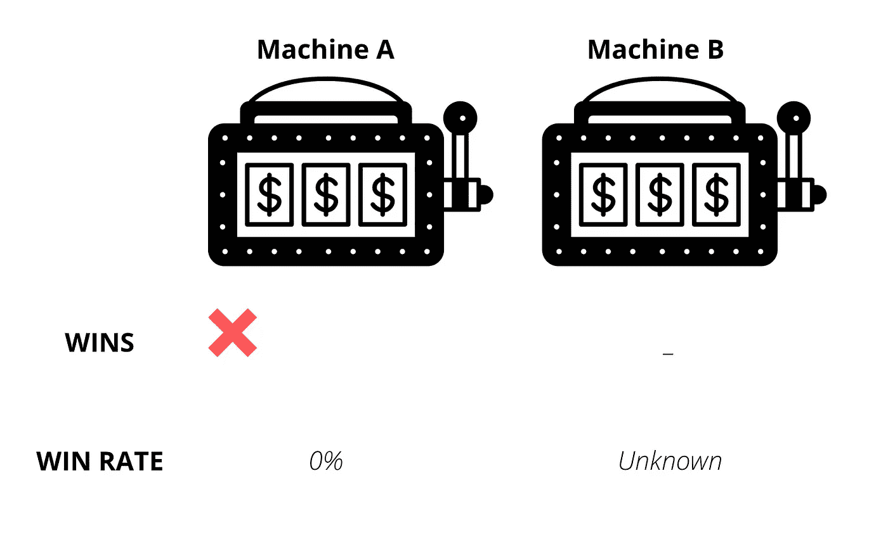
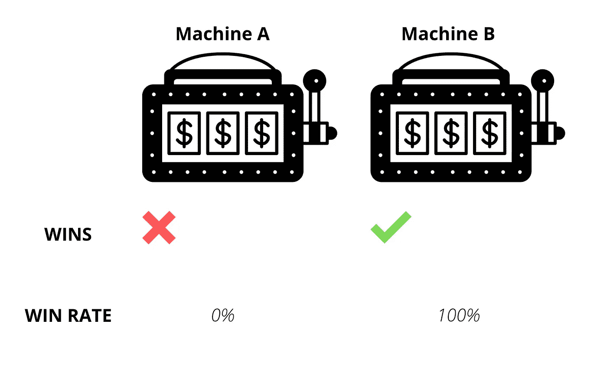
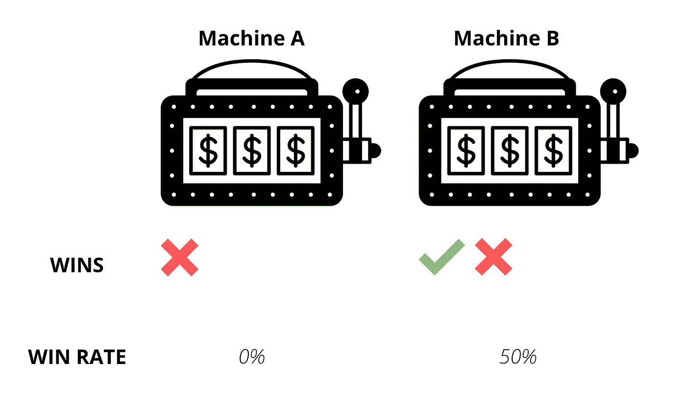
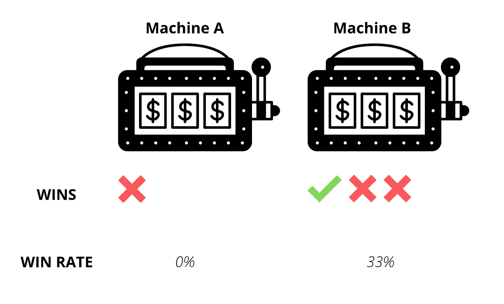
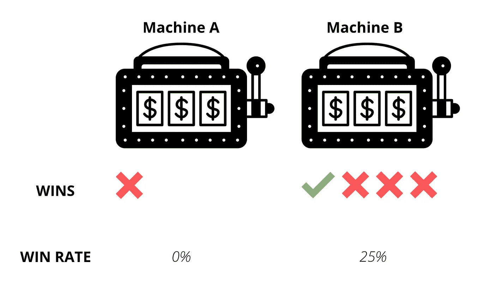

# 探索-利用困境:一种视觉方法！

> 原文：<https://blog.devgenius.io/understanding-the-explore-exploit-dilemma-a-visual-approach-839f437c1cff?source=collection_archive---------9----------------------->

## 强化学习和贝叶斯统计交叉的经典问题

Philippe Oursel 在 [Unsplash](https://unsplash.com?utm_source=medium&utm_medium=referral) 上的照片

让我们以一个例子开始讨论。考虑到这一点，你最近搬到了一个新的城市，让我们假设你对这个地方、市场广场等没有预先的了解。

附近有几家餐馆，但由于你没有任何先验知识，你别无选择，只能自己探索。

在探索或尝试了几家餐馆后，你意识到有一家餐馆(比如说**餐馆和**餐馆)的食物是你绝对喜欢的。

现在情况变了。

因为你有一些先验知识，你知道什么最有效。所以，为了节省时间或优化决定去哪里吃饭，你只要去餐馆 A，因为它是你最喜欢的。

现在让我们假设有一家餐馆(姑且称之为 B 餐馆)你错过了去探索，并且你已经听说了关于它的非常好的事情。

照片由[-](https://unsplash.com/@pat__?utm_source=medium&utm_medium=referral)在 [Unsplash](https://unsplash.com?utm_source=medium&utm_medium=referral) 上拍摄

想要探索这家餐厅是合理的，因为你之前对 B 餐厅没有第一手的了解，谁知道你可能会比 A 餐厅更喜欢它。

但如果事实并非如此呢？你只是花费了你的时间和金钱来获得次优的回报。为什么不干脆选择餐厅 A ( **Exploit** )。

这就是探索与剥削的两难境地。

这次讨论的目的是要表明，最终目标是以这样一种方式分配资源，使我们获得尽可能高的回报。

# 多臂强盗问题

现在让我们来看看经典的场景，它构成了探索-利用困境的基础。

想象你自己是一个赌徒，带着一些吃角子老虎机走进赌场，目的是赚取最大的奖励。

> 简单说明一下，每台老虎机都被称为**独臂强盗**。
> 
> 之所以这样命名，是因为吃角子老虎机有一只手臂需要拉着才能玩。
> 
> 由于我们有多台老虎机可供选择，因此这个问题被命名为**多臂强盗**。

你知道每台老虎机都有不同胜率。但是，您不知道实际的胜率，因为您刚刚走进来，事先没有任何知识。

为了赢得最大奖励，直觉告诉你必须玩赢率最高的机器。

在 [Unsplash](https://unsplash.com?utm_source=medium&utm_medium=referral) 上由 [Aron 视觉](https://unsplash.com/@aronvisuals?utm_source=medium&utm_medium=referral)拍摄的照片

最重要的是，你有有限的资源，即金钱(玩老虎机)和时间。

# 模拟

为了简单起见，让我们假设我们只有两个实际胜率分别为 50%和 25%的 A & B 老虎机。请注意，您不知道这些胜率。目标是获得最大的回报。

初态

那么，如何解决这个问题呢？事实证明，这归结为你能多好地估计吃角子老虎机的胜率。

如果您的估计与实际胜率足够接近，那么您需要做的就是以最高的估计胜率玩老虎机，工作就完成了。

请记住，我们的资源有限，因此随机选择老虎机玩很多次是没有用的。我们不能奢侈地采用*的频繁主义方法。*

我们需要用数据做选择来支持它。

也就是说，在第 N 次迭代时选择的老虎机应该基于直到前(N-1)次迭代时收集的数据。这就是*贝叶斯方法*。

## 迭代 1

在初始状态，我们没有任何机器上的数据。因此，目前还不知道胜率的估计值。

因此，随机选择一个是安全的。假设选了 A，你输了。

注意，这是 **Explore** 的一个实例。

迭代 1

所以你玩了一次，输了，机器 a 的估计胜率计算为 0%。

## 迭代 2

现在，您对机器 A 进行了一次观察，相应的成功率为 0%。然而，机器 B 仍然没有任何数据。

再次探索是很直观的，因为机器 B 的胜率是未知的，可能大于机器 a 的胜率。

所以，你拉机器 B 的手臂，这次你赢了。

这是**探索**的一个实例。

迭代 2

你玩了一次并赢了，机器 B 的估计胜率为 100%。

## 迭代 3

现在，机器 A 和机器 B 各有一个观察值，估计成功率分别为 0%和 100%。

因此，您决定使用这些数据并选择机器 B，因为它的成功率更高。假设这次你输了。

这是**漏洞利用**的一个实例。

迭代 3

基于这一观察，机器 B 的估计胜率变为 50%。还是比机器 a 高。

## 迭代 4

由于预计胜率较高(50%)，再次选择了机器 B。你又输了。

这是**漏洞利用**的一个实例。

迭代 4

基于这一观察，机器 B 的估计胜率变为 33%。还是比机器 a 高。

## 迭代 5

假设你选择了机器 B，再次下降到更高的胜率估计值(33%)，再次失败。

这是**利用**的一个实例。

迭代 5

现在，机器 B 的估计胜率为 25%。

在这种情况下，你手头有一个困境。下一次迭代是探索还是剥削？

为什么？因为正如你亲眼所见，如果你继续利用数据，仅仅为了更高的胜率而选择一台机器(贪婪的方法)，你就有可能成为次优的强盗。

为了便于理解，请注意机器 A 和机器 B 的实际胜率(您不知道)分别是 50%和 25%,如开头所述。

但是贪婪的做法，导致你目光短浅，多次玩**次优土匪** ( **机 B** )，而**优土匪** ( **机 A** )只玩一次。

解决方法是有一个探索因素。

这仅仅是一个概率，即使在最初的探索之后，你有一个因素迫使模型去探索除了一个估计胜率最高的强盗之外的其他强盗。

> 像**ε-贪婪**、**乐观初始值**和**置信上限**这样的算法可以帮助我们解决**探索-利用困境**。

本文重点介绍这一思想。因此，我将在下面单独的文章中讨论这些算法。

 [## 如何解决多臂强盗问题:ε-贪婪算法

### 包括代码解释和模拟结果！

blog.devgenius.io](/how-to-solve-the-multi-armed-bandit-problem-epsilon-greedy-approach-ebe286390578)  [## 如何解决多臂强盗问题:乐观的初始值

### ε-贪婪算法的升级

blog.devgenius.io](/multi-armed-bandit-problem-optimistic-initial-values-89c10f04974c) 

下次见！

# 感谢阅读！

*这给了我很大鼓励！*😃*如果你觉得这个帖子很有趣，还想看更多，可以考虑* [***关注我***](https://medium.com/subscribe/@pratik.pandav)**🥁*。我每周发布与机器学习、统计和数据分析相关的主题。我喜欢通过可视化来学习，因此，我的帖子包含了大量的图表、模拟和代码示例。***

**简要说明一下，我尽最大努力将错误降到最低，但它们是我们学习的一部分，所以，如果你发现了什么，请指出来。最后，请随意提出你希望我写的主题。**