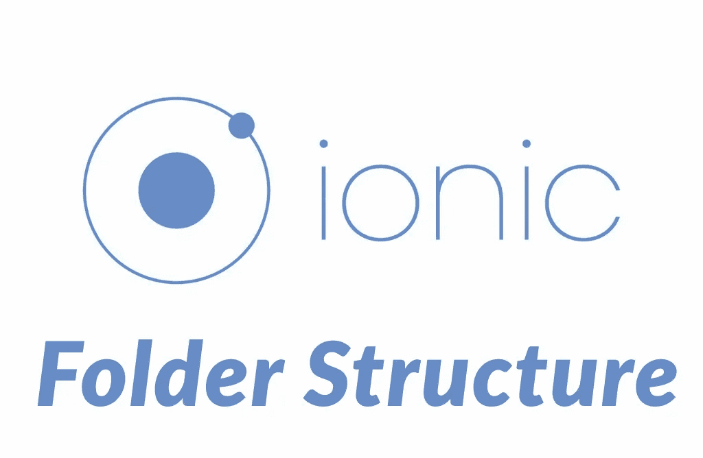
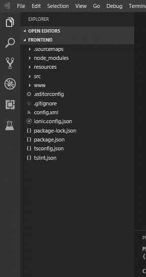
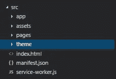
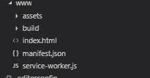
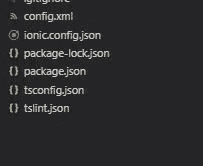

# 理解 Ionic 框架的文件夹结构

> 原文：<https://blog.devgenius.io/understanding-the-folder-structure-of-ionic-4798e4345587?source=collection_archive---------0----------------------->

今天我将解释一个 Ionic 应用程序的文件夹结构。在上一期中，我解释了如何使用 Ionic 框架创建一个简单的应用程序。所以让我们开始吧。

上图显示了 Ionic 项目的典型文件夹结构。所以让我们从 **Sourcemaps** 文件夹开始。

1.  **来源图**

这个文件夹主要是用来调试你的 Ionic 应用程序的。它包含代码转换版本的路径。这个文件夹没什么好讨论的。但这并不意味着这个文件夹不重要。

2.**节点模块**

该文件夹包含与您的 Ionic 项目相关的所有节点模块。例如:Http 模块。如果您在开发 Ionic 应用程序时打算使用任何模块。假设您将向后端服务器发送一个 HTTP 请求。如果你想发送一个 HTTP 请求到你的后端服务器，你必须使用 HTTP 模块。那么该模块在该文件夹中是可用的。当我们导入一个特定的模块时，我们使用下面的语句。**从' @angular/common/http '导入{ http client }；**

Src 文件夹和子文件夹

3. **Src 文件夹**

这个文件夹是开发人员完成大部分工作的地方。当您导航到 src 文件夹时，您将能够看到 Src 文件夹中的其他 4 个文件夹。它们是**应用文件夹、资产文件夹、页面文件夹、主题文件夹。**

让我们从应用程序文件夹开始，它有引导应用程序和应用程序结构所需的所有文件。它有 4 个文件。 **app.component.ts —** 定义应用程序的基本结构和初始导航。举个例子，如果我们想在应用程序中开发一个侧菜单。这里是定义侧边菜单第一页的地方。**app.html—**这里我们将定义导航及其根。 **app.module.ts —** 这是 app 的入口。在这一页中，我们将定义应用程序中使用的所有模块、页面和组件。 **app.scss —** 这是我们 app sass 文件的主要入口。在这里，您可以应用应用程序共享导入和全局 sass，您可以全局应用(整个应用程序)。 **main.ts —** 这是一个 ionic 自动生成的文件。(有助于 app 的自举)。

移动到页面文件夹。这是应用程序所有创建的页面都是商店的地方。每个页面都有一个单独的文件夹，并且在该文件夹内**。html 文件、. module.ts 文件、。scss 文件，以及。包含 ts 文件**。

然后**主题文件夹**包含所有的变量、混合和共享样式。您可以使用主题文件夹自定义默认字体、颜色等。

然后,**服务文件夹**包含所有你将用来访问应用程序中显示的数据的服务。

**资产文件夹**包含应用程序中使用的所有图像和字体。此外，应用程序的其他资产也在这里。

WWW 文件夹和子文件夹

4. **WWW 文件夹**

Src 文件夹包含你的应用程序的所有未编译的代码。www 文件夹包含您的代码的编译版本。每次构建项目时，都会重新构建 www 内容。如果你想在 web 中部署你的应用，可以使用 www 文件夹内的代码。

配置文件

在这些文件夹之后，您将能够看到一个名为 **config.xml 的文件。**这是您的应用程序的全局配置。特别是当你把这个应用程序和科尔多瓦整合在一起的时候。这可以用来改变应用程序的行为。此外，应用程序的**名称、作者、电子邮件地址**也可以使用该文件进行更改

另一个重要的文件是存储在项目根目录下的项目配置文件。 **ionic.config.json.** 这些文件以 json 文件格式保存。您将能够看到应用程序的名称。app 的类型，例如: **ionic-angular。**然后是配置集成，如 Cordova 或电容器。