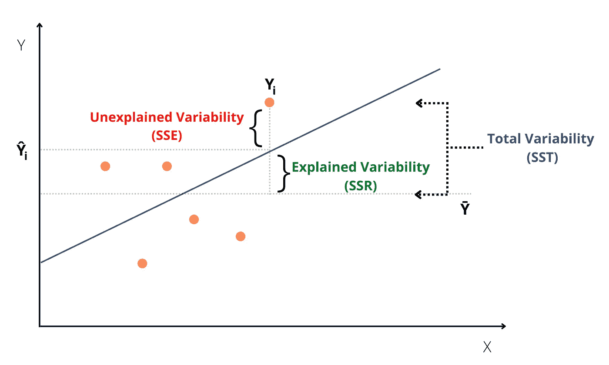
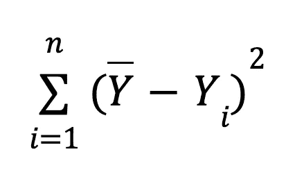
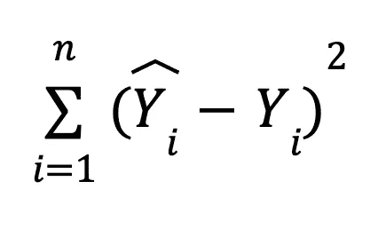
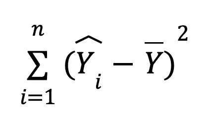

# 理解回归分析的本质细节

> 原文：<https://blog.devgenius.io/understanding-the-nitty-gritty-details-of-regression-analysis-e05a94fb47b5?source=collection_archive---------8----------------------->

## 用可视化方法探索 SST、SSE 和 SSR 的现实意义

[NIKHIL](https://unsplash.com/@vinikhill?utm_source=unsplash&utm_medium=referral&utm_content=creditCopyText) 在 [Unsplash](https://unsplash.com/s/photos/patterns?utm_source=unsplash&utm_medium=referral&utm_content=creditCopyText) 上的照片

如果你刚刚开始尝试机器学习，那么你肯定遇到过线性回归。最基本的算法之一，但背后有丰富的概念。

但事情有那么简单吗？

我来问你这个，**平方和误差(SSE)** & **平方和回归(SSR)** 有什么区别？第一个可能看起来更熟悉(感谢那里所有的课程！)但是其他的呢。

除此之外，什么是**平方和(SST)** ？看，不再那么简单了，是吗？

不幸的是，这是使用图书馆学习基本概念的副作用。这会导致太多的抽象。

当你在学习新的东西时，最好是在最低的水平上用最少的资源去做。随着时间的推移，这些东西复合在一起，形成了你思考 ML 问题的方式。

> 当你继续在基础上建造时，基础的 1 度移动会增加几十度。

因此，了解基层的这些细节非常重要。

现在，让我们开始有趣的部分。

下图是两个变量 **X(自变量)**和 **Y(因变量)**之间因果关系的线性近似。

没什么特别的，只是对一组数据点拟合一条线，直到最佳拟合。

> 公式:ŷ=b+w*x
> ŷ: y 预测值
> b: Y 截距(偏差因子)
> w:权重
> X:自变量 x
> y-bar:y 真实值的平均值

SST、SSE 和 SSR

> 从图中可以看出，任何回归模型的最终目标都是**解释总可变性中的最大可变性**。也就是说，在某个阈值之前，具有高值的已解释变异性(SSR)和低值的未解释变异性(SSE)。

## 总平方和(SST):

总平方和是因变量 Y 的真值与其平均值之间的平方差之和。这表示当前数据集上的模型可以解释的总可变性。

SST 公式

一些关键点:

*   总可变性 **(SST)** =已解释可变性 **(SSR)** +未解释可变性 **(SSE)**
*   也称为**平方和总和(TSS)** 。

## 误差平方和(SSE):

误差平方和表示回归模型的估计能力。它表示训练后模型无法解释的差异量。

上交所公式

一些关键点:

*   具有高估计能力的模型意味着预测值(ŷ)接近真实值(y)。因此，会导致更低的 SSE 值，这是我们的最终目标。
*   由于真实值和预测值之间的差异是平方的，这导致较大的差异受到严重惩罚。
*   又称为**【残差平方和】**。

> **误差&残差有什么区别？**答案取决于上下文。
> 在机器学习的背景下，比如在这种情况下，它们可以互换使用，但在统计学中，它们有不同的含义。更多关于那个[这里](https://stackoverflow.com/questions/56754560/what-is-the-exact-difference-between-error-and-residual)。

## 平方和回归(SSR):

平方和回归解释了模型与数据点的拟合程度。它表示模型在训练后能够解释的差异量。

SSR 公式

> 用于计算回归模型拟合优度的 **R 平方度量**只不过是**解释可变性(SSR)** 与**总可变性(SST)** 的比率。
> 
> **R 平方= SSR/SST**
> 
> 其范围在[0，1]之间。**随着 SSR 接近 SST** ，**R 平方值接近 1。这表明该模型具有很好的拟合性，能够解释数据中的许多可变性。**

一些关键点:

*   也被称为****【ESS】****

# **感谢阅读！**

**这给了我很大的鼓励！😃*如果你觉得这个帖子很有意思，想看更多，可以考虑* [***关注我***](https://medium.com/subscribe/@pratik.pandav)*🥁*。我每周发布与机器学习、统计和数据分析相关的主题。我喜欢通过可视化来学习，因此，我的帖子包含了大量的图表、模拟和代码示例。****

***简要说明一下，我尽最大努力将错误降到最低，但它们是我们学习的一部分，所以，如果你发现了什么，请指出来。最后，请随意提出你希望我写的主题。***