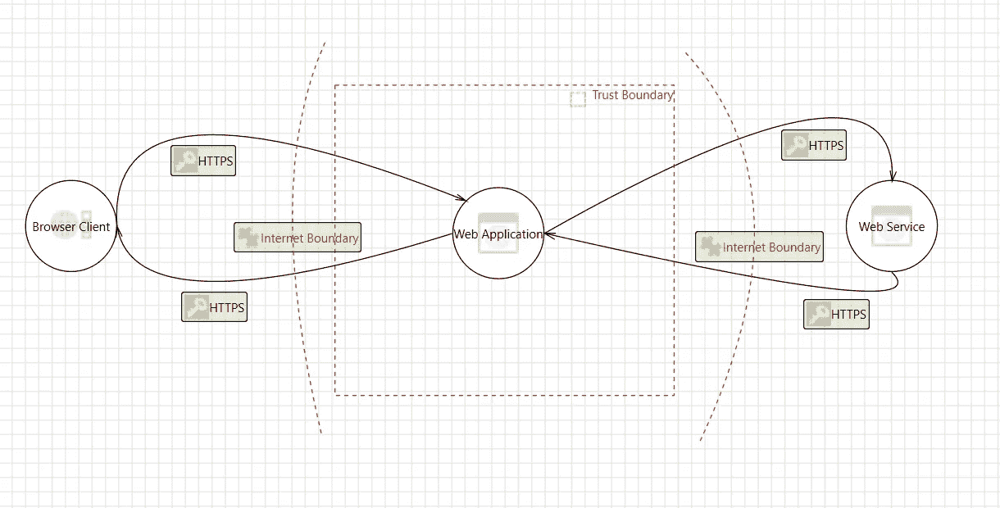
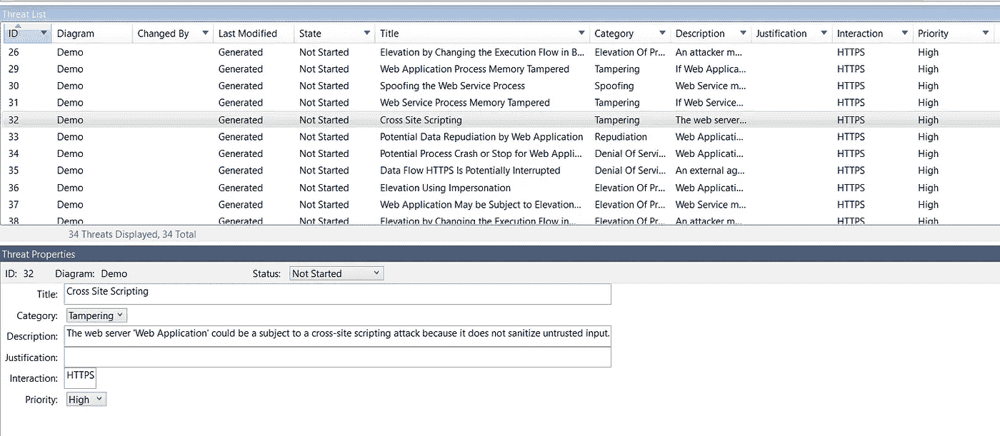

# 了解威胁建模

> 原文：<https://blog.devgenius.io/understanding-threat-modeling-bc7b48791892?source=collection_archive---------17----------------------->

你安全吗？

> 攻击者正在尝试不同的方法来渗透您的系统，每天都有新的漏洞被发现。与不安全软件相关的日益增长的担忧和商业风险使得许多组织提倡开发者和工程师在他们的软件开发生命周期(SDLC)或者更准确地说是安全软件开发生命周期 **(Secure SDLC)的早期采用不同的安全实践。威胁建模就是这样一种重要的安全实践。**

# **威胁和威胁建模**

**威胁**是一种恶意行为，旨在破坏数据、窃取数据或扰乱一般的数字生活。威胁包括数据泄露、拒绝服务(DoS)攻击和其他攻击媒介。**威胁建模在保护有价值的东西的背景下识别、交流和理解威胁和缓解措施。**威胁建模回答诸如“我在哪里最容易受到攻击？”、“最相关的威胁是什么？”，以及“我需要做些什么来防范这些威胁？”。为了更好地使用威胁建模，应该在开发周期的早期进行。这意味着可以及早发现潜在问题并进行补救，从而避免日后付出更高的代价。考虑威胁建模的安全需求可以导致主动的架构决策，从一开始就减少威胁。

威胁建模采用不同的方式，如 STRIDE、CVSS、PASTA 等。我将在这里分享微软在其安全 SDLC 实践中采用的 STRIDE 模型。威胁建模的 STRIDE 方法于 1999 年在微软推出。

# STRIDE

STRIDE 是一个威胁分类模型，它是以下内容的首字母缩写:
欺骗
篡改
否认
信息泄露
拒绝服务
特权升级

*下面的传说读作-****-什么，***H***-怎么样，***M***-缓解***

****欺骗(真实性)**
**W** —欺骗是指冒充他人(即欺骗用户)或声称虚假身份(即欺骗进程)的行为。
**H** —一个用户通过暴力破解用户名/密码凭证来假冒另一个用户的身份。
**M** —您通常会通过适当的身份验证来减轻这些风险。**

****篡改(完整性)**
**W** —篡改是指对数据或流程的恶意修改。篡改可能发生在传输中的数据、静态数据或流程上。
**H** -用户修改静态/磁盘上的数据。用户对应用程序执行注入攻击。
**M** —用户输入的正确验证和输出的正确编码。存储过程来减少 SQL 注入。与安全静态代码分析工具集成，以识别安全缺陷。**

****否认(不可否认)**
**W** —否认是指否认某个动作或事件已经发生的能力。
**H** —用户否认执行了破坏性操作(例如，从数据库中删除所有记录)。攻击者通常会删除或截断日志文件，以此来隐藏他们的踪迹。
**M** —通过适当的审计日志记录来减轻这些风险**

****信息泄露(保密)**
**W** —信息泄露是指数据泄露或数据泄露。这可能发生在传输中的数据、静态数据，甚至某个流程。
**H** —用户能够窃听、嗅探或读取明文形式的流量。用户能够读取数据库/磁盘中的敏感数据。
**M** —使用有效的可信证书颁发机构(CA)。避免自签名证书。实施适当的加密。**

****拒绝服务(可用性)**
**W** — DoS 是指导致服务或网络资源对其预定用户不可用。
**H** —协议攻击——用户进行洪水攻击。存储(即磁盘、驱动器)变得太满。基于卷—使带宽饱和，应用层攻击—获取/发布洪水。目标是让网络服务器
**M**——解决方案取决于很多因素。一些常见的方法是配额检查、速率限制。堵住拥堵的交通。使用特殊的硬件和软件。**

****权限提升(授权)**
**W** —权限提升意味着用户获得了他们无权获得的权限。
**H** —垂直/水平升级。非管理员用户执行管理员功能。
**M** —适当的授权机制(如基于角色的访问控制)。**

# **威胁建模**工具****

**微软提供了一个免费的威胁建模工具，它根据我们刚刚讨论过的 **STRIDE 威胁分类方案**来识别威胁。这个工具基于数据流图( **DFD** )。DFD 是通过流程或系统表示数据流的一种方式。DFD 还提供关于每个实体和过程本身的输出和输入的信息。该工具通过可视化系统组件、数据流和安全边界的标准符号，使所有开发人员更容易进行威胁建模。**

**现在整个讨论可以归结为以下两个步骤**

*****第一步:创建威胁模型*****

**首先，从[微软网站](https://www.microsoft.com/en-in/download/details.aspx?id=49168)下载该工具(始终检查最新版本)。您可以使用工具创建一个详细的 DFD，如下所示**

****

**威胁模型示例**

**当您在创建威胁模型图的过程中，此工具会自动生成威胁列表。这可以通过单击“视图→分析视图”，然后单击“视图→威胁列表”功能来查看。您还必须单击“查看→威胁属性”功能来获取以下详细信息。威胁属性给出了每一个威胁的描述，并且很容易理解威胁的细节。**

****

**自动生成的威胁列表**

*****第二步:针对威胁的行动计划*****

**一旦我们准备好了威胁列表，我们就可以对每个威胁进行更深入的研究，以了解威胁的全部内容，如上所述。请记住，如前所述，该列表是由工具自动生成的，由您来决定它是否是威胁。很多时候，列出的威胁可能不相关，或者可能是误报。您可以对此类项目采取“不适用”的措施。此外，用户可以创建缓解计划来应对已识别的威胁。最后，由组织来决定/规划如何修复已识别的安全威胁。**

# **摘要**

**通过这次简短的旅程，我们试图了解什么是威胁建模，以及 STRIDE 方法如何帮助您系统地检查和解决您的应用程序的安全状况中的差距。**

**安全无虞:)。**