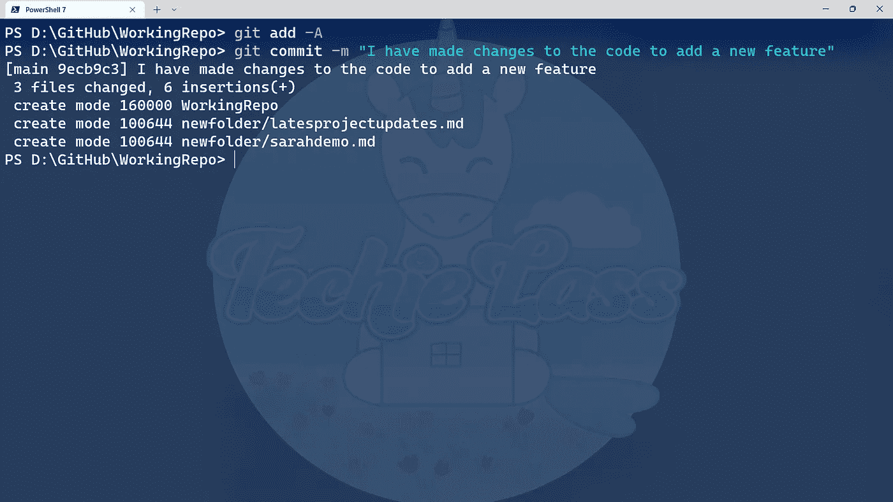
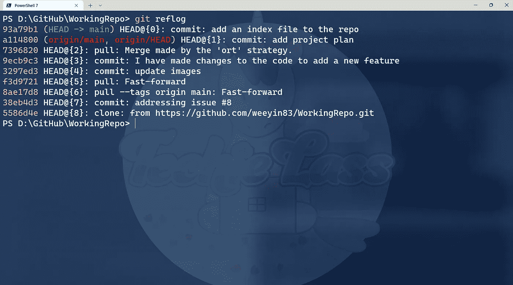

# 撤销提交和更改— 14 天的 Git

> 原文：<https://blog.devgenius.io/undoing-commits-changes-14-days-of-git-13cef95faaff?source=collection_archive---------10----------------------->

我们正处于 14 天 Git 学习之旅的第 7 天，到目前为止，我已经探索了:

现在是时候开始考虑如何撤销对存储库的提交和更改了！

# 撤消提交和更改

有时候你会做出承诺，然后意识到无论出于什么原因你都想撤销它。

不过，这样做的最佳方式是什么？删除你刚刚创建的文件，删除你在文件中写的那一行？当你做了大量的改变，却不记得所有需要撤销的部分时，会发生什么？

这就是 git 恢复的地方，git 重置可以有所帮助。

# Git 还原

Git revert 是一个命令，可以删除一次提交对存储库所做的所有更改。

当您恢复 Git 提交时，来自该提交的更改将从您的本地工作区中删除。并且创建一个新的提交来反映您的存储库的新状态。

让我们用行动来证明这一点。

我发出一个命令来创建一个名为 *index.md* 的新文件，并添加和提交该文件。

添加新文件并提交到存储库

如果我想恢复那个提交，我首先需要使用命令 *git reflog* 来获得关于那个提交的更多细节。

git reflog 命令

*git reflog* 命令给了我恢复提交所需的提交号。

在这种情况下，我想恢复提交 *93a79b1。*

我现在可以发出命令***git revert 93a 79 b 1***

因为这个命令正在创建一个新的提交，所以有人问我希望新的提交消息反映什么。

重要的是要记住，使用这个命令，您只是恢复提交，而不是清除提交的历史。因此，任何更改仍然可以在存储库的历史中引用。

# Git 重置

使用 Git revert，我们只是撤销了特定提交的更改。但是，有时您可能希望恢复自给定提交以来发生的所有更改。

这就是可以使用 *git 复位*命令的地方。

使用 Git 重置的步骤如下:

1.  使用 *git reflog* 获取您希望重置的提交号
2.  发出命令 *git 复位号*
3.  存储库不会将您的存储库重置为选择提交时的状态

同样，使用 *git reset* 命令，记住您只是恢复到以前的状态，而不是删除历史。它仍然会在那里看到和参考。

# 14 天的饭钱

今天，研究如何撤销变更或转移到存储库历史上的另一个时间是很有趣的。 *git 重置*和 *git 恢复*有两个明确的使用案例和区别。

很好地扩展了我的知识，并从 Git 产品组合中学到了更多的命令。

我 14 天 Git 学习之旅的下一步是寻找重写历史！请务必[订阅](https://www.techielass.com/newsletter)，加入我们的学习之旅！

你可以跟着这里:【https://github.com/weeyin83/14daysofgit】T4

*原载于 2022 年 9 月 23 日 https://www.techielass.com**[*。*](https://www.techielass.com/undoing-commits-changes/)*