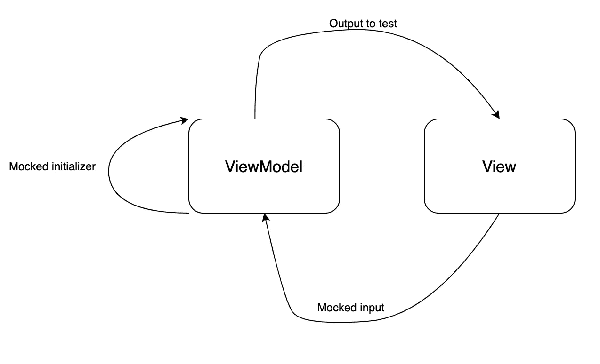

# RxSwift 中的单元测试

> 原文：<https://blog.devgenius.io/unit-test-in-rxswift-bf81fc23c872?source=collection_archive---------9----------------------->

如果我们能够适当地控制输入和输出，单元测试就变得容易了

[斯科特·格雷厄姆](https://unsplash.com/@sctgrhm?utm_source=medium&utm_medium=referral)在 [Unsplash](https://unsplash.com?utm_source=medium&utm_medium=referral) 上拍照

作为一名软件工程师，编写单元测试变得越来越重要。一个好的单元测试可以是你的代码的文档。它给了你信心去重构你的代码或者添加新的特性，因为你知道只要测试通过，我的代码就没问题。

今天我就来说说 Rxswift 中的单元测试。正如我提到的，为了测试一个类，你必须创建输入和输出。只有这样做，你才能有模拟来构造类，并且你知道你能生成什么来作为输入“喂”类。显然，你会有信心知道你的输出是什么样子的。结构如下:

基本上，测试遵循以下 3 个步骤:

*   用模仿的初始化器构造视图模型
*   模拟视图中的输入(用户交互)
*   测试输出是否是我们想要的

在我们深入细节之前，我将发布我们正在测试的 ViewModel 代码:

我强烈推荐阅读这篇文章，以了解关于这个视图模型的更多信息:

 [## Rxswift MVVM-了解您的视图模型

### 仅仅将逻辑代码移出 ViewController 是不够的

medium.com](https://medium.com/dev-genius/rxswift-mvvm-understand-your-viewmodel-50e8fe12436b) 

现在让我们检查我们的单元测试代码:

在我们解释所有项目之前，我想解释一下这个测试类的结构。正如您可能看到的 setup()和 tearDown()方法。一般来说，我们将所有先决步骤添加到设置中，并将所有清理步骤添加到拆卸中。

当定义了 setUp()方法时，测试运行程序将在每次测试之前运行该方法。同样，如果定义了一个 tearDown()方法，测试运行程序将在每次测试后调用该方法。

1.  Testscheduler 仅用于测试。它创建了*观测器*和*可观测器*来记录基于时间的事件。
2.  我们创建了 MockArticleFetchingService 来模拟文章是否被获取。如果物品已经被取出，我们就把它变成一个可观察的物体，否则它就会变成一个可观察的误差。
3.  我们用 MockArticleFetchingService 对象创建了视图模型。现在我们已经完成了模拟初始化步骤。
4.  我们将返回错误消息的服务中的文章指定为 nil。
5.  我们让调度程序创建文章和错误观察器，它将绑定来自 ViewModel 的文章和错误。
6.  调度器创建可观察对象作为输入，以绑定来自 ViewModel(ViewModel . input . reload)的输入。然后调用 start()通过触发输入开始整个过程。
7.  现在让我们断言结果。你可能已经注意到了。接下来([10，expectedErrors])。当我们测试从输入到输出的数据流时，最好多次触发和测试结果，以验证测试结果。
8.  在这些功能中，大多数步骤是相同的。我只想解释一下我在测试中经常使用的模拟数据。我个人只是复制一部分 API JSON 数据到本地文件。当我开始测试它时，我不必花费时间来生成不同的模型。

Rxswift 中的单元测试可能很棘手，因为数据是一个流。我们必须确保准备好正确的输入和依赖注入。然后我们就可以对我们的产量有信心了。

感谢您花时间阅读这篇文章。你可以在这里找到完整的演示，我会感谢你的任何建议。