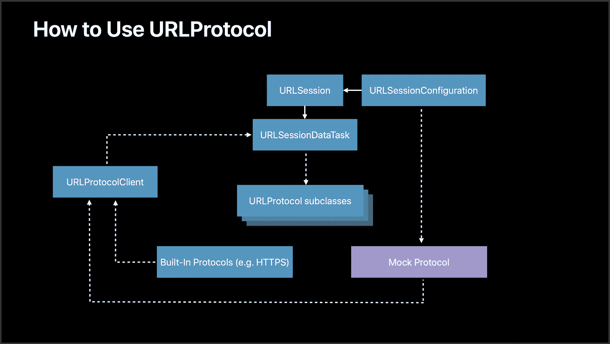

# 在 Swift 中对网络代码进行单元测试，而无需创建大量模拟类

> 原文：<https://blog.devgenius.io/unit-test-networking-code-in-swift-without-making-loads-of-mock-classes-74489d0b12a8?source=collection_archive---------0----------------------->

子类化 URLProtocol 以模拟 URLSession 网络请求


艾莉娜·格鲁布尼亚克在 [Unsplash](https://unsplash.com/s/photos/network?utm_source=unsplash&utm_medium=referral&utm_content=creditCopyText) 上的照片

嗨，

在本文中，我分享了一个在 Swift 中单元测试网络代码的简洁方法；其中我们将实现对 URLSession 网络请求的模拟，而不必为每个 API 构建大量模拟类。

# 模仿网络请求的目的

在单元测试网络代码时，模拟网络请求而不实际与服务器通信是标准的行业最佳实践。

造成这种情况的原因有很多，下面列出了一些原因-

*   **单元测试应该是快速可靠的。**实际上与服务器通信不仅会使单元测试非常慢，而且由于依赖于互联网连接而不可靠。
*   实际上与服务器通信会中断后端。例子:假设你正在单元测试网络代码来删除一个用户。对服务器进行实际的调用会导致用户的实际删除，我们不希望这样:P

# 履行

> 注意:本文和实施仅适用于 Swift 中的 [URLSession](https://developer.apple.com/documentation/foundation/urlsession) 。

在本文中，我们将为 URLSession 使用[Combine](https://developer.apple.com/documentation/combine)dataTaskPublisher。但是，我们也可以使用标准的 URLSession.dataTask 来代替。概念保持不变。

我们开始吧！

## 1.REST API 网络类(起点)

假设我们正在使用一个后端 REST API 来加载用户的概要文件。

我们使用 URLSession 与这个后端 API 联网的类可能看起来像这样—

我们在类中定义了一个方法“getProfile()”，它与后端 API 联网并返回用户。对于这个简单的例子，我们只需打印收到的用户名(第 19 行)。

我们可以用这个类让用户简单地像这样—

```
**Code** let profileAPI = ProfileAPI()
profileAPI.getProfile()**Sample Output** Yugantar
```

## 2.使 REST API 网络类可测试

我们的 ProfileAPI 类还不可测试，还不能进行模拟。

为了能够模拟它，我们必须对它进行一些修改，之后最终的类可能看起来像这样—

为了使 ProfileAPI 类可测试，我们做了两个主要的修改。

**引入 URLSession 类型的属性“session”—**

现在，我们不再总是使用 URLSession.shared 进行联网，而是使用' Session '属性(第 19 行)。

默认情况下，“session”将等于 URLSession.shared (init 方法)，因此，不需要每次都不必要地指定它或更新现有代码。

然而，也可以在需要时注入不同的 urlSession 类型(例如，用于单元测试的定制模拟 URL 会话)。

**声明一个完成处理程序，并在接收操作符中使用它—**

在第 18 行，我们在 getProfile()方法中声明了一个完成处理程序作为函数参数。然后在 sink 操作符中使用这个完成处理程序，代替 print 语句。

完成处理程序已经被实现为一个[转义闭包](http://We need to build the project and login before running the test suite.)；这很重要，因为 URLSession 和网络通常是高度异步的。

使用完成处理程序而不是直接在 API 类中定义我们的逻辑不仅有助于模块化，而且使其可测试。从现在开始，assert 语句可以在我们的单元测试中的完成处理程序中使用。

**现在，使用类来获取用户看起来像这样—**

```
**Code** let profileAPI = ProfileAPI()
profileAPI.getProfile { user in
    print(user.name)
}**Sample Output** Yugantar
```

## 3.子类 URLProtocol 用于模仿，并对我们的 API 类进行单元测试

通常，为了实现模拟和测试网络代码，模拟类是为每个不直接与服务器通信的 API 类构建的。

这通常会导致代码的大量重复；正如您所想象的，随着 API 类数量的增加，这很容易变成一项麻烦的任务。

相反，Apple 建议子类化 URLProtocol 来构建一个可以用于每个 API 类的 MockURLProtocol。



来源:[测试技巧&技巧，WWDC18 苹果开发者大会](https://developer.apple.com/videos/play/wwdc2018/417/)

我们在继承 URLProtocol 的基础上开发的 MockURLProtocol 是样板代码，所以让我们把这段代码添加到我们的测试用例文件中——

> 我们现在都准备好了！让我们对我们的网络代码进行单元测试—

我们使用 setUpWithError()方法来设置我们的自定义 url 会话以进行模仿(这也是样板文件，可以照原样复制)并分配它。

在我们的测试方法(testGetProfile)中，我们为 ProfileAPI 类声明了一个对象，并在其中注入了我们的自定义 url 会话。

之后，我们设置我们期望在成功的请求上接收的自定义数据，并告诉 MockURLProtocol 返回该数据(我们在 sink 操作符中获得的数据)。

我们的完成处理器得到这个数据(在 sink 中，我们做`completion(user)`)。

我们使用 XCTestExpectation(用于测试异步代码)，并在断言语句之后的闭包中实现它(用于测试)。最后，我们稍微等待一下这个期望。我们完事了。

# 参考:

[测试技巧&窍门，WWDC18 苹果开发者大会](https://developer.apple.com/videos/play/wwdc2018/417/)

# **感谢您的阅读！**

*请随时联系我并联系，查看我们的项目，或者加入我们的开源社区:* [*LinkedIn*](https://www.linkedin.com/in/yugantar-jain-1a7820158/)*，*[*GitHub*](http://github.com/yugantarjain)*，* [*导师 iOS*](https://github.com/anitab-org/mentorship-ios) *，*[*AnitaB.org 社区*](https://anitab-org.zulipchat.com)