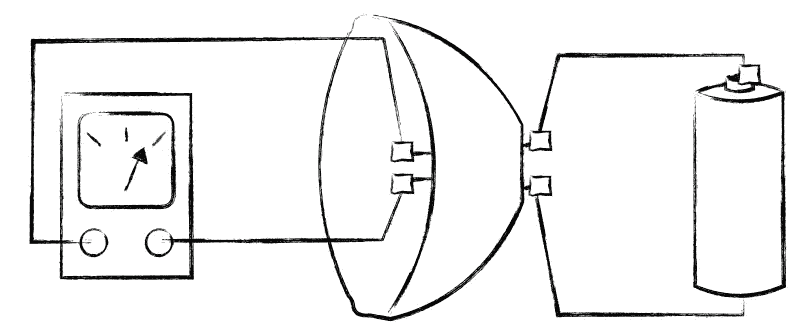
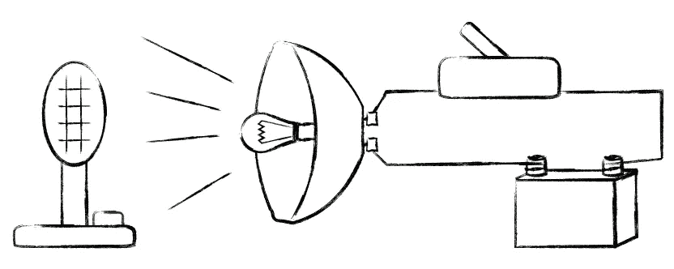
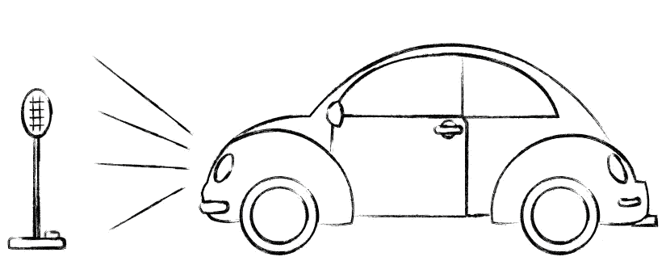

# 单元测试、开发人员测试和集成测试

> 原文：<https://blog.devgenius.io/unit-test-vs-programmer-test-vs-integration-test-54c509852ab8?source=collection_archive---------2----------------------->

## 什么是开发者测试？查看每种类型的清晰示例。

几乎所有人都认同什么是单元测试。QA 工程师和开发人员通常赋予集成测试不同的含义。极限编程定义了程序员测试概念，其目标是创建更有用的测试。本文概述了每种测试的特性，并为讨论它们创造了一个共同的基础。

照片由来自 [Pexels](https://www.pexels.com/photo/asphalt-auto-automobile-automotive-381228/?utm_content=attributionCopyText&utm_medium=referral&utm_source=pexels) 的[迈克](https://www.pexels.com/@mikebirdy?utm_content=attributionCopyText&utm_medium=referral&utm_source=pexels)拍摄

# 单元测试

*你拿到头灯，把一个传感器当成灯泡，把头灯连接到电源上。如果传感器通电，测试通过。*

单元测试:灯。

*   跑得快；刻度是毫秒。
*   孤立地测试一个单元；一个故障意味着一个单元。
*   模拟内部依赖关系；用模型替换其他组件。
*   模拟外表；避免数据库、网络和外部 API。
*   失败准确地指出了失败的根源；它是一个单元。
*   重构很难；代码的变化通常意味着测试的变化。
*   没有商业价值；测试没有解释单元的目标。
*   信心低；不要测试组件之间的关系。
*   劝阻使用 TDD 测试和单位距离太近。

测试是:前照灯在通电时是否给灯泡插座供电？通过对灯泡、开关、电池和电线的额外测试来完成用例。

单元测试没有商业价值。大概你是车厂公司，不是大灯厂公司。如果你读了所有的测试，你知道你需要哪些零件来制造一辆汽车，但不知道如何制造一辆汽车。改变是艰难的；如果您更改了任何部分，您必须为该部分重新构建您的测试，并且您不知道它如何影响其他部分。

信心低落。您没有检查前照灯插座是否与灯泡兼容，或者前照灯玻璃是否是黑色的，并且不允许光线通过；仅举几个例子。

# 开发者测试

*你得到头灯、灯泡、电池、电灯开关，把它们互连起来。打开开关。如果灯泡发光，测试通过。*

开发人员测试:灯亮了。

*   跑得快；刻度是毫秒。
*   孤立地测试业务规则；不要构建整个应用程序。
*   使用内部组件；避免模仿，使用真实的零件。
*   模拟外表；避免数据库、网络和外部 API。
*   失败很好地指出了失败的根源；有几个单位参与。
*   重构很容易；该测试对代码的变化具有弹性。
*   记录代码；连接测试和业务规则。
*   信心高；它用相关组件测试业务规则。
*   使用 TDD 最近的编辑是至关重要的。

测试是:打开开关会点亮灯吗？

程序员测试具有商业价值。你知道头灯的作用和工作原理。每个测试都变成了一个关于如何制造汽车零件的小手册。你可以切换灯泡、头灯和其他部件，如果工作正常，测试仍然通过。

信心高涨。你没有检查每一部分，也没有检查每一部分是否都工作良好。

# 整合测试

你造了一辆车，把它放在黑暗的街道上。打开门，转动钥匙，打开灯开关。如果它正确地照亮街道，测试就通过了。

集成测试:汽车点亮街道。

*   比人类更快；每个测试需要几秒或几分钟。
*   测试业务规则；使用应用程序模仿人类。
*   使用真正的内部组件；不要嘲笑这里。
*   可能使用真实的外部依赖；一些模拟是必要的。
*   失败模糊地给出了失败的起源；考虑整个系统。
*   重构很难；测试很慢，失败给出模糊的提示。
*   商业价值高；记录系统的确切行为。
*   信心最高；下一步是真正的用户。
*   不适合 TDD 测试-代码-重构周期太长。

测试是:打开开关会让汽车照亮道路吗？

这些测试是真正的商业价值。你知道汽车必须做什么。你可以改变任何部分，仍然检查是否一切正常。问题是如果出了点故障，你还得调试全车。

信心最高。你有一辆真正的车。它也很慢，因为每次测试你都需要造一辆新车。

## 多读书。

如果你想了解更多，你可以阅读:

*   [单元测试陷阱](https://medium.com/@drpicox/the-unit-test-trap-4a83e4012b17)
*   [理解测试和重构的快速拼图](https://medium.com/@drpicox/simple-exercise-to-understand-testing-and-refactoring-9b3431afd333)
*   [开始编写测试文档](https://medium.com/@drpicox/why-you-should-start-writing-tests-as-they-were-documentation-73a356df3523)
*   [100%代码覆盖率的神话](https://medium.com/@drpicox/the-myth-of-100-of-code-coverage-8d465589a0f8)
*   [沃德·坎宁安程序员考试维基词条](http://wiki.c2.com/?ProgrammerTest)
*   [沃德·坎宁安单元测试维基条目](https://wiki.c2.com/?UnitTest)
*   [单元测试与集成测试](https://medium.com/android-testing-daily/unit-test-vs-integration-tes-fba13b92fbf6)
*   [功能/组件集成测试](https://proandroiddev.com/writing-integration-tests-in-android-b0436978ed7b)

## 重要的引言。

来自沃德·坎宁安(2010)，来自 [DeveloperTest](https://wiki.c2.com/?DeveloperTest) 和 [UnitTest](https://wiki.c2.com/?UnitTest) wiki 条目:

> 一个[开发者测试](https://wiki.c2.com/?DeveloperTest)是业界通常称之为[单元测试](https://wiki.c2.com/?UnitTest)的正确名称。这是为开发人员编写的测试，不同于为现场客户编写的[验收测试](https://wiki.c2.com/?AcceptanceTest)或[客户测试](https://wiki.c2.com/?CustomerTest)。
> 
> 根据严格的定义，出于质量保证的目的，一个[单元测试](https://wiki.c2.com/?UnitTest)的失败只涉及一个单元。你确切地知道在哪里搜索以找到 bug。
> 
> [TestDrivenDevelopment](https://wiki.c2.com/?TestDrivenDevelopment) 产生 [DeveloperTest](https://wiki.c2.com/?DeveloperTest) s。测试用例的失败仅涉及开发人员最近的编辑。这意味着开发人员不需要使用 [MockObject](https://wiki.c2.com/?MockObject) s 来将他们所有的代码分割成可测试的单元。这意味着开发人员可以通过恢复最后一次编辑来避免调试。