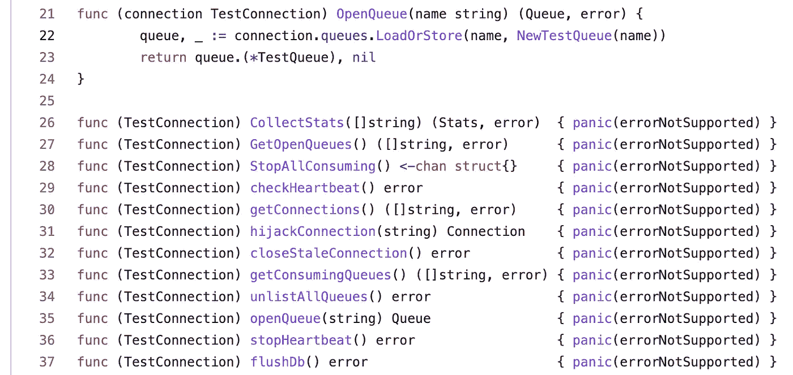

# Golang 中的单元测试、接口污染和接口

> 原文：<https://blog.devgenius.io/unit-testing-interface-pollution-and-interfaces-in-golang-c25885d1fc39?source=collection_archive---------3----------------------->

*golang 包设计和单元测试的几堂课*

在本文中，我们将讨论:

*   问题:依赖于其他包的单元测试代码
*   错误的解决方案:界面污染
*   首选解决方案
*   看一个使用 Redis 客户端库的单元测试代码的例子

这篇文章有点适合中级程序员和那些有初级到中级围棋经验的人，所以欢迎在评论中寻求澄清。我们将从本库作者的角度以及本库使用者的角度来探讨上述问题和解决方案。

在任何语言和框架中，你都会发现自己需要对一些依赖于第三方包的代码进行单元测试。在 Go 中，这有点棘手，因为它不像 Java 和 C#这样的语言那样支持反射。(这是故意的，但超出了本文的范围)。Go 中的方法是设计您的代码来接受接口类型，而不是具体类型，允许您的单元测试模拟接口，让您的非测试代码实现与第三方库的接口。

**问题是，谁应该编写接口？**第三方库应该公开其所有公共类型的接口，还是每个客户端都应该编写接口？根据我的经验，直观的答案通常是“第三方”，因为这将避免每个客户都必须自己编写接口。但是在围棋中，有一句谚语/经验法则说

> 界面越大，抽象性越弱
> 
> [来源](https://www.youtube.com/watch?v=PAAkCSZUG1c&t=317s)

假设一个库通过一个接口公开了一个包含 10 个方法的类型。如果您编写的代码依赖于该接口，那么当您对代码进行单元测试时，您可能倾向于模仿该接口的所有 10 个方法。这是一个看起来像什么的例子:

来源:[github.com/adjust/rmq/test_connection.go](https://github.com/adjust/rmq/blob/master/test_connection.go#L21-L37)

*首先，很抱歉 adjust/rmq 挑了你的毛病，我用过这个库，很高兴使用它。*

这里发生的事情是在 rmq 库中有一个类似的*连接*类型，它是一个接口。为了让库公开一些测试助手，它必须实现接口的所有方法，这导致了一长串“errorNotSupported”方法存根。rmq 的作者为代码的消费者做这些重复性的工作是很好的，但是如果他们没有这样做，每个客户都必须做这些工作。

总之，当一个库公开了一个大的接口时，模仿这个接口充其量也是混乱的。接下来，让我们来探索上述围棋谚语背后的智慧。

# 解决方案

当创建一个库时，你可以自由地公开组成你的 API 的实际结构，而不是公开一个接口。然后，让 API 的客户机来实现专门构建的接口，这些接口只存根客户机使用的方法。这里的原则是，作为一个库作者，您应该尽可能少地假设您的客户将如何使用您的代码。

现在，作为客户机代码的作者，您可以从使用库的 API 开始。一旦准备好对代码进行单元测试，就可以查看正在使用的方法，为其创建一个本地接口，然后用对本地接口的引用替换对库的结构类型的引用。这在一个例子中更容易理解，这里有一个关于 go-redis 库的例子。

go-redis 公开了一个 *redis。与 redis 数据库交互的客户端类型。假设这是您想要测试的代码:*

如您所见，我们从 *redis 中调用了 *Keys()* 、 *Set()* 和 *Del()* 方法。客户端*类型。所以，现在如果我们想对代码进行单元测试，我们只需创建一个新的类型，如 So，并替换我们的引用 *redis。客户端*到我们的接口类型。

瞧啊。现在，当您对这段代码进行单元测试时，您就有了一个简洁而简单的模拟类型。此外，通过将 *redisKvStore* 类型放在文件的顶部，很容易理解您的代码对 redis 的依赖性。

# 关于局部接口类型的一个注记

注意*redisvstore*接口方法如何从 redis 库中返回类型，而不是一些本地类型？最初我认为我应该(并且能够)为接口方法的返回值定义接口方法。我尝试了这个实现:

此代码将导致编译错误:

怎么回事就是 Go 编译器在比较 **redis。客户端*方法到 *redisKvStore* 方法，并指示它们具有不同的返回类型。我想，既然 *redisKvResult* 接口定义了我使用的方法，那么 **redis。IntCmd* 实现了接口，编译器会接受 **redis。客户*作为实施者。

实际上，并不奏效。Go 对 **redis 上 *Del()* 的返回类型不做深度检查。客户端*检查是否在 *redisKvStore* 接口上实现了 *Del()* 的返回类型。所以，最后，你必须返回和库返回的完全相同的类型。同样的原则也适用于这些方法的参数。

这在编写库时引入了对公共类型的重要警告。API 使用和返回的类型也必须是公共的。Go 允许你从一个公共方法返回一个类型，但是这个类型的构造函数是私有的。我在 terraform codebase 上进行黑客攻击时遇到过这个问题，结果是我可以使用他们的 API 来做我想做的一部分事情，但是当我想实例化一个与公共 API 方法返回的值相同类型的变量时，我不能！

# 摘要

Go 中的单元测试和模拟不同于动态和基于 VM 的语言。在 Go 中，我们创建特定于我们对库或 API 的使用的本地接口。作为库的作者，在大多数情况下，我们可以自由地将 API 公开为 struct 方法。

当创建这些本地接口时，我们需要准确地理解 Go 编译器将要比较的类型。方法签名——参数和返回类型——必须与您试图模仿的类型完全匹配。