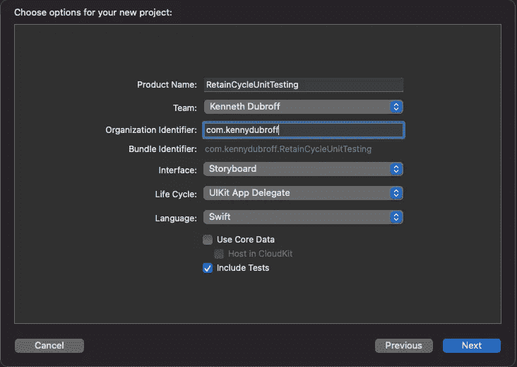
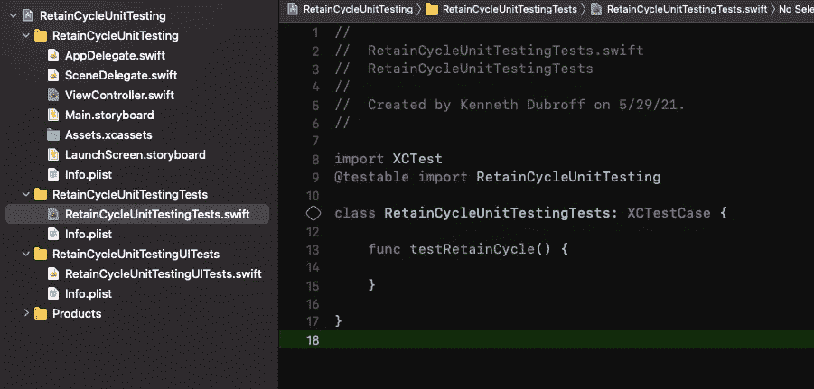
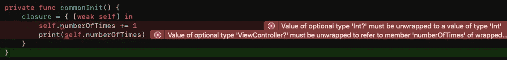
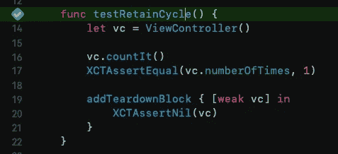

# 单元测试内存泄漏

> 原文：<https://blog.devgenius.io/unit-testing-memory-leaks-265f8d9777fb?source=collection_archive---------3----------------------->

## 通过避免保留周期来提高性能

## 在一瞬间找到这个难以捉摸的浪费时间的人

呃，漏码

在 Swift 中，通过 ARC 我们可以非常高效地处理内存。基本上，引用对象(比如类)记录了它们被引用的次数。当计数达到 0 时，该项被标记为释放，并在系统需要空间时从内存中移除。

但是，如果我们不小心，我们可能会遇到这样的情况，因为我们创建了一个保留循环，所以内存空间从来没有被标记为释放。不幸的是，对我们来说，这些可能是相当棘手的跟踪。

在本教程中，您将实现一个单元测试，该单元测试可以测试任何对象，以查看它是否被正确发布。

有关内存管理、保留周期以及如何避免它们的更多信息，我写了这篇文章:

 [## 保留周期和弱对无主

### 什么是保留周期？我为什么要用弱？我什么时候使用无主？

blog.devgenius.io](/retain-cycles-and-weak-vs-unowned-643c676821fc) 

# 公共保留周期

偷偷摸摸的保留周期最常见的地方之一是当我们在闭包中捕获`self`时。本质上，`self`指向闭包，那么如果闭包调用`self`，闭包就有对`self`的引用。因为他们互相指着对方，所以很有可能两个人都不会被释放。

继续开始一个新项目，并选中包含单元测试的复选框。

记得检查包含测试

接下来，实现下面的类。您可以使用默认的 ViewController 或创建自己的 view controller。在`ViewController`中，我们简单地使用闭包来增加一个整数。

确保实现所需的 init，而不是使用默认的`fatalError`，否则你的应用会崩溃。

如果你自己打出来，并且在`numberOfTimes`前没有包含`self`，编译器会给出一个关于捕获语义的错误。我认为编译器让你在这里显式引用`self`来提醒你，你可能正在创建一个保留循环。在这里打破保持循环是微不足道的，我们将在本文的后面讨论这一点。现在，我们只是有一个内存泄漏💧

# 让我们直入主题，证明我们有一个保留周期

继续打开`YourProjectNameTests.swift`，你会看到一堆样板代码。去掉所有这些，创建一个名为`testRetainCycle`的函数。

通过创建 ViewController 的实例，运行`countIt()`，并断言`numberOfTimes`为 1，来测试您的方法是否有效。

## 通过点击方法签名旁边的菱形来运行测试，测试应该会通过

现在你需要做的是证明你有一个保持周期，在测试运行后检查并查看`vc`是否为零。它应该为零，因为它只在测试范围内有效。如果不为零，则存在保留周期。

单元测试有特定于`XCTestCase`类的`setup`和`teardown`方法。这些方法在每次测试之前和之后都会被调用。要检查保留周期/内存泄漏，只需检查测试运行后实例是否被释放。

即使这个类有一个拆卸方法，也要在你的`testRetainCycle`方法中实现`addTearDownBlock`。这是一个特殊的方法，只在调用后调用本地函数，而不是为每个测试函数调用。当我们不需要在我们测试的所有东西上运行时，这是很有用的。在`addTearDownBlock`闭包中，简单断言`vc`就是`nil`。

运行测试，它失败了！就像任何其他闭包一样，`self`通过局部作用域拥有/指向`addTeardownBlock`。然后检查闭包中的`vc`是否为零，vc 是在闭包之前由局部作用域创建/指向的，所以现在闭包和 vc 通过局部作用域相互指向对方。这是一个保留周期…

# 打破循环

我之前说过，打破循环是微不足道的，我没有撒谎。闭包带有一个捕获列表。在捕获列表中，我们声明了想要在闭包中使用的外部对象。我们可以给属性添加修饰符，所以我们可以像这样`addTearDownBlock { [weak vc] in`我们的`vc`属性。由于引用计数不计入弱属性，我们打破了保留循环！

但是如果你运行单元测试，它仍然失败。这是为什么呢？

嗯，我们只解决了一个保留周期——我们刚刚创建的单元测试中的那个。我们还需要回到`countIt`方法中的`ViewController`和`weakify` `self`。当你这样做的时候，你应该得到一些编译错误。这是因为`self`现在是可选的。为了避免这种情况，你可以让`self`成为无主，但是弱是更安全的选择——无主就像强制解包。

您可以随意打开`self`，但是如果您强制打开，您也可以使用`unowned`。我选择了可选链接。也就是说，在这个特殊的例子中，self 拥有闭包，不涉及其他类，所以*我认为*使用 unowned 是安全的。

展开弱变量，它们是可选的！

你刚刚把[软弱的自己]加入了你的捕获列表，打破了保留循环。

最后，如果您运行您的单元测试，您将看到保留循环被打破。既然您已经知道在闭包中创建(和打破)保持循环是多么容易，那么希望您可以开始测试捕获`self`的闭包。

## 使其可重复使用

这对于一次性测试来说很好，但是如果您有一堆引用对象，并且您想确保在代码的其他地方没有保留循环，该怎么办呢？嗯，由于本地`addTeardownBlock`和`XCTAssert`的可选行和文件属性，你可以很容易地做到这一点！行和文件属性将错误冒泡到发生错误的特定测试中，而不是将错误保存在 helper 方法中。

继续并在`testRetainCycle`后添加该方法

那就叫它代替`addTearDownBlock`

发生保留周期最常见的地方之一是在 ViewController 中使用 URLSession 之类的 HTTP 客户端。因此，对于您的下一步，为什么不研究期望和测试异步方法，然后看看您是否可以创建一个 HTTP 客户端的保留循环，测试它，并打破它。

评论里见！⏬