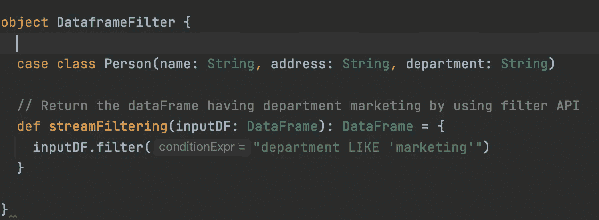

# 使用内存流对 Spark 结构化流应用程序进行单元测试。

> 原文：<https://blog.devgenius.io/unit-testing-spark-structured-streaming-application-using-memory-stream-fbaebfd39791?source=collection_archive---------3----------------------->


Spark 结构化流提供了强大的 API 来构建连续的应用程序。然而，当谈到流式应用程序的单元测试时，我发现互联网上的可用信息非常有限。

## 概观

在这篇文章中，我们将探讨如何用 [java](https://github.com/MayuriD18/MDSparkStreamingUnitTest/tree/master/src/test/java/com/md/spark/sql/streaming) 和 [scala](https://github.com/MayuriD18/MDSparkStreamingUnitTest/tree/master/src/test/scala/com/md/spark/sql/streaming) 为结构化流应用编写简单的单元测试代码。我们将使用 [junit](https://junit.org/junit5/docs/current/user-guide/) 框架来编写单元测试用例。我们将利用 apache spark 的[内存流](https://www.javadoc.io/doc/org.apache.spark/spark-sql_2.12/latest/org/apache/spark/sql/execution/streaming/MemoryStream.html)。

Spark 的内存流是一个流源，当用户添加值时，它产生存储在内存中的值。此源旨在用于单元测试，因为它只能在对象仍然可用时重放数据。一旦我们创建了内存流，我们必须将测试数据添加到内存流中，我们将应用一些转换，并将实际结果与预期结果进行比较。因此，内存流是在微批处理流处理中支持读取的数据流。

让我们理解简单的流式作业，我们将使用它进行单元测试和单元测试代码。

*注意——我们在这篇博客中使用了 Scala API。可以在* [**GitHub**](https://github.com/MayuriD18/MDSparkStreamingUnitTest/tree/master/src/test/java/com/md/spark/sql/streaming) 上找到 Java API 代码。

**Spark 结构化流作业**

> 在我们的流应用程序中，我们过滤了部门为“营销”的人员。这只是我们写的简单的过滤查询。



scala 中的过滤方法

在上面的代码中，

*   我们有 Person case 类，定义了人的属性。
*   我们将为其编写单元测试的流过滤方法。

## **使用内存流的单元测试代码**

> 创建内存流-

```
import org.apache.spark.sql.{Encoder, Encoders}
implicit val personEncoder: Encoder[Person] = Encoders.*product*[Person]

val inputStream: MemoryStream[Person] = new MemoryStream[Person](1, *spark*.*sqlContext*,*Some*(5))
implicit val sqlCtx: SQLContext = *spark*.*sqlContext* val sessions = inputStream.toDF
```

我们已经创建了 Person 类的内存流，并使用 toDF 将内存流转换为 Dataframe[Person]

> 调用转换(业务逻辑或者我们为之编写单元测试的方法)

```
val filteredDF = DataframeFilter.*streamFiltering*(sessions)
```

我们调用我们的过滤方法，如上图所示。此方法筛选部门为“营销”的人员。

> 将输出写入内存表

```
val streamingQuery = filteredDF.writeStream.format("memory").queryName("person").outputMode("append").start
```

现在，我们将把过滤后的流写入内存表“person ”,保持输出模式 append。这将启动我们的流式查询。但是到目前为止，查询正在处理 0 行，因为我们还没有向内存流添加数据。

> 将数据添加到内存流并处理它

```
val inputData = *Seq*(*Person*("donna","india","finance"), *Person*("dora","india","marketing"), *Person*("dina","india","marketing"))inputStream.addData(inputData)streamingQuery.processAllAvailable()
```

我们通过直接在代码中添加数据，创建了 Seq[Person]。我们可以使用 json 来读取(github java 测试代码中提供了示例)。

> 主张

```
val result = *spark*.sql("select * from person").collectAsList

*assertEquals*("Filtering the Input Stream should get filtered correctly", 2, result.size)

*assertEquals*(RowFactory.*create*("dora", "india", "marketing"), result.get(0))
```

使用写流，我们将数据保存到内存表 person 中，现在我们从 person 表中读取数据，将其收集为列表，并使用它来比较实际结果和预期结果。我们可以使用各种 spark sql 命令，并获得特定的记录用于输出比较。

> 将新数据添加到相同的流中并处理它

```
val inputData1 = *Seq*(*Person*("sam","india","marketing"), *Person*("sara","india","marketing"))inputStream.addData(inputData1)streamingQuery.processAllAvailable()
```

我们已经将新的两个事件添加到流中，并对其进行了处理。这将使用新数据更新内存表。

> 对更新数据的断言

```
result = *spark*.sql("select * from person").collectAsList

*assertEquals*("Filtering the Input Stream should get filtered correctly", 4, result.size)
```

最后，根据更新的数据，我们写了更多的断言。现在结果大小为 4，因为我们与部门有 4 个事件。

至此，我们已经成功地为 spark 流应用程序编写了单元测试！！

我希望这个概述对您有所帮助！
为了便于参考，可以在[**GitHub**](https://github.com/MayuriD18/MDSparkStreamingUnitTest/tree/master/src/test/java/com/md/spark/sql/streaming) 上找到完整的代码。它将涵盖 scala 和 java API 中的单元测试用例。