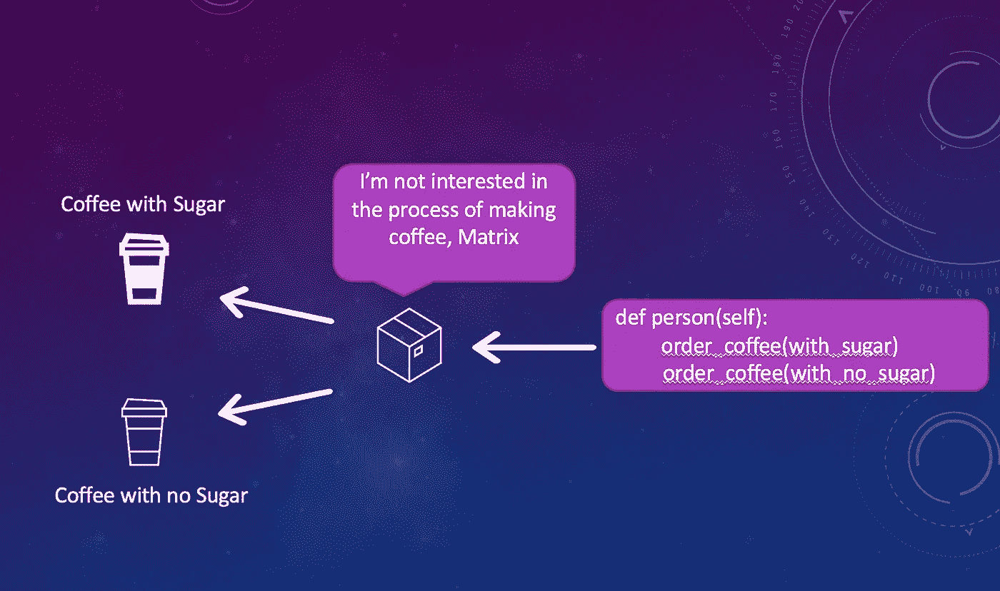

# 用 Python 进行单元测试

> 原文：<https://blog.devgenius.io/unit-testing-with-python-b7f41985e542?source=collection_archive---------12----------------------->

像大多数开始使用 AWS 技术，特别是 Lambda 函数的开发人员一样，我发现有必要开始用 Python 编写代码，随着从 Java 到 Python 的转换，我开始寻找库和技术来测试我的代码。

包括我自己在内的大多数开发人员发现，当我们面对一些复杂的场景时，很难测试我们的代码，我将带你浏览一些案例，向你展示如何解决这些案例，所以让我们开始吧。


加州帕萨迪纳

> 案例一:如何模拟 datetime？

> FreezGun library 是一个可以帮助你冻结时间的库:
> 
> 一旦调用了装饰器或上下文管理器，所有对 datetime.datetime.now()、datetime.datetime.utcnow()、datetime.date.today()、time.time()、time.localtime()、time.gmtime()和 time.strftime()的调用都将返回已冻结的时间。time.monotonic()和 time.perf_counter()也将被冻结，但像往常一样，它不保证它们的绝对值，只保证它们随时间的变化。https://github.com/spulec/freezegun

```
from datetime import datetime
from freezegun import freeze_time@freeze_time(datetime(2022,2,22,12,34,56,789000))
def test_time(self):
    actual = hey_time()
    self.assertEqual("hey: it's 2022-02-22 12:34:56.789000", actual)def hey_time():
    return 'hey: it's ' + datetime.utcnow()
```

> 案例二:如何模拟一个函数根据传入的参数返回不同的响应？


想象一下，崔妮蒂和尼奥走到一家咖啡馆，崔妮蒂向咖啡师要了两杯咖啡，一杯加糖，另一杯不加糖。

如果你是 Java 出身，大概知道在**中* 的时候可以用 ***来控制方法行为。*幸运的是，python 提供了类似的解决方案，但是语法不同。那么，让我们假设你有一个调用 S3 桶并返回一个文件的函数，这个函数接收文件名参数并从 S3 桶中获取它，你怎么能根据输入参数返回不同的文件呢？通过将模拟函数中的***side _ effect****属性分配给***MagicMock、*** ，您将能够根据输入参数控制函数的结果。在下面的代码中，我创建了函数 *handler_side_effect* ，它将检查第一个传入的参数，并基于此返回不同的结果。现在想象一下基于 ***args*** 数组你能想出什么复杂的场景。****

****

**三一不关心幕后发生了什么，她关心的是最后的输出。**

****

**当我们模仿咖啡馆时，我们把它当作一个盒子，我们给它一个输入，我们期待一个输出。**

```
****test.py** REGION = 'jordan-east-1'

@mock.patch('src.s3_util.fetch_file_from_s3')
def test_handler(self, mock_fetch_file_from_s3):
    mock_fetch_file_from_s3.side_effect = MagicMock(side_effect=handler_side_effect)def handler_side_effect(*args, **kwargs):
    if args[0] == 'Regular':
        return {"Ingredients ": "Humus, Tomato, Falafel, and Bread"}
    elif args[0] == 'Super':
         return {"Ingredients ": "Humus, Fries, Tahina, Eggplant, Tomato, Falafel, and Bread"}**src/s3_util.py**def fetch_file_from_s3(file_name: str):
    ...
    return file**
```

> **案例三:如何模拟一个函数一直返回一个值？**

**如果你有一个简单的函数，尽管有输入参数，你的函数需要返回相同的值，那么你可以在模拟函数中使用 ***return_value*** 属性。**

```
**@mock.patch('src.s3_util.fetch_file_from_s3')
def test_handler(self, mock_fetch_file_from_s3):
    mock_fetch_file_from_s3.return_value = 'I'm cool as Avocado'**
```

> **案例四:如何验证被模仿的函数是用特定的参数调用的？**

**在某些情况下，仅仅验证你模仿的函数的结果是不够的，你还需要验证被模仿的函数是否是用特定的参数调用的？它被呼叫了多少次？等等……
重要的是要提到在 python 中模拟函数的**顺序**有点混乱，在下面的例子中，你会注意到 ***模拟 _ 腐殖质*** 在参数中排在第一位，所以请记住这一点，以免碰壁:)**

```
**@mock.patch('src.eggplant.add')
@mock.patch('src.humus.add')
def test_falafel_factory(self, mock_humus, mock_eggplant):
    mock_humus.assert_called_with('humus')
    mock_humus.assert_called_with('lentils')
    self.assertEqual(mock_humus.call_count, 2)
    self.assertEqual(mock_eggplant.call_count, 0)**src/falafel_sandwitch_factory.py**from humus  import add
def make_falafel_sandwitch(self):
     add('humus')
     add('lentils') **src/humus.py**def add(self, ingredient):
     ... **src/eggplant.py**def add(self, ingredient):
     ...**
```

> **案例五:异常出现时如何测试你的函数？**

**如果您的函数必须处理异常，您希望能够测试您的函数行为，假设您有一个从 s3 bucket 获取信息并对该信息进行分析的函数，并且您遇到了来自 s3 的异常，比如找不到文件或区域关闭。模仿给了你控制 fetch 函数行为的能力，你可以在被模仿的函数被调用时抛出一个异常，在你的代码中捕捉这个异常，并验证被模仿的函数是用某些参数调用的。**

```
**@mock.patch('src.data_factory.read_from_s3')
def test_data_factory(self, mock_read_from_s3):
    mock_read_file.side_effect =    MagicMock(side_effect=Exception('Trinity is mad at you')) 
    try:
       fetch_data_and_analyse()
    except Exception as e: 
       self.assertEqual('Trinity is mad at you', format(error))
    mock_read_from_s3.assert_called_with('cool_bucket')
    self.assertEqual(mock_read_from_s3.call_count, 1)**src/data_factory.py**from s3_util  import read_from_s3
def fetch_data_and_analyse(self): try:
     data = read_from_s3('cool_bucket') except Exception as e:
     print(e) analyse(data)**src/s3_util.py**def read_from_s3(self, bucket_name):
     ...**
```

**这是目前为止，如果你有以上案例中没有提到的任何案例，请给我留下评论，如果我有答案，我会尽量给你回复。**