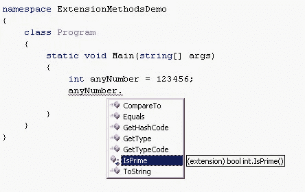
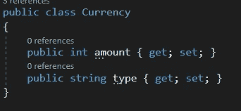
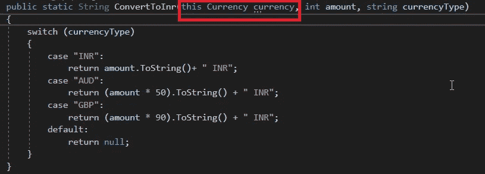
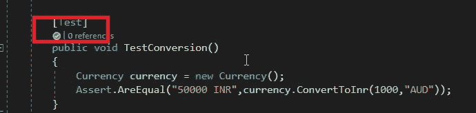
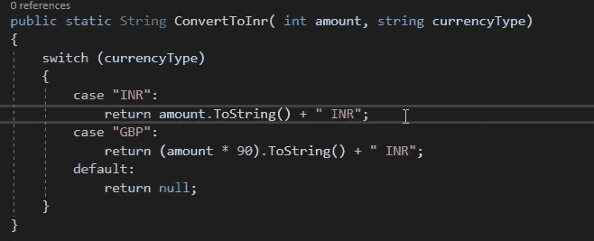
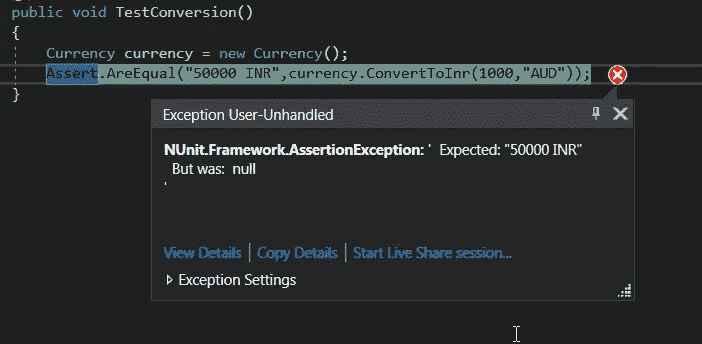

# 单元测试是扩展方法的必备工具。明白为什么了吗？

> 原文：<https://blog.devgenius.io/unit-tests-are-a-must-have-for-extension-methods-see-why-f803211e14fa?source=collection_archive---------1----------------------->

我一直以懒散著称。因此，我必须说服自己编写单元测试用例。这篇文章是写给那些避免为基本的和低风险的方法编写单元测试的人(比如我)。

来自我的开发机器的图像

C#中的[扩展](https://docs.microsoft.com/en-us/dotnet/csharp/programming-guide/classes-and-structs/extension-methods)方法是实现[开闭原则](https://en.wikipedia.org/wiki/Open%E2%80%93closed_principle)最简单也最不常用的方法。棘手的部分是调试由扩展方法引起的错误。

防止这些错误的最好方法是确保为扩展方法编写单元测试。

在我用一个例子演示之前，需要快速介绍一下扩展方法:

> 扩展方法是静态方法，就像被扩展的类的普通方法一样使用。因此，新的功能可以添加到现有的类中，而不需要更改或重新编译类本身。但是，由于扩展不是类的直接组成部分，因此它们不能访问私有或受保护的方法、属性或字段。

让我们试着用一些代码来理解这一点。

我正在创建一个控制台应用程序，将外币转换为印度卢比。有一个名为 Currency.cs 的类，其成员变量为“Amount”和“Type”。

**用户 A** 为 **Currency.cs** 类编写一个扩展方法。 **ConvertToInr()** 是将货币转换成 Inr(印度卢比)的扩展方法。该方法将如下所示:

对**用户 A** 的要求是只实现 AUD 和 GBP 的逻辑。正如你从上面的快照中看到的，我已经硬编码了转换率(例如，50 & 90 分别对应于澳元& 90 英镑)。

**用户 A** 使用库 NUnit 编写单元测试进行验证。测试用例如下所示。在执行时，测试用例执行成功。

**用户 B** 出现并提出了类似的要求。在不知道扩展方法的情况下，用户 B 在 Currency.cs 类中编写了一个方法(非静态的)。

对**用户 B** 的要求是只实现逻辑 GBP 而不是 AUD。

尽管用户 A 编写的测试用例中没有编译错误，但是测试执行仍然会失败。类 **Currency.cs** 中的方法 **ConverToInr()** 将优先于 **CurrencyExtension.cs** 中定义的扩展方法。**ConvertToInr()**in currency . cs 不包含任何将 AUD 转换为 Inr 的逻辑，这是测试用例失败的原因。

见下文:

如果没有用户 A 编写的测试用例，来自用户 B 的代码更改将会导致后期的错误。如果扩展方法是在不同的库中编写的，调试这样的问题会更加困难。

这里需要注意的重要一点是，Currency.cs 中的 ConvertToInr 方法不是静态方法。这是主要原因，扩展被覆盖。

谢谢

塔伦

页（page 的缩写）s-Medium 是一个阅读、写作和向其他作者学习的绝佳平台。如果你想加入我的旅程，今天就加入 [medium](https://tarunbhatt9784.medium.com/membership) 。