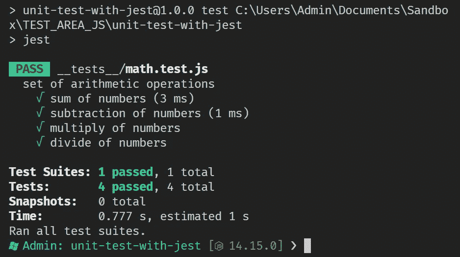
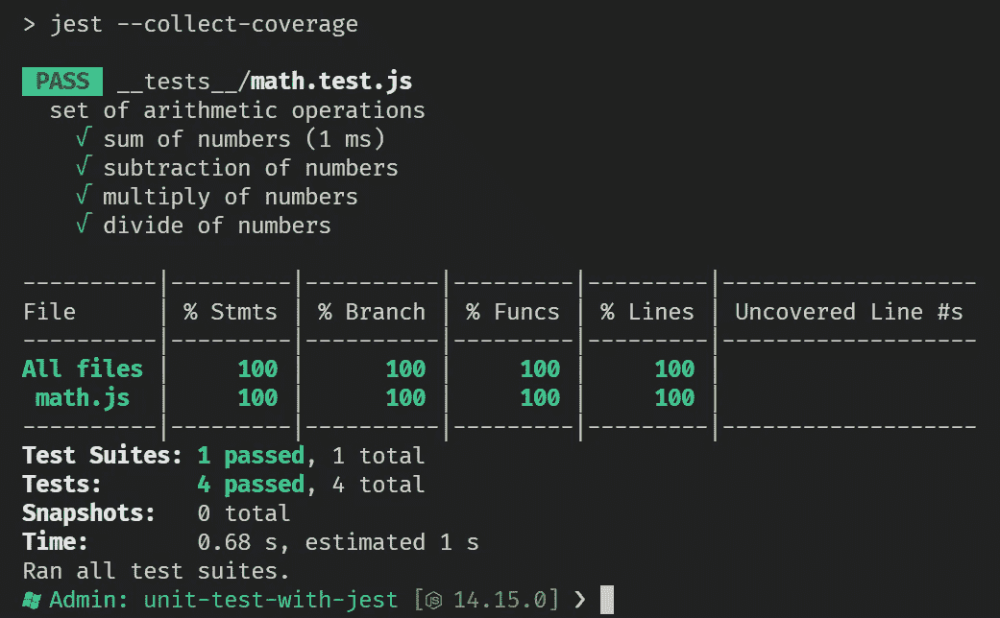

# 用 Jest 在 Javascript 中进行单元测试

> 原文：<https://blog.devgenius.io/unit-tests-in-javascript-with-jest-8962f29d8af4?source=collection_archive---------6----------------------->


软件测试基础文章。Jest 框架的基本概念和单元测试。

# 玩笑

Jest 是来自 Javascript 生态系统的开源测试框架。Jest 是目前最受欢迎的测试框架，被脸书、Airbnb、Twitter 和 Spotify 等大公司使用，它还有多个插件，可以在前端和后端(React、Angular、Vue、Node)轻松与所有现代框架集成。

它的一些特性是简单的配置、代码快照的使用和包含的覆盖报告。

# 单元测试

单元测试是在计算机软件的最小个体单元上执行的测试。其主要目的是验证这些小部件在隔离环境中的正确操作。

单元测试包括:

*   功能。
*   班级。
*   方法。
*   在其他小块中。

# Jest 测试的关键概念

以下概念将帮助我们理解所有 Javascript 测试框架中常用的术语和保留字，重点是 Jest 使用的函数。

*   **描述:**功能，将帮助我们创建分组几个相关测试的块。
*   **测试**:将测试诡辩的功能。请注意，测试函数包含一个名为 it 的别名，它采用了相同的功能。
*   **Expect** :允许在测试过程中验证匹配的功能。Jest 将通过返回基于标准的结果来验证这些匹配。每当需要验证一个值时，就会使用 expect 函数。Expect 与其他函数协同工作来处理多种情况。

下面是层次结构的使用顺序:

```
**describe**('set of math test', () **=>** {

  **test**('it is pair', () **=>** {
    **expect**(6 **%** 2).toEqual(0);
  });**test**('it is not pair', () **=>** {
    **expect**(7 **%** 2).not.toEqual(0);
  });});
```

**注意**:在测试文件中，Jest 将这些方法和对象放在全局环境中，使用它们不需要任何东西。

# 配置我们的环境

在开始之前，有必要在我们的工作环境中安装 [**Nodejs**](https://nodejs.org/en/) 。安装后，运行以下命令:

```
> mkdir unit-test-with-jest
> cd unit-test-with-jest/
> npm init -y
> npm i jest --save-dev
```

还将配置一个 NPM 脚本来运行单元测试，并配置一个脚本来生成覆盖率报告。打开 package.json 并配置以下脚本:

```
{
  "name": "unit-test-with-jest",
  "version": "1.0.0",
  "description": "",
  "main": "index.js",
  "scripts": {
    "**test**": "jest",
    "**coverage**": "jest --collect-coverage"
  },
  "keywords": [],
  "author": "",
  "license": "ISC",
  "devDependencies": {
    "jest": "^29.0.3"
  }
}
```

## math.js 文件

第一步是创建一个名为`math.js`的 javascript 文件，其中包含基本的算术运算，如加、减、乘、除。这些特性中的每一个都将被包装在不同的函数中，并被导出以供进一步测试。

```
**function** sum(a, b) {
  **return** a **+** b;
}**function** sub(a, b) {
  **return** a **-** b;
}**function** mul(a, b) {
  **return** a ***** b;
}**function** div(a, b) {
  **return** a **/** b;
}**module**.exports **=** {
  sum,
  sub,
  mul,
  div
}
```

## math.test.js 文件

下一步是创建一个名为`math.test.js`的 javascript 文件，它将包含从`math.js`文件导入的每个操作的单元测试。强调文件将被创建在一个名为`__tests__`的文件夹中

```
**const** { sum, sub, mul, div } **=** require('../math.js');**describe**('set of arithmetic operations', () **=>** {

  **test**('sum of numbers', () **=>** {
    **expect**(sum(1, 1)).toBe(2);
  });**test**('subtraction of numbers', () **=>** {
    **expect**(sub(1, 1)).toBe(0);
  });**test**('multiply of numbers', () **=>** {
    **expect**(mul(1, 1)).toBe(1);
  });**test**('divide of numbers', () **=>** {
   **expect**(div(1, 1)).toBe(1);
  });
});
```

**注意**:Jest 默认情况下会寻找名为`__tests__`的文件夹来搜索测试，并且会覆盖所有包含以`.test.js`或`.spec.js`结尾的文件名的文件，同样默认情况下，它会忽略`node_modules`中的所有内容。

## 运行测试

为了执行详细的测试，通过控制台指示命令`npm run test`。这样，Jest 将执行检查，并抛出结果。



# 覆盖率报告

覆盖率报告允许您估计测试了多少百分比的代码。这些报告提供了用于进一步分析的一般指标。要运行覆盖率报告，通过控制台指示命令`npm run covergare`。Jest 将通过控制台和当前目录中生成的 HTML 报告提供指标。



# 资源 javascript jest

*   [**主页笑话** :](https://jestjs.io/) 主网站、帮助、博客和文档。
*   [**Jest 用户手册**](https://jestjs.io/docs/getting-started) :第一步，安装，举例。
*   [**Jest CLI**](https://jestjs.io/docs/cli)**:**Jest 命令行、选项等。
*   [**Jest 文档 API**](https://jestjs.io/docs/api):API、方法、kickstarters 的使用。
*   [**GitHub Jest**](https://github.com/facebook/jest) :官方开源库。

# 结局

在本文中，我们将介绍框架的基本概念，记住有多个 CLI 函数和命令可以帮助我们涵盖所有可能的情况。建议阅读文档以继续扩展该工具的知识。

感谢你远道而来，如果你觉得这很有用，别忘了鼓掌👏。订阅以接收更多内容🔔。

如果你需要额外的帮助，请联系我🤠。

*   ✉️ [**给我发邮件**](mailto:dcortes.net@gmail.com)
*   🤝 [**在 LinkedIn 上联系我**](https://www.linkedin.com/in/dcortesnet/)
*   📮 [**在推特上联系我**](https://twitter.com/dcortes_net)

非常感谢您的阅读，我感谢您的时间。