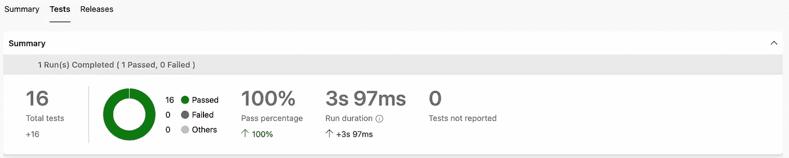
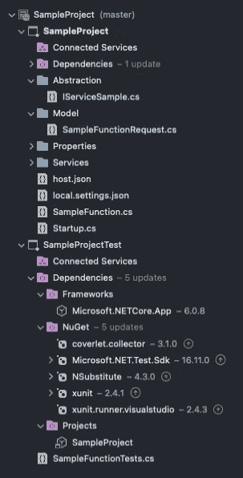
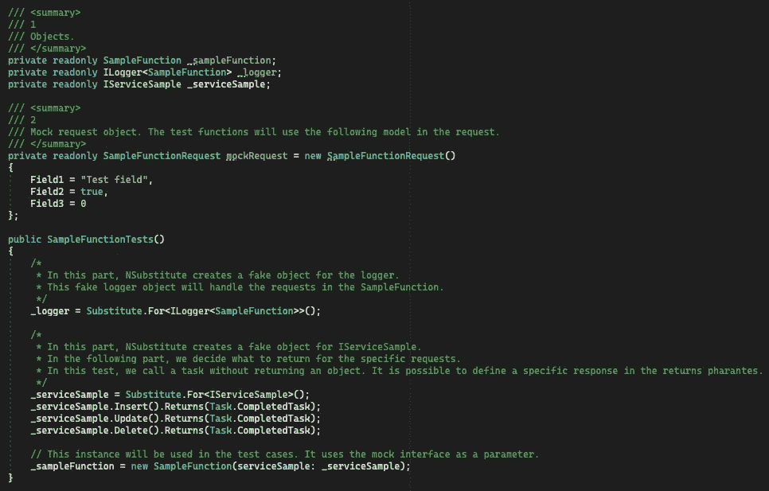
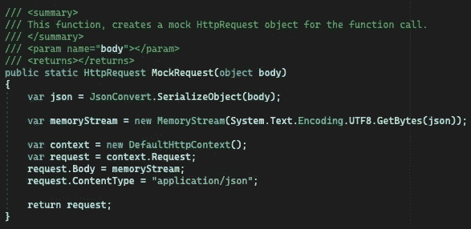
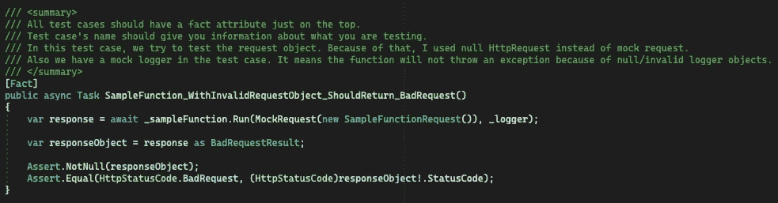
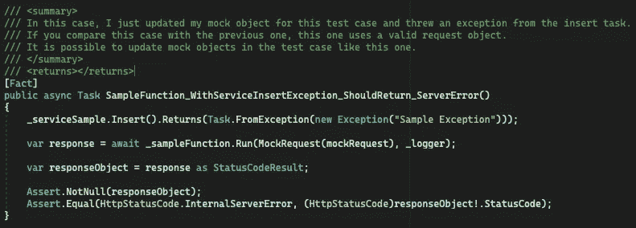
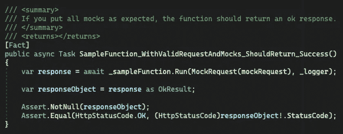
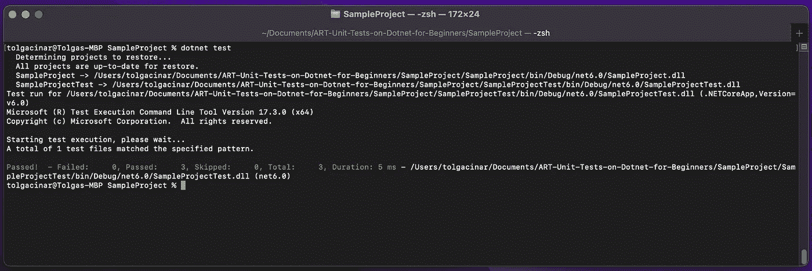

# 面向初学者的 Dotnet 单元测试

> 原文：<https://blog.devgenius.io/unit-tests-on-dotnet-for-beginners-5f37ffff86d7?source=collection_archive---------16----------------------->

大家好，

本文将尝试涵盖以下主题。介绍不要太长，开始学吧！

> -什么是单元测试？
> 
> -为什么我们要写单元测试？
> 
> -为什么干净的代码对单元测试很重要？
> 
> -什么是测试覆盖率？
> 
> -什么是模仿？
> 
> -教程。

## 什么是单元测试？

这是最小的测试类型。它有助于测试源代码中最小的一段代码*(最小单元)*。通过单元测试，开发人员可以验证源代码的每个单元都按预期工作。

*让我们看一个单元测试的例子。你有一台笔记本电脑。一个单元测试正在检查你的 type-c 端口是否按预期工作。此外，正在测试您可以将 type-c 端口连接到 type-c 电缆/设备，但不能连接 HDMI 或 VGA 或音频插孔。或者它可以测试您的 type-c 端口在有/没有电池的情况下是否如预期的那样工作。单元测试可以像这样检查你所有的笔记本电脑部件，帮助你的笔记本品牌提供更一致的产品。*

## 我们为什么要编写单元测试？

编写单元测试是一种很难养成的习惯，一些开发人员不喜欢单元测试。他们大多认为单元测试只是浪费时间，但事实并非如此。单元测试有助于开发人员确保源代码已准备好投入生产。此外，他们对新团队成员也有好处。当一个新成员加入一个团队，并开始工作中的第一个项目时，单元测试有助于对新的变化感到安全。此外，他们还帮助当前团队确保他们在修复 bug 或开发新功能时没有破坏任何东西。最后，在团队中创建一些代码标准是有帮助的。

可以向**构建管道**添加单元测试，并在每次自动部署之前检查一切是否按预期工作。下面是来自构建管道的示例屏幕截图；



**截图 1:** 来自 Azure Devops 的一个样本测试结果。

**任务名称:** VSTest@2

## 为什么干净的代码对单元测试很重要？

干净的代码对于单元测试很重要，因为如果代码是意大利面条式的代码，就很难，有时甚至不可能编写测试用例。这意味着，为了能够编写单元测试，在第一次开发时应该遵循干净代码原则，或者应该重构源代码。

*例如，如果****Http client****类用于函数的 Http 请求，那么一个新的实例****Http client****对象应该在函数的流程中创建。这意味着，所有的对象都不能在测试文件中被模仿。在这种情况下，为了能够编写单元测试，****IHttpClientFactory****接口作为依赖注入在这里是正确的选择。*

这意味着，如果你养成了写测试的习惯，你至少应该在写单元测试的时候重构上面的用法。

## 什么是测试覆盖率？

测试覆盖率是一个统计数据，它向我们展示了当我们运行测试用例时，检查了多少代码。*例如；你有 2000 行代码，而你的测试用例只检查 500 行代码。这意味着你的测试覆盖率是 25%。更高的测试覆盖率增加了在生产之前发现错误的机会。*

## 什么是嘲弄？

单元测试只是测试一段孤立的代码。这意味着，一个单元测试没有调用任何内部的*方法/函数*或*第三方端点*，但仍然需要这些*方法/函数*和*第三方端点*。它使用一些**假的**(示例)*请求/响应*对象在测试用例中使用，它们的名字是模拟对象。

*例如；在下面的示例函数中，该函数从****IServiceSample****接口中调用****Insert****方法。但是在测试用例中，不可能调用它，因为单元测试只是试图验证函数的流程。这意味着，为了能够完成函数的流程，单元测试需要一个假调用。对于这种情况，将下面一行代码插入到测试类的构造函数中。这一行写着:如果我调用* ***插入*** *方法然后返回****your-mock-object****作为响应。这意味着单元测试实际上不会调用* ***插入*** *方法。测试假设该方法被函数调用，并返回****your-mock-object****作为响应。*

```
_serviceSample.Insert().Returns(**your-mock-object**);
```

让我们通过下面的测试项目来巩固一些主题。示例项目是一个 Azure function 项目，包含以下文件夹和文件。

> -Root/Abstraction/**iservicesample . cs**
> 
> -Root/Services/**service sample . cs**
> 
> -Root/Model/**samplefunctionrequest . cs**
> 
> - Root/ **SampleFunction.cs**

示例函数是一个匿名的 HttpTriggered 函数。它通过 **IServiceSample.cs** 接口使用依赖注入。这些文件的详细信息如下:

**IServiceSample.cs**

```
using System.Threading.Tasks;namespace **SampleProject.Abstraction**
{
   public interface **IServiceSample**
   {
      Task Insert();
      Task Update();
      Task Delete();
   }
}
```

**提醒:**该界面仅用于展示依赖注入和模仿样本。

**ServiceSample.cs**

```
using System;
using SampleProject.Abstraction;
using System.Threading.Tasks;namespace **SampleProject.Services**
{
   public class **ServiceSample : IServiceSample**
   {
      public async Task Delete()
      {
         throw new NotImplementedException();
      } public async Task Insert()
      {
         throw new NotImplementedException();
      } public async Task Update()
      {
         throw new NotImplementedException();
      }
   }
}
```

**提醒:**这个类只是用于测试接口实现。

**samplefunctionrequest . cs**

```
namespace **SampleProject.Model**
{
   public class **SampleFunctionRequest**
   {
      public string Field1 { get; set; }
      public bool Field2 { get; set; }
      public int Field3 { get; set; }
   }
}
```

**samplefunctionrequest . cs**是函数的请求对象。它将被用来通过这个模型模拟和编写一个测试用例。

最后，示例函数如下所示。

```
using System;
using System.IO;
using System.Threading.Tasks;
using Microsoft.AspNetCore.Mvc;
using Microsoft.Azure.WebJobs;
using Microsoft.Azure.WebJobs.Extensions.Http;
using Microsoft.AspNetCore.Http;
using Microsoft.Extensions.Logging;
using Newtonsoft.Json;
using SampleProject.Model;
using SampleProject.Abstraction;namespace **SampleProject**
{
   public class **SampleFunction**
   {
      private readonly **IServiceSample _serviceSample;** public SampleFunction(**IServiceSample serviceSample**)
      {
         **_serviceSample = serviceSample;**
      } **[FunctionName(“SampleFunction”)]**
   public async Task<IActionResult> Run(
     **[HttpTrigger(AuthorizationLevel.Anonymous, “post”, Route =           “samplefunction”)]**
     HttpRequest req,
     ILogger log)
   {
      try
      {
         string stringRequest = await new   StreamReader(req.Body).ReadToEndAsync();
         SampleFunctionRequest request = JsonConvert.DeserializeObject<SampleFunctionRequest>(stringRequest); if (string.IsNullOrEmpty(request.Field1))
         {
            log.LogInformation(“Invalid request object”);
            return new BadRequestResult();
         } await _serviceSample.Insert(); return new OkResult();
      }
      catch (Exception ex)
      {
         log.LogInformation($”Exception = {ex.Message}”);
         return new StatusCodeResult(500);
      }
    }
  }
}
```

现在，除了依赖注入之外，一切都准备好测试了。如果函数/项目通过依赖注入有一个服务，该服务应该被添加到项目的启动文件中。欲了解更多信息，请访问此处。

**startup.cs** 文件如下:

```
using Microsoft.Azure.Functions.Extensions.DependencyInjection;
using Microsoft.Extensions.DependencyInjection;
using SampleProject.Abstraction;
using SampleProject.Services;**[assembly: FunctionsStartup(typeof(SampleProject.Startup))]**
namespace SampleProject
{
   public class Startup : **FunctionsStartup**
   {
      public override void Configure(IFunctionsHostBuilder builder)
      {
         **builder.Services.AddScoped<IServiceSample, ServiceSample>();**
      }
   }
}
```

现在，项目已经准备好接受测试了。此时，我们需要在同一个解决方案下增加一个项目，这个示例的项目类型是 **XUnit** 。在创建项目之后，应该为函数的测试用例创建一个新的类。在这个示例中，它的名称是 **SampleFunctionTests。这个类包括下列对象/接口/测试用例。**

> -请求模型。**(样本函数请求)**
> 
> -注入服务。 **(IServiceSample)**
> 
> -日志对象。 **(ILogger)**

**注意:**在开始编写测试用例之前，应该将函数 app 作为依赖项添加到测试项目中。因为，嘲讽完一切，我们要从测试用例中调用函数。

**注意:**为了能够模拟方法/函数，测试项目应该有**n 替换**库。可以使用替代库，但本文是基于 **NSubstitute。**



**截图二:**依赖关系。

在编写任何测试用例之前，应该在测试类中准备好所有的模拟对象。从下面的截图中可以看到这个函数的模拟对象。此外，从 GitHub 存储库中也可以看到它。



**截图 3:** 功能模拟图。

在示例函数中，服务方法不返回任何响应。正因为如此，他们才返回**任务。Completed** 但是如果它们有方法的返回类型，就有可能在括号中添加一个模拟响应对象。它类似于:

```
_serviceSample.Insert().Returns(**your-mock-object**);
```

此外，模仿具有一个/多个参数的函数；

```
_serviceSample.Insert(***Arg.Any<string>(), Arg.Any<int>()***).Returns(**your-mock-object**);
```

最后，单元测试需要一个假的 **HttpRequest** 对象。单元测试将在测试用例的函数调用中使用它。mock **HttpRequest** 对象如下:



**截图 4:** HttpRequest mock 函数。

**注意:**我为 sample 函数创建了 3 个测试用例。此外，我在代码中添加了一些注释。我建议你也读一读。

第一个测试用例；



**截图 5:** 第一个测试用例。

第二个测试用例；



**截图 6:** 第二个测试用例。

第三个测试案例；



**截图 7:** 第三个测试用例。

以及测试用例是通过 Visual Studio/Visual Studio 代码还是通过以下命令运行；

```
dotnet test
```

结果如下图；



**截图 8:** 测试结果。

即使使用这个简单的测试函数，也可以创建更多的测试用例。如果我们通过测试覆盖了高比例的代码，我们就有很大的机会在生产之前发现 bug。但是它仍然不能保证产品没有错误。

感谢您阅读文章。要添加任何附加信息或通知我任何错误信息，请使用评论部分或 GitHub。

可以从[这里](https://github.com/cinarrtolga/ART-Unit-Tests-on-Dotnet-for-Beginners)访问样本库。