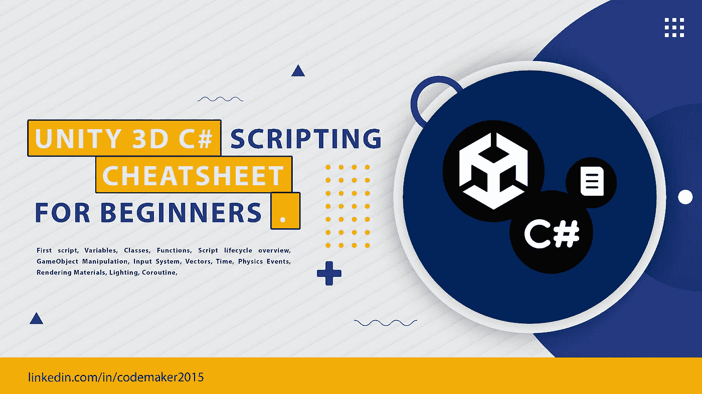
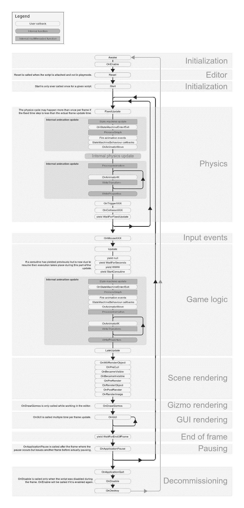
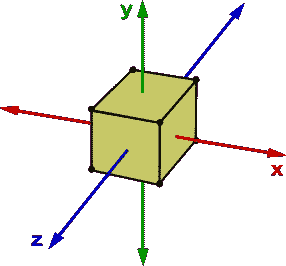
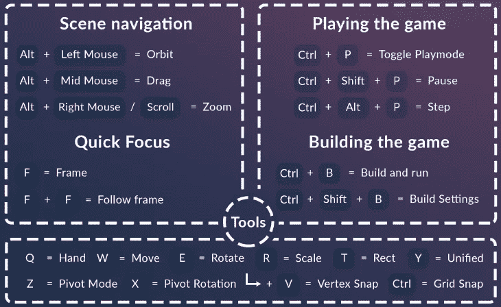

# 适用于初学者的 Unity 3D C#脚本备忘单

> 原文：<https://blog.devgenius.io/unity-3d-c-scripting-cheatsheet-for-beginners-be6030b5a9ed?source=collection_archive---------0----------------------->

Unity3D 是最好的跨平台游戏引擎之一，具有 AR VR 集成能力和强大的渲染引擎(HDRP，URP)。此外，资产商店支持免费和付费资产购买。Unity 使用 C#作为脚本语言来实现游戏逻辑。您可以使用 C#脚本机制处理对象实例化、操作、用户交互、UI 控件管理。unity 脚本的亮点是通过 inspector 和 MonoBehaviour 生命周期方法轻松访问对象。

脚本是控制游戏对象的实体，并告诉游戏对象在场景中的行为和交互。Unity 脚本的优势在于它的生命周期方法和用于游戏对象操作的 API。你可以将 Unity 场景中的所有东西视为游戏对象，并通过 inspector 或使用`GetComponent`方法在脚本中引用它。

本教程使用 C#总结了 Unity 中常用的特性。

我们开始吧！

# 入门指南

## 目录

*   [我们的第一个剧本](#f1cc)
*   [变量](#4d35)
*   [类](#4180)
*   [功能](#7de8)
*   [脚本生命周期概述](#7b5b)
*   [游戏对象操纵](#43b8)
*   [输入系统](#926b)
*   [矢量](#3454)
*   [时间](#e44d)
*   [物理事件](#d04b)
*   [渲染材质](#769a)
*   [照明](#4930)
*   [协程](#2f01)
*   [动画](#6523)

## 我们的第一个剧本

Unity 使用 C#作为主要的脚本语言。你也可以用 Javascript 写你的代码，但是大多数人更喜欢 C#，因为它简单。Unity 只支持面向对象的脚本语言。变量、函数和类是任何语言的基本构件。以下是 Unity 中带有日志消息的基本脚本。

在这里，我们可以看到`HelloWorld`类、`Start()`和`Update()`函数以及一条日志消息。

## 1.变量

它是保存对象的值和引用的内存位置的名称。像任何面向对象的编程语言一样，变量声明包含可访问性级别(范围)。它可以是公共的、私有的或受保护的。

Unity 通过在检查器中显示公共变量使对象引用变得简单。因此，用户可以很容易地从检查器中提供该变量的值或引用。

如果我们想引用脚本中的任何游戏对象，那么就公开它的可见性，或者在那里放一个`SerializeField`标签。

这里`gameObject1`和`gameObject2`将在检查器中可见，游戏对象 3 只能在脚本中引用。

## 2.班级

类是对象的蓝图。它是一个将变量和函数包装在一起的模板。

## 3.功能

函数是为完成特定任务而执行的一组代码。它有助于在应用程序中创建可重用代码并实现模块化。此外，我们使用函数来使我们的代码可读和可移植。

Unity 有几个生命周期方法，如 wake()、Start()、Update()，这些方法在满足某些预定义条件时会自动调用。

*   **场景初始化前调用**。
*   **场景对象创建后调用**开始。
*   **更新**每帧调用一次。
*   **FixedUpdate** 与 Update 相似，但调用间隔相等。
*   **后期更新**与更新相似，但在帧末触发。

## 脚本生命周期概述

影像学分 docs.unity3d.com

## 4.游戏对象操作

游戏对象是 Unity 项目的核心组件。所有的物体，如光、用户界面和三维模型都是从游戏物体类派生出来的。这是我们在统一场景中使用的所有对象的父类。

在 Unity 中，我们可以通过两种方式与游戏对象交互——通过检查器和使用脚本。如果您想更改对象的位置，那么您可以通过检查器窗口轻松地进行更改。此外，您可以更改渲染属性，并通过检查器添加额外的组件，如刚体和自定义脚本。如果需要，您也可以通过自定义脚本来完成同样的操作。

## 5.输入系统

输入系统是我们玩的每一个游戏的关键组成部分。它可能是键盘、操纵杆或触摸屏。Unity 有一个[常规游戏输入](https://docs.unity3d.com/Manual/ConventionalGameInput.html)来访问您游戏中的输入。

Unity 还提供了一些方法来访问我们脚本中的输入系统。要读取一个轴，我们可以使用带有“水平”/“垂直”值的`[Input.GetAxis](https://docs.unity3d.com/ScriptReference/Input.GetAxis.html)`作为参数来访问键盘上的箭头按钮和操纵杆上的`A`、`W`、`S`、`D`键。

## 6.矢量

向量是一个数学概念，同时包含大小和方向。描述一些属性是很有用的，比如游戏中运动物体的位置和速度，或者两个物体之间的距离。Unity 实现了 Vector2 和 Vector3 类，用于处理 2D 和 3D 矢量。

图片来源:reaconverter.com

> *X =左/右 Y =上/下 Z =前/后*

## 7.时间

Unity 通过其时间库支持与时间相关的操作。`Time.time`、`Time.deltaTime`和`Time.timeScale`是项目中最常见的处理时间的 API。

*   `[Time.time](https://docs.unity3d.com/ScriptReference/Time.time.html)`返回当前帧开始时的时间。
*   `[Time.deltaTime](https://docs.unity3d.com/ScriptReference/Time.deltaTime.html)`返回当前帧和上一帧之间的时间差，以秒为单位。
*   `[Time.timeScale](https://docs.unity3d.com/ScriptReference/Time.timeScale.html)`表示时间流逝的刻度。

## 8.物理事件

Unity 有一个复杂的系统在你的项目中实现物理。它的各种物理属性归于`gameObjects`如重力、加速度、碰撞和其他力。

## 9.渲染材料

材质告诉我们应该如何在场景中渲染一个表面。该材质包含对着色器、纹理、颜色、发射等的引用。每种材质都需要一个着色器来渲染内容，不同的着色器值可能会有不同的可用属性。

## 10.照明设备

在任何 Unity 场景中，照明都是必不可少的组成部分。默认情况下，所有 unity 场景都包含一个平行光组件。Unity 有四种类型的灯光——平行光、点光、聚光灯和区域光。

## 11.协同程序

协程就像一个后台活动，它可以在 yield 语句之后暂停代码的执行，直到它返回一个值。

## 12.动画

在 Unity 中创建动画是一件容易的事情。Unity 借助动画师控件和动画图形使它变得简单。Unity 调用动画师控制器来处理播放哪些动画以及何时播放。动画组件用于回放动画。

从脚本中与动画进行交互非常简单。首先，您必须将动画剪辑引用到动画组件。然后通过`GetComponent`方法或通过将该变量公开来获取脚本中的`Animator`组件引用。最后，设置`enabled`属性值为`true`启用动画，设置`false`禁用动画。

# 13.热键

图片来源:patreon.com

感谢阅读这篇文章。

如果你喜欢这篇文章，请点击拍手按钮👏并且分享出来帮别人找！

获取 pdf 格式的文章:[unity 3d C # Cheatsheet.pdf](https://drive.google.com/file/d/1qJ0PIUY75c3_6B351SBwDkln1wQ2j-8z/view?usp=sharing)

如果您有兴趣进一步探索，这里有一些我认为有用的资源:

 [## GitHub-codemaker 2015/unity3d-备忘单:Unity 3D 备忘单及示例

### Unity 3D 备忘单及示例。创建一个帐户，为 codemaker 2015/unity 3d-备忘单开发做出贡献…

github.com](https://github.com/codemaker2015/unity3d-cheat-sheet) 

最初发布于 Dev:

 [## 适用于初学者的 Unity 3D C#脚本备忘单

### Unity3D 是最好的跨平台游戏引擎之一，具有 AR VR 集成能力，功能强大...标记为…

开发到](https://dev.to/codemaker2015/unity-3d-c-scripting-cheatsheet-for-beginners-34f8)