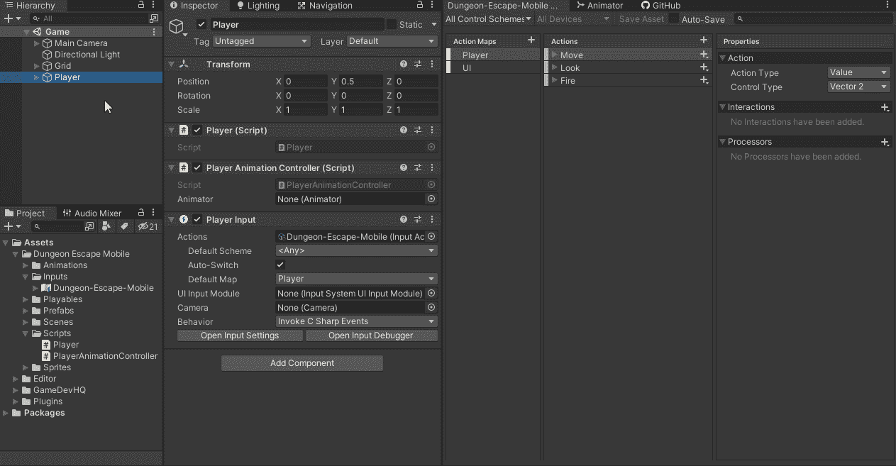
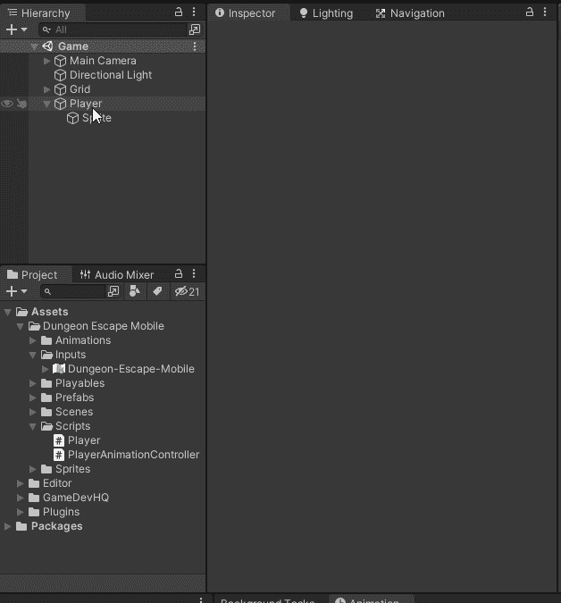
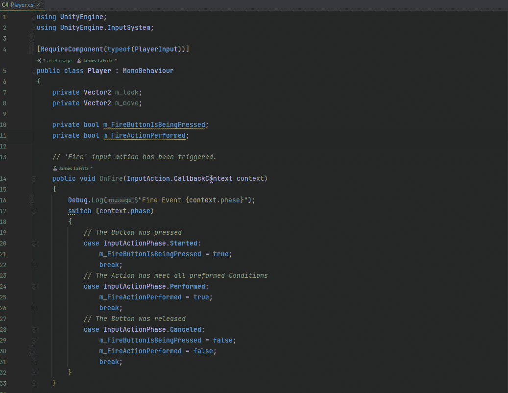
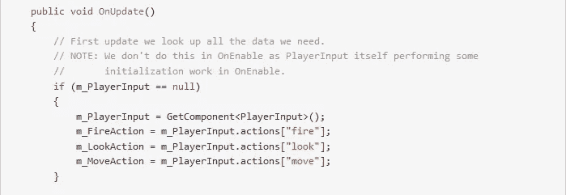
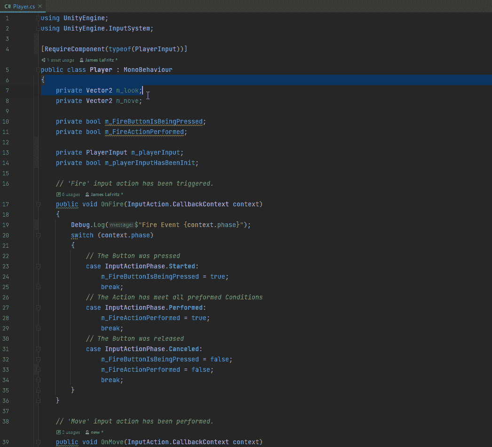
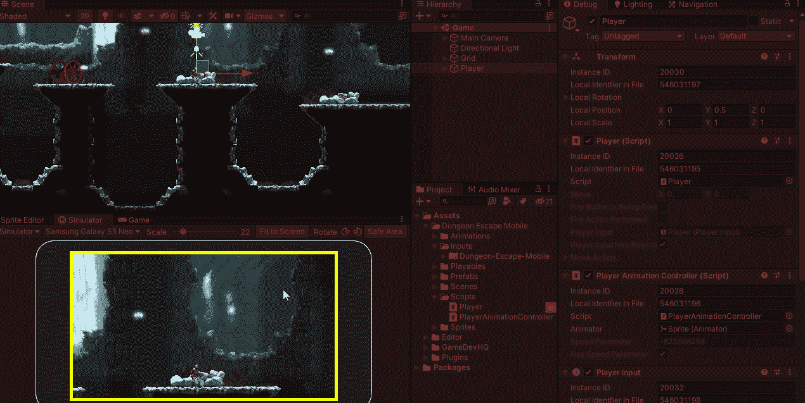
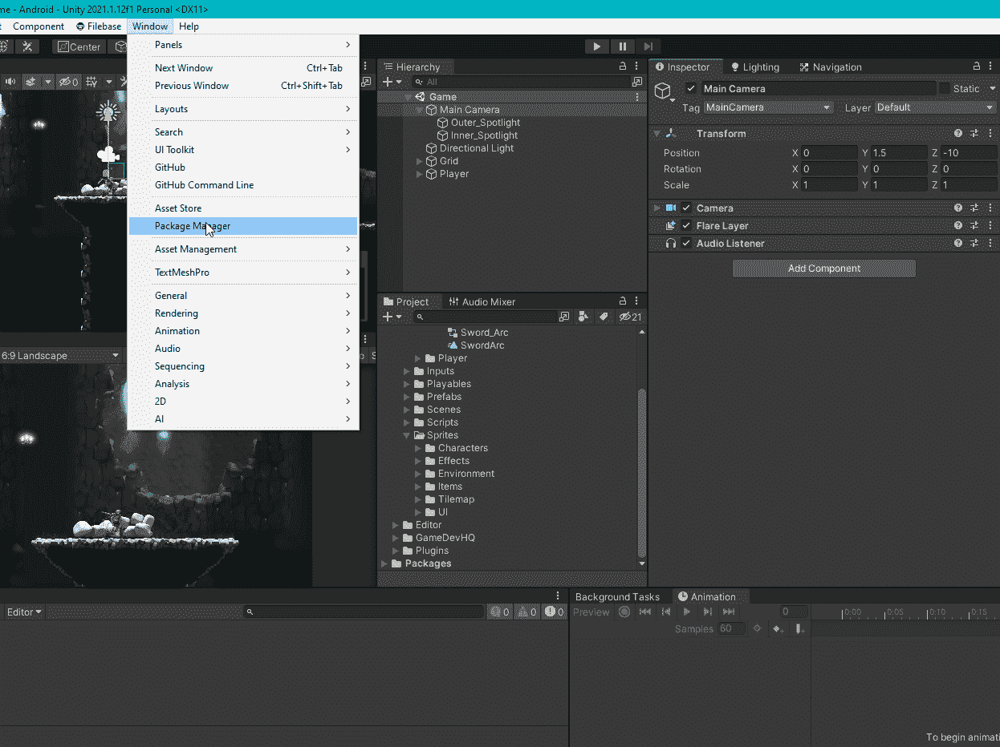

# Unity 新输入系统第 2 部分

> 原文：<https://blog.devgenius.io/unity-new-input-system-part-2-7cd53e04951d?source=collection_archive---------0----------------------->

## C#事件，响应 Unity 动作，改变动作地图上的动作

# 使用 C#事件

在播放器的播放器输入组件上，我将行为更改为 C 锐事件。

接下来，我添加了几个变量来跟踪玩家的输入。在 Start 方法中，我缓存了播放器输入组件。在 On Disabled 事件中，我确保取消订阅输入事件。我创建了 Init 播放器输入法并订阅了输入事件。在更新的方法中，如果玩家输入没有被初始化，我就初始化它。

请注意，我订阅了 Fire 操作的所有三个阶段，因为我的代码设置为处理 Unity 事件的所有三个阶段。还要注意，我对所有 3 个阶段都使用了相同的方法。

最初，我试图在启用状态下订阅输入事件，但这给了我一些错误，经过一些研究并阅读了 [**播放器输入文档**](https://docs.unity3d.com/Packages/com.unity.inputsystem@1.0/api/UnityEngine.InputSystem.PlayerInput.html) 后，我发现播放器输入本身在启用状态下执行一些初始化工作，这就是为什么我最终以上面的方式完成了它

# 响应统一行动

 [## 行动

### 相关页面:输入动作被设计成将输入的逻辑意义与物理输入方式分开…

docs.unity3d.com](https://docs.unity3d.com/Packages/com.unity.inputsystem@1.0/manual/Actions.html#responding-to-actions) 

我可以检查动作，而不是响应移动输入事件。为了做到这一点，我缓存了我想要的动作，然后我使用`[InputAction.ReadValue<>()](https://docs.unity3d.com/Packages/com.unity.inputsystem@1.0/api/UnityEngine.InputSystem.InputAction.html#UnityEngine_InputSystem_InputAction_ReadValue__1)` o 来表示值类型动作或`[InputAction.triggered](https://docs.unity3d.com/Packages/com.unity.inputsystem@1.0/api/UnityEngine.InputSystem.InputAction.html#UnityEngine_InputSystem_InputAction_triggered)`按钮类型动作。对于移动操作，这将是一个向量 2 类型，所以我将使用读取值。

我的游戏还是老样子。

# 更改动作地图上的动作

我将我的播放器切换到 Unity Events，只是为了观察输入动作的检测是如何工作的。然后我编辑了我的输入动作，删除了“看”动作，创建了一个跳跃动作。我可以通过添加另一个绑定为不同的控制器类型添加输入。我把绑定的路径编辑成我想要的控件。我可以有多个相同类型的控制，像游戏垫，并设置他们为特定的按钮，如果他们是一个特定的类型，即 Xbox 控制器或 PS4 控制器。完成更改后，我会保存输入资产，并检查附加到播放器的播放器输入中的事件。外观事件已消失，跳跃事件显示。

# 结论

新的输入系统加载了许多功能，并且易于实现。与传统输入系统相比，使用它需要做更多的工作，但是这些额外的工作用额外的特性来回报，这些特性使得做其他事情更容易，例如交互。除了使用玩家输入之外，还有其他方法可以访问动作和动作地图，也就是说，它们可以直接在您自己的脚本中设置。输入系统还附带了利用其他功能的其他行为/组件，即适用于多人游戏的玩家管理器和适用于触摸控制图形用户界面的两个屏幕(屏幕按钮和屏幕棒)。我建议查看一下示例，看看是如何实现的，因为它们有很多示例展示了输入系统的特定于案例的特性，即可视化和重新绑定 UI。

