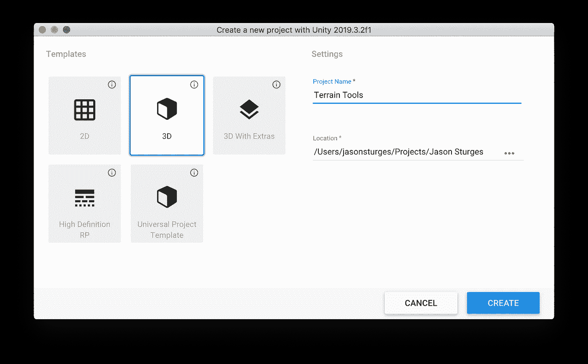
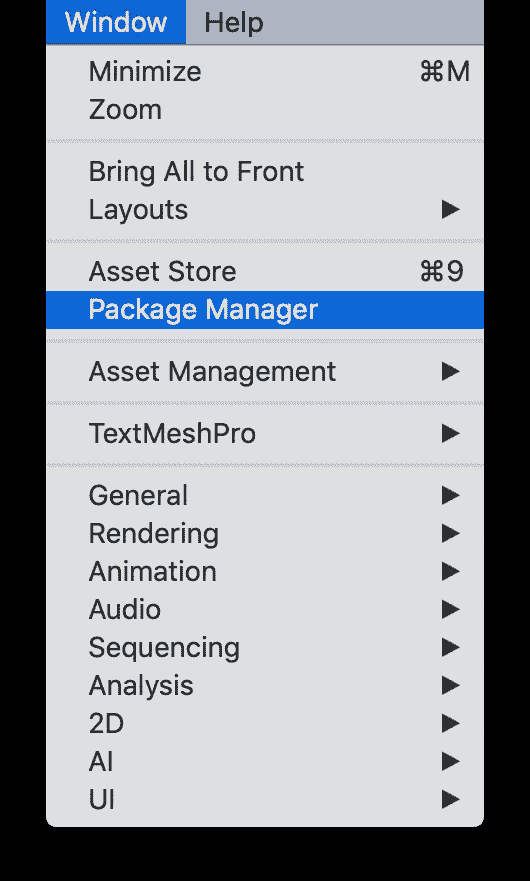
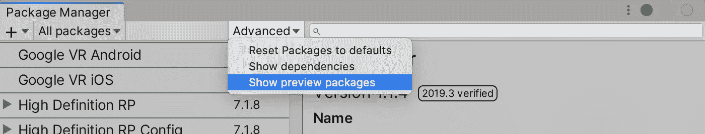
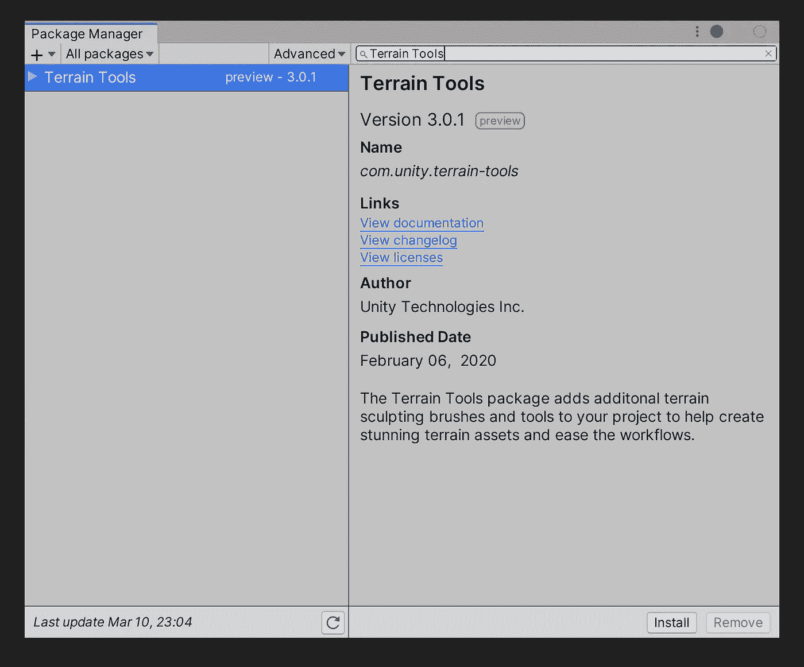
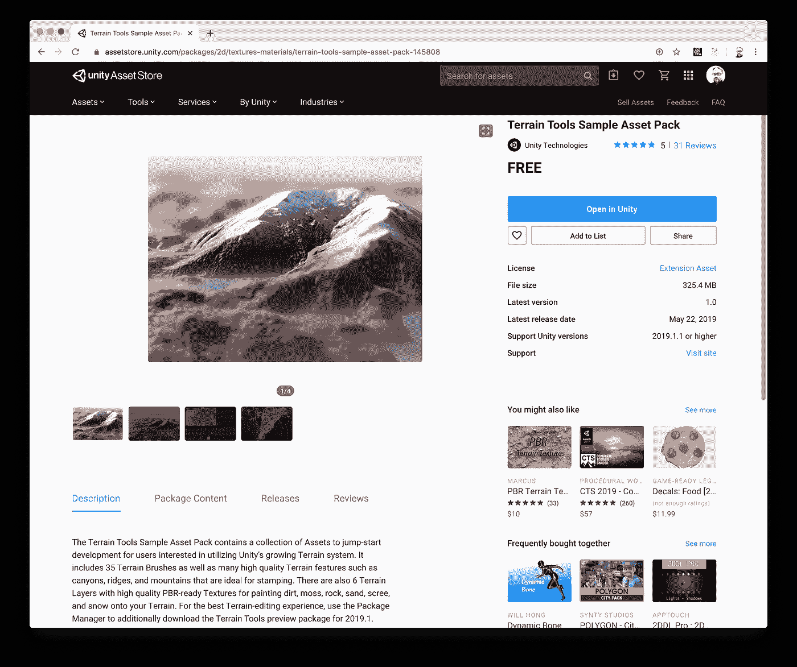
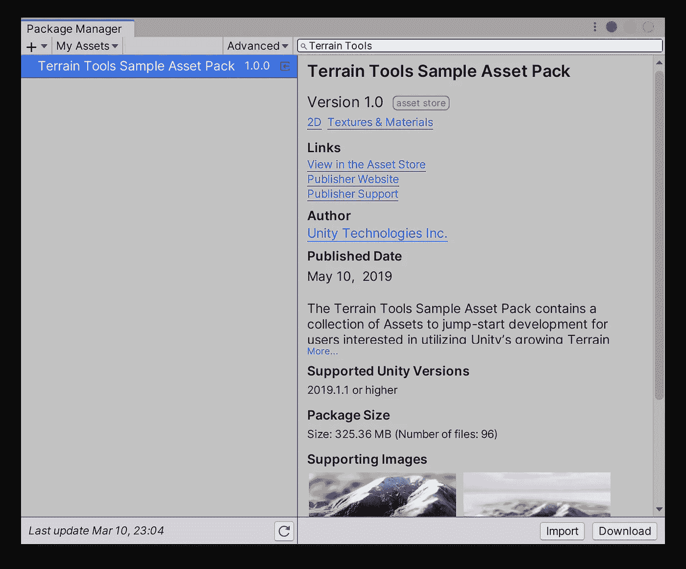
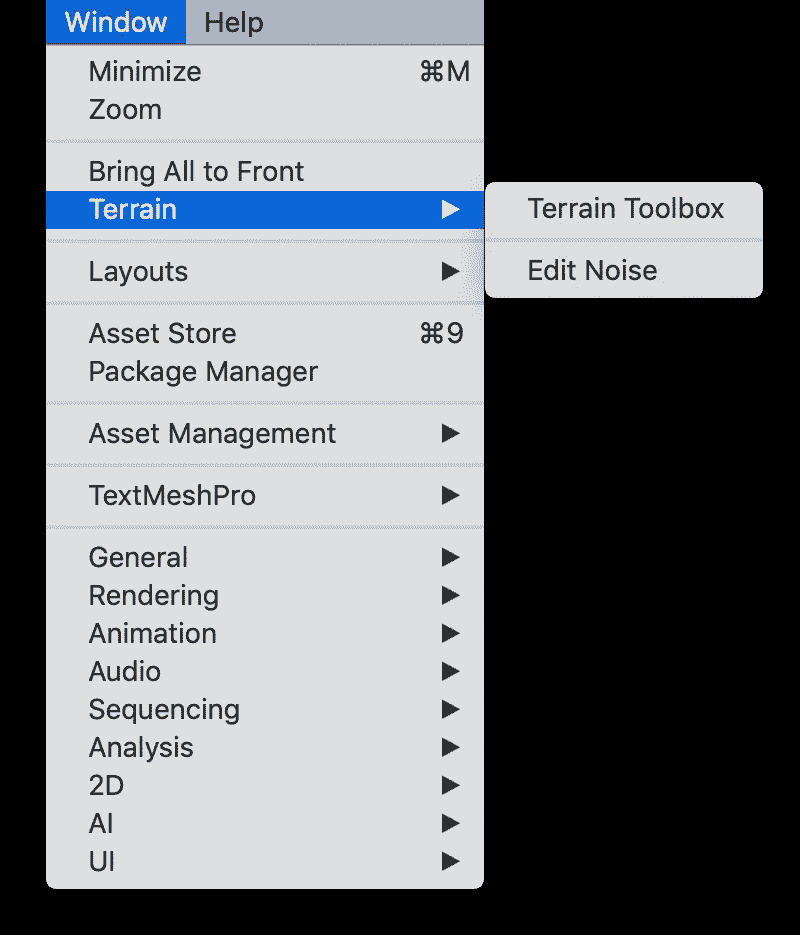
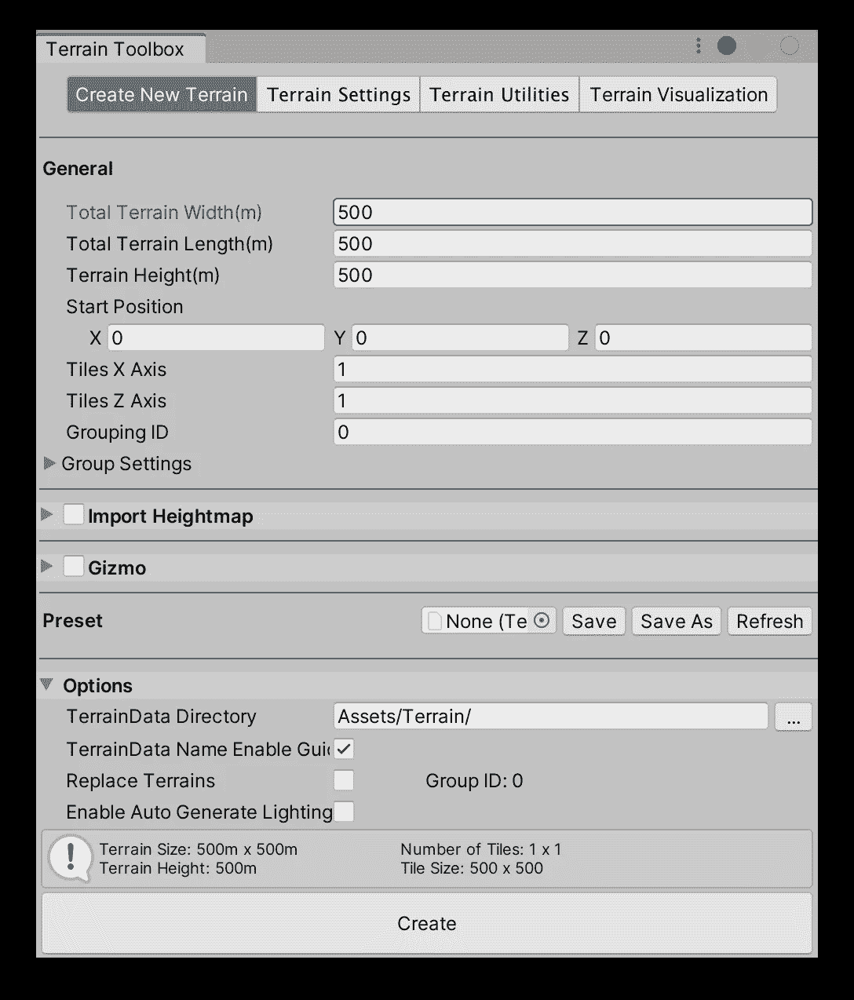
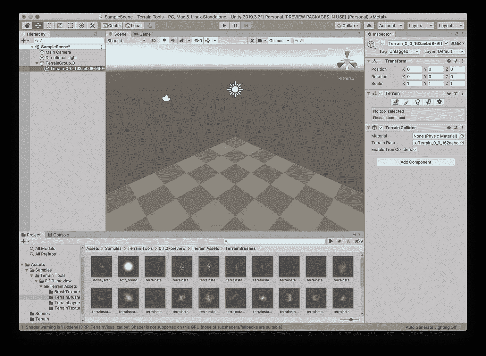
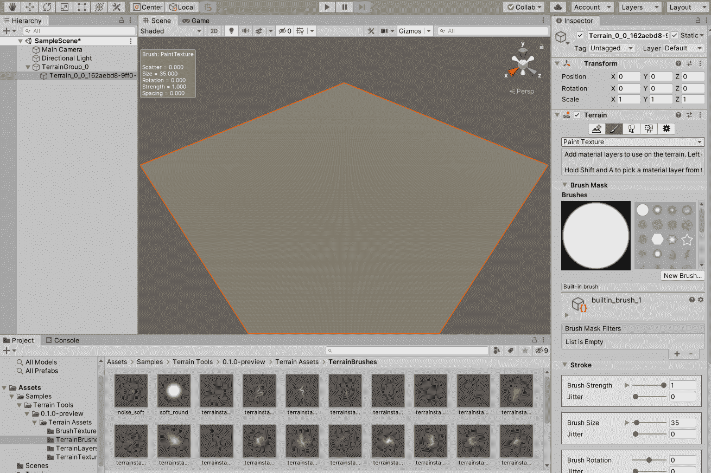

# Unity 地形工具

> 原文：<https://blog.devgenius.io/unity-terrain-tools-214da1cdbb4a?source=collection_archive---------6----------------------->

Unity 2019.1 提供了一个新的地形工具包，用于自动创建地形。

从 Unity Hub 在 Unity 3D 中创建新项目:

进入*窗口* *包管理器*，在 Unity 项目中安装地形工具包:

在*包管理器*窗口中，在*高级*菜单下选择*显示预览包*:

然后，搜索“地形工具”并按下*安装*:

考虑通过选择*添加到我的资产*从资产商店安装 Unity Technologies 免费赠送的 [*地形工具示例资产包*](https://assetstore.unity.com/packages/2d/textures-materials/terrain-tools-sample-asset-pack-145808) :

从*窗口* *包管理器*，从菜单中选择*我的资产*搜索地形工具，按*导入*:

现在回到 Unity，所有东西都安装好了，在*窗口*菜单下有一个新的*地形*选项。

选择*窗口* *地形* *地形工具箱*:

这将打开一个*地形工具箱*窗口——更改任何设置并按下*创建*:

地形已在 Unity 中创建:

从*层级*中，选择*地形组*下的地形，开始编辑地形。

*   在*检查员*下，在*地形*下
*   选择*绘制地形*
*   选择*升高或降低地形*
*   在*笔刷遮罩*下，选择一个笔刷
*   在*行程*下，设置*毛刷强度*和*毛刷尺寸*
*   在场景中，左键单击以提高标高；或者，*【控制】*左键点击降低标高

