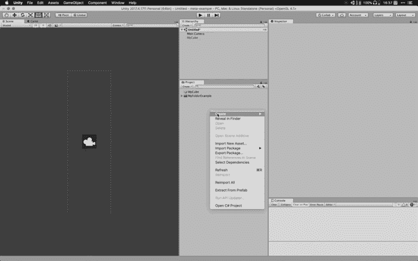

# Unity 提示:。元文件

> 原文：<https://blog.devgenius.io/unity-tips-meta-files-a26fb8f48e9d?source=collection_archive---------0----------------------->

你有没有在你的发展中听过这个词？meta？如果你做过，你真的知道它是关于什么的吗？如果你从未听说过它，或者你不知道它真正的意思，那么这篇文章将会帮助你！

> **。meta** 文件是将特定文件导入资产文件夹时的标识。的。元文件是标识。

然后。元就像我们在 Unity 项目中引用的文件的灵魂，它们在我们的浏览器或 finder 中是不可见的，是在我们导入或创建资产(例如:脚本、材质、3d 模型等)时由 Unity 生成的。

让我们更详细地看看在 Unity 中创建/导入文件时会发生什么。

## 创建资产

我在我的空项目中创建了一个文件夹，你可以在 Finder 中看到没有**。meta** 但是如果我们按“ *cmd +shift +”*我们会看到隐藏文件和**。meta** 现在可见。

*提示:显示隐藏文件:*

***Mac:****“cmd+shift+”*

***窗口:*** *转到查看工具栏，检查隐藏项目*

如果我们从项目外部导入一个文件到编辑器中，例如一个图像，Unity 将创建一个**。meta** 文件也是！让我们看看！

## 重要！

当你操作资产时，就像我对图像所做的那样，使用 Unity 编辑器，因为如果你只是将图像复制并粘贴到你的浏览器或 Finder 中。将不会创建元数据文件，并且可能会发生错误。

因此，如果你是艺术家、游戏设计师、动画师、开发人员或集成人员，请务必使用 UNITY 编辑器来操作资源。:)

# 的。元文件

让我们看看它看起来怎么样。

这就是**。我创建的文件夹中的元数据。Metas 将根据所表示的文件而变化，但是它们中的每一个都有最重要的值，那就是 **GUID。****

> GUID(或 UUID)是“全球唯一标识符”(或“通用唯一标识符”)的缩写。

这是 Unity 将用来创建文件之间的引用和依赖的 id。你有没有想过一个预置是如何维护一个脚本或者另一个游戏对象的引用的？这就是神奇之处！

# 连接文件

让我们看看 Unity 是如何在它们之间连接文件的。

首先，让我们在场景中创建一个立方体，并使其成为一个预设。

现在创建一个脚本。

现在让我们连接我们的脚本和预设(不要忘记应用预设的变化)

我们终于可以去我们的。预置文件并检查连接是否真的存在。怎么会？先去你的剧本**。meta** 文件并复制 GUID 值，然后打开。带有文本编辑器(可视代码、记事本等)的预置文件

在那里你可以找到联系！在 *.prefab.* 中搜索脚本 GUID

现在你知道了什么是. meta 文件，它在 Unity 中的作用是什么，你会更好地理解著名的 **Missing (Mono Script)** 。这是因为我们的游戏对象或预设引用了一个项目中不存在的 GUID。如果团队不小心，没有将它们提交到他们的存储库中，比如 Github、Gitlab、Bitbucket 等等，这种情况会经常发生。

缺失(单声道脚本)示例

# 摘要

元文件是必不可少的，它们在 Unity 开发中有着重要的作用。确保将它们提交到您的存储库中，不要和技术人员谈论这个，这样您可以避免将来的麻烦，现在您对 Unity 有了更多的了解！

如果你想看到一个使用元文件来检查对象之间的引用和依赖关系的工具，你可以在这里找到它:[引用浏览器](http://bit.ly/2E9DfoO)