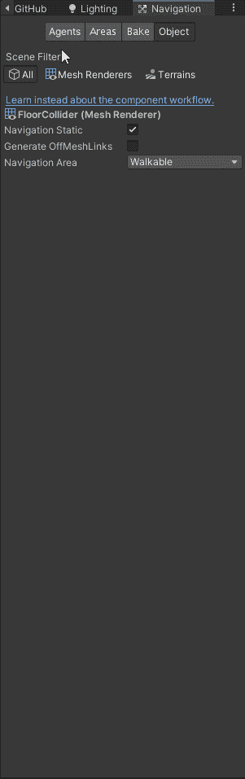
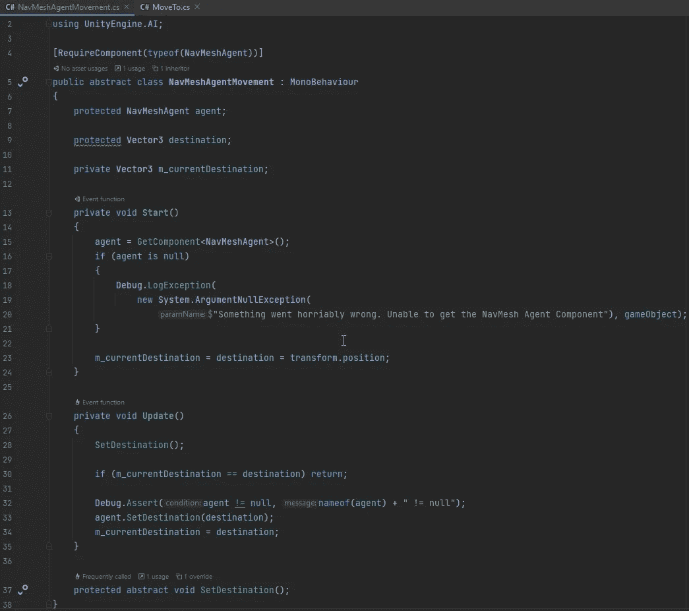

# Unity 的导航和寻路

> 原文：<https://blog.devgenius.io/unitys-navigation-and-pathfinding-f91f4335e5e5?source=collection_archive---------1----------------------->

## 使用导航网格和导航代理

[图片来自 Unity 中的 Unity 手动导航系统](https://docs.unity3d.com/2021.1/Documentation/Manual/nav-NavigationSystem.html)

场景设置好了，过场动画也完成了，现在是时候开始玩游戏了。为了实现我的角色四处走动，我需要一种方法来了解可以行走的区域，哪里有障碍，以及如何从一个地方移动到另一个地方。

我知道 Unity 提供了一个 [**导航和寻路**](https://docs.unity3d.com/2021.1/Documentation/Manual/Navigation.html) 系统，我可以用它来实现这个目的。

> 导航系统允许你使用从你的**场景**几何图形自动创建的导航网格来创建可以在游戏世界中智能移动的角色。动态障碍允许您在运行时改变角色的导航，而脱离网格链接允许您建立特定的动作，如开门或从壁架上跳下。本节详细介绍 Unity 的导航和寻路系统。

正如你所看到的，Unity 的内置导航包非常强大。对于这个游戏，我将不需要 [**脱离网格链接**](https://docs.unity3d.com/2021.1/Documentation/Manual/nav-CreateOffMeshLink.html) ，或者 [**导航网格障碍**](https://docs.unity3d.com/2021.1/Documentation/Manual/nav-CreateNavMeshObstacle.html) 。我需要一个 [**导航网**](https://docs.unity3d.com/2021.1/Documentation/Manual/nav-BuildingNavMesh.html) 和一个 [**导航网代理**](https://docs.unity3d.com/2021.1/Documentation/Manual/nav-CreateNavMeshAgent.html) 因为这些都是使用导航系统必不可少的组件。

# 导航网格

由[定义**统一手册**定义](https://docs.unity3d.com/2021.1/Documentation/Manual/nav-NavigationSystem.html)

> **NavMesh** (导航网格的缩写)是一种数据结构，描述了游戏世界的可行走表面，并允许在游戏世界中找到从一个可行走位置到另一个位置的路径。数据结构是从级别几何体自动构建或烘焙的。

我需要为我的游戏构建一个 **NavMesh** ，可以分 4 步完成:

1.  **选择**会影响导航的场景几何图形——可行走的表面和障碍物。
2.  **选中导航静态**打开，将选定的对象包含在 NavMesh 烘焙过程中。
3.  **调整**烘焙设置来匹配你的代理大小。
4.  **点击烘焙**构建 NavMesh。

如果我有一个更复杂的场景，比如在运行时修改的场景，我可能会考虑使用来自 [**NavMesh 构建组件**](https://docs.unity3d.com/Manual/NavMesh-BuildingComponents.html) **的 [**NavMesh 曲面**。](https://docs.unity3d.com/Manual/class-NavMeshSurface.html)**

## **选择**会影响导航的场景几何图形。

对于几何图形，我有一个地板碰撞器来代表游戏中可以行走的地板。

## 检查导航静态

我需要修改导航窗口对象选项卡中的设置。要到达那里，进入窗口->人工智能->导航。然后单击对象选项卡。

确保地板碰撞器在我的场景中仍然被选中，我在导航窗口的对象标签上单击导航静态复选框，然后我可以设置使用什么类型的 [**区域**](https://docs.unity3d.com/2021.1/Documentation/Manual/nav-AreasAndCosts.html) 当然这是可行走区域。

我也可以在 inspector 选项卡中完成此操作，而不用打开导航窗口，只需使用 inspector 并将此对象标记为静态导航即可。

我也去了，并确保所有的环境预设都被标记为不可行走，以确保这些在 **NavMesh** 中得到考虑。

## **调整**烘焙设置

接下来，我去烘焙标签，并确保设置是正确的。我将使用默认设置，如果这些对我来说不太好，我会回来调整这些设置，并重新烘焙 **NavMesh** 后者。

## **点击烘焙**来构建导航网格

现在我所要做的就是点击烘焙来构建我的 **NavMesh。**

只要我选择了导航窗口，它就会在场景中显示我的导航网格。场景中可行走的区域将是蓝色的。

# 导航代理

现在我有了一个 NavMesh，我需要一个可以用来在场景中导航的角色。为了在场景中导航，我的角色需要一个 **NavMesh 代理**。

由[定义**统一手册**定义](https://docs.unity3d.com/2021.1/Documentation/Manual/nav-NavigationSystem.html)

> **NavMesh Agent** 组件帮助你创建人物，这些人物在朝着各自的目标前进的同时相互躲避。代理使用 NavMesh 推理游戏世界，他们知道如何避免彼此以及移动障碍物。

这就像将 **NavMesh 代理组件**添加到**游戏对象**一样简单。

NavMesh 代理有各种各样的 [**设置**](https://docs.unity3d.com/2021.1/Documentation/Manual/class-NavMeshAgent.html) 可以更改，但我认为默认设置会对我有用。

## 与其他组件一起使用

当将此组件与修改**游戏对象**的位置和旋转的其他组件组合时，也需要进行一些考虑。如果动画有根运动，两个主要组件是 **Unity 物理系统**和**动画系统**。参见 [**将 NavMesh 代理与其他组件一起使用**](https://docs.unity3d.com/2021.1/Documentation/Manual/nav-MixingComponents.html) 了解注意事项的完整列表。

使用**刚体**时，确保打开运动学。

使用**动画**时，您可以使用 **NavMeshAgent.velocity** 作为动画制作人的输入，并关闭动画的根部运动，或者您可以通过禁用 **NavMesh 代理**上的更新位置和更新旋转来使代理跟随动画。然后使用根位置来计算位置的差异。详见[耦合动画和导航](https://docs.unity3d.com/2021.1/Documentation/Manual/nav-CouplingAnimationAndNavigation.html)。

# 把它放在一起

首先，我需要为代理提供一条路径。路径由**导航网格**上的起始位置和目的地组成。起点将是**导航员**的位置，终点是我希望**导航员**移动到的点。一旦我有了这两样东西，Unity 就会计算出它需要的路径。要找到统一的路径，请使用一种称为 A* "A star "的算法，这是一种图形搜索算法，通常在游戏中用于找到目的地。有关 A*和其他搜索算法的更多信息，请参见[http://theory . Stanford . edu/~ amitp/game programming/astar comparison . html](http://theory.stanford.edu/~amitp/GameProgramming/AStarComparison.html)或更新版本的互动图表[https://www . redblobgames . com/path finding/A-star/introduction . html](https://www.redblobgames.com/pathfinding/a-star/introduction.html)

因此，现在我需要做的就是为 NavMesh 代理提供一个移动到的目的地。 [**Unity 文档**](https://docs.unity3d.com/2021.1/Documentation/Manual/nav-HowTos.html) 提供了几个关于如何做这件事的例子 [**告诉一个 NavMeshAgent 移动到一个目的地**](https://docs.unity3d.com/2021.1/Documentation/Manual/nav-MoveToDestination.html) 、[、**移动一个 Agent 到一个被鼠标点击的位置**、](https://docs.unity3d.com/2021.1/Documentation/Manual/nav-MoveToClickPoint.html)、 [**让一个 Agent 在一组点**](https://docs.unity3d.com/2021.1/Documentation/Manual/nav-AgentPatrol.html) 之间巡视。

## 向目标前进

在本文中，我将使用 [**告诉 NavMeshAgent 移动到目的地**](https://docs.unity3d.com/2021.1/Documentation/Manual/nav-MoveToDestination.html) ，因为这是移动 **NavMesh Agent** 的最基本和最简单的方法。

统一引擎。AI 需要进入 Unity 的导航系统。NavMesh 代理是必需的。

我需要一个转换来设置目的地。(可在检查器中设置)

确定有目标，有代理人。

将目的地设置为目标位置。

球员向球形球门移动

导航窗口打开时。

只是它选择的最佳路径移动到了守卫后面，这不是故意的，现在有一组代码让它避开守卫。

**NavMesh 代理移动**

现在我有了一个工作的运动，我将创建一个抽象类，我可以用它来使未来的类，如点击移动和在路点之间移动，在未来更容易实现。

我使代理受到保护，以防我需要访问子类中的代理属性。

我有一个 Vector3，子类也可以用它来设置期望的目的地。

我有一个私人的矢量，所以我可以跟踪目的地的变化。

在 Start 方法中，我得到了 NavMesh 代理。如果代理由于某种原因为空，我会记录一条异常消息，指出有些地方不对劲。

然后，我将目标和当前目标设置为转换位置。

在更新方法 a 中调用抽象方法来设置目的地。我检查目的地是否改变了，如果没有，我退出这个方法。如果目的地改变了，那么我将当前目的地和代理目的地设置为目的地

然后，我将 Move To Behavior 更改为使用新的抽象类。

测试以确保移动到仍能正常工作。

现在，当我移动目标时，代理将继续移动到新的目的地。

