# 为电子商务系统创建高效卡珊德拉 NoSQL 数据模型的 6 个实用步骤

> 原文：<https://blog.devgenius.io/unleash-the-power-of-nosql-cassandra-with-query-first-data-modeling-97f1e53e8d1d?source=collection_archive---------4----------------------->

## 神奇的 Cassandra“查询优先”数据建模分步指南


伦纳德·冯·比布拉在 [Unsplash](https://unsplash.com/?utm_source=unsplash&utm_medium=referral&utm_content=creditCopyText) 上的照片

Cassandra 是一个流行的 NoSQL 数据库，以其高性能而闻名。它是实现处理高交易量和快速响应时间需求的电子商务系统的良好候选。

CQL 的设计对于开发人员来说是一个巨大的优势，可以在没有陡峭的学习曲线的情况下使用 Cassandra。不幸的是，许多开发团队由于错误地将关系数据模型应用于 Cassandra 而遭受系统性能差和其他问题的困扰。

许多人对 Cassandra 的用法有误解，他们对 Cassandra 的数据建模就像它是一个关系数据库一样，只是因为 Cassandra 查询语言(CQL)看起来像传统的 SQL。

事实是，Cassandra 不是一个关系数据库，它是一个分布式 NoSQL 数据库，其中一个表的数据分散地驻留在多个数据库节点上。Cassandra 的数据模式设计基于“查询优先”的概念，这与传统的实体数据建模完全不同。因此，规范化和关系数据库的概念可能不适用于 Cassandra。

在本文中，我将逐步演示如何为在线超市系统设计 Cassandra 数据模型。设计过程的灵感来自卡珊德拉[官方文件](https://cassandra.apache.org/doc/latest/cassandra/data_modeling/intro.html)的有益指导。

# 分区键和簇键的概念

如果您不熟悉这个 NoSQL 数据库，本节提供了一个关于 Cassandra 主键的快速概念。Cassandra 是一个分布式数据库，它将数据表分割成分区，并存储在多个节点上。

数据分区基于数据表上定义的分区键。为了说明这个概念，下图显示了一个以客户 id 作为分区键的客户订单表。您可以看到，该表根据客户 id 被分割成多个分区，并分布在不同的节点上。

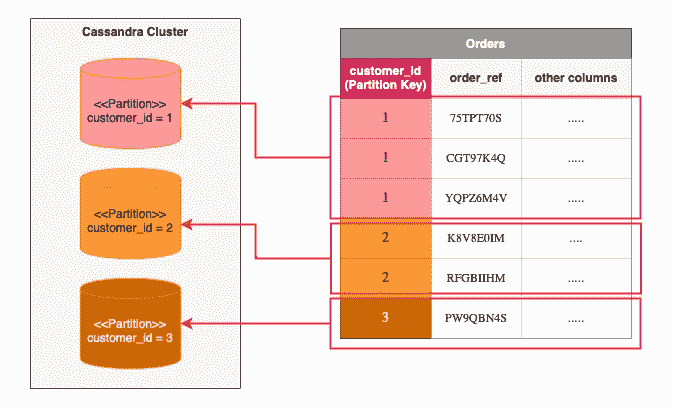

卡珊德拉分区键

除了分区键之外，如果分区键不是唯一标识符，则簇键标识同一分区内的唯一记录。聚簇键指定分区内记录的自然顺序，它可以是查询中 WHERE 子句的一部分。

下面的示例显示了一个客户订单表，其中交货日期列作为聚类键。分区中的记录按交付日期降序排序。

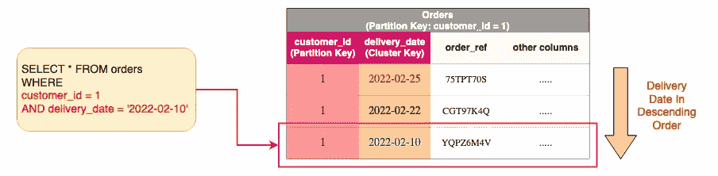

Cassandra 群集密钥

客户订单表的表定义将客户 id 和交货日期分别定义为分区键和集群键。分区键+集群键构成主键，因此，客户 id +交付日期是复合唯一键。这个简单的例子说明了一个假设，即客户不能有一个以上的订单有相同的交货日期。

Cassandra 的表定义类似于 SQL 定义:

```
CREATE TABLE IF NOT EXISTS demo.orders (
  customer_id int,
  delivery_date date,
  order_ref text,
  status text,
  total_amount double,
  delivery_address text,
  PRIMARY KEY (customer_id, delivery_date)
)
WITH CLUSTERING ORDER BY (delivery_date DESC);
```

参考[这篇文章](/the-essential-concepts-of-high-speed-distributed-database-cassandra-b87267d5f83e)，它通过实际动手练习详细阐述了这个概念。

# 示例应用程序—网上超市

让我们来研究在线超市系统的数据建模。首先，我们有一个用例图，它提供了系统功能的概述。

客户之旅从维护包括交付地址在内的配置文件开始。然后，浏览产品并将产品添加到购物篮中。为了确认订单，客户需要预订一个可用的时间段，然后提交订单。

另一方面，交付团队通过根据团队的可用性生成新的时隙来计划即将到来的交付时间表。系统为交付团队提供了按交付日期检查即将确认的订单的功能。

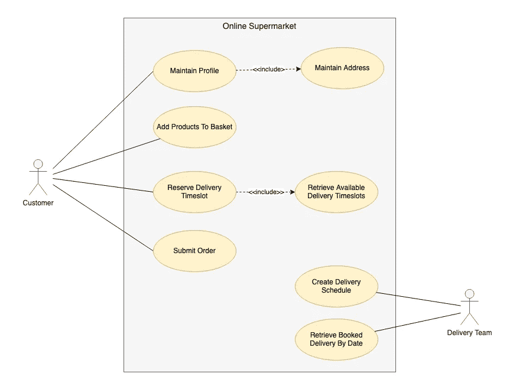

用例图

产品搜索没有显示在用例图中，因为它由另一个 NoSQL 数据库 Elasticsearch 支持。在本文中，我们主要关注使用 Cassnadra 实现的功能。

# Cassandra 数据建模过程

数据建模从应用程序查询和概念数据建模开始。应用程序查询提供了关于数据表分区的提示，而概念数据模型为我们提供了高级数据实体的概述。然后，逻辑数据建模生成一个数据表列表，其中包含分配分区键和集群键。接下来，物理数据建模定义了字段数据类型。在创建表模式之前，分区优化会估计分区大小，并在必要时微调分区键。

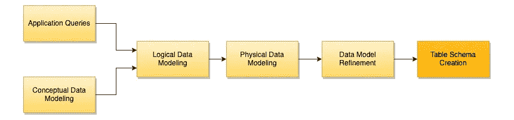

Cassandra 数据建模流程

# 步骤 1 —概念数据建模

我们采用自顶向下的方法来设计数据模型。下面的概念域模型提供了列出实体及其关系的起点。

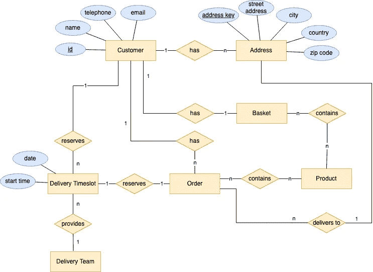

概念数据模型

对于在线超市的用例，我们有拥有多个地址的客户。顾客一次只能拿一个篮子来装一系列选定的产品。

作为订单提交流程的一部分，客户需要预留可用的交付时间段。一旦订单成功提交，预留时隙将与订单相关联，以便安排交付。

由于客户可以在订单提交过程中在付款前退出，如果订单提交未完成，时隙预留将过期。

交付时间段由交付团队根据可用人力定期创建。

# 步骤 2 —应用程序查询

定义应用程序查询列表是 Cassandra 数据建模的关键步骤。与关系数据库不同，为了获得高性能，Cassandra 上的查询基于分区键和簇键进行了优化。因此，Cassandra 的数据建模是“查询优先”，数据表定义来自应用程序查询，然后将其他必需的数据字段添加到表中。

应用程序查询意味着数据查找操作，而不考虑其他数据操作，如插入/更新。从上面的用例图中，我们可以看到客户资料维护和客户订单提交的工作流程。

下图展示了从上面的用例图中派生出来的查询列表。查询序列分别代表客户和交付团队的工作流。

## **客户的使用案例**

客户档案维护涉及 2 个查询:

*   Q1 —查找客户资料
*   Q2 —检索客户地址

另一方面，订单提交的工作流由以下查询组成:

*   Q3 —查看购物篮
*   Q4 —按交付日期获取时隙
*   Q5 —查看已提交订单的列表

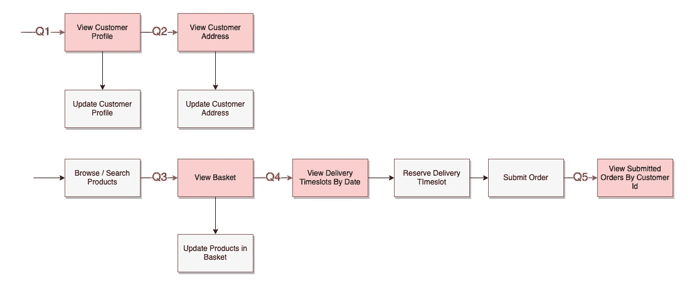

客户使用案例的应用程序查询

## **交付团队的用例**

交付团队安排订单交付。日常运营包括:

*   Q6 —按交付日期查看订单
*   Q8 —检查订单的交货地址

计划交付时间表(灰色方框)不是一个查询，它将插入生成新的可用时隙的记录，作为交付团队资源计划的一部分

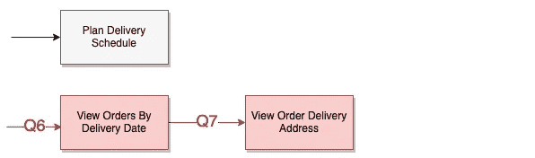

交付团队用例的应用查询

# 步骤 3 —逻辑数据建模

逻辑数据建模的结果是带有分区键和簇键的表定义。这个过程的输入是应用程序查询列表和概念数据模型。

经验法则是根据查询条件分配分区键，如果分区键本身不能唯一地标识一条记录，则分配簇键。

## 客户概况

对客户档案的查询是非常典型的，它们只是为了显示客户档案和地址列表。

**Q1 —查看客户资料**

看看客户档案的查询。记录查找基于唯一的客户 id，该 id 是在该查询之前由认证过程给出的。

因为记录是通过客户 id 检索的，所以毫无疑问，它是下面的客户表中分区键的一个很好的候选。不需要群集键，因为客户 id 已经是唯一标识符。

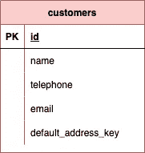

客户表

**Q2 —查看客户地址**

下一个查询是**查看客户地址。**我们有一个单独的表格“customer_addresses ”,其中保存了所有客户的地址。由于客户可能有多个地址，客户 id 本身不能作为唯一标识符。因此，我们需要在这里分配一个集群键。

address key 列是一个很好的集群键选择，因为它可以帮助我们找到同一客户的准确地址记录。当客户维护新的地址条目时，必须为其地址提供一个名称。地址关键字是客户为新地址设置分配的字符串，如“家庭”、“办公室”等

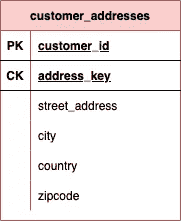

客户地址表

为什么“地址键”应该是簇键而不是分区键？

假设地址键是一个分区键，那么地址键将成为一个强制查询条件，因为 Cassandra 要求所有分区键都是查询 WHERE 子句的一部分。这意味着 Cassandra 不允许我们通过客户 id 检索地址列表。

相比之下，在 Cassandra 查询中，集群键是可选的。它与分区键一起形成一个复合的唯一标识符。

## 订单提交

订单提交的应用查询包括查看购物篮、按日期获取交货时间段以及对已提交订单的查询。

**Q3 —查看购物篮**

每个客户只有一个购物篮，其中包含所选产品和数量的列表。将购物车存储到 Cassandra 中为客户提供了良好的用户体验，让他们可以继续购物，而不用担心登录会话到期或连接断开。 **basket_by_customer** 表设计简单，使用产品列表和客户 id 作为分区键。

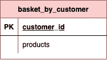

按客户列出的购物篮表

**Q4 —按日期查看交付时隙**

为了预约送货时段，系统首先检索并显示所有时段供客户选择。**delivery _ slots**表支持以交付日期为分区关键字的查询。由于一天中有多个时隙，并且不止一个交付团队支持装运时隙，所以开始时间和交付团队 id 是群集键，以便可以通过交付日期+开始时间+交付团队 id 来唯一地标识时隙记录。

当客户为订单提交预留时间段时，客户 id 和到期时间被设置到时间段记录中。如果客户最终没有在预订到期前完成订单提交，该时间段将自动释放。

一旦订单成功提交，确认栏(一个布尔标志)将被设置，以表明该时间段已被确认。

期望应用逻辑显示原始计划时隙和可用性的列表。如果确认为假，则时隙可用，如果预留的到期时间有值，则预留的到期时间是过去的时间。

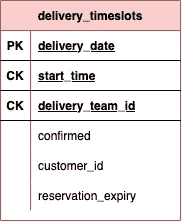

交付时隙表

**Q5 —查看客户提交的订单**

客户 id 应该是按客户 id 查询的分区键。由于一个客户可能有多个订单，我们使用 order id 作为集群键，以便唯一地定位一个订单记录。

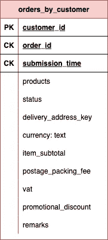

按客户列出的订单表

事实上，订单 id 是唯一的键。对于关系数据库，我们可以定义一个名为 **orders** 的表，用 order id 作为唯一的主键。因此，Cassandra 数据建模的“查询优先”方法使它不同于关系数据库设计。

此外，在 Cassandra 中只能对集群键进行排序。因此，提交时间是一个群集键，不是作为唯一标识符，而是用于记录排序。使用群集键设置，数据表按提交时间排序，以显示最近提交的订单。

## 订单交付

在日常操作中，交付团队首先按日期检查订单列表，然后检索订单详细信息和交付地址。

**Q6 —按交付日期查看订单**

为 Q4 创建的数据表 **orders_by_customer** 不适用于此查询，因为查询条件是基于交货日期而不是客户 id。我们需要另一个表 **orders_by_delivery_date** ，其分区键被分配给交付日期和交付团队 id。此外，start time 是构成唯一键的簇键，并按升序对表记录进行排序。

尽管数据复制违反了关系世界中的数据建模，但是从性能的角度来看，在 NoSQL 世界中这是绝对没有问题的。所以，不要因为这样做而感到愧疚。

由于目标受众是交付团队，**orders _ by _ delivery _ date**中的订单记录可能不是 **orders_by_customer** 中数据的精确副本。某些数据字段(如增值税、项目小计和促销折扣)不包括在 order_by_delivery_date 中，因为它们与交货无关。

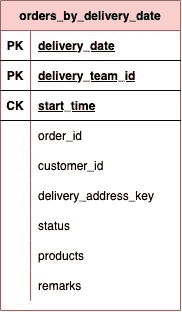

按交货日期排列的订单表

**Q7 —查看订单交付地址**

利用客户 id 和来自 **order_by_delivery_date** 的交货地址关键字，我们可以在 **customer_addresses** 表中唯一地定位一个地址记录。

## 把所有东西放在一起

有 6 个表支持应用程序查询列表:

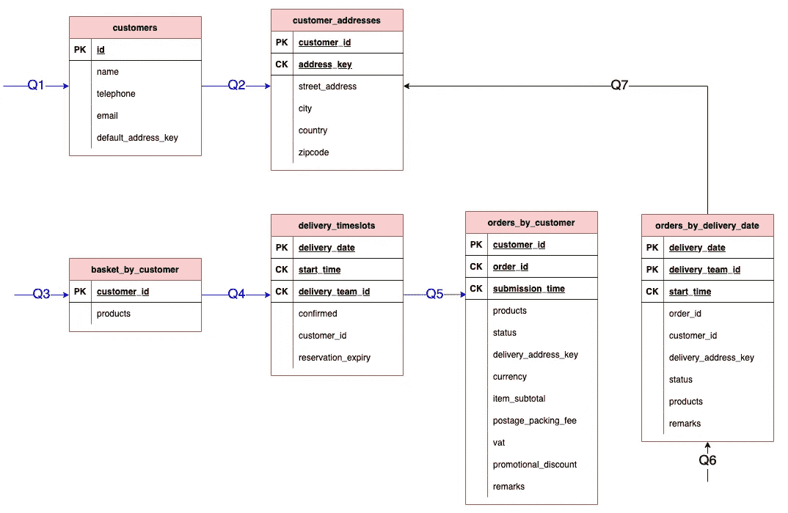

逻辑数据模型

# 步骤 4 —物理数据建模

物理数据建模只是向逻辑数据模型中的每一项添加数据类型。Cassandra 支持最常见的数据类型，如 uuid、字符串、整数、小数、日期/时间。关于[的原生数据类型列表](https://cassandra.apache.org/doc/latest/cassandra/cql/types.html)，请参考官方文档。

**客户**下表向您展示了一个简单的例子。大多数字段都是字符串类型，所以我们指定数据类型为**文本**。UUID 是一种有用的数据类型，可以确保客户 ID 的唯一标识符。

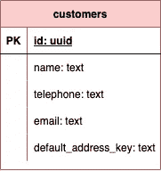

客户表

## 用户定义的数据类型

除了这些内置的数据类型，Cassandra 还支持设置自定义数据类型。这是一个令人难以置信的特性，它促进了公共数据定义的重用。地址是一个常见的例子。

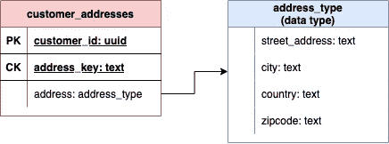

客户地址表

## 数据收集

对数据收集的支持是我最喜欢的特性之一。如果您已经编写了一段时间的代码，那么像 Map、Set 和 List 这样的集合可能对您来说很熟悉。例如，所选产品和购物篮中的数量可以存储在地图中。项目关键字是产品 id，而条目值是数量。

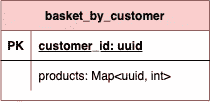

按客户列出的购物篮表

## 表格分组

Cassandra 中的 Keyspaces 类似于关系世界中的数据库。键空间规定了跨数据中心的数据表的复制。为了分离关注点，与客户和订单相关的表被分别分组到**客户**键空间和**订单 _ 交付**键空间。

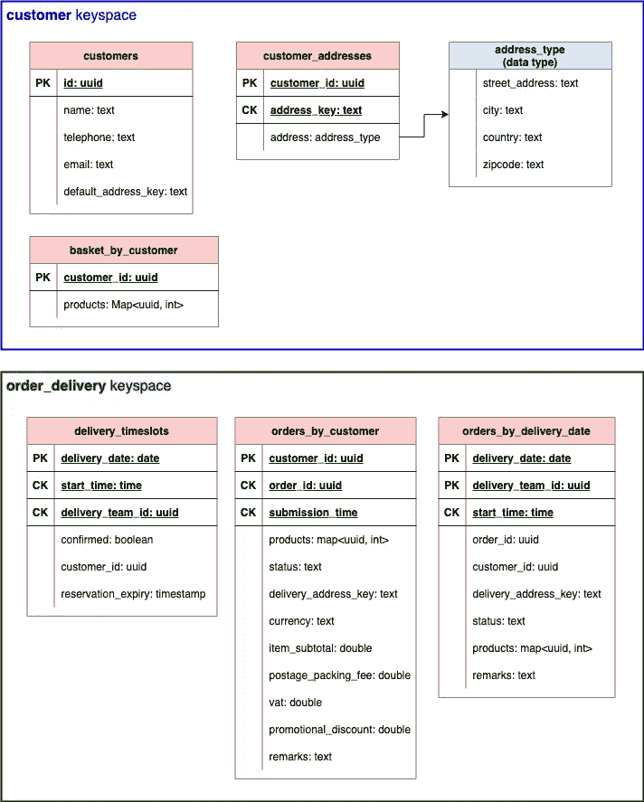

具有数据类型的逻辑数据模型

# 步骤 6 —分区优化

不要急于创建表模式。花点时间检查一下表的设计，以确保设计对于生产数据量是可持续的。

这个过程主要关注分区大小。需要注意的是，Cassandra 对分区有一个硬限制，即每个分区 20 亿个单元。由于单元数量即将达到极限，系统性能可能会受到影响。

每个分区 20 亿个单元的硬性限制是根据单元数量而不是数据大小计算的。每条记录的单元格数是总列数减去主键数(分区键和簇键)。让我们看看 **orders_by_customer** ，它采用了宽分区设计:

*   总列数:12
*   主键的数量(分区键和簇键):2
*   每条记录的单元格数量:12–2 = 10

该表按客户 id 进行分区。如果一个客户每月提交 100 万(虽然可能性很小)，那么 17 年后细胞数将达到极限。

## 分区分裂

生产的实际数量多少是不可预测的。如果由于订单量激增而导致分区达到硬限制，该怎么办？有 3 种方法可以分解大型分区:

*   选项 1 —分成两个数据表
*   选项 2 —分配一个额外的列作为分区键
*   选项 3 —分桶

## 选项 1 —分成两个数据表

想法是将一些列迁移到另一个表中。例如，我们将所有金额字段移动到订单 id 作为唯一键的 **order_amount** 表中。然后， **orders_by_customer** 表的每条记录的单元格数从 10 减少到 5。但是，应用程序需要执行一个额外的查询来检索订单记录的每次检索的金额字段。

如果原始分区非常大，这是分解分区的有效方法，但是，这样的表修补可能需要花费时间和精力来实现。


选项 1 —表格拆分

## 选项 2 —分配一个额外的列作为分区键

在不拆分整个表的情况下，该选项指示 Cassandra 通过添加一列作为分区键来将分区拆分成小分区。例如，我们将订单状态字段指定为分区键。应该修改查询标准以包括状态字段。需要修改系统功能，以便客户指定订单状态，以便检索订单记录。

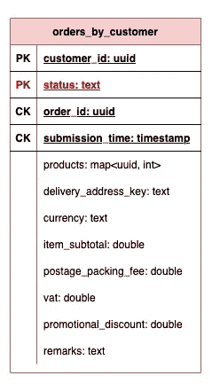

选项 2 —添加新的分区密钥

## 选项 3 —分桶

此选项类似于选项 2，但它使用现有字段的部分副本。下面的示例添加了提交时间戳的月份作为分区键。通过这样做，原来的分区被分成 12 个桶。同样，需要修改系统功能，因为提交月份应该被指定为查询的一部分。

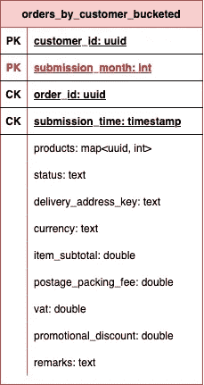

选项 3 —添加现有字段的部分副本作为分区键

# 第 6 步—表模式

最后，是时候创建表定义了。这个过程是将数据模型转换成表创建脚本。

Cassandra 表创建的语法类似于 SQL。区别在于主键的定义。下面是语法:

```
CREATE TABLE IF NOT EXISTS <keyspace name>.<table name> (
  <field name> <data type>,
  …
  …
  PRIMARY KEY ((<partition key 1>, <partition key 2>...), <cluster key 1>, <cluster key 2>,...)
)
WITH CLUSTERING ORDER BY (<cluster field name> ASC | DESC);
```

## 密钥空间—单节点集群

```
CREATE KEYSPACE IF NOT EXISTS customer
WITH REPLICATION = { 
  'class' : 'NetworkTopologyStrategy’, 
  ‘datacenter1: '1' 
};CREATE KEYSPACE IF NOT EXISTS order_delivery
WITH REPLICATION = { 
  'class' : 'NetworkTopologyStrategy’, 
  ‘datacenter1: '1' 
};
```

## 客户

```
CREATE TABLE IF NOT EXISTS customer.customers (
  id uuid,
  name text,
  telephone text,
  email text,
  default_address_key text,
  PRIMARY KEY (id)
);
```

## 客户地址

```
CREATE TYPE customer.address_type (
  street_name text,
  city text,
  country text,
  zipcode text
);CREATE TABLE IF NOT EXISTS customer.customer_addresses (
  customer_id uuid,
  address_key text,
  address address_type,
  PRIMARY KEY (customer_id, address_key)
);
```

## 顾客购物篮

```
CREATE TABLE IF NOT EXISTS customer.basket_by_customer (
  customer_id uuid,
  products map<uuid, int>,
  PRIMARY KEY (customer_id)
);
```

## 交付时隙

```
CREATE TABLE IF NOT EXISTS order_delivery.delivery_timeslots (
  delivery_date date,
  start_time time,
  delivery_team_id uuid,
  confirmed boolean,
  customer_id uuid,
  reservation_expiry timestamp,
  PRIMARY KEY (delivery_date, start_time, delivery_team_id)
);
```

## 客户订单

```
CREATE TABLE IF NOT EXISTS order_delivery.orders_by_customer (
  customer_id uuid,
  order_id uuid,
  submission_time timestamp,
  products map<uuid, int>,
  status text,
  delivery_address_key text,
  currency text,
  item_subtotal double,
  postage_packing_fee double
  vat double,
  promotional_discount double,
  remarks text,
  PRIMARY KEY (customer_id, order_id, submission_time)
)
WITH CLUSTERING ORDER BY (order_id ASC, submission_time DESC);
```

## 按交付日期排列的订单

```
CREATE TABLE IF NOT EXISTS order_delivery.orders_by_delivery_date(
  delivery_date date,
  delivery_team_id uuid,
  start_time time,
  order_id uuid,
  submission_time timestamp,
  customer_id uuid,
  delivery_address_key text,
  status text,
  products map<uuid, int>,
  remarks text,
  PRIMARY KEY ((delivery_date, delivery_team_id), start_time)
)
WITH CLUSTERING ORDER BY (start_time ASC);
```

# 最后的想法

查询优先数据建模的概念明显不同于关系数据建模。对于那些熟悉关系数据建模的人来说，采用这个新概念无疑是一种思维转变。吸收和消化这些概念需要时间。

就我个人而言，我从事关系数据库已经很长时间了。外键和规范化的概念在我脑海中根深蒂固。我的 Cassandra 数据模型的第一个版本类似于关系数据模型。然后，我重复了几次数据建模过程，以便细化数据模型。

如何确定数据模型是否足够好？关键是通过逐个检查应用程序查询来验证数据模型，以查看分区键和集群键的设计是否能够正确支持查询工作流。

如果你想通过实践来学习 Cassandra，那么你会发现这篇文章很有用:

[](/the-essential-concepts-of-high-speed-distributed-database-cassandra-b87267d5f83e) [## 高速分布式数据库的基本概念— Cassandra

### Cassandra 分区键、簇键、查询设计实用指南

blog.devgenius.io](/the-essential-concepts-of-high-speed-distributed-database-cassandra-b87267d5f83e)