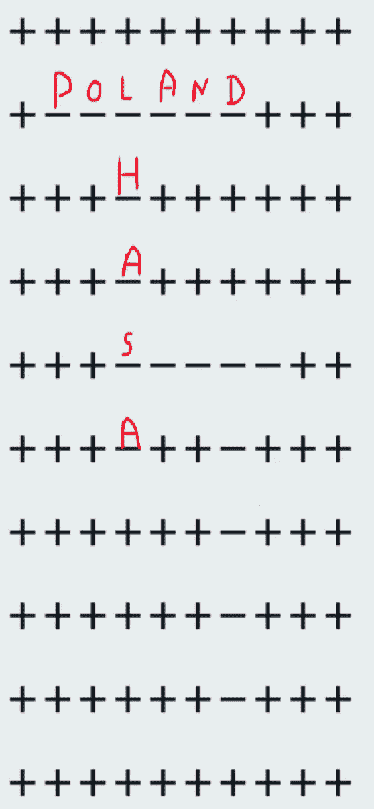

# 释放递归的力量来解决纵横字谜

> 原文：<https://blog.devgenius.io/unleashing-power-of-recursion-to-solve-crossword-puzzles-d5b94737c916?source=collection_archive---------4----------------------->


纵横字谜是一种文字游戏，游戏者得到一个方格和一系列线索。目标是用字母填充方块，形成在称为交叉点的特定方块处相交的单词。

使用纵横填字游戏时，您可能会遇到的一个问题是如何根据提供的线索有效地用正确的字母填充方块。你可能需要写一个程序来接收线索和网格，并输出完成的纵横字谜。

在解决此问题时，您可能会遇到一些挑战，包括:

*   解析和解释线索和网格数据
*   根据线索确定哪些方块应该被填充
*   处理相互矛盾的线索或多种可能的解决方案
*   实现解决纵横字谜的有效算法

## 问题陈述

给定一个纵横字谜，用一个数组表示，数组中的空格用“-”表示，还有一个单词列表可以放入空格中，我们需要一个程序用适当的单词填充空格，这样完成的纵横字谜才有效。"

## 示例:


## 方法:

为了解决这个纵横字谜问题，我们将使用回溯的递归方法。这意味着我们将在纵横字谜中尝试不同的单词和位置组合，并在到达死胡同或无效解时回溯。

填字游戏的方法包括扫描网格中的每个方块，并尝试从左上角开始，一行一行、一列一列地横向或纵向填充一个单词。如果一个单词不适合某个特定的位置，我们将返回并尝试不同的组合。这个过程将会继续，直到我们成功地完成整个填字游戏，或者我们已经确定没有解决方案存在。

这意味着我们将从网格的左上角(第 0 行，第 0 列)开始，尝试水平拟合第一个单词。如果单词不合适，我们将尝试垂直匹配。如果仍然不合适，我们将返回并尝试不同的单词和位置组合。一旦我们成功地放置了第一个单词，我们将移动到网格中的下一个位置(第 0 行，第 1 列),并重复该过程，直到我们已经填充了整个网格或者我们已经确定不存在解。"

首先，波兰已被选中，然后纵横字谜的第一个元素被选中，它将横向和纵向检查波兰是否适合。像这样。


此后，将对第二个元素重复该操作。


因此，它重复了第二个元素，并发现对于“P”它能够适合，但其余的字母不能适合。所以它将再次检查下一个元素。

并且重复这个过程，直到没有找到正确的位置。


一旦这个单词的位置被找到，它将移动到下一个单词，拉萨。对于拉萨也一样，它会从头开始扫描，直到找不到合适的地方。



这一进程将继续下去。


## 回溯:

现在，回溯将如何发生，它将从最后一个单词开始删除填充的字符。所以这里填的最后一个词是印度。所以它会开始删除字符。

但是，这里要注意的是“I”字是由意大利放置的，它是放置印度的线索。所以“我”不会被删除。


它将移除 NDIA。此后，在回溯的最后第二个词，即西班牙将被删除。但是 S 是由拉萨而不是西班牙填充的，所以“S”不会被删除。


因此，通过这种方式，会发生回溯。

如果放置了错误的字母，那么回溯将删除这些字母，并从下一个位置重新开始搜索。

这就是解决纵横字谜问题的强力递归方法！

## 伪代码

基于该方法的伪代码如下所示:

```
For all rows:
    For all cols:
        If CanPlaceHorizontally:
            PlaceHorizontally
            RECURSIVE_CALL()
            UnPlaceHorizontal

        If CanPlaceVertically:
            PlaceVertically
            RECURSIVE_CALL()
            UnplaceVertically
```

这个伪代码定义了一个递归的方法来解决纵横字谜。它首先遍历纵横字谜的行和列，并尝试在每个位置水平和垂直地匹配当前单词。如果这个单词符合任何一个方向，它就把它放入纵横字谜中，并用修改过的纵横字谜递归地调用它自己。如果单词在任一方向都不合适，它将移动到下一个位置并再次尝试。

这个过程一直持续到所有的单词都被放入纵横字谜中，此时函数返回完成的纵横字谜。如果函数找不到解决方案，它将返回 None 或其他失败指示。

这种方法使用递归和回溯来探索在纵横字谜中放置单词的所有可能的方法，并且如果存在的话，它保证找到解决方案。然而，如果纵横字谜很大或者单词列表很长，它可能是低效的，因为它将需要探索大量的可能性。

## 逐步实施

1.  函数解决方案将一个纵横字谜、一个单词列表和列表中的当前索引作为输入。
2.  如果当前索引等于单词列表的长度，则意味着所有的单词都已被放入填字游戏中。因此，该函数调用 convert_to_string 将纵横字谜从一个列表转换为一个字符串，然后打印出来。然后返回 True，表示找到了解决方案。
3.  如果所有的单词还没有被放置，函数将变量 word 设置为列表中的当前单词。
4.  然后，它遍历纵横字谜的行和列，对于每个位置，它检查单词是否可以水平或垂直放置。
5.  如果单词可以水平放置，该函数调用 place horizontally 将其放置在纵横字谜中，然后用修改后的纵横字谜和更新后的索引递归调用自己。如果递归调用返回 False，表明没有找到解决方案，则该函数调用 unplaceHorizontally 从纵横字谜中删除该单词，并尝试下一个位置。如果递归调用返回 True，表示找到了解决方案，则该函数返回 True，表示找到了解决方案。
6.  如果单词不能水平放置，或者已经在当前位置尝试过但失败了，则该函数对垂直放置重复相同的过程。
7.  如果单词不能水平或垂直放置

```
def solution(arr, words, idx):
  # If all the words have been placed, print the crossword and return True
  if idx == len(words):
    convert_to_string()
    print(crossword)
    return True

  # Set the current word to the word at the current index
  word = words[idx]

  # Iterate over the rows and columns of the crossword
  for rows in range(len(crossword)):
    for cols in range(len(crossword[0])):
      # Try fitting the word horizontally
      if canPlaceHorizontally(arr, word, rows, cols):
        # Place the word horizontally
        wherePlaced = placeHorizontally(arr, word, rows, cols)
        # Recursively try to place the remaining words
        if not solution(arr, words, idx+1):
          # If no solution was found, remove the word from the crossword and try the next position
          unplaceHorizontally(arr, wherePlaced, word, rows, cols)
        else:
          # If a solution was found, return True
          return True

      # Try fitting the word vertically
      if canPlaceVertically(arr, word, rows, cols):
        # Place the word vertically
        wherePlaced = placeVertically(arr, word, rows, cols)
        # Recursively try to place the remaining words
        if not solution(arr, words, idx+1):
          # If no solution was found, remove the word from the crossword and try the next position
          unplaceVertically(arr, wherePlaced, word, rows, cols)
        else:
          # If a solution was found, return True
          return True

  # If the word did not fit horizontally or vertically, return False
  return False
```

**检查水平放置和垂直放置**

canPlaceHorizontally 和 canPlaceVertically 函数是帮助函数，用于检查给定的单词是否可以水平或垂直地放置在纵横字谜的给定位置。它们都遵循相似的过程:

1.  他们将一个纵横字谜、一个单词和纵横字谜中的当前位置作为输入。
2.  他们计算纵横字谜的尺寸(M 和 N 代表垂直放置，M 和 N 代表水平放置)。
3.  它们检查单词的第一个字符是否可以放在当前位置。如果位置在纵横字谜的边缘，或者适当方向上的字符是一个加号，他们继续。否则，它们返回 False，表示该单词不能放在当前位置。
4.  然后，它们检查单词的最后一个字符是否可以放在当前位置。如果位置在纵横字谜的边缘，或者适当方向上的字符是一个加号，他们继续。否则，它们返回 False，表示该单词不能放在当前位置。
5.  然后，他们遍历单词的字符，检查每个字符是否可以放在纵横字谜中的相应位置。如果这个位置是空的或者这个字符已经存在于纵横字谜中，他们继续。否则，它们返回 False，表示该单词不能放在当前位置。
6.  如果该函数到达循环的末尾，它将返回 True，表示该单词可以放在当前位置。

```
def canPlaceHorizontally(arr, word, rows, cols):
  # Calculate the dimensions of the crossword
  M = len(arr)
  N = len(arr[0])

  # Check if the first character of the word can be placed at the current position
  if cols > 0 and arr[rows][cols-1] != '+':
    return False
  # Check if the last character of the word can be placed at the current position
  elif (cols+len(word)-1) >= N or ((cols+len(word) < N) and (arr[rows][cols+len(word)] != '+')):
    return False

  # Iterate over the characters of the word
  for i in range(len(word)):
    # Check if the character can be placed at the current position
    if arr[rows][cols+i] != '-' and arr[rows][cols+i] != word[i]:
      return False

  # If all characters of the word can be placed, return True
  return True

def canPlaceVertically(arr, word, rows, cols):
  # Calculate the dimensions of the crossword
  M = len(arr)
  N = len(arr[0])

  # Check if the first character of the word can be placed at the current position
  if rows > 0 and arr[rows-1][cols] != '+':
    return False
  # Check if the last character of the word can be placed at the current position
  elif (rows+len(word)-1) >= M or ((rows+len(word) < M) and (arr[rows+len(word)][cols] != '+')):
    return False

  # Iterate over the characters of the word
  for i in range(len(word)):
    # Check if the character can be placed at the current position
    if arr[rows+i][cols] != '-' and arr[rows+i][cols] != word[i]:
      return False

  # If all characters of the word can be placed,
  return True
```

放置逻辑非常简单，我们只需迭代并放置每个字符。

```
def placeHorizontally(arr, word, rows, cols):
    wherePlaced = set()
    for i in range(len(word)):
        if arr[rows][cols+i] == '-':
            arr[rows][cols+i] = word[i]
            wherePlaced.add(cols+i)
    return wherePlaced

def placeVertically(arr, word, rows, cols):
    wherePlaced = set()
    for i in range(len(word)):
        if arr[rows+i][cols] == '-':
            arr[rows+i][cols] = word[i]
            wherePlaced.add(rows+i)
    return wherePlaced
```

现在，在删除字符时，我们需要确保被删除的字符是由某个特定的句子书写的，而不是由任何其他句子书写的。因此，我们将借助于放置数组的位置。它包含由特定句子放置的字符的索引。

我们使用集合是因为集合中的索引复杂度较低。

```
def unplaceHorizontally(arr, wherePlaced, word, rows, cols):
    for i in range(len(word)):
        if cols+i not in wherePlaced:
            continue
        else:
            arr[rows][cols+i] = '-'

def unplaceVertically(arr, wherePlaced, word, rows, cols):
    for i in range(len(word)):
        if rows+i not in wherePlaced:
            continue
        else:
            arr[rows+i][cols] = '-'
```

## 时间复杂性分析

该算法的总时间复杂度将为 O(MN *W* L)。这意味着算法所花费的时间将取决于纵横字谜的大小、要放置的字数以及单词的长度。

## 下面给出了全部代码

```
crossword = [
    '++++++-+++',
    '++------++',
    '++++++-+++',
    '++++++-+++',
    '+++------+',
    '++++++-+-+',
    '++++++-+-+',
    '++++++++-+',
    '++++++++-+',
    '++++++++-+',

]

words = "ICELAND;MEXICO;PANAMA;ALMATY"
words = words.split(";")

def convert_2_matrix():
    for i in range(len(crossword)):
        crossword[i] = list(crossword[i])

def convert_to_string():
    for rows in range(len(crossword)):
        crossword[rows] = ''.join(crossword[rows])

convert_2_matrix()

def canPlaceHorizontally(arr, word, rows, cols):
    M = len(arr)
    N = len(arr[0])
    if cols > 0 and arr[rows][cols-1] != '+':
        return False
    elif (cols+len(word)-1) >= N or ((cols+len(word) < N) and (arr[rows][cols+len(word)] != '+')):
        return False
    for i in range(len(word)):
        if(arr[rows][(cols+i)] == '-' or arr[rows][(cols+i)] == word[i]):
            continue
        else:
            return False

    return True

def canPlaceVertically(arr, word, rows, cols):
    M = len(arr)
    N = len(arr[0])
    if rows > 0 and arr[rows-1][cols] != '+':
        return False
    elif (rows+len(word)-1) >= M or ((rows+len(word) < M) and (arr[rows+len(word)][cols] != '+')):
        return False
    for i in range(len(word)):
        if(arr[rows+i][cols] == '-' or arr[rows+i][cols] == word[i]):
            continue
        else:
            return False

    return True

def placeHorizontally(arr, word, rows, cols):
    wherePlaced = set()
    for i in range(len(word)):
        if arr[rows][cols+i] == '-':
            arr[rows][cols+i] = word[i]
            wherePlaced.add(cols+i)
    return wherePlaced

def placeVertically(arr, word, rows, cols):
    wherePlaced = set()
    for i in range(len(word)):
        if arr[rows+i][cols] == '-':
            arr[rows+i][cols] = word[i]
            wherePlaced.add(rows+i)
    return wherePlaced

def unplaceHorizontally(arr, wherePlaced, word, rows, cols):
    for i in range(len(word)):
        if cols+i not in wherePlaced:
            continue
        else:
            arr[rows][cols+i] = '-'

def unplaceVertically(arr, wherePlaced, word, rows, cols):
    for i in range(len(word)):
        if rows+i not in wherePlaced:
            continue
        else:
            arr[rows+i][cols] = '-'

def solution(arr, words, idx):

    if idx == len(words):
        convert_to_string()
        print(crossword)
        return True
    word = words[idx]
    for rows in range(len(crossword)):
        for cols in range(len(crossword[0])):
            if(canPlaceHorizontally(arr, word, rows, cols)):
                wherePlaced = placeHorizontally(arr, word, rows, cols)
                if not solution(arr, words, idx+1):
                    unplaceHorizontally(arr, wherePlaced, word, rows, cols)
                else:
                    return True
            if(canPlaceVertically(arr, word, rows, cols)):
                wherePlaced = placeVertically(arr, word, rows, cols)
                if not solution(arr, words, idx+1):
                    unplaceVertically(arr, wherePlaced, word, rows, cols)
                else:
                    return True

    return False

solution(crossword, words, 0)
```

谢谢你阅读我的博客！

~普里图尔·戴夫([https://linktr.ee/prituldave](https://linktr.ee/prituldave)