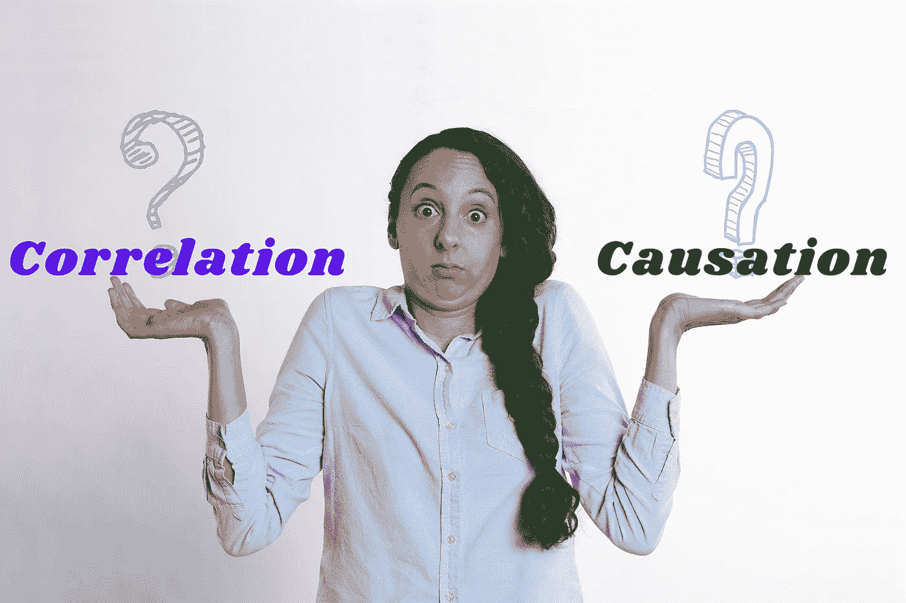

# 不受欢迎的观点——相关而非因果

> 原文：<https://blog.devgenius.io/unpopular-opinion-correlation-not-causation-b0c8853698ec?source=collection_archive---------32----------------------->

Daafid 是老年人对乡村男孩的普遍称呼；Daafid 应该发音为 DAVID，这是 Ara 村的意大利天主教神父在他的洗礼仪式上给他的。Ara 村是这个国家西部的一个小村庄，坐落在海边。村民们还没有离开他们旧有的处事方式，特别是那句 ***老样子老样子*** 应该是亚拉族人的代名词，但至少他们全心全意接受了西方的教育。

Daafid 是村里最受欢迎的 8 岁孩子，他是社区的儿子，是同龄人中最乐观的，但最重要的是他们中最聪明的。在雨季，Daafid 不仅是他奶奶的牵挂，也是 Ara 所有人的牵挂，因为在 Ara 村*大家的事就是大家的事*。在此期间，他的奶奶确保他不会做其他村里男孩正在做的事情，事实上，他被限制外出。天气如此恶劣，以至于这个小男孩整个季节都不得不缺课，有一个神话说，这场雨给了达菲尔德某种形式的发痒的疖子，使他的腿肿胀了好几天，因此他们都得出结论，这场雨一定是达菲尔德季节性悲伤的原因。

**因果关系和相互关系**

因果关系普遍被误认为是相互关系，甚至研究人员在报告他们的发现时也会陷入这种困境。在统计学中，相关性用于确定或衡量两个或多个变量之间的关系，而因果关系是所确定的关系背后的原因，简单地说，一个事件的发生是因为前一个事件。相关性是一个热门话题，因为它被广泛用于不同的研究中作为一种衡量标准，但我们往往忘记了它是一个指南，应该将我们的研究指向“光”。

**如何测量相关性**

相关系数由符号“*r”*表示，表示关系的强度，其必须在-1 和 1 之间。考虑以下变量，Ara 村一个月内下雨的天数，Daafid 出来玩的天数，Daafid 腿上疖子的生长速度:

如果这三(3)个变量中的任何一个给出一个趋向于 1 的值，那么存在一个强的正关系，这意味着当一个变量增加时，另一个也增加

如果它几乎为 0，则关系是弱的

如果该值趋向于-1，那么这种关系是负向的，意味着一个值增加，另一个值减少。

**如何衡量因果关系**

因果关系很容易通过医学领域流行的对照研究来衡量。这是一个简单的实验，我们根据研究的性质和可用的资金将测试分成两个或多个样本。在这里，我们将一个样品置于受控条件下，另一个样品置于中性条件下，然后研究它们的反应；

以达菲尔德为例，我们让这个小男孩暴露在这些条件下

**测试 1:** 独自下雨天玩

**测试 2:** 去过去 7 天没下雨的场地玩

**测试 3:** 在前一天下雨的当地足球场上踢足球，这是他最喜欢的运动

**测试 3** 指出是 Daafid 过敏的原因，每当他在湿草地上打球，几个小时后，它就开始表现出花粉草过敏的症状，这在皮肤敏感的人身上很常见。

这是因果分析能做什么的一个小例子，在研究或回答商业问题中识别关系。它是一种工具，通过回顾过去流行的相关性观点来回答事件发生背后的原因，这可以帮助我们自信地推动组织、治理甚至个人生活中的战略决策。

*参考*

[https://www . ABS . gov . au/websitedbs/A 3121120 . NSF/home/statistical+language+-+correlation+and+cause #:~:text = A % 20 correlation % 20 between % 20 variables % 2C % 20 然而，关系% 20 between % 20 the % 20 two % 20 events](https://www.abs.gov.au/websitedbs/a3121120.nsf/home/statistical+language+-+correlation+and+causation#:~:text=A%20correlation%20between%20variables%2C%20however,relationship%20between%20the%20two%20events)。