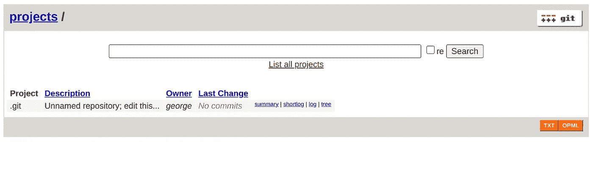
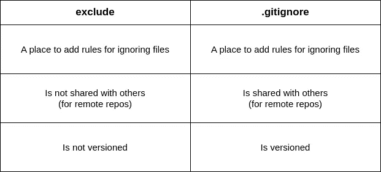
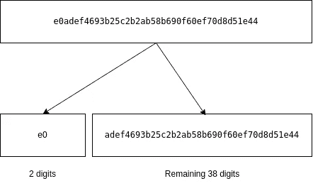

# 这是什么？git 文件夹呢？

> 原文：<https://blog.devgenius.io/unraveling-the-mysteries-of-the-git-folder-d47b55071aa5?source=collection_archive---------24----------------------->

在每个由 **Git、**监控的项目文件夹中，你会看到一个名为`.git`的隐藏文件夹。这个文件夹是在 Git 初始化期间创建的(当您使用`git init`命令时)。

你有没有想过这个文件夹为你做了什么？

如果答案是肯定的，那么你来对地方了，如果不是，那么你又来对地方了，因为，在这两种情况下，你可能会在阅读这篇文章时发现一些有趣的东西！或者至少这是我的希望。😜


照片由[罗曼·辛克维奇·🇺🇦](https://unsplash.com/@synkevych?utm_source=medium&utm_medium=referral)在 [Unsplash](https://unsplash.com?utm_source=medium&utm_medium=referral) 拍摄

## 使用的技术

*   Git 2 . 34 . 1

## 使用的环境

Linux Ubuntu 22.04.1 LTS

*如果你像我一样在 Unix 系统中，要看到* `.git` *文件夹，你需要做如下事情:*

```
ls -a
```

🕵️**-一个** *标志是对* ***—所有*** *的排序，基本意思是列出所有文件(也包括隐藏的)。*

进入`.git`文件夹时，您会看到以下文件/子文件夹:

```
root 
└─.git
  ├─📁 branches
  ├─📄 config
  ├─📄 description
  ├─📄 HEAD
  ├─📁 hooks
  ├─📁 info
  ├─📁 objects
  └─📁 refs
```

注意，这个文件夹的结构或者它的子目录可能与你项目中的不同。这是因为一些文件/文件夹是在初始化之后创建的，这取决于 git 的行为。此外，我分析文件夹内容的顺序不同于上面项目树中显示的顺序。这是因为在研究其他内容之前，我们需要了解一些内容的工作方式。如果有帮助的话，可以把它们当作必备知识。

说够了，让我们潜进去，看看发生了什么事。


资料来源:[吉菲](https://giphy.com/)

[](https://medium.com/@georgelinardis/membership) [## 通过我的推荐链接加入媒体-乔治·里纳尔迪斯

### 阅读乔治·里纳尔迪斯(以及媒体上成千上万的其他作家)的每一个故事。您的会员费直接支持…

medium.com](https://medium.com/@georgelinardis/membership) 

通过支付您的会员费，您将不仅支持我，也支持 Medium 上的其他作者，支持我们继续为您制作有价值的内容。

# 📁分支

正如在 [git 文档](https://git-scm.com/docs/gitrepository-layout) **分支**文件夹中提到的，是一个不推荐使用的机制，它可能不存在于您项目的 git 文件夹中。2009 年，当使用`git init`时，Git 停止创建这个文件夹。过了一会儿，虽然那个提交(删除创建的**分支**文件夹)被恢复，并且**分支**再次被包含进来。初始化时 git 子文件夹。

# 📄描述

**描述**文件包含了您的存储库的描述。多。😏但是如果你打开这个文件，你会看到什么呢？

默认情况下，其内容为:

```
Unnamed repository; edit this file ‘description’ to name the repository.
```

该文件主要由 [GitWeb](https://git-scm.com/book/en/v2/Git-on-the-Server-GitWeb) 程序使用，该程序是一个
Git Web 接口。要查看 GitWeb 的运行情况，只需在您的终端中键入:

```
git instaweb --httpd=webrick
```

🕵️ `*git instaweb*` *可能需要不同的* `*http*` *守护进程，这取决于您的操作系统。我用的是 Linux Ubuntu。*

运行此命令将在您的系统上创建/配置一个 web 服务器，并打开您的浏览器，以便您可以查看您的存储库的信息。当我运行它时，我得到了这样的结果:



很酷吧？这就像为存储库的内容生成一个 UI。😎

# 📁信息

对于初学者来说，在**信息**文件夹中，只有一个名为**的文件，不包括**。

**排除**文件是您可以添加规则的地方，以文件模式的形式，这样您就可以**忽略项目中的**特定文件。

但是等等…如果这就是我们使用**排除**的方式，那么与**有什么区别。gitignore** 文件？

好问题，让我们看看有什么不同:



你可以把**排除**看作本地私有**。gitignore** 文件，该文件可以存储您个人的关于文件排除的项目选项，而不会与其他任何人共享。但是优先级呢？哪个先来？

基于 [git 文档](https://git-scm.com/docs/gitignore)，优先顺序为:
1。命令行
2。**。git ignore**3。**排除**
4。配置变量`core.excludesFile`

# 📁钩住

hooks 文件夹，如果它的名字还不明显的话，包含了你的项目使用的所有
Git 钩子。

🕵️ ***钩子*** *是一种机制、函数的通用术语，它通过在事件之前或之后被调用来拦截该事件。*

那么钩子和 Git 有什么关系呢？

钩子和 **config** 文件被认为是 Git 提供的在项目级定制其行为的方式。

在一个项目中，你可能会看到自己重复一些工作流程。其中之一可能是在推送或部署代码更改之前检查控制台日志。尽管他们中的一些人总能找到办法逃过我们的检查，对吗？🤭另一种情况可能是偶然将那个分支合并到 master 并推动它活过来。勾起了谁的回忆？


资料来源: [Giphy](https://giphy.com/)

其他例子包括:

*   在提交或推送之前，在代码中应用 eslint 检查。
*   提交前检查提交消息中的拼写错误。
*   在提交消息中自动添加任务 ID 前缀。

对于任何一种情况，你都可以添加一个 Git 钩子，在特定事件之前或之后运行，比如在提交之前，它可以为你自动检查。

# 📄配置

这是 git 用来检查存储库配置的文件。如果您运行了以下一些命令，您可能已经看到应用了一些设置:

```
git config user.name “<your name here>”
git config user.email <your email here>
git config core.editor <preferred editor>
```

如果您以前没有使用过这些命令，也没关系。前两个命令将您的姓名和电子邮件应用于项目的存储库设置，而第三个命令将特定的编辑器设置为查看文件的默认编辑器。这些更改将反映在项目的配置文件中。例如，如果您运行这些命令，然后打开配置文件，您可能会看到如下内容:

```
[core]
 editor = vim
[user]
 name = John Doe
 email = someone@example.com
```

这基本上是我们设置的记录。🤓
还有比这里提到的更多的配置选项，如果你想了解更多，请访问 [git 配置文档](https://git-scm.com/book/en/v2/Customizing-Git-Git-Configuration)。

# 📄头

这是 git 用来动态记录项目的**头**名的文件。

🕵️ *头上的 git***是一个指针。一个指针，它指向您的活动分支的* ***最新*** *提交或提交散列(以防您已经签出并处于* ***分离的*** *头状态)。**

*让我们看看**头**文件的运行情况。我已经创建了一个空文件夹，它是使用 git 通过键入以下命令初始化的:*

```
*git init*
```

*默认的 git 分支是`main`分支。因此，如果我尝试通过键入以下内容来读取`HEAD`文件:*

```
*cat .git/HEAD*
```

*🕵️****猫*** *命令用来显示一个文件的内容。***

**我得到以下回答:**

```
**ref: refs/heads/main**
```

**这个内容基本上说的是我们项目的**头**是`main`分支的最后一个提交。这就是为什么这个引用，`refs/heads/main`也被称为分支引用。
*(我们将在下一节更详细地讨论 refs 文件夹)。***

**让我们通过键入来切换到另一个分支**

```
**git checkout -b playground**
```

**切换到新的分支后，如果我现在再次阅读`HEAD`的内容，它将显示一个不同的参考:**

```
**ref: refs/heads/playground**
```

**看到了吗？它只是记录你的项目的当前头。但是我们的小侦探🕵在上面几行提到的超脱的头部状态呢？让我们看看，我将在我的项目中添加一个简单的标记为`some random change`的提交消息，并按`git logs`查看它的提交散列:**

```
**commit d31d7b141c9a27f71c13eab90b8943ae126b8f74 (HEAD -> playground)
Author: GeorgeLinardis
Date:   Mon Dec 14 19:58:32 2022 +0200**
```

```
 **some random change**
```

**好了，现在我们有了提交的散列，让我们通过键入:**

```
**git checkout d31d7b141c9a27f71c13eab90b8943ae126b8f74**
```

**现在我们已经使用提交的散列检查过了，我们处于**分离**头**头**状态。如果我们尝试查看我们头的文件内容，它会显示:**

```
**d31d7b141c9a27f71c13eab90b8943ae126b8f74**
```

**这实际上是我们使用的哈希。这很有道理，对吗？毕竟，如果这个文件记录了当前使用的文件头，并且我们使用散列而不是分支进行了检查，那么它应该准确地记录下来。**

***如果你正在阅读这篇文章，并且你也跟着读，记住，要从脱离状态回到你的分支，只需键入* `*git checkout <branch_name>*`**

# **📁参考文献**

**Refs 是**引用**的简写，是 git 引用提交散列的另一种方式。git 将通过类似于`refs/heads/main.`的方式引用提交的散列，而不是提及提交的散列**

**🕵️*a****hash****是由一些输入数据生成的值。Git 使用 SHA-1 散列类型为其对象创建唯一标识符。***SHA-1 代表安全散列算法，基本上是一个函数。一种加密功能，接受输入并生成一个摘要，即哈希摘要，简单来说，它是一个基于所用内容的 40 位唯一字母数字消息。如果你想和 SHA-1 玩在线游戏，试试这个* [*游乐场*](https://codebeautify.org/sha1-hash-generator) *。****

****参考文件**文件夹包含以下文件/文件夹:**

```
**refs
 ├─📁 heads
 ├─📁 remotes
 ├─📁 tags
 └─📄 stash**
```

## **头**

**它包含您所有的本地分支机构。Git 为创建的每个分支创建一个新文件，并使用分支的名称命名该文件。**

**假设我们有两个分支，一个名为**主菜单**，一个名为**导航栏菜单**。(*导航栏菜单是从主菜单创建的一个分支)***

**这意味着在 **heads** 文件夹中，您应该会看到以下两个文件:**

```
**heads
  ├─📄 main
  └─📄 navbar-menu**
```

**每个文件将包含各自的**头**提交散列。因此，如果我们要查看每个文件服务器的内容，我们会看到:**

```
**// inside the heads/main file
ed37f2bdba2b9c062b1147226cb384619d4a0133**
```

```
**// inside the heads/playground file
d31d7b141c9a27f71c13eab90b8943ae126b8f74**
```

**为了仔细检查我们的发现，我们可以检查每个分支的日志历史:**

```
**// main branch history
commit ed37f2bdba2b9c062b1147226cb384619d4a0133 (HEAD -> main)
Author: GeorgeLinardis
Date:   Mon Dec 14 20:57:57 2022 +0200

  init**
```

```
**// playground branch history
commit d31d7b141c9a27f71c13eab90b8943ae126b8f74 (HEAD -> playground)
Author: GeorgeLinardis
Date:   Mon Dec 14 20:58:32 2022 +0200 some random changecommit ed37f2bdba2b9c062b1147226cb384619d4a0133 (main)
Author: GeorgeLinardis
Date:   Mon Dec 14 20:57:57 2022 +0200 init**
```

**如您所见，显示为`HEAD -> <branch>`的散列是包含在**头**内的相应文件中的散列。开始感觉好像我们看到了指针，不是吗？**

## **隐藏物**

**如果你以前没有使用过 **stash** 命令，最好查看 git 的 [stash docs](https://git-scm.com/docs/git-stash) 来了解更多，这是一个非常有用的命令。**

**🕵 ***stash*** *当我们想要移除应用到我们的分支* ***的任何变更时使用，但是*** *同时保存那些变更以备后用*。**

**在我的项目中，我在 **refs** 文件夹中没有 stash 文件，所以如果没有也不用担心。要查看 git 自动创建的 **stash** 文件，我们需要遵循以下步骤:**

1.  **修改文件的内容**
2.  **类型`git stash`**

**执行 stash 命令后，您将看到它的文件变得栩栩如生。查看它的内容，您会看到一个散列，例如，我看到下面这个:**

```
**e446267da6ae4d783e30dd5ce411fba5f4c12453**
```

**但是从我之前查看日志的历史来看，我在任何地方都没有看到这个散列。那么它来自哪里呢？您可能已经猜到了，它代表了存储时存储的更改。**

**好吧，但是我们能用它做什么呢？使用它们的一种方法是查看项目的当前状态和保存的存储更改之间的差异。这可以通过做类似于`git diff <stash hash>`的事情来实现。酷吧？**

**其他两个子文件夹的**遥控器**和**标签**遵循相同的逻辑。它们包含对远程分支和标记的引用。**

# **📁目标**

**Git 的核心是需要一种方法来存储恢复项目版本所需的所有必要信息，跟踪它的历史和任何已经做出的更改。为此，它使用许多数据结构和算法来有效地存储和管理版本控制信息。
保存所有相关信息的地方是**对象**文件夹，也称为**对象库**。**

**但是它是怎么做到的呢？这是否意味着如果你进入 **objects** 文件夹，你将会看到你的项目文件的不同版本？**

**嗯……是的，但不是你期望的方式(如果我没猜错的话)。**

**Git 使用以下 4 种数据结构来保存信息:**

*   ****斑点****
*   ****树木****
*   ****提交****
*   ****标签****

## **一滴**

**对于文件的每个不同版本，文件的内容都保存为 blob。**

**🕵*a****blob****—****a b****inary****l****arge****ob****object—是一个大块，一段二进制数据。***

## **树**

**树相当于目录。一棵树可以包括其他树和 blobs，或者换句话说，目录和文件。**

## **承诺**

**每当我们使用`git commit`命令时，就会创建一个提交对象，它包含以下关于每次提交的信息:**

*   **树的散列(*标识树对象的散列，文件夹结构***
*   **父散列*(代表父分支顶端的散列)***
*   **作者信息**
*   **委托人信息**
*   **提交消息**

## **标签**

**标签是一种用户友好、人类可读的保存对象信息的方式。**

**因此，让我们开始整合所有这些新信息:**

****

**我们将从另一个空的项目文件夹开始，在其中我们将通过键入`git init`来初始化 git。首先，我们看到在我们的 **objects** 文件夹中没有文件。让我们通过键入`touch README.md`创建一个空的`README.md`文件。**

**即使存储库中还没有文件，也没关系！现在，我将为新的空`README.md`文件添加一条提交消息，消息为“*添加 README.md 文件*”。当我这样做时，我看到在**的**对象**文件夹中创建了三个新文件夹。git** 目录。git 使用这些文件夹来存储新提交的数据，包括`README.md`文件的内容和提交元数据。这三个文件夹是:**

```
**objects
 ├─📁 e0
 ├─📁 e6
 └─📁 f9**
```

**如果我键入`git log`，我会看到一个包含以下信息的提交:**

```
**commit e0adef4693b25c2b2ab58b690f60ef70d8d51e44 (HEAD -> main)
Author: GeorgeLinardis
Date:   Wed Dec 14 18:11:27 2022 +0200

    Adding README.md file**
```

**这个提交的散列被分成两部分**

****

**hash 的前两位用作文件夹名，剩下的 38 位用作`e0`文件夹内的文件名。但是因为我们只有一个提交，其他两个文件夹代表什么呢？嗯，为了定义我们项目的状态，我们需要三条信息:一个**提交**，一个**树**，以及一个**斑点**。这三个文件夹恰恰代表了这一点。我们可以使用以下命令查看每个文件的类型:**

```
**git cat-file -t <hash>**
```

**其中`<hash>`是我们想要检查的文件的哈希值。通过这样做，我们将看到每个文件都有以下类型:**

```
**objects
 ├─📁 e0
 |  └─📄 adef4693b25c2b2ab58b690f60ef70d8d51e44 (commit)
 ├─📁 e6
 |  └─📄 9de29bb2d1d6434b8b29ae775ad8c2e48c5391 (blob)
 └─📁 f9
    └─📄 3e3a1a1525fb5b91020da86e44810c87a2d7bc (tree)**
```

**我知道你在想什么。那么每个文件里面都有什么呢？**

## **犯罪**

**为了查看标记为`adef4...`的提交文件内部，我们将使用`cat-file`命令，更具体地说是`git cat-file -p <hash>`。**

**🕵 `git *cat-file*` *用于查看 git 对象内容。* `*-p*` *为蛮印。* `*-t*` *也可以用来查看对象的类型***

**通过检查第一个文件的提交对象信息，我得到了以下内容:**

```
**tree f93e3a1a1525fb5b91020da86e44810c87a2d7bc
author GeorgeLinardis 1671034287 +0200
committer GeorgeLinardis 1671034287 +0200

Adding README.md file**
```

**🕵 *你在我的提交信息中看到的 1671032375 是以 epoch UNIX 时间戳格式显示的时间。换句话说，是时间，以通用的方式写成，从 UTC 的 1970 年 1 月 1 日开始计时。(+0200 是我的时区)。***

**但是等等，在这个文件的内容中提到的树的散列和在第三个文件中使用的是一样的，对吗？你预料到了吗？是吗？哦，不过还是很酷！🤩**

## **树**

**通过执行相同的命令，我看到在树对象内部得到了以下内容:**

```
**100644 blob e69de29bb2d1d6434b8b29ae775ad8c2e48c5391    README.md**
```

**好吧，那这意味着什么？这是项目文件夹在特定时间点的快照。它包含项目的结构，并引用 blob 对象(文件)和该快照上存在的其他树。**

**它基本上说的是 ID 为`e69de29bb2d1d…`的对象是一个正则类型的 blob ( *一个文件*)(`*100644*`*表示正则类型，而* `*100755*` *表示名为`README.md`的可执行文件*。**

## **一滴**

**现在有趣的部分，让我们看看 blob 文件包含什么。和其他情况一样，通过输入`git cat-file -p e69de2...`，我得到一个空的内容。🤔**

**是啊。有道理对吗？毕竟我们提交 README.md 文件时它是空的。通过添加新文件，我们将看到我们的`object`子文件夹基于我们项目中在那个时间点包含的文件而增加。**

**所以你有它！**。git** 文件夹就像是你的 git 库的心脏和灵魂，它装满了让 Git 成为如此强大的工具的所有好东西。这看起来像是一个拥有奇怪超能力的秘密巢穴，但我希望在读完这篇文章后，我们可以澄清它的一些能力，并在这个过程中变得更加明智。**

**通过这篇文章，我发现探索**的内部运作。git** 文件夹可能是一个具有挑战性的话题，即使对于像我这样的初学者来说也是如此。尽管困难重重，但我发现深入研究这个话题并更好地理解如何做很有意思。git 在引擎盖下工作。有时这有点令人头痛🤕，但我认为这种努力是值得的。🥳**

# **进一步阅读**

**在写这篇文章并试图理解`.git`文件夹是如何工作的时候，我发现了一些非常棒的文章，我想分享给你，以防你感到好奇并想深入了解:**

*   **Tobias Günther 在 StackOverflow 上发表的《引擎盖下的一瞥:Git 中的分支是如何工作的》。**
*   **[Omer Rosenbaum 在 FCC 上发布的 Git 内部可视化指南——对象、分支以及如何从零开始创建回购](https://www.freecodecamp.org/news/git-internals-objects-branches-create-repo/)**

# **谢谢你🙏**

**恭喜你走到这一步。我希望你像我写这篇文章一样喜欢它！**

**👏感谢阅读！如果你觉得这个故事有趣或有帮助，请鼓掌让我知道。别忘了关注更多类似的精彩内容。**

**🛎有问题或评论吗？让我们在 [Twitter](https://twitter.com/FreakingCode) 或 [LinkedIn](https://www.linkedin.com/in/georgelinardis/) 上保持联系，继续对话吧！**

**下次见。🤓**