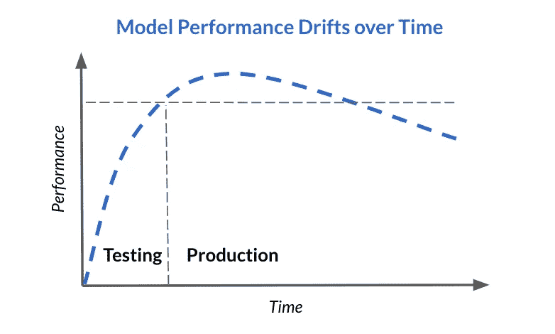
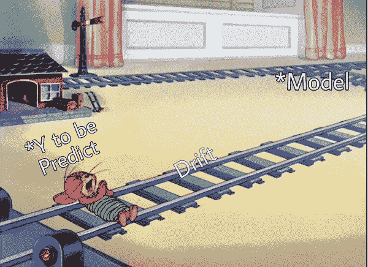
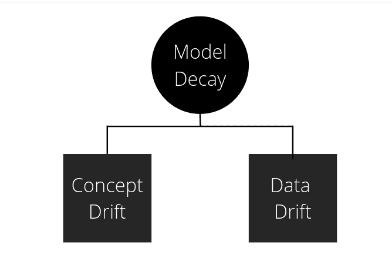
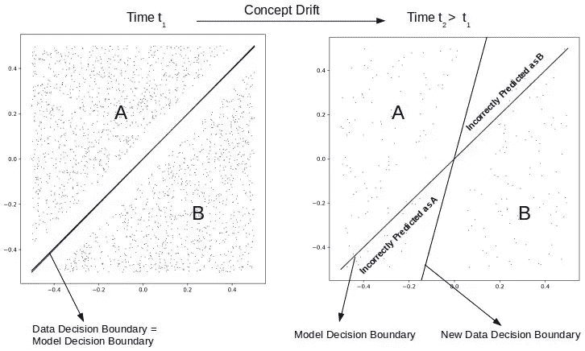
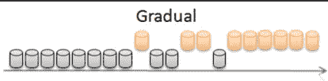
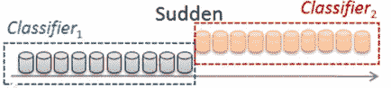
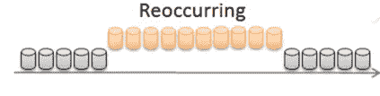
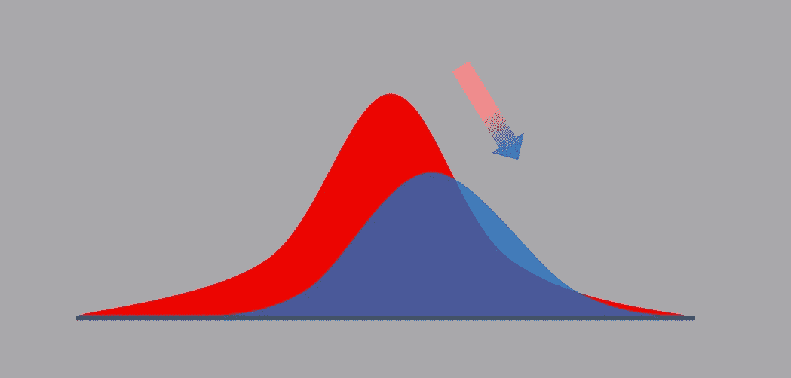
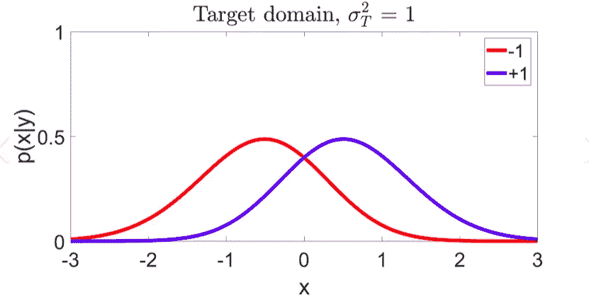
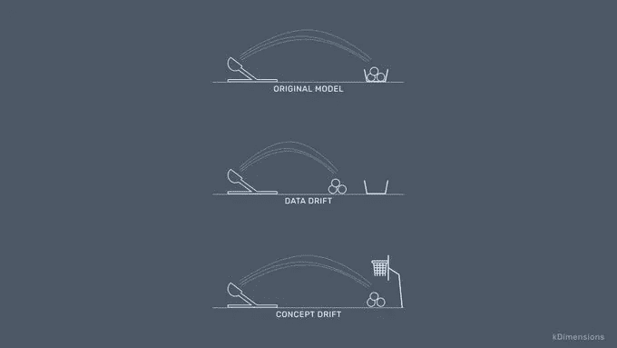

# 非简单模型衰减

> 原文：<https://blog.devgenius.io/unsimply-model-decay-aa3689975ada?source=collection_archive---------14----------------------->

随着时间的推移，模型衰减无非是**衰减**模型的性能和准确性。

新手可能会感到困惑。因为在我们的童年，我们读到过硬件和软件之间的差异。有人说“硬件会随着时间的推移而磨损，但软件不会”。那这到底是什么？
不仅你，我也有同样的困惑。

最大似然模型的结果是通过从类似数据的训练中得到的知识来预测/分类/聚类数据。但是数据的频率会随着时间和场景的不同而变化。就像，我们不能把 20 年前的天气数据用于现在的情况。因此，建立在这些数据上的模型不能在这些数据上起作用。性能一次次降低。这被称为模型衰退。

模型衰退的场景，例如，
-贷款批准模型是在 5-6 年前培训的。因为客户的财务水平存在差异。
-台风、海啸、飓风、地震等自然灾害后的市场/股票预测，我们也可以考虑 COVID。

大体上，我们可以将模型衰退分为两种方式。他们是
1。概念漂移
2。数据漂移

模型衰减的类型

# **概念漂移**

模型衰减是由于数据的变化。概念漂移是模型试图预测的目标变量的统计属性的**变化，随着时间以不可预见的方式变化。更简单地说，**输入和输出变量之间的关系被改变**。它发生在更依赖于时间的领域。**

你的模型在过去的训练中学到的模式不再适用，**世界在进化。**

观念转变主要有三种类型。他们是，
1。渐进漂移/渐进漂移——目标变量的属性正在以一种我们可以观察到也可以预期的方式发生变化。**漂移有规律**。在这些情况下，很容易重新训练模型。

像股票交易一样，经济增长

2.突然漂移——名字本身就包含了暗示。**突然的全局变化影响目标变量**。像 COVID 这样的变化是描述突然漂移的最好例子。covid 提高后有很多变化。

3.周期性/季节性漂移:**季节性变化**。如果可以的话，我们可以观察和预测这种变化。就像，周末和工作日的销售是不同的。夏季和冬季空调和空气冷却器的销售。

# **数据漂移**

数据漂移意味着**数据分布随时间而变化。**

数据漂移比概念漂移更难处理。有两种类型的数据漂移。他们是，

1.  协变量移位— **一个或多个自变量(输入变量)**中数据分布的变化。但是 X 和 Y 变量之间的关系保持不变。

简单来说，pt rain(Y | X)= Pprod(Y | X)；pt rain(X)*≦*Pprod(X)。
鉴于 Ptrain 是用于培训的数据，Pprod 是生产后的数据

2.先验概率转移— **因变量(预测变量/输出变量)中数据分布的变化。**
简单来说，pt rain(Y | X)= Pprod(Y | X)；pt rain(Y)*≦*Pprod(Y)。
pt rain 是培训中使用的数据，Pprod 是生产后的数据

这就是我们对概念漂移和数据漂移的理解。这里有一个简单的图像，用来理解概念漂移和数据漂移的区别。

在下一部分，我们可以讨论如何处理这些漂移。

谢谢，
快乐编码:)

联系方式:
邮件:mentasuryateja@gmail.com
领英:[https://www.linkedin.com/in/surya-teja-menta/](https://www.linkedin.com/in/surya-teja-menta/)
Github:[https://github.com/Surya-Teja-Menta](https://github.com/Surya-Teja-Menta)
推特:[https://twitter.com/suryaTejamenta](https://twitter.com/suryaTejamenta)

**参考文献**

[1][Numal Jayawardena](https://medium.com/@numal.jayawardena?source=post_page-----16b3eb175006--------------------------------)(2021 年 6 月 27 日)—数据漂移—第 1 部分:数据漂移的类型
[https://towards Data science . com/Data-Drift-Part-1-Types-of-Data-Drift-16 B3 EB 175006 #:~:text = % 20 some % 20 examples % 20 of % 20 gradual % 20 concept % 20 Drift % 20 are，to % 20default % 20on...%20 更多%20](https://towardsdatascience.com/data-drift-part-1-types-of-data-drift-16b3eb175006#:~:text=%20Some%20examples%20of%20gradual%20concept%20drift%20are,to%20default%20on%20their%20loans%20can...%20More%20)

[2][Ashok Chilakapati](https://medium.com/@ashok.chilakapati?source=post_page-----a98a809ea8d4--------------------------------)(2019 年 4 月 25 日)——机器学习中的概念漂移和模型衰减
[https://towards data science . com/Concept-Drift-and-Model-Decay-in-Machine-Learning-a98a 809 ea8d 4](https://towardsdatascience.com/concept-drift-and-model-decay-in-machine-learning-a98a809ea8d4)