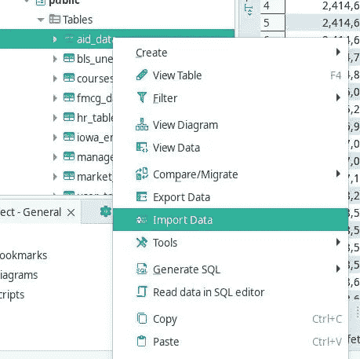

# 解开数据库:SQL 表:复制

> 原文：<https://blog.devgenius.io/untangling-database-sql-tables-copy-ccf50cb50c9f?source=collection_archive---------6----------------------->

我一直在学习使用关系数据库进行数据摄取、数据探索和分析的许多不同方法。本系列将涵盖这些课程。有这么多帖子涵盖了详细的教程。这些帖子将分享想法、工具和流程概述。在此基础上，您可以通过查找教程或文档来进一步深入研究。

# 目标:数据摄取

将文本、csv 和 tsv 文件中的数据加载到数据库中可能会遇到意想不到的问题。当数据库管理的新加入者面临这些挑战时，他们可能会止步不前。让我们给你一些非正统的工具。首先，让我们创建表。

# **测量数据:**

我们需要通过代码获得提供给我们的文件的以下信息。您想到了哪种工具

a)文件中有多少列？他们的名字。

b)根据您使用的数据库服务器，每列的变量类型是什么。

c)列是否有空值？他们是如何表现的。

d)文件中有多少条记录？

最有可能是 python 的操作系统模块。还有更强大的替代品。

# **Linux Shell 命令:**

以上问题可以通过查看文件头来回答。您还可以找到文件中的记录/行数

```
$ cat filename.csv | head (or use) head filename.csv

user_first_name,user_last_name,user_email_id,user_role,created_dt
Gordan,Bradock,gbradock0@barnesandnoble.com,Actor,2020-01-10
Tobe,Lyness,tlyness1@paginegialle.it,User,2020-02-10
Addie,Mesias,amesias2@twitpic.com,User,2020-03-05
#### Data truncated ####

$ wc -l filename.csv

1507886 filename
```

```
# Find if column 'user_role' in above file has null values 

$ cat filename.csv | cut -d ',' -f4 | sort -u # this will provide 
Actor
Null << Yep
User
Promoter
```

到目前为止，您一定已经看到了 Bash 工具的强大功能。它们比文本编辑器效率高得多。cat，sed，awk，cut，grep 然后 Vim 是我的最爱。

一些列有空格，另一些列有带" "的空格，有问题的列用字符串" null "代替空格。最后一个是当你把数据推进“数据库表”时最头疼的问题。

```
$ cat part-00000.csv | head #The file is truncated with head
24000.00 null null 90
17000.00 null 100 90
17000.00 null 100 90
9000.00 null 102 60
6000.00 null 103 60
4800.00 null 103 60
4800.00 null 103 60
4200.00 null 103 60
12000.00 null 101 100
9000.00 null 108 100

# How to find out if the 1st column also has Nulls? Use cut -f and Uniq

$ cat part-00000.csv | cut -f 3| sort -u
90
60
" " << That was not expected!!!
30
50
80
null << There you go!!!
80
50
--- << How did that even get there??
20
40
70
110
```

# 用 DuckDB 扩充 Bash:

如果您认为 bash 命令具有超能力，那么您就可以享受了。我只是像前面解释的那样介绍 DuckDB 的用法。

```
$ duckdb # will start the duckdb instance

D #that is prompt of duckdb

D SELECT * FROM read_csv_auto('filename.csv') 

┌─────────────────┬────────────────┬──────────────────────────────┬───────────┬────────────┐
│ user_first_name │ user_last_name │        user_email_id         │ user_role │ created_dt │
│     varchar     │    varchar     │           varchar            │  varchar  │    date    │
├─────────────────┼────────────────┼──────────────────────────────┼───────────┼────────────┤
│ Gordan          │ Bradock        │ gbradock0@barnesandnoble.com │ A         │ 2020-01-10 │
│ Tobe            │ Lyness         │ tlyness1@paginegialle.it     │ U         │ 2020-02-10 │
│ Addie           │ Mesias         │ amesias2@twitpic.com         │ U         │ 2020-03-05 │
│ Corene          │ Kohrsen        │ ckohrsen3@buzzfeed.com       │ U         │ 2020-04-15 │
│ Darill          │ Halsall        │ dhalsall4@intel.com          │ U         │ 2020-10-10 │
└─────────────────┴────────────────┴──────────────────────────────┴───────────┴────────────┘
```

是的……它读取 csv 文件并从中创建了一个数据库表。让我们试试更酷的东西。获取上表的模式怎么样？我求助于 python 的 Pandas / Pyspark 库来获得这个模式，然后用它来创建表。DuckDB 让您粘在 Bash shell 上…甚至不需要启动 python 解释器。

```
# inside DuckDB

D CREATE TABLE civ AS SELECT * FROM read_csv_auto('civilizations.csv');
D .schema
CREATE TABLE civ(civilization VARCHAR, "start" INTEGER, "end" INTEGER, "startLabel" VARCHAR, "endLabel" VARCHAR, region VARCHAR, timeline VARCHAR);
```

# 创建数据库表:

现在，在数据库中创建表就像在公园里散步一样简单。没有必要键入所有这些列名和单独的数据类型。如果 DuckDB 提供了一个不同的数据类型，这不是您的数据库所固有的，那么在 Bash shell 中使用 echo 和 sed 工具，如下所示

```
#Creating table

database=# CREATE TABLE civ("start" INTEGER, "end" INTEGER, "startLabel" VARCHAR,);
# kept the number of columns purposefully less...
```

```
# use echo and sed in bash

$ echo 'CREATE TABLE civ("start" INTEGER, "end" INTEGER, "startLabel" VARCHAR,)' | sed 's/INTEGER/REAL/g'
# INTEGER changed to REAL 
CREATE TABLE civ("start" REAL, "end" REAL, "startLabel" VARCHAR)
```

# 有没有减少打字/鼠标点击的 GUI？

是的，我在探索 DuckDB 的时候发现的。它叫做 [D-Beaver。](https://dbeaver.io/download/)神奇的工具。比起 GUI，我更喜欢命令行，因为它减少了大量的鼠标点击。我将直接讨论将数据导入到 dbeaver 内部的“表”中。



这个导入向导会拉入数据，即使这些数据是杂乱的。尝试了 100K 记录数据

当导入向导完成时，您的表将立即准备好进行查询。今天我已经**摄取了大约 25 个 csv 文件，记录数量**从几十万到几十万不等。DBeaver 像疯了一样给了他们高分。DBeaver 中还有其他漂亮的特性，我将在本系列的后面部分介绍。但请随意探索。

# 想获得即时仪表板吗？

[进入小溪](https://docs.rilldata.com/using-rill/install)

当你说 Rill 启动时，rill 在 localhost:9009 打开一个 web 服务器。需要进行一些设置。rill setup 试图从 https://github.com/hhllcks/snldb/tree/master/output提取的样本数据文件是周六夜现场展示的一个惊人的数据库。

```
$ rill start

# After that, you see the following dashboards...
```

你现在一定已经猜到了。Rill 和一个名为 [tadviewer](https://www.tadviewer.com/) 的命令行工具有助于查看 csv/ parquet 文件，它们都由底层的 DuckDB 提供支持。

# 如果您必须只使用您的数据库服务器，该怎么办？

每个服务器都有一个命令行选项。对于 Postgres，它是 psql-h localhost-U Postgres，对于 mysql，它是 mysql -u root -p 命令。一旦进入 DB 服务器，就可以使用 SQL 查询启动命令行 fu。

所有这些讨论都集中在 csv、tsv 和文本文件上，它们大多是表格。一旦创建了表，就可以将 CSV/TSV 文件的内容复制到上面创建的表中。

```
# for postgres db, it works this ways

mdy_db=# COPY my_new_table(col1, col2, col3...) FROM (/path/to/csv) DELIMITER \
',' CSV HEADER;
```

CSV 文件中的数据必须在表中，并且您可以开始处理这些数据。下一个重要任务是数据建模。很快就会回来…