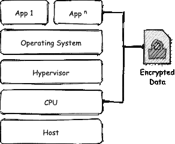
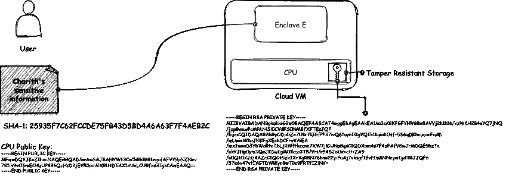
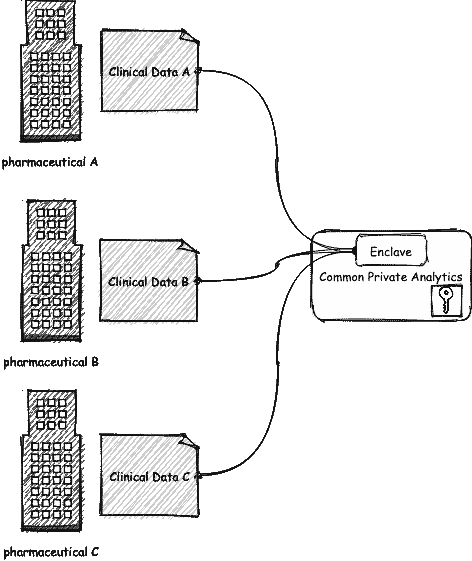

# 近距离和机密，计算

> 原文：<https://blog.devgenius.io/up-close-confidential-computing-a5e5989cd1cb?source=collection_archive---------2----------------------->

Mauro Sbicego 在 [Unsplash](https://unsplash.com/s/photos/encryption?utm_source=unsplash&utm_medium=referral&utm_content=creditCopyText) 上拍摄的照片

多年来，我们已经知道数据有三个脆弱点，静态数据、传输中的数据和使用中的数据。多年来，我们已经知道使用中的数据很难保护，因为您正在使用它。一把剑放在鞘中是为了保护它，一旦拔出来并在战斗中使用，我很抱歉地说，它会被挖。尽管数据比剑更强大，但在使用时，也会遭受同样的命运。(如果你想阅读关于数据泄露和预防的文章，[这里有一个我关于它的文章的无耻插件](https://medium.com/dev-genius/lossless-by-design-89c4db2503f4)。)

并不是所有的路都通向云，有些仍然通向本地托管的裸机服务器或有时稍微高级一点的私有云。如果你与一位选择走更少人走的路的好心人交谈，他们会告诉你，出于对数据隐私或数据主权等立法要求的担忧，他们不得不这样做。这个确切的问题是机密计算联盟的好人们经过多年研究后设法解决的。

众所周知，有许多技术和实践可以用来保护静态数据和传输中的数据。以至于如果你不用它们来保护你的数据，你就活该被黑。但是，当需要处理或使用这些受到良好保护的数据时，必须将其从保护性外壳中取出，这就是机密计算的用武之地。它允许你执行你的程序和安全地操作你的数据，这样第三方，甚至是 VM 提供者都不能访问你的原始数据。现在，一些热心的读者可能会问，同态计算不也是一样的吗(对你们中的其他人来说，不，听起来不是这样的，不要胡思乱想了)？好问题！让我在文章末尾回答这个问题。

> 机密计算是通过在基于硬件的可信执行环境中执行计算来保护使用中的数据。

传统上，当您操作数据时，内存中保存的数据对操作系统是可见的，因此存在将数据暴露给虚拟机管理程序(或 VMM)和虚拟机提供商的风险。机密计算允许数据在被称为可信执行环境(TEE)的 CPU 上直接执行。只有具有正确凭证的可信方才能访问该球座。这样做的目的是通过消除数据泄露的可能性来降低云提供商和用户之间的信任需求。

> 可信执行环境(TEE)通常被定义为提供一定级别的保证的环境，这些保证包括**数据完整性**、**数据机密性**和**代码完整性**。⁴

这背后的诡计存在于驱动机密计算虚拟机的 CPU 中。英特尔和 AMD 都在这一领域提供解决方案。英特尔软件保护扩展(英特尔 SGX) ⁷和 AMD 安全加密虚拟化(AMD SEV) ⁸是两个竞争者。虽然他们的成就具有开创性，但基本原理其实很简单。我给你两个提示，认证& PKI。

> 证明是被称为“验证者”的一方评估潜在的不可信对等体(即“证明者”)的可信度的过程。

这使得用户能够在 CPU 内创建一个安全的容器(一个飞地),用户可以在其中安全地执行应用程序和数据。enclave 保证了在使用过程中内容的机密性和完整性。用户可以通过生成加密签名来验证 enclave 内容的“可信度”。

让我们假设一个场景，用户有一个包含敏感数据的应用程序要执行。首先，用户生成应用程序和数据(enclave 的内容)的加密哈希。然后，用户将应用程序上传到 enclave。初始化时，enclave 让 CPU 使用存储在防篡改存储器中的私钥对哈希进行签名，并将其返回给用户。用户可以使用公钥来验证散列的真实性，从而证明 enclave 的内容。

当涉及到在多方之间共享敏感数据而又不共享时，保密计算的实际应用大放异彩。迷茫？想象一下今天每个制药公司的首要任务，找到冠状病毒的疫苗。然而，如果他们合作，成功的机会会大大增加。然而，这将意味着他们不得不共享敏感信息，从长远来看，这可能会造成不利影响。解决方案是在机密计算虚拟机上设置多方分析应用程序。

每家制药公司都将与分析应用程序共享加密数据。数据将在一个安全的地方被解密和处理。没有一个参与者有 enclave 的钥匙，因此他们不能操作或查看 enclave 中的数据。没有一个参与者可以访问彼此的数据，但他们将受益于一个在组合数据集上训练的分析模型。

随着数字时代的兴起，数字盗窃、欺诈和洗钱也随之而来。金融机构一直在努力寻找新的方法来抵御这些威胁。这是一个大量使用机器学习的领域。然而，如果使用的数据集不够大，模型可能会标记出假阳性。这需要人工干预来解决争议，有时需要联系实际客户来验证交易，并清除或取消交易。
联合机器学习(Federated machine learning)或协作学习(collaborative learning)是一种使用多个分散的数据集(或服务器)来训练算法的技术。使用机密计算虚拟机，这些协作可以以更高的机密性和完整性来编排。
与前面的示例类似，参与的金融机构可以通过集中托管的学习模型共享其加密的客户数据，而不会影响其保密性。结果将是一个在大量不同数据集上训练的模型，具有高准确性和较少的假阳性。

现在让我们回到同态加密。同态加密提供了对加密数据执行计算而无需解密的能力。如果是这样的话，为什么要去所有的飞地和三通的麻烦？因为所有的数据都需要加密和解密，并且计算需要在加密的数据上进行，所以同态计算是资源密集型的。没有办法使用同态加密来执行证明，也不能保证代码机密性或代码完整性。虽然同态加密本身是独特而有趣的，但它并不能解决保护使用中数据的问题。

机密计算为保护数据状态的最后一步提供了一线希望，让数据泄露成为过去。然而，永远不要低估糟糕的设计和实现的力量。你可以在门上安装最复杂的门栓锁，但是如果你把钥匙放在门垫下，并在门上留一张纸条，注明钥匙的位置，那么…

[1][https://confidential computing . io](https://confidentialcomputing.io)

[2][https://open enclave . io](https://openenclave.io)

[3]机密计算深潜 v1.0 [，](https://confidentialcomputing.io/wp-content/uploads/sites/85/2020/10/Confidential-Computing-Deep-Dive-white-paper.pdf)机密计算联盟，2020 年 10 月*[https://Confidential Computing . io/WP-content/uploads/sites/85/2020/10/Confidential-Computing-Deep-Dive-white-paper . pdf](https://confidentialcomputing.io/wp-content/uploads/sites/85/2020/10/Confidential-Computing-Deep-Dive-white-paper.pdf)*

*[4]机密计算:基于硬件的应用和数据可信执行，机密计算联盟，2020 年 11 月[https://Confidential Computing . io/WP-content/uploads/sites/85/2021/01/Confidential Computing _ outreach _ white paper-8-5x 11-1 . pdf](https://confidentialcomputing.io/wp-content/uploads/sites/85/2021/01/confidentialcomputing_outreach_whitepaper-8-5x11-1.pdf)*

*[https://eprint.iacr.org/2016/086.pdf](https://eprint.iacr.org/2016/086.pdf)*

*[6][https://fengweiz . github . io/paper/sec data view-acsac 19-slides . pdf](https://fengweiz.github.io/paper/secdataview-acsac19-slides.pdf)*

*[7][https://software . Intel . com/content/www/us/en/develop/articles/Intel-software-guard-extensions-tutorial-part-1-foundation . html](https://software.intel.com/content/www/us/en/develop/articles/intel-software-guard-extensions-tutorial-part-1-foundation.html)*

*[8] AMD SEV-SNP:通过完整性保护加强虚拟机隔离等，AMD，2020 年 1 月[https://www . AMD . com/system/files/tech docs/SEV-SNP-加强虚拟机隔离-完整性保护等. pdf](https://www.amd.com/system/files/TechDocs/SEV-SNP-strengthening-vm-isolation-with-integrity-protection-and-more.pdf)*

*[9][https://en.wikipedia.org/wiki/Federated_learning](https://en.wikipedia.org/wiki/Federated_learning)*

*[https://en.wikipedia.org/wiki/Homomorphic_encryption](https://en.wikipedia.org/wiki/Homomorphic_encryption)*