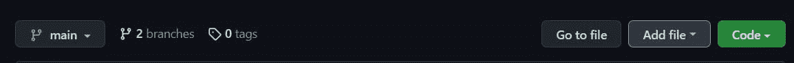
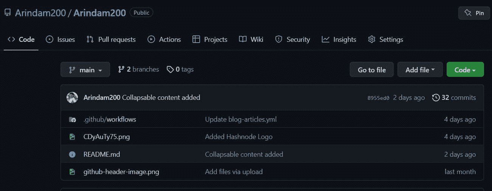
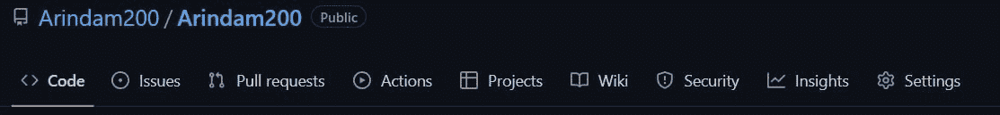
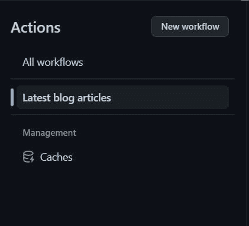
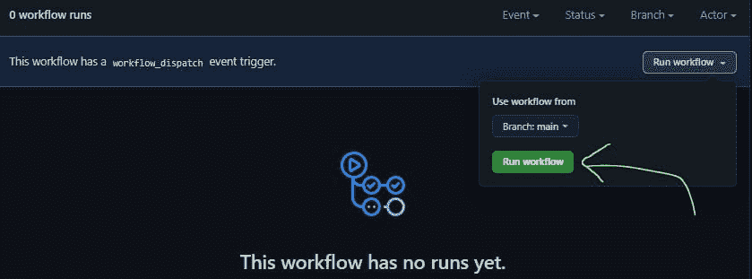
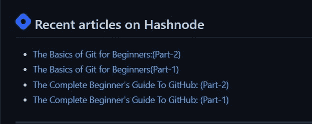

# 使用 GitHub 操作，用您的博客活动更新 GitHub 个人资料

> 原文：<https://blog.devgenius.io/update-github-profile-with-your-blog-youtube-activity-using-github-actions-eae859d51f4a?source=collection_archive---------11----------------------->

# 介绍

GitHub Actions 可以做很多事情，我们通常看到它运行自动化测试，但它可以用你在 YouTube、博客帖子等其他平台的活动来更新你的 GitHub 个人资料！这篇博文将教你如何使用 GitHub 动作更新你的 GitHub 档案。

> 我们将使用[blog-articles . yml](https://github.com/FrancescoXX/FrancescoXX/blob/main/.github/workflows/blog-articles.yml)GitHub Action，作者是 [Francesco Ciulla](https://github.com/FrancescoXX)

# 入门指南

*   转到您的个人资料自述文件。
*   添加一个标题(例如:最近关于 Hashnode 的文章)。


*   在您的`README.md`中添加以下代码

```
<!-- BLOG-POST-LIST:START -->
<!-- BLOG-POST-LIST:END -->
```

*   单击提交更改按钮保存更改。
*   然后进入你的自述文件，点击“添加文件”并选择创建新文件



*   在名称字段中，输入`.github/workflows/blog-post-workflow.yml`



*   在`Edit new file tab`中添加以下代码

```
name: Latest blog articles
on:
  schedule: # Run workflow automatically
    - cron: '0 * * * *' # Runs every hour, on the hour
  workflow_dispatch: # Run workflow manually (without waiting for the cron to be called), through the Github Actions Workflow page directly
jobs:
  update-readme-with-hashnode-blog:
    name: Update this repo's README with the latest hashnode blog posts
    runs-on: ubuntu-latest
    steps:
      - uses: actions/checkout@v2
      - uses: gautamkrishnar/blog-post-workflow@master
        with:
          feed_list: "https://blog.francescociulla.com/rss.xml"
```

这将成功创建工作流。它会每小时从你的 Hashnode 档案中获取新的博客文章，并将它们添加到你的 README 文件中。

> 要了解关于 GitHub 工作流语法的更多信息，请查看此工作流语法[文档](https://docs.github.com/en/actions/using-workflows/workflow-syntax-for-github-actions)。

*   下一个！转到存储库中的`actions`选项卡



*   在所有工作流程下，点击`Latest blog articles`工作流程。



*   在运行工作流程下拉菜单中，点击`Run workflow`按钮。工作流将开始执行。



*   转到你的 GitHub 个人资料页面，在 Hashnode 上的最近博客部分，你会看到 blog-post-workflow.yml 文件中定义的博客平台的所有博客帖子的列表。



```
For video tutorial [Click Here](https://www.youtube.com/watch?v=oVS3M9IPZUM&t=3s)
```

# 结论

感谢你阅读这篇博客。希望你今天学到了一些东西！

如果你觉得这个指南很有帮助，请点赞、分享并关注我们，以便将来有更多类似的博客帖子。