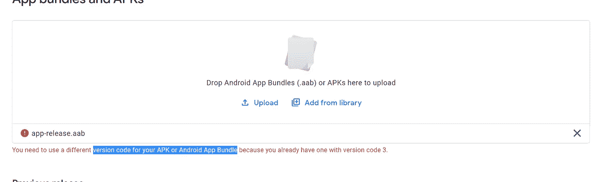
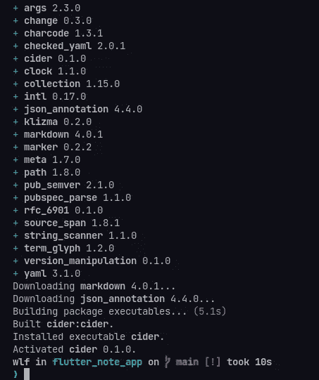
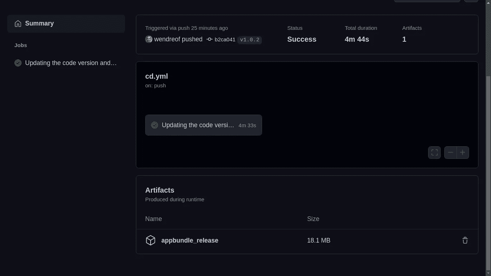
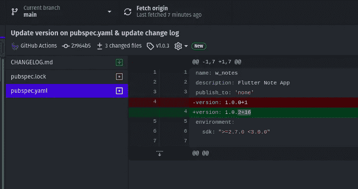
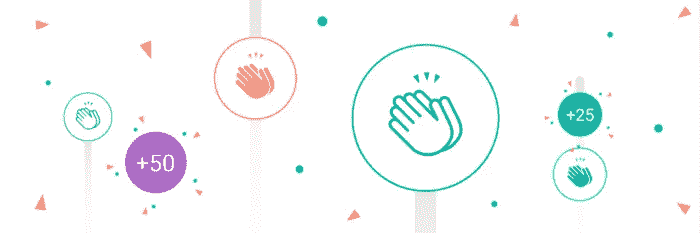

# 使用 GitHub 操作更新 Play Store 的版本代码

> 原文：<https://blog.devgenius.io/updating-version-code-for-play-store-using-github-actions-d5ea0f07f6ff?source=collection_archive---------3----------------------->

[https://miro . medium . com/max/821/1 * 33q 2 nnubhqal 9 hsweohgha . png](https://miro.medium.com/max/821/1*33q2NnubhqAL9HSwEohGHA.png)

**→** [**我的 GitHub 简介。**](http://github.com/wendreof) **→** [**我的 LinkedIn 个人资料**](https://www.linkedin.com/in/wendreof/) **。
→把** [**Ufo 主题**](https://marketplace.visualstudio.com/items?itemName=wendreof.ufo) **放到你的 VS 代码里。**

怎么了，戴夫？今天的帖子我将帮助你解决一个最无聊的事情，同时为谷歌 Play 商店提交一些新版本的应用程序:**在上传审核之前更新代码版本。**

所以，要阅读这篇文章，你需要:
# 1——一个已经在 GitHub 版本控制上的 Flutter 应用程序；
# 2—GitHub 动作流程和标签的一些经验；

发完这个帖子，你就再也看不到这个了 LOL:

正如你可能知道的，在软件开发中有很多方法来做某事，所以，这只是我的方法，它对我来说工作正常，你可以根据自己的需要随意改变它。

让我们继续前进！

**#1 —将苹果酒添加到您的项目***(*[*https://pub.dev/packages/cider*](https://pub.dev/packages/cider)*)*
前往页面查看更多相关信息。它是一个命令行工具，用于自动化包维护。操纵 changelog **和 pubspec.yaml** 。

运行第 4 步后，如果一切正常，您需要看到如下内容:

**# 2——准备 GitHub 动作的脚本**

在 **your-project-name/上创建一些 script.yaml。github/workflows** 并复制下面的脚本，注意我解释的注释。

**复制内容后，将新文件提交给 GitHub 版本控制。**

这样，当我们创建一些新标签时，这个动作将被触发，pubspec.yaml 上的版本将通过 Cider 提取新标签的数据来更新。

**#3 —创建新标签**

推完标签，动作就开始了！

**#4 —转到 GitHub**

转到 GitHub Actions 选项卡并查看结果:

现在，让我们看看发生了什么变化:

如你所见，一切都在意料之中。**版本变更**，**版本控制上的变更**，现在要再次更新我们只需要创建其他标签就可以享受了；)

当然，这个例子会对您有所帮助，但是要将捆绑包提交给 Play Store，需要对其进行分配。所以看看我的另一篇文章:

 [## 如何用 GitHub Actions 安全构建指定的 Flutter App

### 你好，欢迎来到我的博客。今天的帖子是关于在不损害…

medium.com](https://medium.com/@wendreof/how-to-safely-build-assigned-flutter-app-with-github-actions-8860b1b6eef6) 

我希望你喜欢它，下一篇文章再见！

获取完整的脚本并给它一颗星:[https://gist . github . com/wendre of/3d fa 1c 35 CD 0 dcb 96 c 7637 BFF 8435 Fe 02](https://gist.github.com/wendreof/51d1717ffec45f9b8211e813b8578d82)
[https://gist . github . com/wendre of/f 07 f 0 fad 656 de 537 b 20438248 Fe 813 CB](https://gist.github.com/wendreof/f07f0fad656de537b20438248fe813cb) [https://gist . github . com/wendre of/67 f](https://gist.github.com/wendreof/67f65574a26113f4779b3d1514a5e641)

感谢你阅读❤

所以不要为明天忧虑，因为明天自有明天的忧虑。每天都有足够多的麻烦。马太福音 6:34

错误或建议？用你的拍手留下评论吧！

**→** [**我的 GitHub 简介。**](http://github.com/wendreof) **→**[**我的 LinkedIn 简介**](https://www.linkedin.com/in/wendreof/) **。
→把** [**Ufo 主题**](https://marketplace.visualstudio.com/items?itemName=wendreof.ufo) **拿到你的 VS 代码里。**