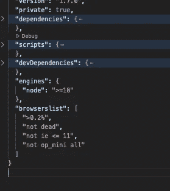
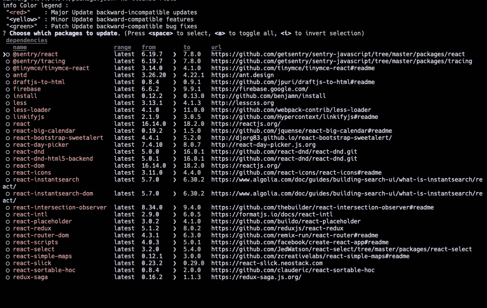
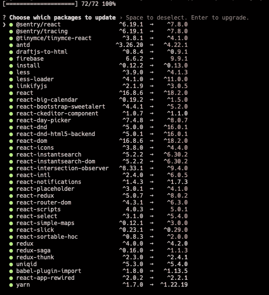

# 更新您的依赖项(节点)

> 原文：<https://blog.devgenius.io/updating-your-dependencies-node-1df408cf4f7f?source=collection_archive---------15----------------------->

Avel Chuklanov 在 [Unsplash](https://unsplash.com?utm_source=medium&utm_medium=referral) 上拍摄的照片

长话短说，你正在进入一个痛苦的世界，就像我现在正在经历的一样。幸运的是，我做了所有繁重的工作，所以那些新来的人不必…..

我将提供一步一步的程序，并希望你永远不会到达它的结尾。

由[霍莉·曼达里奇](https://unsplash.com/@hollymandarich?utm_source=medium&utm_medium=referral)在 [Unsplash](https://unsplash.com?utm_source=medium&utm_medium=referral) 拍摄的照片

# 在我们开始之前，让我们了解一下我们可能会遇到的情况-

*   **封装兼容性**
    1。向后兼容
    2。向后兼容折旧警告
    3。没有向后兼容性
*   **节点版本支持** 有些包需要最低版本才能工作
*   **包本身被折旧** 有时创建者会发布一个新的包

# 该怎么办-

## 1.确保您的 json 包中有一个引擎锁

## 2.现在接下来是更新软件包

1.  **让运行一个命令-**
    如果你正在使用**yarn**>>**yarn upgrade-interactive**
    否则使用**npx NPM-check-updates-u** 还有许多其他的，但这些是我觉得我可以依赖的。此外，在使用之前，请随意在谷歌上搜索。

2.**分析输出-** 在这里，除红色以外的所有版本都可以安全升级。关于红色的，建议在根据依赖关系继续之前检查文档。在研究文档-
-节点兼容性问题
-向后兼容性检查时，请记住这些事情

专业提示:一次一个依赖项，在进入下一个之前完成所有需要的代码修改。

## 2.由于支持问题，有时需要更新基本节点版本本身-

特别是当使用早于 12 的节点版本时。在完成这些任务的过程中，你可能会遇到很多问题。

## 3.包它贬值了——

在这种情况下，可能需要重新实现功能。由于软件包本身已经过时。

> 祝正在读这篇文章的人一切顺利，因为这是一项艰巨的任务。没有！这是劳动。我觉得我应该得到更多的报酬…

如果你有这个任务，我建议你不要把它作为首要任务，在一个月的时间内和其他次要任务一起完成。以便没有合并冲突。

皮特·佩德罗萨在 [Unsplash](https://unsplash.com?utm_source=medium&utm_medium=referral) 上的照片

> *以上是我的观点，你可以随意问我任何问题，如果我有足够的经验，我一定会尽力帮助你。*