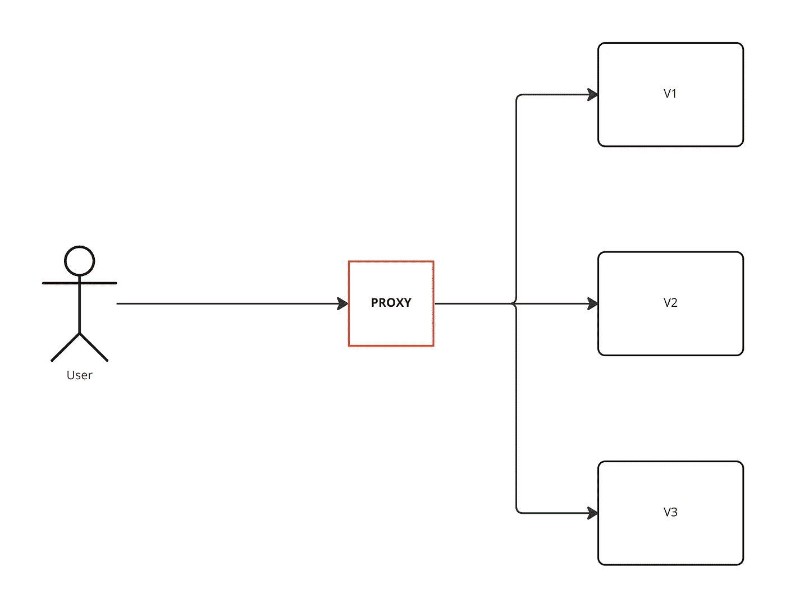
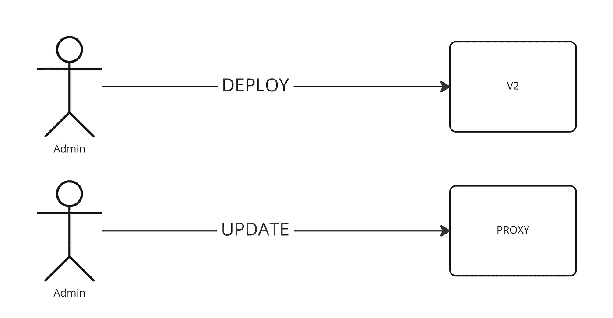
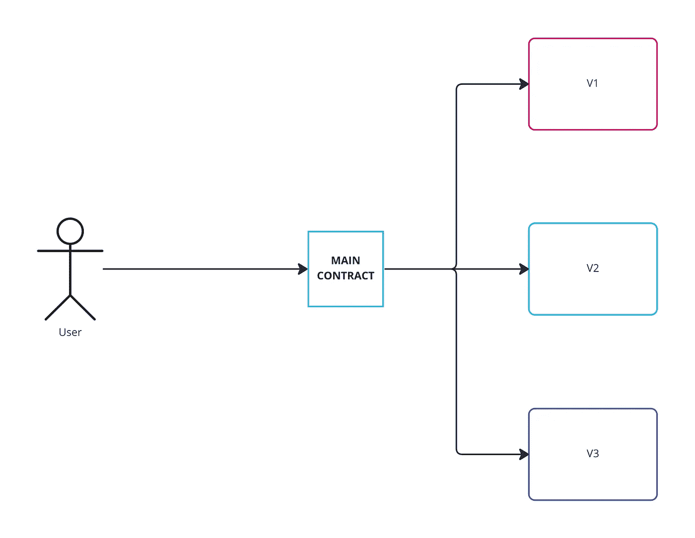
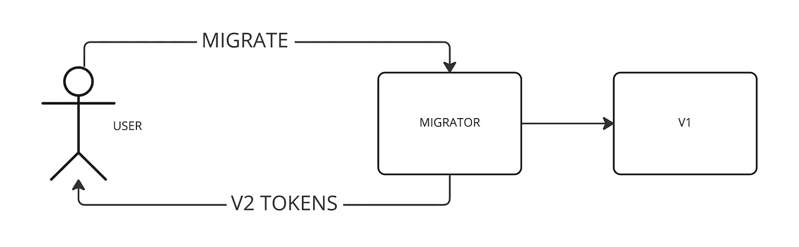

# 可升级智能合同—如何升级？

> 原文：<https://blog.devgenius.io/upgradable-smart-contracts-how-to-2f60814ee5f3?source=collection_archive---------11----------------------->

我将揭开升级智能合约的三种方式，是的，升级它们不是神话！

在以太坊、BSC 和 Polygon(或所谓的 EVM 区块链)等区块链网络上，智能合约是可部署和可执行的不可变、可验证和自治的代码。由于区块链的不变性，无法更改已部署的智能合约或已确认的交易。

# **不可改变的**

部署在以太坊等 EVM 网络上的智能合约在“理论上”是不可改变的。上传字节码，执行构造函数，然后将结果代码存储在不能更新的区块链上。够吓人吗？

区块链领域的工程师和企业主通常将其称为智能合同诅咒。

为什么？
因为如果他们需要改变或更新业务模式怎么办？接下来会发生什么？所以这是一个诅咒！但真的是这样吗？

作为工程师，我们总是试图找出新的方法来帮助企业和项目持续发展，并根据他们的需求进行改变。

# 变化

在现实世界的实践中，我们必须知道智能合同本身是不可变的，但“不是”合同的执行！这为我们变异一个聪明的契约打开了新的可能性之门。

智能合约可以以不同的方式变异:

*   利用`SELFDESTRUCT` 操作码删除一个契约，并可能在相同的地址重新上传不同的字节码。
*   利用`DELEGATECALL`调用另一个合同的代码。
*   使用`CREATE2`将代码存储在状态中，然后执行它。

# 升级智能合同

现在通常有 3 种方法可以用来升级合同。

## **方法 1 —代理:**



用户的请求通过代理

当用户与智能合约交互时，它会通过代理智能合约将函数调用转发到实际实现，在下图中由 v1、v2 和 v3 表示:

当用户想要在代理上调用一个函数时，事实是，该函数在代理上并不存在，但是由于 solidity 的回退特性，我们仍然能够处理这个调用，并且在这个特殊的回退函数中，我们将把调用转发到实际的实现。

需要使用名为`delegatecall`的 EVM 特殊操作码来实现期望的结果。这将允许我们在另一个合同的上下文中执行智能合同。例如，当我们执行 V1 的调用时，如果我们更改任何状态变量，它实际上会更改代理智能合约的存储，它不会更改 V1 的存储，V1 只是代码。



管理员部署 V2 并更新代理中的地址

稍后，一旦我们想要升级我们的智能合同，管理员将部署 V2，此后，管理员将在代理中更新实现的地址，下次用户将通过代理进行呼叫，这一次，代理将把呼叫转发到 V2，而不是 V1。

```
// A piece of Proxy smart contract code that will return the written data size
fallback() external payable {
  assembly {
    let _target := sload(_IMPLEMENTATION_SLOT)
    calldatacopy(0x0, 0x0, returndatasize())
    switch result case 0 {revert(0, 0) default {return (0, returndatasize())}
  }
}
```

如果你分析上面的代码，我们已经使用了汇编，原因是我们必须利用它来转发我们对实现的调用，这是因为，在一些高级用例中，我们必须求助于汇编而不是纯粹的可靠性。

## **方法 2 —适配器模式:**



适配器模式图

在这种方法中，有一个包含大部分业务逻辑的主契约，而主契约的一些功能将它们的责任委托给其他智能契约。
这方面的一个例子是，yearn finance 的收益率优化器，它基本上是一个存放代币的功能，在代币根据选定的投资策略进行投资后，这些代币在其他智能合约 V1、V2、V3 中实施，因此，在任何时候，yearn finance 都可以通过部署新的实施合约和更新主合约中的地址来添加新的投资策略。因此，除了简单性之外，它在某种程度上类似于代理方法，因为在这种情况下，当用户调用主合同中的函数时，该函数实际上存在于主合同的上下文中，并且它不会调用主合同的回退函数。到了主合同的业务逻辑，你就改不了了！然而，对于 V1、V2 和 V3 的实现契约，只要它尊重某个特定的接口，您就可以随意更改。

界面:

```
pragma solidity ^0.8.7;

interface IImplementation {
  function getData() external pure returns(uint);
}
```

主合同:

```
pragma solidity ^0.8.7;

import './IImplementation.sol';

contract MainContract {
  address public admin;
  IImplementation public implementation;

  constructor() {
    admin = msg.sender;
  }

  function upgrade(address _implementation) external {
    require(msg.sender == admin, 'admin rights required');
    implementation = IImplementation(_implementation);
  }

  function getData() external view returns(uint) {
    return implementation.getData();
  }
}
```

升级功能由管理员调用，管理员可以更改实现合同。当在幕后调用 getData 时，它调用实现契约，但是根据版本的不同，返回值会有所不同。

## **方法 3——迁移(最简单):**



迁移方法

在这种方法中，您只需部署一个新的智能合约，它可以完全独立于您的第一个智能合约，您还可以部署一个迁移智能合约，将数据从 V1 迁移到 V2。这尤其适用于令牌的情况，例如，如果您部署令牌的版本 2，您将向迁移合同发送所有令牌，之后每个用户将通过与迁移合同交互来申请新令牌，他们将获得基于其 v1 令牌余额的 v2 令牌。

迁移者:

```
pragma solidity ^0.8.7;

import '@openzeppelin/contracts/token/ERC20/IERC20.sol';

contract Migrator {
  mapping(address => bool) public migrations;
  IERC20 public v1;
  IERC20 public v2;

  constructor(address _v1, address _v2) {
    v1 = IERC20(_v1);
    v2 = IERC20(_v2);
  }

  function migrate() external {
    require(migrations[msg.sender] == false, 'migration has been already done');
    migrations[msg.sender] = true; 
    v2.transfer(msg.sender, v1.balanceOf(msg.sender));
  }
}
```

映射部分用于确保防止重复迁移。

V1 是:

```
pragma solidity ^0.8.7;

import '@openzeppelin/contracts/token/ERC20/ERC20.sol';

contract V1 is ERC20 {
  constructor() ERC20('Token V1', 'TV1') {
    _mint(msg.sender, 1000000);
  }
}
```

V2:

```
pragma solidity ^0.8.7;

import '@openzeppelin/contracts/token/ERC20/ERC20.sol';

contract V2 is ERC20 {
  constructor() ERC20('Token V2', 'TV2') {
    _mint(msg.sender, 1000000);
  }

  function burn(uint amount) external {
    _burn(msg.sender, amount);
  }
}
```

这是其他方法中使用最广泛的方法，但是应该根据场景的复杂性选择一种或混合两种方法。

我希望你对可升级的智能合约有所了解，接下来是如何有效地完成它，我会让你了解 GitHub repo 的一些实现。敬请期待！