# 升级项目。

> 原文：<https://blog.devgenius.io/upgrading-a-project-77deff090cdd?source=collection_archive---------5----------------------->

## 升级 Cinemachine 和后期处理。

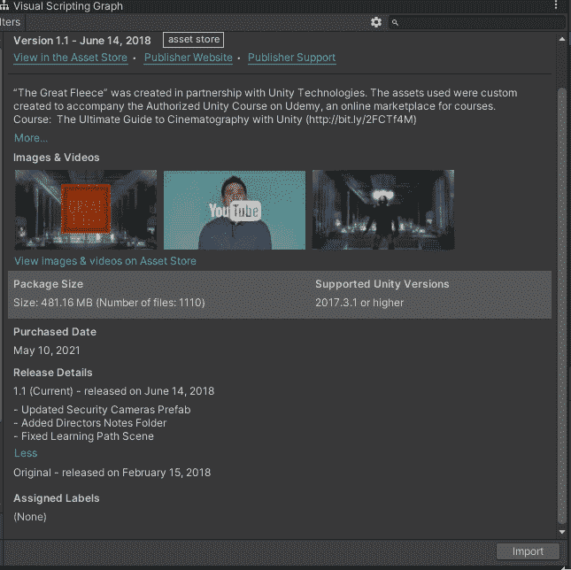

我正在用联合资产商店 的 [**大羊毛资产创建一个潜行游戏。**](https://assetstore.unity.com/packages/templates/tutorials/the-great-fleece-110186)

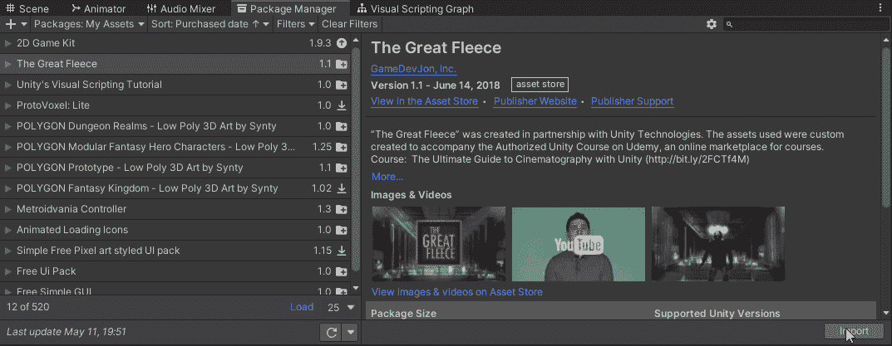

当导入资产时，我注意到它有 Cinemachine 和后处理文件夹，这表明它正在使用这些资产的旧版本。

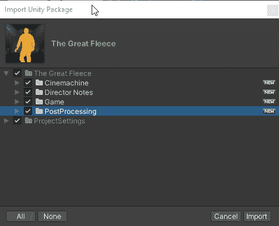

在将它导入到我的项目中之前，我确实确保了 Cinemachine 和后期处理没有安装在我的项目中(它们没有安装，因为这是一个新项目)。

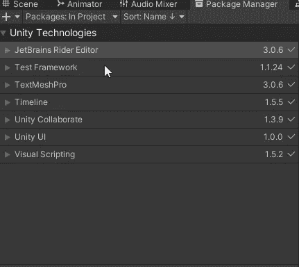

Unity 2021.1.6 唯一可用的 Cinemachine 版本是 v2.7.3。您使用的 Unity 版本取决于可用的 Cinemachine 版本。

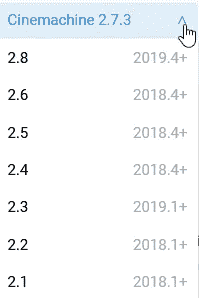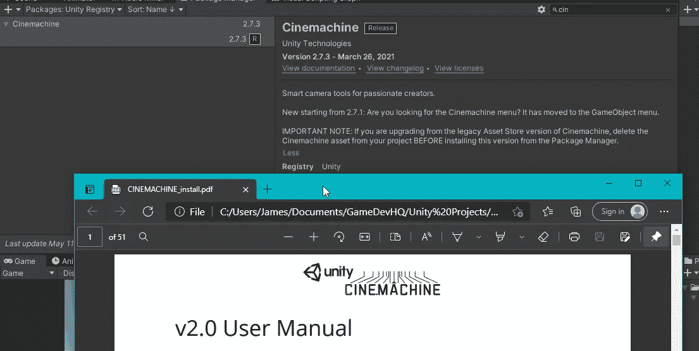

这同样适用于后处理堆栈。我可以使用的最低版本是 3.1 版。顺便提一下，如果你使用的是 MacOS X 10.11.6，你可能会考虑使用 Unity 版本(Unity 2020.2)，它允许你将 2.3 版用作 3.0 版和 3.1.0 版，这两个版本在 Metal 中运行编辑器时都有一个已知的问题。

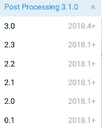

也要知道你想要使用哪个渲染管道，因为这取决于后期处理是如何安装的，以及你可以使用哪些效果。如果你正在使用 [**通用渲染管道(URP)**](https://docs.unity3d.com/Packages/com.unity.render-pipelines.universal@latest/index.html) 你不能使用自动曝光，雾，或屏幕空间反射。如果您正在使用 [**内置渲染管道**](https://docs.unity3d.com/2021.1/Documentation/Manual/SL-RenderPipeline.html) 您不能使用帕尼尼投影、阴影中间调高光或分割调色。 [**【高清渲染管道(HDRP)**](https://docs.unity3d.com/Packages/com.unity.render-pipelines.high-definition@latest/index.html?preview=1) 拥有所有可用的效果。

# 为什么要费心升级呢？

这取决于你需要使用的 Unity 的特性，例如 2021 包含了几个概要更新和默认的可视化脚本。Unity 不断增加新的功能和改进，或者你工作的公司正在使用特定版本的 Unity。你会希望能够充分利用你正在使用的 Unity 的当前版本，并充分利用你正在使用的软件包的所有可用功能。由于 Unity 已经将软件包管理器整合到 Unity 中，这使得升级到新版本的软件包更加容易。

升级到新版本的另一个原因是因为旧版本的软件包使用过时的代码，这些东西已经过时了，并且与 unity 中添加的东西有命名冲突。

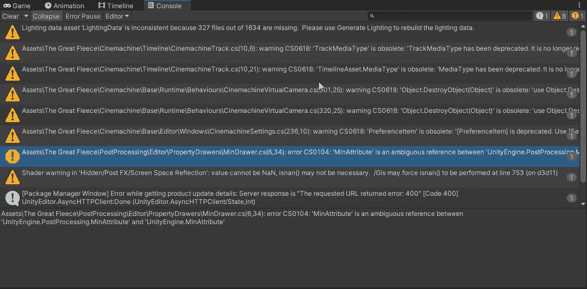

# 准备升级

首先需要做的是找到这些包实际被使用的地方，并获得所有参数的值。在我的例子中,_Scenes 文件夹中的所有场景都有一个使用了**后处理行为的摄像机。**

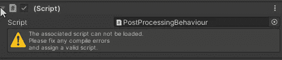

在修复了一个关于**的错误后，MinAttribute** 是一个不明确的引用(我很幸运)。

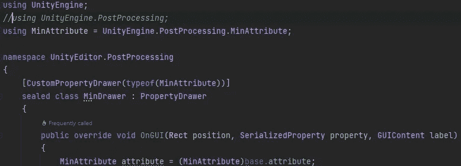

检查完所有场景摄像机后，它们都使用 Main_Profile(后处理配置文件)。

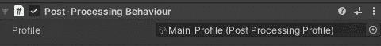

看起来我唯一需要的地方是 Post_Processing_Profiles 文件夹，它包含了所有的后处理配置文件。

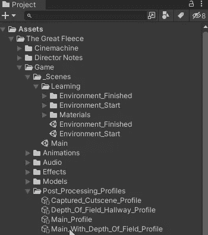

在看了所有的后处理配置文件后，看起来他们使用了雾，抗锯齿，环境遮挡，屏幕空间反射，景深，运动模糊，高光，颜色分级，纹理和复古。如果我想实现所有已经在这里的效果，我将不能使用[**【URP】**](https://docs.unity3d.com/Packages/com.unity.render-pipelines.universal@latest/index.html)**。**参考[后处理概述效果可用性和位置](https://docs.unity3d.com/2021.1/Documentation/Manual/PostProcessingOverview.html#effect-availability-and-location)。

似乎 Cinemachine 目前并没有在这个包中实现，它实际上是在学习相关的 Udemy 教程时使用的。所以我继续从项目中删除了那个文件夹。并且没有出现任何错误。

# 安装升级的软件包

现在我创建一个新项目，这样我就可以使用升级后的后处理堆栈。(这是我发现的能够复制设置的最简单的方法。)

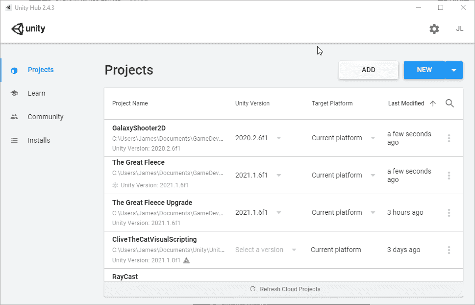

现在，在我的新项目中，我打开包管理器，添加后期处理。

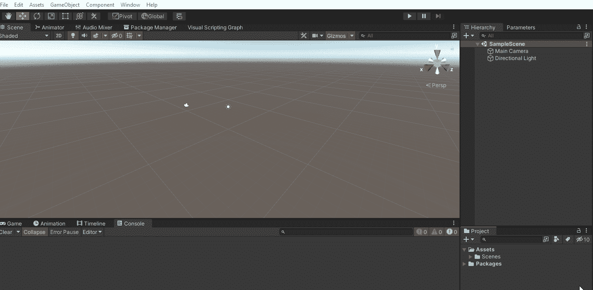

现在，在新的 Unity 编辑器中，我创建了每个渲染配置文件，并为它们添加了效果。

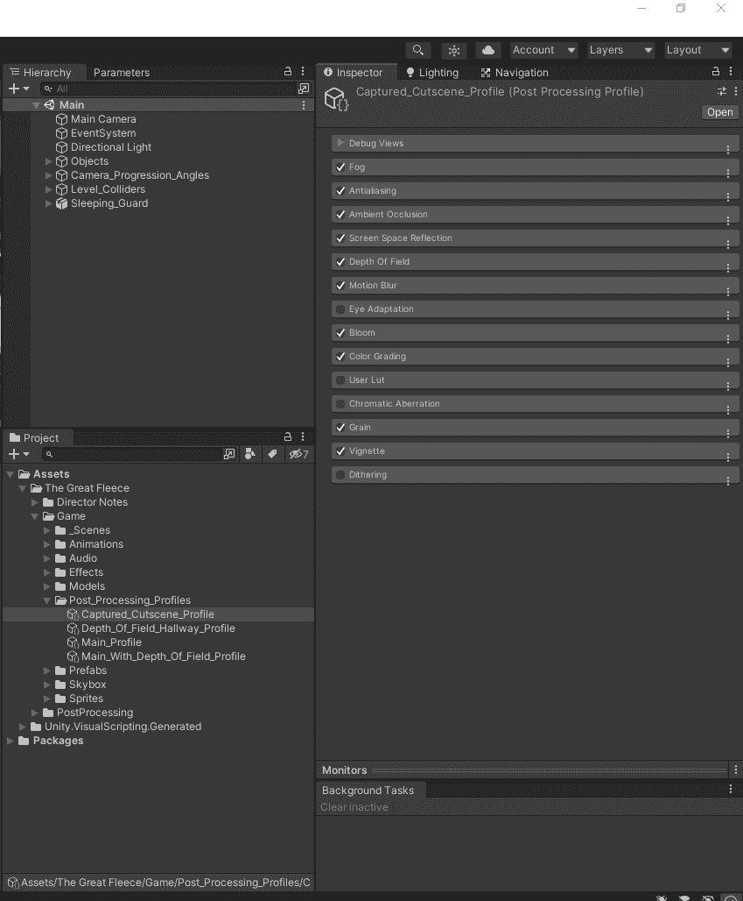

为了抗锯齿，你必须在相机上有一个**后处理层**。

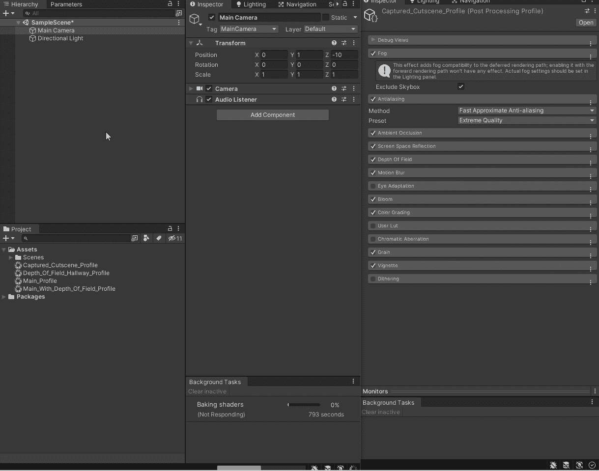

从 [**Unity 手动延期雾**](https://docs.unity3d.com/Packages/com.unity.postprocessing@3.1/manual/Deferred-Fog.html)

> 如果相机设置为使用 [**延迟渲染路径**](https://docs.unity3d.com/Manual/RenderTech-DeferredShading.html) 进行渲染，则**延迟雾**效果仅出现在您的 [**后处理层**](https://docs.unity3d.com/Packages/com.unity.postprocessing@latest?subfolder=/manual/Quick-start.html#post-process-layer) 中。默认启用，并从 [**灯光窗口**](https://docs.unity3d.com/Manual/lighting-window.html) 添加对**延迟雾**的支持，否则只能与 [**正向渲染路径**](https://docs.unity3d.com/Manual/RenderTech-ForwardRendering.html) 一起工作

默认情况下，雾化处于启用状态。

# 在原始项目中安装后期处理和 Cinemachine。

在原始项目中删除所有后期处理资源。

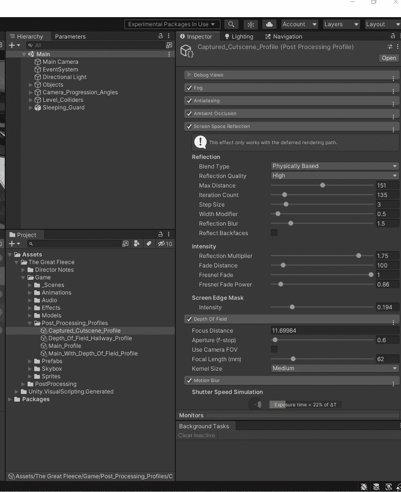

从软件包管理器安装后处理。

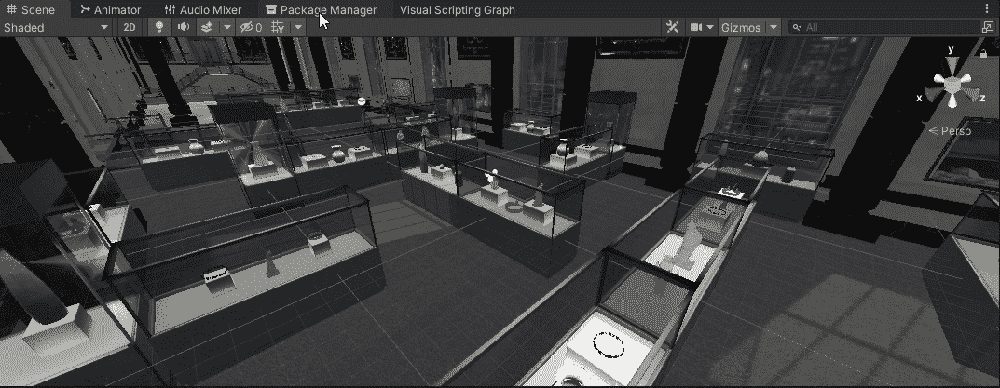

现在，将您创建的后处理配置文件复制到原始项目中。

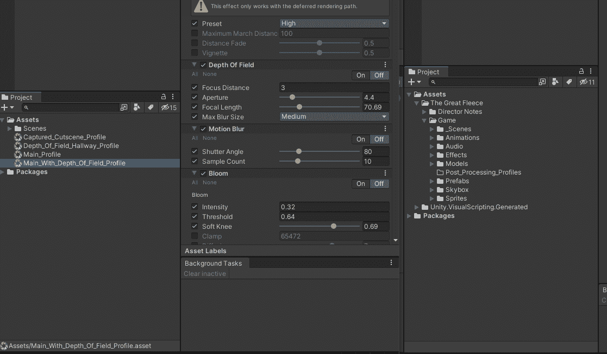

现在，我创建的用来制作概要文件的项目可以删除了。

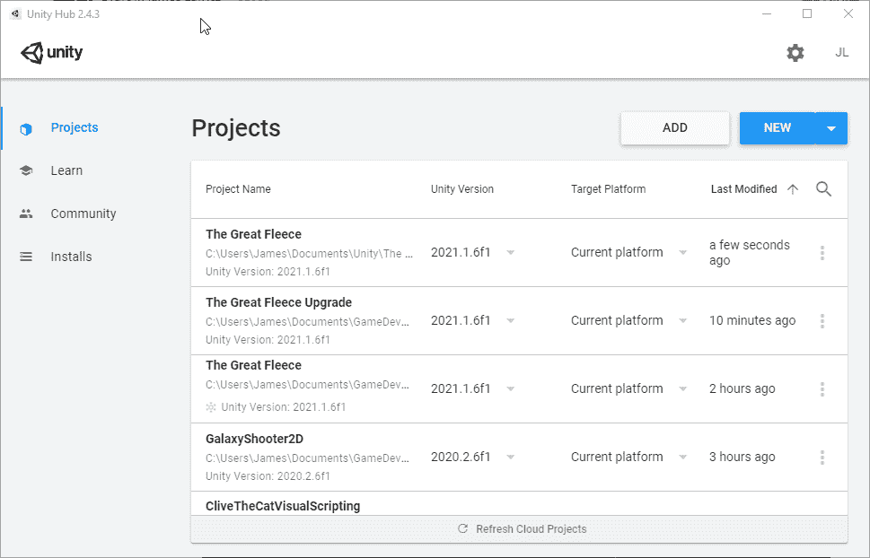

回到最初的项目，我用一层**后处理体积**给场景添加了一个后处理体积，它是使用 Main_Profile 全局的。然后在主摄像机上移除不存在的脚本，添加一个使用后处理体积层的**后处理层**。然后我从后处理体积游戏对象创建了一个预置。

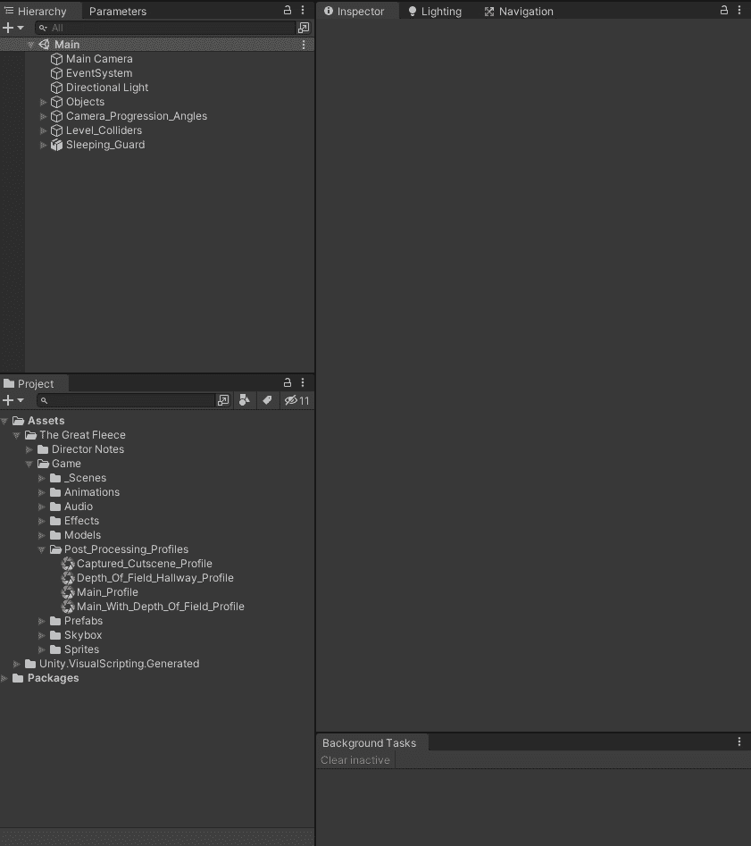

然后我也更新了其他场景来使用后期处理。

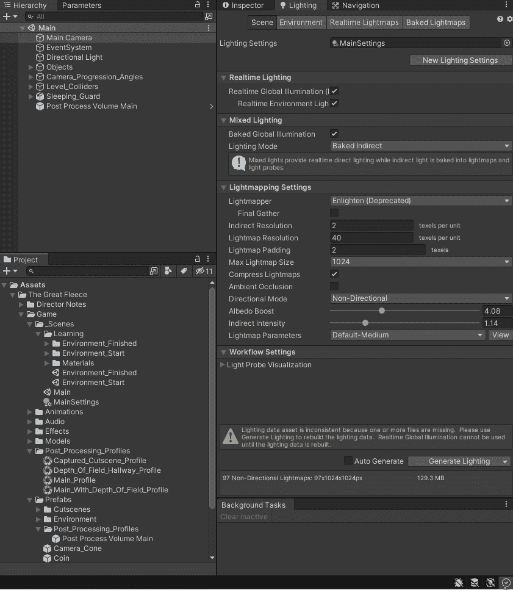

接下来，我从项目经理那里将 Cinemachine 添加回项目中。

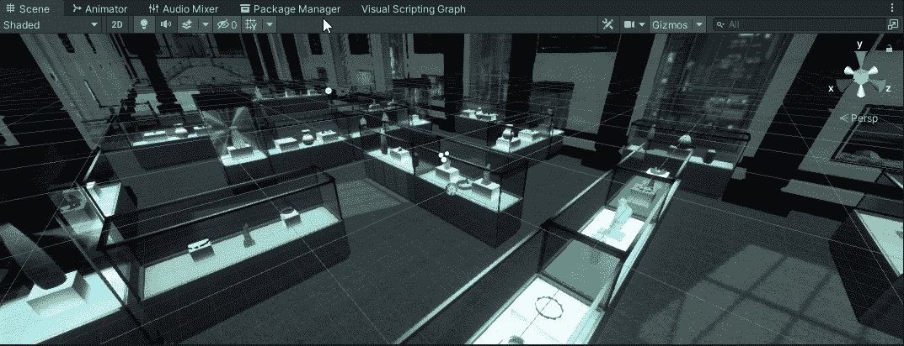

# 结论

当从资产存储添加资产时，使用一个空白项目开始。如果有未从软件包管理器安装的旧 Unity 软件包，请使用新的空白项目来创建可在原始项目中使用的新资产。删除使用旧包的原始资产。从软件包管理器安装软件包。将新资产复制到项目中。现在你的项目被设置为使用 Unity 的包管理系统，这将允许你的项目在将来能够容易地升级到新版本，你能够利用当前包和当前 Unity 版本的所有功能。如果您正在使用 Unity 资产商店 的 [**巨幅羊毛资产，您可以从**](https://assetstore.unity.com/packages/templates/tutorials/the-great-fleece-110186) **[**Itch.io**](https://ktmarine1999.itch.io/great-fleece-upgrade-package) 下载新的配置文件**