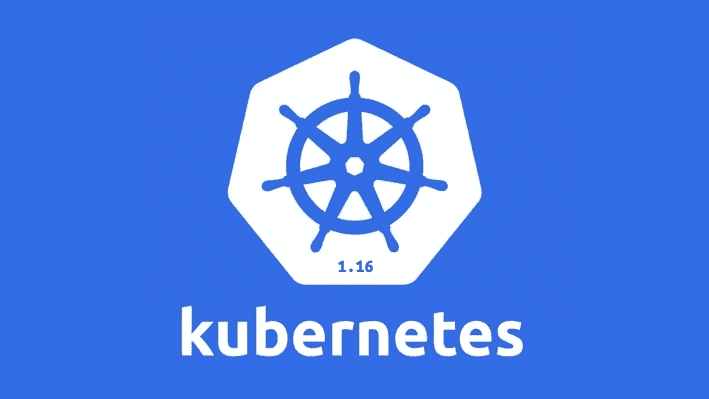

# 升级到 Kubernetes 1.16

> 原文：<https://blog.devgenius.io/upgrading-to-kubernetes-1-16-ad977933694d?source=collection_archive---------2----------------------->

Kubernetes 1.16 中有哪些新增功能和不推荐使用的功能？使用 [kube-no-trouble](https://github.com/doitintl/kube-no-trouble) 或 [pluto](https://github.com/FairwindsOps/pluto) 在升级前找到并解决问题。



[Kubernetes 1.18](https://kubernetes.io/blog/2020/03/25/kubernetes-1-18-release-announcement/) 于今年早些时候发布，这意味着 Kubernetes 1.16 跨托管 Kubernetes 平台(即 GKE、EKS、阿拉斯加)的推出即将到来(大多数提供商仅支持最近的三个次要版本)。**升级到 1.16 意义重大，因为** **几个 API 最终被弃用并从 Kubernetes** 中移除。这意味着任何创建或升级包含不赞成使用的 API 的 Kubernetes 资源的尝试都将失败。在这篇文章中，我们将重点介绍 Kubernetes 1.16 的一些新特性，指出所有被否决的 API，并列出一些有助于升级过程的工具。

# Kubernetes 1.16 的新特性

1.16 版中的三大主题包括:

1.  将自定义资源定义(CRD)升级到正式发布(CRD 从 1.7 开始就处于测试阶段)。
2.  彻底检查 Kubernetes 指标:使指标符合官方的 Kubernetes 标准(例如，从 cAdvisor 指标中删除重复的`pod_name`和`container_name`，改变 API 延迟直方图桶，改变 client-go 指标)
3.  容器存储接口(CSI)升级到测试版，为扩展 PersistentVolumeClaims (PVC)提供更多支持

你可以阅读[官方发布说明](https://kubernetes.io/blog/2019/09/18/kubernetes-1-16-release-announcement/)、 [CNCF 的演示文稿](https://www.cncf.io/wp-content/uploads/2019/10/CNCF-Webinar_-Kubernetes-1.16.pdf)，或者 [Sysdig 的总结](https://sysdig.com/blog/whats-new-kubernetes-1-16/)来找到更多关于新特性和增强的信息。

# Kubernetes 1.16 移除了什么

更重要的是，1.16 为了支持稳定的 API 版本，删除了以下 API:

*   **网络策略** : `extensions/v1beta1` → `networking.k8s.io/v1`
*   **PodSecurityPolicy:**`extensions/v1beta1`→`policy/v1beta1`
*   **达蒙塞特:** `extensions/v1beta1`、`apps/v1beta1`、`apps/v1beta2` → `apps/v1`
*   **部署:**、`apps/v1beta1`、`apps/v1beta2` → `apps/v1`
*   **状态设置** : `apps/v1beta1`和`apps/v1beta2` → `apps/v1`
*   **副本集** : `extensions/v1beta1`、`apps/v1beta1`和`apps/v1beta2` → `apps/v1`

在大多数情况下，解决方法是简单地将 API 版本更新为稳定的 API。但是，`app/v1`在某些情况下的表现略有不同:

*   **DaemonSet**:spec . template generation 已删除，spec.selector 现在是必需的且不可变，spec.updateStrategy.type 默认为 RollingUpdate
*   **部署:** spec.rollbackTo 被删除，spec.selector 现在是必需的且不可变，spec.progressDeadlineSeconds 默认为 600s，spec.revisionHistoryLimit 默认为 10，maxSurge 和 maxUnavailable 默认为 25%
*   **StatefulSet:**spec . selector 现在是必需的且不可变的，spec.updateStrategy.type 默认为 RollingUpdate

记下这些行为(尤其是对于更改了 updateStrategy 的 StatefulSets ),以确保对您的工作负载造成最小的中断。

# 如何找到不推荐使用的 API

如果您正在使用 GKE，并且在集群上启用了 Stackdriver 日志记录，则可以使用以下过滤器来识别所有使用不推荐的 API 的工作负荷:

```
resource.type="k8s_cluster"
resource.labels.cluster_name="$CLUSTER_NAME"
protoPayload.authenticationInfo.principalEmail:("system:serviceaccount" OR "@")
protoPayload.request.apiVersion=("extensions/v1beta1" OR "apps/v1beta1" OR "apps/v1beta2")
protoPayload.request.kind!="Ingress"
NOT ("kube-system")
```

否则，您可以使用一个名为[**Kube No Trouble**](https://github.com/doitintl/kube-no-trouble)**(**`**kubent**`**)**by[DoiT International](https://www.doit-intl.com/)或[**fairwindops 的**](https://www.fairwinds.com/)**[**Pluto**](https://github.com/FairwindsOps/pluto)如果您正在使用其他工具，如 [polaris](https://github.com/FairwindsOps/polaris) 或 [goldilocks](https://github.com/FairwindsOps/goldilocks) 。这两个工具都与`kubectl`和 Helm 一起工作，并列出不推荐使用的 API:**

## **kubent 示例**

```
$./kubent
6:25PM INF >>> Kube No Trouble `kubent` <<<
6:25PM INF Initializing collectors and retrieving data
6:25PM INF Retrieved 103 resources from collector name=Cluster
6:25PM INF Retrieved 132 resources from collector name="Helm v2"
6:25PM INF Retrieved 0 resources from collector name="Helm v3"
6:25PM INF Loaded ruleset name=deprecated-1-16.rego
6:25PM INF Loaded ruleset name=deprecated-1-20.rego
__________________________________________________________________________________________
>>> 1.16 Deprecated APIs <<<
------------------------------------------------------------------------------------------
KIND         NAMESPACE     NAME                    API_VERSION
Deployment   default       nginx-deployment-old    apps/v1beta1
Deployment   kube-system   event-exporter-v0.2.5   apps/v1beta1
Deployment   kube-system   k8s-snapshots           extensions/v1beta1
Deployment   kube-system   kube-dns                extensions/v1beta1
__________________________________________________________________________________________
>>> 1.20 Deprecated APIs <<<
------------------------------------------------------------------------------------------
KIND      NAMESPACE   NAME           API_VERSION
Ingress   default     test-ingress   extensions/v1beta1
```

## **冥王星的例子**

```
$ pluto detect-helm --helm-version 3 
KIND          VERSION        DEPRECATED   RESOURCE NAME 
StatefulSet   apps/v1beta1   true         prod-rabbitmq-ha Deployment    apps/v1        false        goldilocks-controller Deployment    apps/v1        false        goldilocks-dashboard
```

**一旦确定了不推荐使用的 API，就可以使用`kubectl convert`:**

```
$ kubectl convert -f <file> --output-version <group>/<version>(example)$ kubectl convert -f deployment.yaml --output-version apps/v1
```

**或者用新的 apiVersions 更新舵图并运行`helm upgrade`。如果出于某种原因，您在迁移所有 Helm 图表之前升级了集群，或者如果 Helm 由于过时的 API 而失败，您可以使用`[**helm-mapkubeapis**](https://github.com/hickeyma/helm-mapkubeapis)` 工具来修补存储在 configmap 或 secret 中的 Helm 版本清单。**

**最后，如果您在 EKS 或其他提供商上运行升级，而其他 Kubernetes 组件(如 kube-proxy 和 CNI)不会自动升级，请确保也手动修补版本。**