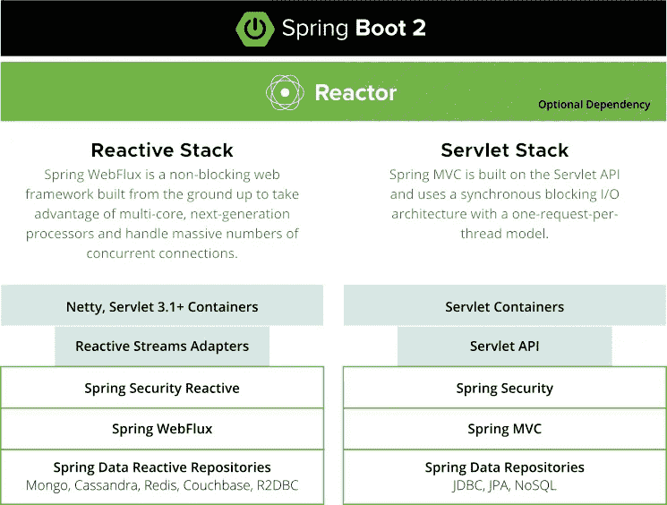
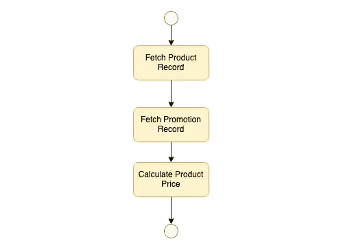
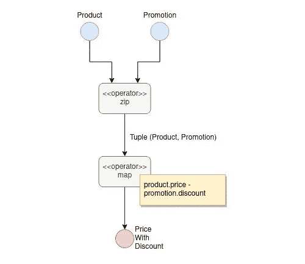
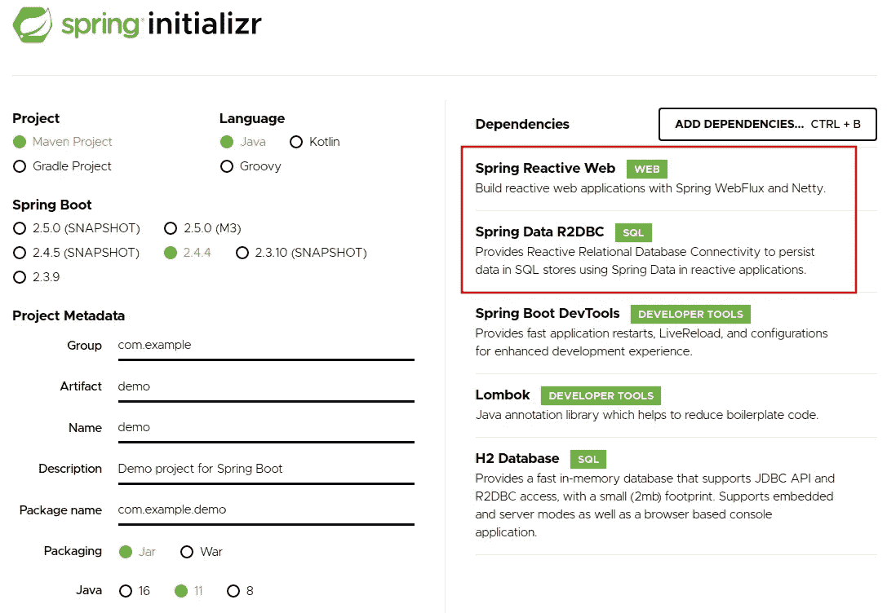

# 将您的 Java Spring Boot 升级到 WebFlux 非阻塞应用程序

> 原文：<https://blog.devgenius.io/uplift-your-java-spring-boot-to-webflux-non-blocking-application-7b207999e669?source=collection_archive---------0----------------------->

## 构建反应式 Spring WebFlux 快速指南


米卡·廷德尔在 [Unsplash](https://unsplash.com?utm_source=medium&utm_medium=referral) 上的照片

Spring MVC 一直是一个流行的框架，不仅因为它的简单，还因为它提供了广泛的生产就绪特性，支持快速的系统开发。许多企业基于该框架构建了任务关键型系统。然而，这项技术并非没有缺点。它的每请求线程设计和同步 I/O 操作已经成为一个突出的问题，因为该设计会阻塞当前线程，直到它收到来自 I/O 操作(如文件访问、数据库访问和 API 消费)的响应。一方面，这种阻塞过程的编程使得编码更简单且易于处理，另一方面，这种设计导致计算资源的低效使用，并在具有大量请求的环境中引起性能问题。

好消息是，该框架经历了一次革命性的突破，它创建了一套独立的技术堆栈，称为 Spring WebFlux，支持端到端的异步 I/O 流程，并采用了事件循环而不是每请求一个线程的方法。主要好处是实现了高系统性能，同时需要较少的计算资源。

Spring WebFlux 很吸引人，经过多年的开发，这个技术栈已经成熟，可以用于生产。这一点值得注意，因为非阻塞系统的实现可能是一种未来的系统解决方案。我将分享如何构建一个反应式 Spring REST API，并找出它与 Spring MVC 的系统开发有何不同。如果您习惯于使用 Spring MVC 编码系统，并且对探索更多关于 Spring Reactive 的内容感兴趣，那么这篇文章将是一个很好的参考。

# 概观

传统的 Spring web 框架基于 Servlet 堆栈，它通过为每个请求分配一个线程来处理传入的请求。而且，底层技术的 I/O 操作都是阻塞过程。换句话说，修改原始的 Spring MVC 框架以支持异步 I/O 并不是简单地改变某些组件，而是需要在系统架构的所有层上进行彻底的技术转移。

下面的逻辑组件图展示了原始 Spring MVC 和 Spring WebFlux 之间的比较。这些变化不仅涉及 web 框架，还涉及 web 容器、安全性以及数据库访问。



Spring 反应堆栈 vs Servlet 堆栈(来源:【https://spring.io/reactive】T4)

您可能会担心从零开始学习另一个全新的框架。事实上，即使幕后有巨大的变化，使用这种技术也很容易获得发展。感谢 Spring 团队，Spring 是一个高质量的框架，具有周到和开发者友好的设计。你会发现 Spring WebFlux 应用的注释使用和整体结构和 Spring MVC 很相似。

# 反应式编程一览

熟悉 WebFlux Spring 应用程序开发的反应式编程至关重要。这种思维模式不同于传统的命令式编程，后者是一系列指令和逻辑。由于 I/O 操作是异步的，方法调用在发布/订阅模型中工作，因此方法调用将立即返回发布者对象，而无需等待 I/O 执行。然后，依赖于该数据的程序逻辑可以订阅发布者对象并获取数据以供进一步处理。

反应式编程是通过将系统逻辑构建为数据流和数据操作过程来以发布/订阅模型方法处理程序异步操作的方法之一。

下面这个简单的例子是根据产品信息和促销数据获取产品价格。程序逻辑首先检索产品记录，然后是促销信息，然后计算产品价格。整个过程是按顺序一步一步执行的，所以只有在当前操作完成后才会调用下一步。

```
Product product = productRespository.findById(productId);Promotion promotion = promotionRepository.findByid(promotionId);Double productPrice = product.getPrice() — promotion.getDiscount();
```



产品价格计算逻辑流程(同步流程)

使用反应式编程可以实现相同的逻辑，它调用 I/O 操作同时检索产品和促销，然后数据流将加入价格计算的记录。



产品价格计算逻辑流程(异步数据流)

以下是 Spring Reactive 的示例代码:

```
Mono<Product> product = productRepository.findById(productId);Mono<Promotion> promotion = promotionRepository.findById(promotionId);Mono<Double> productPrice = 
Mono.zip(product, promotion)
.map(tuple -> 
tuple.getT1().getPrice() - tuple.getT2().getDiscount())
```

您可能会注意到返回对象被包装在一个类 **Mono** 中，它是一个将检索到的数据返回给订阅者的发布者。我们可以使用出版商作为数据源，形成一个计算价格的数据流。让我们一步一步地解释数据流:

1.  zip()将产品和促销组合成一个名为 tuple 的对象
2.  map()是用于数据转换的函数。我们从元组中获取产品和促销，并计算价格。
3.  计算结果被包装在单声道中

要处理返回值，可以使用 lambda 函数作为输入，在 Mono 对象上调用 *subscribe()* 。一旦数据准备就绪，该函数将被调用。

例如，当 I/O 过程完成时，价格数据将被打印到控制台。

```
product.subscribe(p -> { 
     System.out.println(p.doubleValue());
});
```

## **出版商——单色/通量**

有两种类型的发布者 **—**

*   **Mono** 可以发布零个或单个数据
*   **通量**可以发布零个或多个数据。

例如，如果服务将返回产品记录列表，我们将对数据进行包装:

```
Flux<Product> products = productRepository.findAll();
```

您将在 WebFlux Spring 应用程序开发中频繁使用这两个类。

一旦您熟悉了反应式编程，您将能够更快地构建 Spring 反应式应用程序。

# Maven 依赖性

由于底层技术不同，您将需要使用一组不同的 Maven 启动器。在 Spring Initializr 中，可以选择依赖关系— **Spring Reactive Web** 进行 Maven / Gradle 项目生成。如果需要无阻塞访问持久数据，还可以选择 **Spring Data R2DBC** 。



弹簧反作用应用程序的弹簧初始值

生成的 Maven 项目将包括以下 spring boot starter 依赖项:

```
<dependency>
  <groupId>org.springframework.boot</groupId>
  <artifactId>spring-boot-starter-webflux</artifactId>
</dependency><dependency>
  <groupId>org.springframework.boot</groupId>
  <artifactId>spring-boot-starter-data-r2dbc</artifactId>
</dependency>
```

# 控制器

控制器为传入的请求定义入口点。它与 Spring MVC 非常相似，因为大多数注释都是相同的，比如*、@RestController、@RequestMapping、@PathVariable、*等等。尽管底层技术完全不同，但 Spring framework 会自动检测 Maven 依赖性，并在反应式堆栈上运行控制器。唯一的区别是使用 Mono/Flux 来包装响应数据。

# REST API 集成

REST API 是服务间集成的常见模式，尤其是在微服务架构中。 ***RestTemplate*** 是一个非常有用的进行 HTTP 请求的实用类，它基于阻塞 I/O，由于 Spring 团队已经构建了一个支持异步操作的新版 HTTP client***WebClient***，团队正式宣布 RestTemplate 处于维护模式，并推荐开发者使用新的 web 客户端。

WebClient 的 API 设计类似于 RestTemplate。方法调用很容易理解。让我们看一下关于如何使用新的 web 客户机发出 GET 和 POST HTTP 请求的示例代码。

## HTTP GET

这个例子是通过记录 id 检索一个产品。URL 是使用 UriBuilder 通过一个路径变量和查询参数构建的。响应被自动反序列化到目标对象中。

## HTTP 帖子

为了保存一个新记录，web 客户端发出一个 http post 请求，其内容类型为标题中指定的 application/json。请求体被自动序列化为 JSON 格式以便提交。

在撰写本文时，**Spring****OpenFeign**还不支持非阻塞 I/O，如果你真的想使用 open feign 进行反应式支持的系统开发，那么你可以查看这个 [GitHub 项目](https://github.com/Playtika/feign-reactive)，这也是 Spring 团队建议的，直到 Spring OpenFeign 准备好非阻塞 I/O。

# 数据库访问

Java 中的所有关系数据库访问都依赖于底层的 JDBC 驱动程序，这些驱动程序是基于设计的阻塞 I/O 的。因此，一种全新的底层驱动程序 R2DBC 应运而生，以支持异步数据库访问。毫无疑问，替换底层驱动程序并重写应用程序中的每一层是一项巨大的工作。然而，社区正在快速变化，R2DBC 驱动程序现在已经可以用于许多流行的数据库，如 Oracle、MySQL、MS SQL server。不过，R2DBC 支持 NoSQL 数据库，比如 MongoDB 和 Cassandra。

## 数据存储库

JPA 数据仓库是一个强大的工具，因为它使数据仓库的开发变得简单，并且节省了构建数据 CRUD 操作的样板代码的大量工作。使用 JPA，开发人员可以简单地定义一个数据访问接口，然后框架会在运行时自动生成实现。尽管 JPA 到目前为止还不支持 R2DBC，但是 Spring data framework 提供了类似的特性，这样您就可以通过创建带有定制查询的接口来定义数据存储库。

例如，这是一个阻塞 I/O 的产品存储库接口。这是一个扩展到 CrudRepository 的 JPA 接口，支持基本数据访问。

只需简单地将继承更改为***ReactiveCrudRepository***，您的存储库将支持无阻塞的数据库访问。所有预定义方法如 *save()、findAll()、findById()* 的返回数据类型都是 Mono/Flux，以支持异步操作。

它也适用于 NoSQL 数据库。这是 MongoDB 存储库定义的一个示例:

不幸的是，由于 Hibernate 等底层 ORM 框架目前仅支持 JDBC 同步操作，因此还不支持一对多、多对一和多对多等数据关系特性。因此，如果需要数据关系的支持，您将需要构建应用程序逻辑。

# 测试

自动化测试单元测试、集成测试和端到端测试的概念可以应用于 WebFlux Spring 应用程序。如果您想了解测试和模仿的基本概念，您会发现这篇文章很有用。

[](https://medium.com/dev-genius/java-spring-the-best-practice-of-modern-software-quality-assurance-e5aa66466627) [## Java Spring——现代软件质量保证的最佳实践

### 确保软件质量的全面指南

medium.com](https://medium.com/dev-genius/java-spring-the-best-practice-of-modern-software-quality-assurance-e5aa66466627) 

让我们看看每个组件，看看如何为 WebFlux 应用程序开发测试代码。

## 控制器

控制器上的单元测试是通过模拟所有其他依赖来隔离控制器。为了在控制器上测试而初始化部分应用上下文，可以使用 Spring MVC 中的***@ WebMvcTest****对应的注释****@ WebFluxTest****。***

***为了模拟 http 请求并验证 WebFlux 应用程序的响应，Spring 提供了一个有用的实用程序类 TestWebClient，它利用新的 HTTP 客户端 WebClient 来执行异步请求，它还为控制器的响应验证提供了额外的功能。***

***这个例子验证了来自 REST 控制器的外汇汇率响应。只需使用 *@Autowired* 注释就可以获得 TestWebClient 的一个实例。在请求提交给控制器之后，TestWebClient 的方法可以很容易地断言状态代码和响应体。***

## **成分**

**组件单元测试的设置和注释与 Spring MVC 基本相同。您可以使用像 *@SpringJUnitConfig* 和 *@ContextConfiguration* 这样的注释来初始化测试执行的应用程序上下文。还有，使用 *@MockBean* 来模仿对象和创建测试用例。**

**为了验证来自 Mono/Flux 的数据流，Spring 提供了一个实用程序类 ***StepVerifier*** ，可以依次检查 Mono/Flux 数据流输出的每一项。**

**本例的单元测试检查 Flux 数据流，以按顺序逐个断言数据元素。在交付 3 个预期项目时，StepVerifier 预期这是数据流的结尾。**

## **数据存储库**

**Spring 支持使用注释***@ datar 2 DBC test****，*对反应式数据仓库进行部分应用上下文初始化，该注释类似于同步数据仓库中的函数注释***@ DataJpaTest****。***

***然而，对反应式数据存储库的单元测试比对阻塞 I/O 版本的数据存储库的单元测试需要更多的样板代码，因为 Spring 反应式数据存储库没有类似于 Hibernate 和 *@Sql* 注释的特性。Hibernate 自动创建数据表，而*@ Sql**注释可以在单元测试用例之前运行 Sql 文件进行数据设置。因此，您需要构建代码来创建数据库表和测试数据设置，以便测试您的异步数据存储库。****

***这个例子展示了在执行每个测试用例之前重新创建数据库表的设置方法。在没有 *@Sql* 注释的情况下，您可以看到示例中的测试数据设置使用了实用程序类 R2dbcTemplate，首先将记录插入数据库，然后在数据存储库的 *findAll()* 上执行测试。最后，使用 *StepVerifier* 验证 Flux 数据流中的结果。***

# **最后的想法**

**异步 I/O 操作能力和事件循环结构可以有效地利用计算资源，获得更好的并发性能。它优于传统的每请求线程和阻塞 I/O 操作，后者只能以同步方式一步一步地访问 I/O。然而，使用 Java 实现这种设计的开发可能是一项复杂的工作。WebFlux Spring 是一个非常棒的高质量框架，提供了一种简单的非阻塞系统开发方式。**

**总的来说，技术已经成熟，可以生产了。尽管某些特性还没有实现，比如对 ORM 数据关系的支持和对数据库测试的支持，但是这个框架正在快速发展，在不久的将来会有更多的新特性出现。**